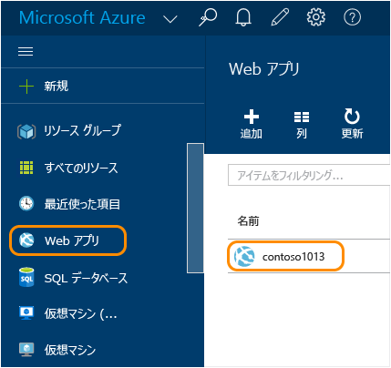
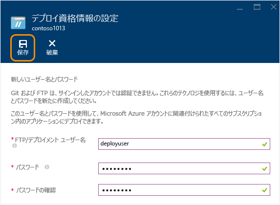

# Azure App Service での Node.js Web アプリの作成
> [!div class="op_single_selector"]
> * [.NET](web-sites-dotnet-get-started.md)
> * [Node.JS](web-sites-nodejs-develop-deploy-mac.md)
> * [Java](web-sites-java-get-started.md)
> * [PHP - Git](web-sites-php-mysql-deploy-use-git.md)
> * [PHP - FTP](web-sites-php-mysql-deploy-use-ftp.md)
> * [Python](web-sites-python-ptvs-django-mysql.md)
> 
> 

このチュートリアルでは、簡単な [Node.js](http://nodejs.org) アプリケーションを作成し、[Git](http://git-scm.com) を使用して [Azure App Service](../app-service/app-service-value-prop-what-is.md) の [Web アプリ](app-service-web-overview.md)にデプロイする方法について説明します。 このチュートリアルの手順は、Node.js を実行できる任意のオペレーティング システムで使用できます。

学習内容:

* Azure ポータルを使用して Azure App Service で Web アプリを作成する方法
* Node.js アプリケーションを Web アプリの Git リポジトリにプッシュすることでその Web アプリにデプロイする方法

完成したアプリケーションにより、ブラウザーに "hello world" という短い文字列が出力されます。

!["Hello World" メッセージを表示しているブラウザー][helloworld-completed]

より複雑な Node.js アプリケーションを使用したチュートリアルとサンプル コードや、Azure での Node.js の使用方法に関するその他のトピックについては、 [Node.js デベロッパー センター](/develop/nodejs/)を参照してください。

> [!NOTE]
> このチュートリアルを完了するには、Microsoft Azure アカウントが必要です。 アカウントを持っていない場合は、[Visual Studio サブスクライバーの特典を有効にする](/en-us/pricing/member-offers/msdn-benefits-details/?WT.mc_id=A261C142F)か、[無料試用版にサインアップ](/en-us/pricing/free-trial/?WT.mc_id=A261C142F)してください。
> 
> Azure アカウントにサインアップする前に Azure App Service を開始する場合は、[App Service の試用](https://azure.microsoft.com/try/app-service/)に関するページにアクセスしてください。 有効期間が短いスターター Web アプリを App Service ですぐに作成できます。このサービスの利用にあたり、クレジット カードは必要ありません。契約も必要ありません。
> 
> 

## Web アプリの作成と Git 発行の有効化
Azure App Service で Web アプリを作成して、Git 発行を有効にするには、次の手順に従います。 

[Git](http://git-scm.com/) は、Azure の Web サイトをデプロイするために使用できる分散型バージョン コントロール システムです。 Web アプリ用に記述したコードはローカルの Git リポジトリに格納されます。このコードをリモート リポジトリにプッシュして Azure にデプロイします。 このデプロイ方法は、App Service Web アプリの特徴です。  

1. [Azure ポータル](https://portal.azure.com)にサインインします。
2. Azure ポータルの左上にある **[+ 新規]** アイコンをクリックします。
3. **[Web + モバイル]** をクリックし、**[Web アプリ]** をクリックします。
   
    ![][portal-quick-create]
4. **[Web アプリ]** ボックスに Web アプリの名前を入力します。
   
    Web アプリの URL は {name}.azurewebsites.net のようになるため、この名前は azurewebsites.net ドメイン内で一意である必要があります。 入力した名前が一意でない場合は、テキスト ボックスに赤色の感嘆符が表示されます。
5. **[サブスクリプション]**を選択します。
6. **リソース グループ** を選択するか、新しく作成します。
   
    リソース グループの詳細については、「[Azure Resource Manager の概要](../azure-resource-manager/resource-group-overview.md)」を参照してください。
7. **App Service プラン/場所** を選択するか、新しく作成します。
   
    App Service プランの詳細については、 [Azure App Service プランの概要](../app-service/azure-web-sites-web-hosting-plans-in-depth-overview.md)
8. **[作成]**をクリックします。
   
    ![][portal-quick-create2]
   
    短時間 (通常は&1; 分未満) で、新しい Web アプリの作成が完了します。
9. **[Web アプリ]、{作成した新しい Web アプリ}** の順にクリックします。
   
    
10. **[Web アプリ]** ブレードで、**[デプロイ]** 部分をクリックします。
    
    ![][deployment-part]
11. **[継続的なデプロイ]** ブレードで、**[ソースの選択]** をクリックします。
12. **[ローカル Git リポジトリ]** をクリックし、**[OK]** をクリックします。
    
    ![][setup-git-publishing]
13. デプロイ資格情報をまだ設定していない場合は設定します。
    
    a.[サインオン URL] ボックスに、次のパターンを使用して、ユーザーが Yardi eLearning アプリケーションへのサインオンに使用する URL を入力します。 [Web アプリ] ブレードで、**[設定]、[デプロイ資格情報]** の順にクリックします。
    
    ![][deployment-credentials]
    
    b. ユーザー名とパスワードを作成します。 
    
    
14. [Web アプリ] ブレードで、**[設定]** をクリックし、**[プロパティ]** をクリックします。
    
    発行するには、リモート Git リポジトリにプッシュします。 リポジトリの URL が **[GIT URL]**の下に表示されます。 この URL は、チュートリアルの後半で使用します。
    
    ![][git-url]

## アプリケーションの作成とローカル テスト
ここでは、[nodejs.org] から入手した 'Hello World' の例を若干変更したバージョンを含む **server.js** ファイルを作成します。 コードでは、Azure Web アプリでの実行時にリッスンするポートとして process.env.PORT が追加されます。

1. *helloworld*という名前のディレクトリを作成します。
2. テキスト エディターを使用して、 **helloworld** ディレクトリに *server.js* という名前の新しいファイルを作成します。
3. **server.js** ファイルに次のコードをコピーし、ファイルを保存します。
   
        var http = require('http')
        var port = process.env.PORT || 1337;
        http.createServer(function(req, res) {
          res.writeHead(200, { 'Content-Type': 'text/plain' });
          res.end('Hello World\n');
        }).listen(port);
4. コマンド ラインを開き、次のコマンドを使用してローカルで Web アプリを開始します。
   
        node server.js
5. Web ブラウザーを開き、http://localhost:1337/ に移動します。 
   
    次のスクリーンショットに示すように、"Hello World" と表示された Web ページが開きます。
   
    !["Hello World" メッセージを表示しているブラウザー][helloworld-localhost]

## アプリケーションの発行
1. Git をまだインストールしていない場合はインストールします。
   
    お使いのプラットフォームでのインストールの手順については、 [Git のダウンロード ページ](http://git-scm.com/download)を参照してください。
2. コマンド ラインから、 **helloworld** ディレクトリに移動し、次のコマンドを入力してローカル Git リポジトリを初期化します。
   
        git init
3. 次のコマンドを使用して、リポジトリにファイルを追加します。
   
        git add .
        git commit -m "initial commit"
4. 次のコマンドを使用して、先ほど作成した Azure Web アプリに更新をプッシュするために Git リモートを追加します。
   
        git remote add azure [URL for remote repository]
5. 次のコマンドを使用して、変更内容を Azure にプッシュします。
   
        git push azure master
   
    以前作成したパスワードを入力するように求められます。 出力は次の例のようになります。
   
        Counting objects: 3, done.
        Delta compression using up to 8 threads.
        Compressing objects: 100% (2/2), done.
        Writing objects: 100% (3/3), 374 bytes, done.
        Total 3 (delta 0), reused 0 (delta 0)
        remote: New deployment received.
        remote: Updating branch 'master'.
        remote: Preparing deployment for commit id '5ebbe250c9'.
        remote: Preparing files for deployment.
        remote: Deploying Web.config to enable Node.js activation.
        remote: Deployment successful.
        To https://user@testsite.scm.azurewebsites.net/testsite.git
         * [new branch]      master -> master
6. アプリを表示するには、Azure Portal で **[Web アプリ]** パーツの **[参照]** ボタンをクリックします。
   
    ![[参照] ボタン](./media/web-sites-nodejs-develop-deploy-mac/browsebutton.png)
   
    

## アプリケーションへの変更の発行
1. テキスト エディターで **server.js** ファイルを開き、"Hello World\n" を "Hello Azure\n" に変更します。 
2. ファイルを保存します。
3. コマンド ラインから、 **helloworld** ディレクトリに移動し、次のコマンドを実行します。
   
        git add .
        git commit -m "changing to hello azure"
        git push azure master
   
    もう一度パスワードを入力するように求められます。
4. Web アプリの URL に移動したブラウザー ウィンドウを更新します。
   
    !["Hello Azure" と表示している Web ページ][helloworld-completed]

## デプロイをロールバックします。
**[Web アプリ]** ブレードで **[設定]、[継続的なデプロイ]** の順にクリックすると、**[デプロイ]** ブレードにデプロイ履歴が表示されます。 以前のデプロイにロールバックする必要がある場合は、そのデプロイを選択し、**[デプロイの詳細]** ブレードの **[再デプロイ]** をクリックできます。

## 次のステップ
ここでは、Node.js アプリケーションを Azure App Service の Web アプリにデプロイしました。 App Service の Web アプリによる Node.js アプリケーションの実行方法の詳細については、[Azure App Service Web Apps の Node.js](http://blogs.msdn.com/b/silverlining/archive/2012/06/14/windows-azure-websites-node-js.aspx) に関するページと「[Azure アプリケーションでの Node.js のバージョンの指定](../nodejs-specify-node-version-azure-apps.md)」を参照してください。

Node.js は、アプリケーションで使用できるモジュールのリッチなエコシステムを実現します。 Web Apps でモジュールを使用する方法については、「 [Azure アプリケーションでの Node.js モジュールの使用](../nodejs-use-node-modules-azure-apps.md)」を参照してください。

Azure へのデプロイ後にアプリケーションで問題が発生した場合、問題の診断については、「 [Azure App Service で Node.js Web アプリをデバッグする方法](web-sites-nodejs-debug.md) 」を参照してください。

この記事では、Web アプリの作成に Azure ポータルを使用しています。 [Azure コマンド ライン インターフェイス](../cli-install-nodejs.md)または [Azure PowerShell](/powershell/azureps-cmdlets-docs) を使用して、同じ操作を行うこともできます。

Azure で Node.js アプリケーションを開発する方法の詳細については、 [Node.js デベロッパー センター](/develop/nodejs/)を参照してください。

[helloworld-completed]: ./media/web-sites-nodejs-develop-deploy-mac/helloazure.png
[helloworld-localhost]: ./media/web-sites-nodejs-develop-deploy-mac/helloworldlocal.png
[portal-quick-create]: ./media/web-sites-nodejs-develop-deploy-mac/create-quick-website.png
[portal-quick-create2]: ./media/web-sites-nodejs-develop-deploy-mac/create-quick-website2.png
[setup-git-publishing]: ./media/web-sites-nodejs-develop-deploy-mac/setup_git_publishing.png
[go-to-dashboard]: ./media/web-sites-nodejs-develop-deploy-mac/go_to_dashboard.png
[deployment-part]: ./media/web-sites-nodejs-develop-deploy-mac/deployment-part.png
[deployment-credentials]: ./media/web-sites-nodejs-develop-deploy-mac/deployment-credentials.png
[git-url]: ./media/web-sites-nodejs-develop-deploy-mac/git-url.png

