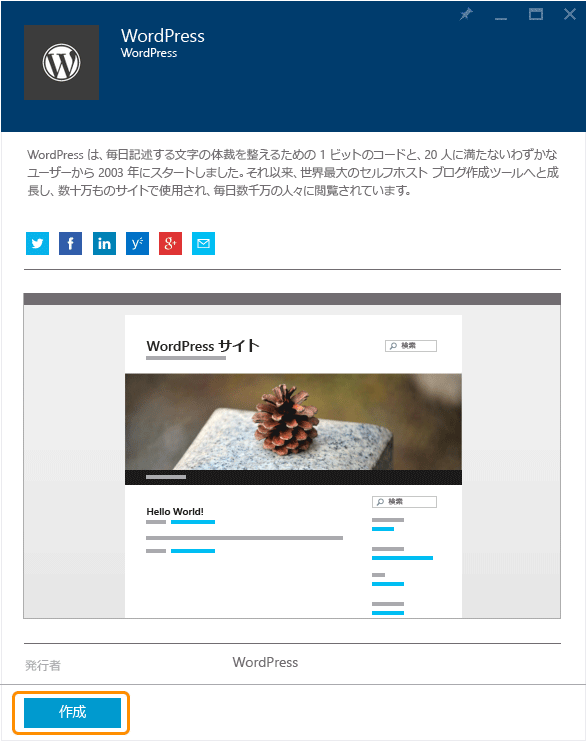

<properties
	pageTitle="Azure App Service での WordPress Web アプリの作成 | Microsoft Azure"
	description="Azure プレビュー ポータルを使用して WordPress ブログ用の新しい Azure Web アプリを作成する方法について説明します。"
	services="app-service\web"
	documentationCenter="php"
	authors="tfitzmac"
	manager="wpickett"
	editor=""/>

<tags
	ms.service="app-service-web"
	ms.workload="na"
	ms.tgt_pltfrm="na"
	ms.devlang="PHP"
	ms.topic="hero-article"
	ms.date="10/15/2015"
	ms.author="tomfitz"/>

# Azure App Service での WordPress Web アプリの作成

このチュートリアルでは、Azure Marketplace でアプリケーションを検索して App Service Web アプリにインストールする方法を示します。このチュートリアルでは例として WordPress ブログ サイトを使用しますが、他の多くの Marketplace アプリケーションについても手順は同様です。

チュートリアルを完了すると、独自の WordPress ブログ サイトをクラウドで運用できるようになります。

学習内容:

* Azure Marketplace でアプリケーション テンプレートを検索する方法。
* Azure App Service でテンプレートに基づく Web アプリを作成する方法。
* 新しい Web アプリと MySQL データベースの Azure App Service 設定を構成する方法。

Azure Marketplace には、Microsoft、サード パーティ企業、およびオープン ソース ソフトウェア活動によって開発された多種多様な人気の Web アプリが用意されています。これらの Web アプリは、この WordPress の例で使用される [PHP](/develop/nodejs/) をはじめ、[.NET](/develop/net/)、[Node.js](/develop/nodejs/)、[Java](/develop/java/)、[Python](/develop/python/) など、さまざまなよく知られたフレームワーク上に構築されています。Azure Marketplace から Web アプリを作成するために必要なソフトウェアは、[Azure プレビュー ポータル](https://portal.azure.com/)に使用するブラウザーだけです。

> [AZURE.NOTE]このチュートリアルを完了するには、Microsoft Azure アカウントが必要です。アカウントを持っていない場合は、[MSDN サブスクライバーの特典を有効にする](/ja-JP/pricing/member-offers/msdn-benefits-details/?WT.mc_id=A261C142F)か、[無料試用版にサインアップ](/ja-JP/pricing/free-trial/?WT.mc_id=A261C142F)してください。
>
> Azure アカウントにサインアップする前に Azure App Service の使用を開始する場合は、「[Azure App Service を使ってみる](http://go.microsoft.com/fwlink/?LinkId=523751)」にアクセスしてください。有効期間が短いスターター Web アプリを App Service ですぐに作成できます。このサービスの利用にあたり、クレジット カードは必要ありません。契約も必要ありません。

## WordPress を選択して Azure App Service 用に構成する

1. [Azure プレビュー ポータル](https://portal.azure.com/)にログインします。

2. **[新規]、[Marketplace]** の順にクリックします。
	
    ![新規作成][5]
	
3. **WordPress** を検索し、**[WordPress]** をクリックします。

	![WordPress リスト][7]
	
5. WordPress アプリの説明を読んだら、**[作成]** をクリックします。

	

4. **[Web アプリ]** ボックスに Web アプリの名前を入力します。

	Web アプリの URL は {name}.azurewebsites.net のようになるため、この名前は azurewebsites.net ドメイン内で一意である必要があります。入力した名前が一意でない場合は、テキスト ボックスに赤色の感嘆符が表示されます。

8. サブスクリプションが複数ある場合には、使用するものを 1 つ選択します。

5. **リソース グループ**を選択するか、新しく作成します。

	リソース グループの詳細については、「[Azure プレビュー ポータルを使用した Azure リソースの管理](../resource-group-portal.md)」を参照してください。

5. **App Service プラン/場所**を選択するか、新しく作成します。

	App Service プランの詳細については、[Azure App Service プランの概要](../azure-web-sites-web-hosting-plans-in-depth-overview.md)に関するページを参照してください。

7. **[データベース]** をクリックし、**[新しい MySQL データベース]** ブレードで、MySQL データベースを構成するために必要な値を指定します。

	a.新しい名前を入力するか、既定の名前をそのまま使用します。

	b.**[データベースの種類]** は **[共有]** のままにします。

	c.Web アプリ用に選択したのと同じ場所を選択します。

	d.価格レベルを選択します。このチュートリアルでは、Mercury (無料で、最小限の許可された接続とディスク領域を使用可能) で問題ありません。

8. **[新しい MySQL データベース]** ブレードで、**[OK]** をクリックします。

8. **[WordPress]** ブレードで、法律条項に同意し、**[作成]** をクリックします。

	

	Azure App Service によって、通常は 1 分以内に Web アプリが作成されます。進捗状況を監視するには、ポータル ページの上部にあるベル アイコンをクリックします。

	

## WordPress Web アプリの起動と管理
	
7. Web アプリの作成が完了したら、ポータルで、アプリケーションを作成したリソース グループに移動し、Web アプリとデータベースを確認できます。

	電球のアイコンが表示された追加のリソースは [Application Insights](/services/application-insights/) であり、Web アプリの監視サービスを提供します。

1. **[リソース グループ]** ブレードで、Web アプリの行をクリックします。

	

2. Web アプリ ブレードで **[参照]** をクリックします。

    ![サイトの URL][browse]

3. WordPress の **[ようこそ]** ページで、WordPress に必要な構成情報を入力し、**[WordPress のインストール]** をクリックします。

	

4. **[ようこそ]** ページで作成した資格情報を使用して、ログインします。

5. サイトのダッシュボード ページが開きます。

	

## 次のステップ

これでギャラリーから PHP Web アプリを作成してデプロイする方法はわかりました。Azure での PHP の使用に関する詳細については、「[PHP デベロッパー センター](/develop/php/)」を参照してください。

App Service Web Apps の使用方法の詳細については、ページの左側 (ワイド ブラウザー ウィンドウの場合) またはページの上部 (幅の狭いブラウザー ウィンドウの場合) に表示されるリンクを参照してください。

## 変更内容
* Websites から App Service への変更ガイドについては、「[Azure App Service と既存の Azure サービス](http://go.microsoft.com/fwlink/?LinkId=529714)」を参照してください。
* 以前のポータルから新しいポータルへの変更ガイドについては、「[Azure ポータル内の移動に関するリファレンス](http://go.microsoft.com/fwlink/?LinkId=529715)」を参照してください。

[5]: ./media/web-sites-php-web-site-gallery/startmarketplace.png
[7]: ./media/web-sites-php-web-site-gallery/search-web-app.png
[browse]: ./media/web-sites-php-web-site-gallery/browse-web.png

<!---HONumber=Nov15_HO1-->