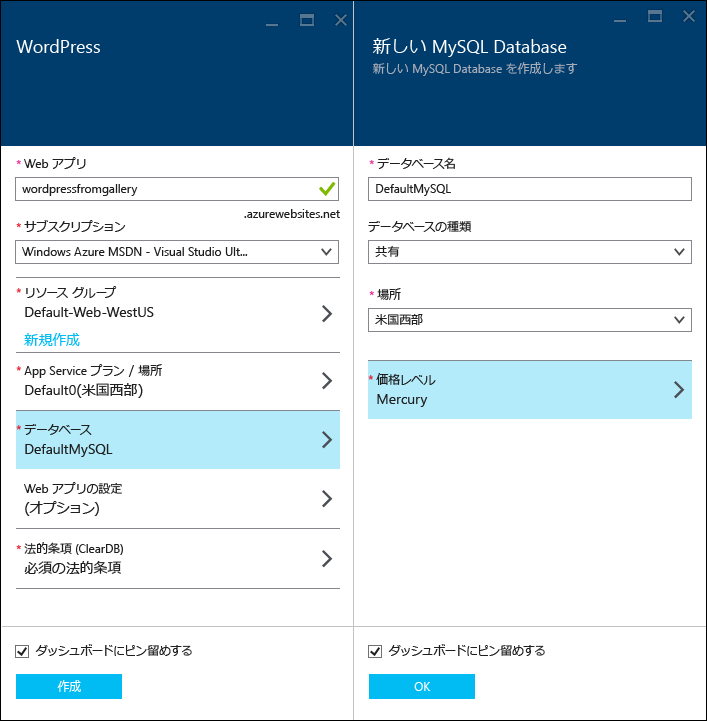
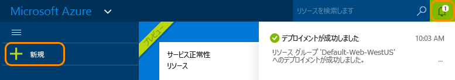
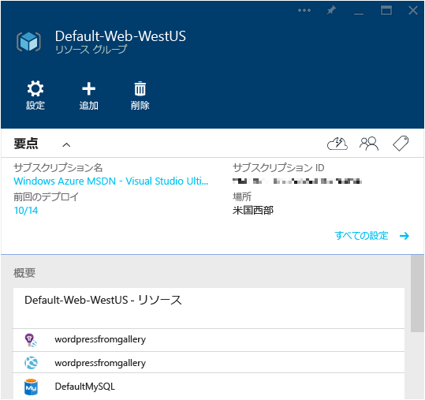

# Azure App Service での WordPress Web アプリの作成
[!INCLUDE [tabs](../../includes/app-service-web-get-started-nav-tabs.md)]

このチュートリアルでは、WordPress ブログ サイトを Azure Marketplace からデプロイする方法について説明します。

チュートリアルを完了すると、独自の WordPress ブログ サイトをクラウドで運用できるようになります。

学習内容:

* Azure Marketplace でアプリケーション テンプレートを検索する方法。
* Azure App Service でテンプレートに基づく Web アプリを作成する方法。
* 新しい Web アプリとデータベースの Azure App Service 設定を構成する方法。

Azure Marketplace には、Microsoft、サード パーティ企業、およびオープン ソース ソフトウェア活動によって開発された多種多様な人気の Web アプリが用意されています。 これらの Web アプリは、この WordPress の例で使用される [PHP](/develop/nodejs/) をはじめ、[.NET](/develop/net/)、[Node.js](/develop/nodejs/)、[Java](/develop/java/)、[Python](/develop/python/) など、さまざまなよく知られたフレームワーク上に構築されています。 Azure Marketplace から Web アプリを作成するために必要なソフトウェアは、 [Azure ポータル](https://portal.azure.com/)に使用するブラウザーだけです。 

このチュートリアルでデプロイする WordPress サイトは、データベースに MySQL を使用します。 SQL Database に変更する場合は、 [Project Nami](http://projectnami.org/)の Web サイトを参照してください。 **Project Nami** は Marketplace からも入手できます。

> [!NOTE]
> このチュートリアルを完了するには、Microsoft Azure アカウントが必要です。 アカウントを持っていない場合は、[Visual Studio サブスクライバーの特典を有効にする](https://azure.microsoft.com/pricing/member-offers/msdn-benefits-details/?WT.mc_id=A261C142F)か、[無料試用版にサインアップ](https://azure.microsoft.com/pricing/free-trial/?WT.mc_id=A261C142F)してください。
> 
> Azure アカウントにサインアップする前に Azure App Service を開始する場合は、[App Service の試用](https://azure.microsoft.com/try/app-service/)に関するページにアクセスしてください。 有効期間が短いスターター Web アプリを App Service ですぐに作成できます。このサービスの利用にあたり、クレジット カードは必要ありません。契約も必要ありません。
> 
> 

## WordPress を選択して Azure App Service 用に構成する
1. [Azure ポータル](https://portal.azure.com/)にログインします。
2. **[新規]**をクリックします。
   
    ![新規作成][5]
3. **WordPress** を検索し、**[WordPress]** をクリックします。 MySQL の代わりに SQL Database を使用する場合は、 **Project Nami**を検索してください。
   
    ![WordPress リスト][7]
4. WordPress アプリの説明を読んだら、 **[作成]**をクリックします。
   
    ![[作成]](./media/web-sites-php-web-site-gallery/create.png)
5. **[Web アプリ]** ボックスに Web アプリの名前を入力します。
   
    Web アプリの URL は {name}.azurewebsites.net のようになるため、この名前は azurewebsites.net ドメイン内で一意である必要があります。 入力した名前が一意でない場合は、テキスト ボックスに赤色の感嘆符が表示されます。
6. サブスクリプションが複数ある場合には、使用するものを&1; つ選択します。 
7. **リソース グループ** を選択するか、新しく作成します。
   
    リソース グループの詳細については、「[Azure Resource Manager の概要](../azure-resource-manager/resource-group-overview.md)」を参照してください。
8. **App Service プラン/場所** を選択するか、新しく作成します。
   
    App Service プランの詳細については、 [Azure App Service プランの概要](../app-service/azure-web-sites-web-hosting-plans-in-depth-overview.md)    
9. **[データベース]** をクリックし、**[新しい MySQL データベース]** ブレードで、MySQL データベースを構成するために必要な値を指定します。
   
    a.[サインオン URL] ボックスに、次のパターンを使用して、ユーザーが Yardi eLearning アプリケーションへのサインオンに使用する URL を入力します。 新しい名前を入力するか、既定の名前をそのまま使用します。
   
    b. **[データベースの種類]** は **[共有]** のままにします。
   
    c. Web アプリ用に選択したのと同じ場所を選択します。
   
    d. 価格レベルを選択します。 このチュートリアルでは、Mercury (無料で、最小限の許可された接続とディスク領域を使用可能) で問題ありません。
10. **[新しい MySQL データベース]** ブレードで、**[OK]** をクリックします。 
11. **[WordPress]** ブレードで法律条項に同意し、**[作成]** をクリックします。 
    
     
    
     Azure App Service によって、通常は&1; 分以内に Web アプリが作成されます。 進捗状況を監視するには、ポータル ページの上部にあるベル アイコンをクリックします。
    
     

## WordPress Web アプリの起動と管理
1. Web アプリの作成が完了したら、Azure ポータルで、アプリケーションを作成したリソース グループに移動し、Web アプリとデータベースを確認できます。
   
    電球のアイコンが表示された追加のリソースは [Application Insights](/services/application-insights/)であり、Web アプリの監視サービスを提供します。
2. **[リソース グループ]** ブレードで、Web アプリの行をクリックします。
   
    
3. Web アプリ ブレードで **[参照]**をクリックします。
   
    ![site URL][browse]
4. WordPress の **[ようこそ]** ページで、WordPress に必要な構成情報を入力し、**[WordPress をインストール]** をクリックします。
   
    
5. **[ようこそ]** ページで作成した資格情報を使用して、ログインします。  
6. サイトのダッシュボード ページが開きます。    
   
    

## 次のステップ
これでギャラリーから PHP Web アプリを作成してデプロイする方法はわかりました。 Azure での PHP の使用に関する詳細については、「 [PHP デベロッパー センター](/develop/php/)」を参照してください。

App Service Web Apps の使用方法の詳細については、ページの左側 (ワイド ブラウザー ウィンドウの場合) またはページの上部 (幅の狭いブラウザー ウィンドウの場合) に表示されるリンクを参照してください。 

## 変更内容
* Websites から App Service への変更ガイドについては、「 [Azure App Service と既存の Azure サービス](http://go.microsoft.com/fwlink/?LinkId=529714)」を参照してください。

[5]: ./media/web-sites-php-web-site-gallery/startmarketplace.png
[7]: ./media/web-sites-php-web-site-gallery/search-web-app.png
[browse]: ./media/web-sites-php-web-site-gallery/browse-web.png

