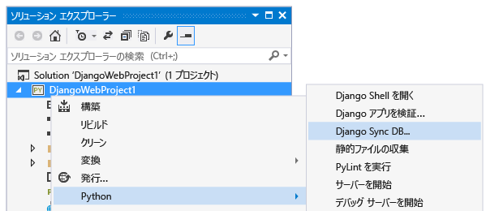
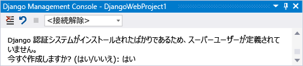
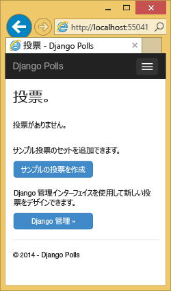
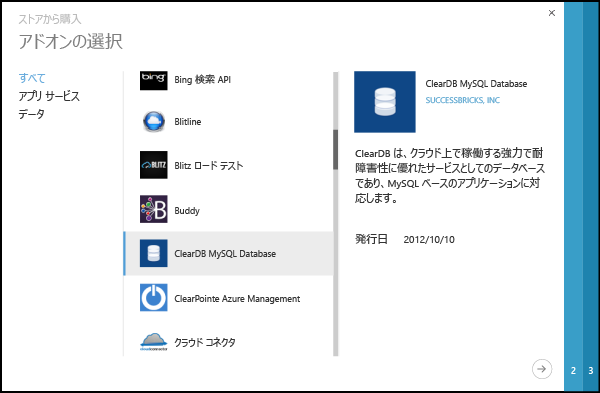
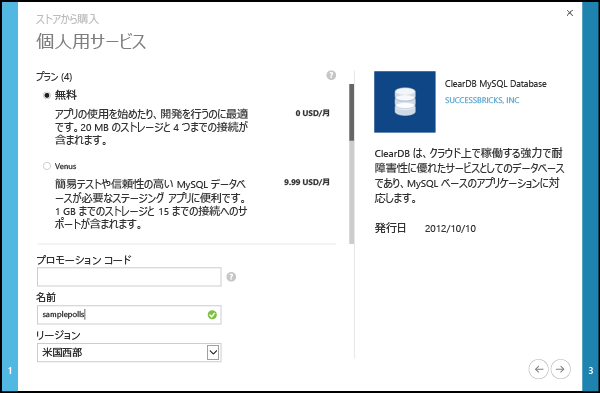
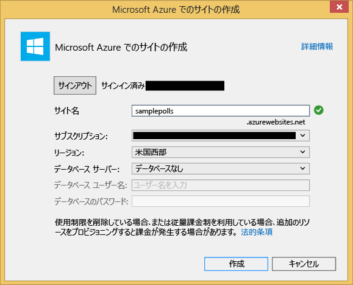

<properties 
	pageTitle="Python Tools 2.2 for Visual Studio を使用した Azure 上の Django と MySQL" 
	description="Python Tools for Visual Studio を使用して、MySQL データベース インスタンスにデータを保存する Django Web アプリを作成し、Azure App Service Web Apps にデプロイする方法について説明します。" 
	services="app-service\web" 
	documentationCenter="python" 
	authors="huguesv" 
	manager="wpickett" 
	editor=""/>

<tags 
	ms.service="app-service-web" 
	ms.workload="web" 
	ms.tgt_pltfrm="na" 
	ms.devlang="python"
	ms.topic="get-started-article" 
	ms.date="06/01/2016"
	ms.author="huvalo"/>

# Python Tools 2.2 for Visual Studio を使用した Azure 上の Django と MySQL 

[AZURE.INCLUDE [タブ](../../includes/app-service-web-get-started-nav-tabs.md)]

このチュートリアルでは、[Python Tools for Visual Studio](PTVS) といずれかの PTVS サンプル テンプレートを使用して、単純な投票 Web アプリを作成します。ここでは、Azure 上でホストされる MySQL サービスを使用する方法、Web アプリ が MySQL を使用するよう構成する方法、[Azure App Service Web Apps](http://go.microsoft.com/fwlink/?LinkId=529714) に Web アプリを発行する方法について説明します。

> [AZURE.NOTE] このチュートリアルに含まれる情報は、次のビデオでも確認できます。
> 
> [PTVS 2.1: Django app with MySQL (PTVS 2.1: MySQL を使用した Django アプリ)][video]

Bottle、Flask、Django の各 Web フレームワークと、MongoDB、Azure Table Storage、MySQL、SQL Database の各サービスを使用した、PTVS での Azure App Service Web Apps の開発を取り上げたその他の記事については、[Python デベロッパー センター]をご覧ください。この記事では App Service について重点的に説明していますが、[Azure Cloud Services] の開発も同様の手順で行います。

## 前提条件

 - Visual Studio 2013 または 2015
 - [Python 2.7 (32 ビット)]
 - [Python Tools 2.2 for Visual Studio]
 - [Python Tools 2.2 for Visual Studio サンプル VSIX]
 - [Azure SDK Tools for VS 2013] または [Azure SDK Tools for VS 2015]
 - Django 1.6 以前

[AZURE.INCLUDE [create-account-and-websites-note](../../includes/create-account-and-websites-note.md)]

<!-- This note should not render as part of the the previous include. -->

> [AZURE.NOTE] Azure アカウントにサインアップする前に Azure App Service の使用を開始する場合は、[App Service の試用](http://go.microsoft.com/fwlink/?LinkId=523751)に関するページを参照してください。そこでは、App Service で有効期間の短いスターター Web アプリをすぐに作成できます。このサービスの利用にあたり、クレジット カードは必要ありません。契約も必要ありません。

## プロジェクトを作成する

このセクションでは、サンプル テンプレートを使用して Visual Studio プロジェクトを作成します。仮想環境を作成し、必要なパッケージをインストールします。SQLite を使用して、ローカル データベースを作成します。その後、アプリケーションをローカルで実行します。

1. Visual Studio で、**[ファイル]**、**[新しいプロジェクト]** の順にクリックします。

1. PTVS サンプル VSIX のプロジェクト テンプレートは、**[Python]** の **[サンプル]** にあります。**[投票 Django Web プロジェクト]** を選択し、[OK] をクリックしてプロジェクトを作成します。

    ![[新しいプロジェクト] ダイアログ](./media/web-sites-python-ptvs-django-mysql/PollsDjangoNewProject.png)

1. 外部のパッケージをインストールするよう求めるメッセージが表示されます。**[仮想環境にインストールする]** を選択します。

    

1. 基になるインタープリターとして **Python 2.7** を選択します。

    

1. **ソリューション エクスプローラー**で、プロジェクト ノードを右クリックして **[Python]** を選択し、**[Django Sync DB]** を選択します。

    

1. これにより、Django Management Console が開き、プロジェクト フォルダーに SQLite データベースが作成されます。プロンプトに従ってユーザーを作成します。

    

1. `F5` キーを押して、アプリケーションが動作することを確認します。

1. 上部にあるナビゲーション バーで、**[ログイン]** をクリックします。

    

1. データベースを同期したときに作成したユーザーの資格情報を入力します。

    

1. **[サンプル投票の作成]** をクリックします。

    

1.  投票をクリックして投票します。

    

## MySQL Database を作成する

データベースには、Azure 上でホストされる ClearDB MySQL データベースを作成します。

別の方法として、Azure 上で実行する独自の仮想マシンを作成し、自分で MySQL をインストールして管理できます。

次の手順に従って、無料プランでデータベースを作成できます。

1. [Azure ポータル]にログインします。

1. ナビゲーション ウィンドウの上部にある **[新規]** をクリックし、**[データ + ストレージ]** をクリックします。次に、**[MySQL データベース]** をクリックします。

1. 検索ボックスに「**mysql**」と入力し、次に **[MySQL データベース]** をクリックし、**[作成]** をクリックします。

    <!--  -->

1. 新しいリソース グループを作成することで、新しい MySQL データベースを構成し、適切な場所を選択します。

    <!--  -->

1. MySQL データベースが作成されたら、データベース ブレードの **[プロパティ]** をクリックします。

1. [コピー] ボタンを使用して、**CONNECTIONSTRING** の値をクリップボードにコピーします。

## プロジェクトを構成する

このセクションでは、先ほど作成した MySQL データベースを使用するように Web アプリを構成します。Django と MySQL データベースを使用するために必要な追加の Python パッケージもインストールします。そのうえで、Web アプリをローカルで実行します。

1. Visual Studio で、 *ProjectName* フォルダーから **settings.py** を開きます。エディターで、接続文字列を一時的に貼り付けます。この接続文字列の形式を次に示します。

        Database=<NAME>;Data Source=<HOST>;User Id=<USER>;Password=<PASSWORD>

    既定のデータベース **ENGINE** を変更して MySQL を使用し、**CONNECTIONSTRING** の**NAME**、**USER**、**PASSWORD**、**HOST** の値を設定します。

        DATABASES = {
            'default': {
                'ENGINE': 'django.db.backends.mysql',
                'NAME': '<Database>',
                'USER': '<User Id>',
                'PASSWORD': '<Password>',
                'HOST': '<Data Source>',
                'PORT': '',
            }
        }

1.  ソリューション エクスプローラーで、**[Python 環境]** の下にある仮想環境を右クリックし、**[Python パッケージのインストール]** を選択します。

1. **easy\_install** を使用してパッケージ `mysql-python` をインストールします。

    

1. **ソリューション エクスプローラー**で、プロジェクト ノードを右クリックして **[Python]** を選択し、**[Django Sync DB]** を選択します。

    これにより、前のセクションで作成した MySQL データベースのテーブルが作成されます。表示される手順に従ってユーザーを作成してください。この記事の最初のセクションで作成した SQLite データベースのユーザーと一致させる必要はありません。

    

1.  `F5` キーでアプリケーションを実行します。**[サンプル投票の作成]** で作成された投票と、投票によって送信されたデータは、MySQL データベースでシリアル化されます。

## Web アプリを Azure App Service に発行する

Azure .NET SDK を使用すると、Web アプリを Azure App Service に簡単にデプロイできます。

1.  **ソリューション エクスプローラー**で、プロジェクト ノードを右クリックし、**[発行]** をクリックします。

    

1.  **[Microsoft Azure Web Apps]** をクリックします。

1.  **[新規]** をクリックして、新しい Web アプリを作成します。

1.  次のフィールドに入力し、**[作成]** をクリックします。
	-	**[Web アプリケーション名]**
	-	**[App Service プラン]**
	-	**[リソース グループ]**
	-	**[リージョン]**
	-	**[データベース サーバー]** は、**[データベースなし]** のままにしておきます。

    <!--  -->

1. 他のすべての既定値をそのまま使用し、**[発行]** をクリックします。

1. Web ブラウザーが自動的に開いて、発行した Web アプリが表示されます。想定どおりに Web アプリが Azure でホストされている **MySQL** データベースを使用して動作していることが確認できます。

    

    ご利用ありがとうございます。 Azure に MySQL ベースの Web アプリが正常に発行されました。

## 次のステップ

Python Tools for Visual Studio、Django および MySQL の詳細については、以下のリンクを参照してください。

- [Python Tools for Visual Studio のドキュメント]
  - [Web プロジェクト]
  - [クラウド サービス プロジェクト]
  - [Microsoft Azure でのリモート デバッグ]
- [Django のドキュメント]
- [MySQL]

詳細については、[Python デベロッパー センター](/develop/python/)を参照してください。

<!--Link references-->

[Python デベロッパー センター]: /develop/python/
[Azure Cloud Services]: ../cloud-services-python-ptvs.md

<!--External Link references-->

[Azure ポータル]: https://portal.azure.com
[Python Tools for Visual Studio]: http://aka.ms/ptvs
[Python Tools 2.2 for Visual Studio]: http://go.microsoft.com/fwlink/?LinkID=624025
[Python Tools 2.2 for Visual Studio サンプル VSIX]: http://go.microsoft.com/fwlink/?LinkID=624025
[Azure SDK Tools for VS 2013]: http://go.microsoft.com/fwlink/?LinkId=323510
[Azure SDK Tools for VS 2015]: http://go.microsoft.com/fwlink/?LinkId=518003
[Python 2.7 (32 ビット)]: http://go.microsoft.com/fwlink/?LinkId=517190
[Python Tools for Visual Studio のドキュメント]: http://aka.ms/ptvsdocs
[Microsoft Azure でのリモート デバッグ]: http://go.microsoft.com/fwlink/?LinkId=624026
[Web プロジェクト]: http://go.microsoft.com/fwlink/?LinkId=624027
[クラウド サービス プロジェクト]: http://go.microsoft.com/fwlink/?LinkId=624028
[Django のドキュメント]: https://www.djangoproject.com/
[MySQL]: http://www.mysql.com/
[video]: http://youtu.be/oKCApIrS0Lo

<!---HONumber=AcomDC_0608_2016-->