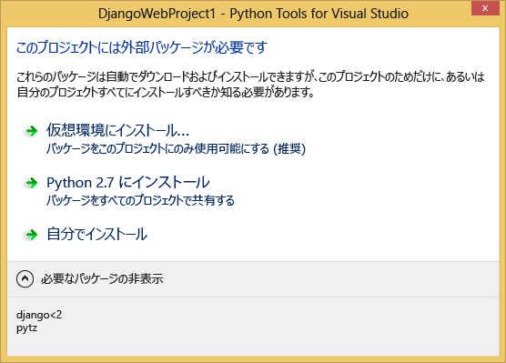
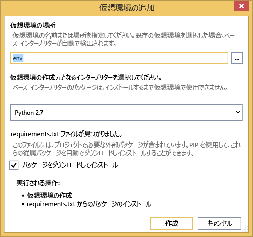
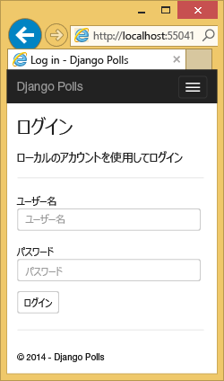
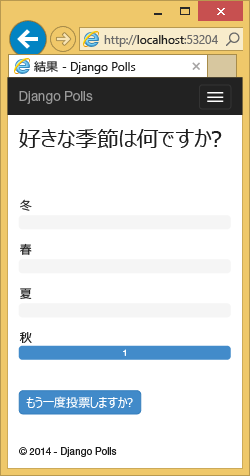
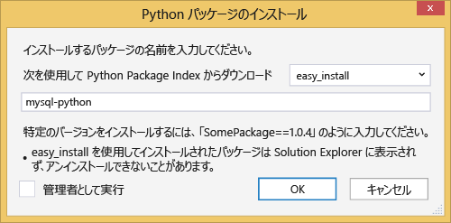
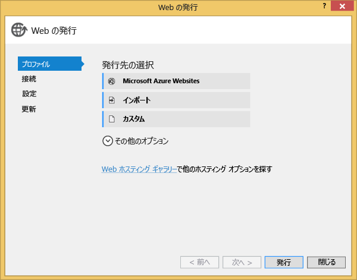
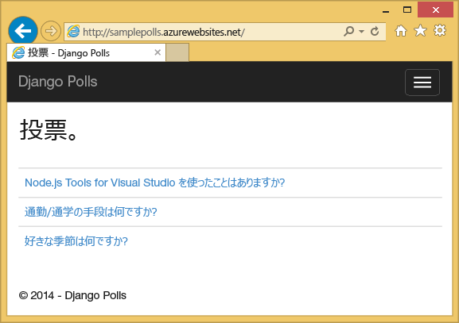

# Python Tools 2.2 for Visual Studio を使用した Azure 上の Django と MySQL
[!INCLUDE [tabs](../../includes/app-service-web-get-started-nav-tabs.md)]

このチュートリアルでは、[Python Tools for Visual Studio](https://www.visualstudio.com/vs/python) といずれかの PTVS サンプル テンプレートを使用して、単純な投票 Web アプリを作成します。 ここでは、Azure 上でホストされる MySQL サービスを使用する方法、Web アプリ が MySQL を使用するよう構成する方法、 [Azure App Service Web Apps](http://go.microsoft.com/fwlink/?LinkId=529714)に Web アプリを発行する方法について説明します。

> [!NOTE]
> このチュートリアルに含まれる情報は、次のビデオでも確認できます。
> 
> [PTVS 2.1: Django app with MySQL (PTVS 2.1: MySQL を使用した Django アプリ)][video]
> 
> 

Bottle、Flask、Django の各 Web フレームワークと、Azure Table Storage、MySQL、SQL Database の各サービスを使用した、PTVS での Azure App Service Web Apps の開発を取り上げたその他の記事については、「 [Python デベロッパー センター] 」をご覧ください。 この記事では App Service について重点的に説明していますが、 [Azure Cloud Services]の開発も同様の手順で行います。

## 前提条件
* Visual Studio 2015
* [Python 2.7 (32 ビット)] または [Python 3.4 (32 ビット)]
* [Python Tools 2.2 for Visual Studio]
* [Python Tools 2.2 for Visual Studio サンプル VSIX]
* [Azure SDK Tools for VS 2015]
* Django 1.9 以降

[!INCLUDE [create-account-and-websites-note](../../includes/create-account-and-websites-note.md)]

<!-- This note should not render as part of the the previous include. -->

> [!NOTE]
> Azure アカウントにサインアップする前に Azure App Service の使用を開始したい場合は、「[Azure App Service アプリケーションの作成](https://azure.microsoft.com/try/app-service/)」を参照してください。そこでは、App Service で有効期間の短いスターター Web アプリをすぐに作成できます。 このサービスの利用にあたり、クレジット カードは必要ありません。契約も必要ありません。
> 
> 

## プロジェクトを作成する
このセクションでは、サンプル テンプレートを使用して Visual Studio プロジェクトを作成します。 仮想環境を作成し、必要なパッケージをインストールします。 SQLite を使用して、ローカル データベースを作成します。 その後、アプリケーションをローカルで実行します。

1. Visual Studio で、**[ファイル]****[新しいプロジェクト]** の順に選択します。
2. [Python Tools 2.2 for Visual Studio サンプル VSIX] のプロジェクト テンプレートは、**[Python]** の **[サンプル]** にあります。 **[投票 Django Web プロジェクト]** を選択し、[OK] をクリックしてプロジェクトを作成します。
   
    ![[新しいプロジェクト] ダイアログ](./media/web-sites-python-ptvs-django-mysql/PollsDjangoNewProject.png)
3. 外部のパッケージをインストールするよう求めるメッセージが表示されます。 **[仮想環境にインストールする]**を選択します。
   
    
4. ベース インタープリターとして **[Python 2.7]** または **[Python 3.4]** を選択します。
   
    
5. **ソリューション エクスプローラー**で、プロジェクト ノードを右クリックして **[Python]** を選択し、**[Django Migrate (Django 移行)]** を選択します。  **[Django Create Superuser (Django でスーパーユーザーを作成する)]**を選択します。
6. これにより、Django Management Console が開き、プロジェクト フォルダーに SQLite データベースが作成されます。 プロンプトに従ってユーザーを作成します。
7. `F5`キーを押して、アプリケーションが動作することを確認します。
8. 上部にあるナビゲーション バーで、 **[ログイン]** をクリックします。
   
    
9. データベースを同期したときに作成したユーザーの資格情報を入力します。
   
    
10. **[サンプル投票の作成]**をクリックします。
    
     ![[サンプル投票の作成]](./media/web-sites-python-ptvs-django-mysql/PollsDjangoCommonBrowserNoPolls.png)
11. 投票をクリックして投票します。
    
     

## MySQL Database を作成する
データベースには、Azure 上でホストされる ClearDB MySQL データベースを作成します。

別の方法として、Azure 上で実行する独自の仮想マシンを作成し、自分で MySQL をインストールして管理できます。

次の手順に従って、無料プランでデータベースを作成できます。

1. [Azure ポータル]にログインします。
2. ナビゲーション ウィンドウの上部にある **[新規]** をクリックし、**[データ + ストレージ]** をクリックします。次に、**[MySQL データベース]** をクリックします。
3. 新しいリソース グループを作成することで、新しい MySQL データベースを構成し、適切な場所を選択します。
4. MySQL データベースが作成されたら、データベース ブレードの **[プロパティ]** をクリックします。
5. [コピー] ボタンを使用して、 **CONNECTIONSTRING** の値をクリップボードにコピーします。

## プロジェクトを構成する
このセクションでは、先ほど作成した MySQL データベースを使用するように Web アプリを構成します。 Django と MySQL データベースを使用するために必要な追加の Python パッケージもインストールします。 そのうえで、Web アプリをローカルで実行します。

1. Visual Studio で、 **ProjectName**フォルダーから *settings.py* を開きます。 エディターで、接続文字列を一時的に貼り付けます。 この接続文字列の形式を次に示します。
   
        Database=<NAME>;Data Source=<HOST>;User Id=<USER>;Password=<PASSWORD>
   
    既定のデータベース **ENGINE** を変更して MySQL を使用し、**CONNECTIONSTRING** の**NAME**、**USER**、**PASSWORD**、**HOST** の値を設定します。
   
        DATABASES = {
            'default': {
                'ENGINE': 'django.db.backends.mysql',
                'NAME': '<Database>',
                'USER': '<User Id>',
                'PASSWORD': '<Password>',
                'HOST': '<Data Source>',
                'PORT': '',
            }
        }
2. ソリューション エクスプローラーで、**[Python 環境]** の下にある仮想環境を右クリックし、**[Python パッケージのインストール]** を選択します。
3. **pip** を使用して `mysqlclient` パッケージをインストールします。
   
    
4. **ソリューション エクスプローラー**で、プロジェクト ノードを右クリックして **[Python]** を選択し、**[Django Migrate (Django 移行)]** を選択します。  **[Django Create Superuser (Django でスーパーユーザーを作成する)]**を選択します。
   
    これにより、前のセクションで作成した MySQL データベースのテーブルが作成されます。 表示される手順に従ってユーザーを作成してください。この記事の最初のセクションで作成した SQLite データベースのユーザーと一致させる必要はありません。
5. `F5`キーでアプリケーションを実行します。 **[サンプル投票の作成]** で作成された投票と、投票によって送信されたデータは、MySQL データベースでシリアル化されます。

## Web アプリを Azure App Service に発行する
Azure .NET SDK を使用すると、Web アプリを Azure App Service に簡単にデプロイできます。

1. **ソリューション エクスプローラー**で、プロジェクト ノードを右クリックし、**[発行]** をクリックします。
   
    
2. **[Microsoft Azure App Service]**をクリックします。
3. **[新規]** をクリックして、新しい Web アプリを作成します。
4. 次のフィールドに入力し、 **[作成]**をクリックします。
   
   * **[Web アプリケーション名]**
   * **[App Service プラン]**
   * **[リソース グループ]**
   * **[リージョン]**
   * **[データベース サーバー]** は、**[データベースなし]** のままにしておきます。
5. 他のすべての既定値をそのまま使用し、 **[発行]**をクリックします。
6. Web ブラウザーが自動的に開いて、発行した Web アプリが表示されます。 想定どおりに Web アプリが Azure でホストされている **MySQL** データベースを使用して動作していることが確認できます。
   
    
   
    ご利用ありがとうございます。 Azure に MySQL ベースの Web アプリが正常に発行されました。

## 次のステップ
Python Tools for Visual Studio、Django および MySQL の詳細については、以下のリンクを参照してください。

* [Python Tools for Visual Studio のドキュメント]
  * [Web プロジェクト]
  * [クラウド サービス プロジェクト]
  * [Microsoft Azure でのリモート デバッグ]
* [Django のドキュメント]
* [MySQL]

詳細については、 [Python デベロッパー センター](/develop/python/)を参照してください。

<!--Link references-->

[Python デベロッパー センター]: /develop/python/
[Azure Cloud Services]: ../cloud-services/cloud-services-python-ptvs.md

<!--External Link references-->

[Azure ポータル]: https://portal.azure.com
[Python Tools for Visual Studio]: https://www.visualstudio.com/vs/python/
[Python Tools 2.2 for Visual Studio]: http://go.microsoft.com/fwlink/?LinkID=624025
[Python Tools 2.2 for Visual Studio サンプル VSIX]: http://go.microsoft.com/fwlink/?LinkID=624025
[Azure SDK Tools for VS 2015]: http://go.microsoft.com/fwlink/?LinkId=518003
[Python 2.7 (32 ビット)]: http://go.microsoft.com/fwlink/?LinkId=517190
[Python 3.4 (32 ビット)]: http://go.microsoft.com/fwlink/?LinkId=517191
[Python Tools for Visual Studio のドキュメント]: http://aka.ms/ptvsdocs
[Microsoft Azure でのリモート デバッグ]: http://go.microsoft.com/fwlink/?LinkId=624026
[Web プロジェクト]: http://go.microsoft.com/fwlink/?LinkId=624027
[クラウド サービス プロジェクト]: http://go.microsoft.com/fwlink/?LinkId=624028
[Django のドキュメント]: https://www.djangoproject.com/
[MySQL]: http://www.mysql.com/
[video]: http://youtu.be/oKCApIrS0Lo

