# Azure App Service に .NET Web ジョブを作成する
このチュートリアルでは、 [WebJobs SDK](websites-dotnet-webjobs-sdk.md)を使用する簡単な多層 ASP.NET MVC 5 アプリケーションのコードを記述する方法を示します。

[WebJobs SDK](websites-webjobs-resources.md) の目的は、Web ジョブで実行できる一般的な作業 (画像処理、キュー処理、RSS 情報集約、ファイル管理、電子メールの送信など) を単純なコードで記述できるようにすることです。 WebJobs SDK には、Azure Storage や Service Bus の操作、タスクのスケジューリング、エラー処理など、一般的な用途に対応した各種の機能が組み込まれています。 拡張性にも優れた設計となっており、 [拡張機能のオープン ソース リポジトリ](https://github.com/Azure/azure-webjobs-sdk-extensions/wiki/Binding-Extensions-Overview)が存在します。

このサンプル アプリケーションは、広告の掲示板です。 ユーザーは広告の画像をアップロードでき、バックエンド プロセスにより、その画像は縮小表示に変換されます。 広告の一覧ページには縮小表示画像が表示され、広告の詳細ページにはフル サイズの画像が表示されます。 スクリーンショットを次に示します。

このサンプル アプリケーションは、[Azure キュー](http://www.asp.net/aspnet/overview/developing-apps-with-windows-azure/building-real-world-cloud-apps-with-windows-azure/queue-centric-work-pattern)および [Azure BLOB](http://www.asp.net/aspnet/overview/developing-apps-with-windows-azure/building-real-world-cloud-apps-with-windows-azure/unstructured-blob-storage) と連動します。 また、[Azure App Service](http://go.microsoft.com/fwlink/?LinkId=529714) と [Azure SQL Database](http://msdn.microsoft.com/library/azure/ee336279) にアプリケーションをデプロイする方法も示します。

## 前提条件
このチュートリアルでは、Visual Studio で [ASP.NET MVC 5](http://www.asp.net/mvc/tutorials/mvc-5/introduction/getting-started) プロジェクトを操作する方法を理解していることを前提としています。

このチュートリアルは、Visual Studio 2013 用に作成されました。 Visual Studio をまだお持ちでない場合は、Azure SDK for .NET をインストールすると自動的にインストールされます。

このチュートリアルは、Visual Studio 2015 でも使用できますが、アプリケーションをローカルで実行する前に、Web.config ファイルと App.config ファイルで SQL Server LocalDB 接続文字列の `Data Source` 部分を `Data Source=(localdb)\v11.0` から `Data Source=(LocalDb)\MSSQLLocalDB` に変更する必要があります。

> [!NOTE]
> このチュートリアルを完了するには、Azure アカウントが必要です。
>
> * 無料で [Azure アカウントを開く](https://azure.microsoft.com/pricing/free-trial/?WT.mc_id=A261C142F)ことができます。Azure の有料サービスを試用できるクレジットが提供されます。このクレジットを使い切ってもアカウントは維持されるため、Websites など無料の Azure サービスをご利用になれます。 明示的に設定を変更して課金を求めない限り、クレジット カードに課金されることはありません。
> * [MSDN サブスクライバーの特典を有効にする](https://azure.microsoft.com/pricing/member-offers/msdn-benefits-details/?WT.mc_id=A261C142F) こともできます - MSDN サブスクリプションにより、有料の Azure のサービスを使用できるクレジットが毎月与えられます。
>
> Azure アカウントにサインアップする前に Azure App Service の使用を開始したい場合は、「[Azure App Service アプリケーションの作成](https://azure.microsoft.com/try/app-service/)」を参照してください。そこでは、App Service で有効期間の短いスターター Web アプリをすぐに作成できます。 このサービスの利用にあたり、クレジット カードは必要ありません。契約も必要ありません。
>
>

## 学習内容
このチュートリアルでは、次のタスクの実行方法を示します。

* Azure SDK をインストールして、Azure 向け開発用にコンピューターを準備する。
* 関連付けられた Web プロジェクトをデプロイしたときに、Azure Web ジョブとして自動的にデプロイするコンソール アプリケーション プロジェクトを作成する。
* 開発コンピューター上で Web ジョブ SDK バックエンドをローカルにテストする。
* Web ジョブ バックエンドと共に Web アプリケーションを App Service に発行する。
* ファイルを Azure BLOB サービスにアップロードして保存する。
* Azure Web ジョブ SDK を使用して Azure Storage キューと BLOB を操作する。

## アプリケーションのアーキテクチャ
サンプル アプリケーションでは、 [キューを中心とした作業パターン](http://www.asp.net/aspnet/overview/developing-apps-with-windows-azure/building-real-world-cloud-apps-with-windows-azure/queue-centric-work-pattern) を使用して、CPU 負荷の高い縮小表示の作成をバックエンド プロセスにオフロードします。

このアプリでは、広告を SQL データベースに格納します。その際、テーブルを作成してデータにアクセスするために Entity Framework Code First を使用します。 それぞれの広告に対し、フルサイズ画像用と縮小表示画像用の&2; つの URL がデータベースに格納されます。

ユーザーが画像をアップロードすると、Web アプリによってその画像が [Azure BLOB](http://www.asp.net/aspnet/overview/developing-apps-with-windows-azure/building-real-world-cloud-apps-with-windows-azure/unstructured-blob-storage)に格納され、広告情報がその BLOB を示す URL と共にデータベースに格納されます。 同時に、メッセージが Azure キューに書き込まれます。 Azure Web ジョブとして実行されるバックエンド プロセスでは、Web ジョブ SDK は、キューをポーリングして新しいメッセージの有無を確認します。 新しいメッセージが出現すると、Web ジョブはその画像の縮小表示を作成し、その広告の縮小表示 URL データベース フィールドを更新します。 次の図に、アプリケーションの各パーツのやり取りを示します。

[!INCLUDE [install-sdk](../../includes/install-sdk-2015-2013.md)]

このチュートリアルの手順は、Azure SDK for .NET 2.7.1 以降に適用されます。

## Azure ストレージ アカウントの作成
Azure ストレージ アカウントは、キューおよび BLOB データをクラウドに格納するためのリソースを提供します。 また、ダッシュボードのログ データを格納するために Web ジョブ SDK によっても使用されます。

現実のアプリケーションでは、通常、アプリケーション データとログ データ、テスト データと運用データに別個のアカウントを作成します。 このチュートリアルでは、アカウントを&1; つだけ使用します。

1. Visual Studio で **サーバー エクスプローラー** ウィンドウを開きます。
2. **[Azure]** ノードを右クリックし、**[Microsoft Azure に接続]** をクリックします。
   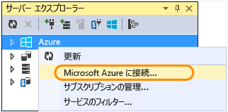
3. Azure の資格情報を使用してサインインします。
4. Azure ノードの **[Storage]** を右クリックし、**[ストレージ アカウントの作成]** をクリックします。
   ![[ストレージ アカウントの作成]](./media/websites-dotnet-webjobs-sdk-get-started/createstor.png)
5. **[ストレージ アカウントの作成]** ダイアログ ボックスで、ストレージ アカウントの名前を入力します。

    名前は一意である必要があります (Azure ストレージ アカウントで同じ名前は使用できません)。 入力した名前が既に使用されている場合、変更を求められます。

    ストレージ アカウントにアクセスするための URL は、 *{name}*.core.windows.net 形式になります。
6. **[リージョン/アフィニティ グループ]** ボックスの一覧で、現在の所在地に最も近いリージョンを選択します。

    この設定は、お使いのストレージ アカウントをホストしている Azure データセンターを指定します。 このチュートリアルでは、選択肢によって顕著な相違は生じません。 ただし、運用 Web アプリケーションの場合は、待ち時間とデータ送信料金を最小限に抑えるために、Web サーバーとストレージ アカウントを同じリージョンに設定することが望まれます。 待ち時間を最小限にするには、Web アプリケーション (後で作成する) を Web アプリケーションにアクセスするブラウザーのできるだけ近くに配置します。
7. **[レプリケーション]** ボックスを **[ローカル冗長]** に設定します。

    Geo レプリケーションをストレージ アカウントに対して有効にすると、1 次拠点で重大な障害が発生した場合に備えて、保存したコンテンツは&2; 次データセンターに複製されて、フェイルオーバーが可能になります。 Geo レプリケーションには追加費用が発生する場合があります。 また、テストおよび開発アカウントの場合は、一般的に Geo レプリケーションに対する課金は避けたいと考えるでしょう。 詳細については、「 [ストレージ アカウントの作成、管理、削除](../storage/storage-create-storage-account.md)」を参照してください。
8. **[作成]**をクリックします。

    

## アプリケーションのダウンロード
1. [完成したソリューション](http://code.msdn.microsoft.com/Simple-Azure-Website-with-b4391eeb)をダウンロードして解凍します。
2. Visual Studio を起動します。
3. **[ファイル]** メニューで **[開く]、[プロジェクト/ソリューション]** の順に選択し、ソリューションをダウンロードした場所に移動して、ソリューション ファイルを開きます。
4. Ctrl + Shift + B キーを押して、ソリューションをビルドします。

    既定では、 *.zip* ファイルに含まれていなかった NuGet パッケージのすべての内容が Visual Studio によって自動的に復元されます。 パッケージが復元されない場合は、**[ソリューションの NuGet パッケージの管理]** ダイアログの右上にある **[復元]** ボタンをクリックしてパッケージを手動でインストールします。
5. **ソリューション エクスプローラー**で、**ContosoAdsWeb** がスタートアップ プロジェクトとして選択されていることを確認します。

## ストレージ アカウントを使用するためのアプリケーションの構成
1. ContosoAdsWeb プロジェクトでアプリケーションの *Web.config* ファイルを開きます。

    ファイルには、BLOB とキューを操作するための SQL 接続文字列と Azure Storage 接続文字列が含まれます。

    SQL 接続文字列は [SQL Server Express LocalDB](http://msdn.microsoft.com/library/hh510202.aspx) データベースを指しています。

    SQL 接続文字列は、ストレージ アカウント名とアクセス キーのプレースホルダーを持つ場合の例です。 これは、ストレージ アカウントの名前とキーを持つ接続文字列と置き換えられます。  

    <pre class="prettyprint">&lt;connectionStrings&gt;
      &lt;add name="ContosoAdsContext" connectionString="Data Source=(localdb)\v11.0; Initial Catalog=ContosoAds; Integrated Security=True; MultipleActiveResultSets=True;" providerName="System.Data.SqlClient" /&gt;
      &lt;add name="AzureWebJobsStorage" connectionString="DefaultEndpointsProtocol=https;AccountName=<mark>[accountname]</mark>;AccountKey=<mark>[accesskey]</mark>"/&gt;
    &lt;/connectionStrings&gt;</pre>

    ストレージ接続文字列は AzureWebJobsStorage という名前になります。これは、Web ジョブ SDK が既定で使用する名前であるためです。 Azure 環境では&1; つの接続文字列を設定する必要しかないため、ここでも同じ名前が使用されます。
2. **サーバー エクスプローラー**で、**[Storage]** ノードの下にあるストレージ アカウントを右クリックし、**[プロパティ]** をクリックします。

    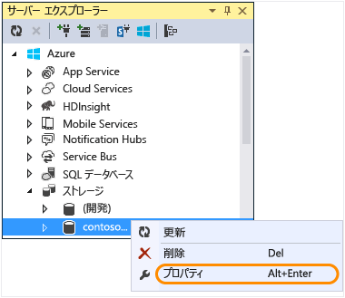
3. **[プロパティ]** ウィンドウで **[ストレージ アカウント キー]** をクリックし、省略記号ボタンをクリックします。

    
4. **接続文字列**をコピーします。

    ![[ストレージ アカウント キー] ダイアログ](./media/websites-dotnet-webjobs-sdk-get-started/cpak.png)
5. *Web.config* ファイル内のストレージ接続文字列を、コピーした接続文字列で置き換えます。 貼り付ける前に、引用符の内側の文字列がすべてコピーされ、引用符が含まれていないことを確認してください。
6. ContosoAdsWeb プロジェクトで *Web.config* ファイルを開きます。

    このファイルには、アプリケーション データ用に&1; つとログ用に&1; つの計&2; つのストレージ接続文字列があります。 ストレージ アカウントは、アプリケーション データ用とログ用とで使い分けることができるほか、 [データ用に複数のストレージ アカウント](https://github.com/Azure/azure-webjobs-sdk/blob/master/test/Microsoft.Azure.WebJobs.Host.EndToEndTests/MultipleStorageAccountsEndToEndTests.cs)を使用することができます。 このチュートリアルでは、1 つのストレージ アカウントを使用します。 接続文字列には、ストレージ アカウント キーのプレースホルダーがあります。

      <pre class="prettyprint">&lt;configuration&gt;
    &lt;connectionStrings&gt;
        &lt;add name="AzureWebJobsDashboard" connectionString="DefaultEndpointsProtocol=https;AccountName=<mark>[accountname]</mark>;AccountKey=<mark>[accesskey]</mark>"/&gt;
        &lt;add name="AzureWebJobsStorage" connectionString="DefaultEndpointsProtocol=https;AccountName=<mark>[accountname]</mark>;AccountKey=<mark>[accesskey]</mark>"/&gt;
        &lt;add name="ContosoAdsContext" connectionString="Data Source=(localdb)\v11.0; Initial Catalog=ContosoAds; Integrated Security=True; MultipleActiveResultSets=True;"/&gt;
    &lt;/connectionStrings&gt;
        &lt;startup&gt;
            &lt;supportedRuntime version="v4.0" sku=".NETFramework,Version=v4.5" /&gt;
    &lt;/startup&gt;
   &lt;/configuration&gt;</pre>

    既定では、Web ジョブ SDK は、AzureWebJobsStorage および AzureWebJobsDashboard という名前の接続文字列を探します。 代替として、[希望する接続文字列を格納し、それを明示的に `JobHost` オブジェクトに渡すこともできます。](websites-dotnet-webjobs-sdk-storage-queues-how-to.md#config)
7. 両方のストレージ接続文字列を先ほどコピーした接続文字列で置き換えます。
8. 変更を保存します。

## ローカルでアプリケーションを実行する
1. アプリケーションの Web フロントエンドを起動するには、Ctrl キーを押しながら F5 キーを押します。

    既定のブラウザーでホーム ページが開きます (Web プロジェクトをスタートアップ プロジェクトとしているため、Web プロジェクトが実行されます)。

    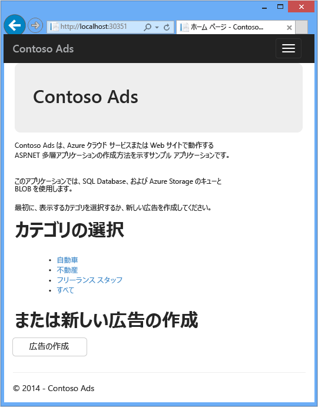
2. アプリケーションの Web ジョブ バックエンドを起動するには、**ソリューション エクスプローラー**で ContosoAdsWebJob プロジェクトを右クリックし、次に、**[デバッグ]** > **[新しいインスタンスを開始]** の順にクリックします。

    コンソール アプリケーション ウィンドウが開き、Web ジョブ SDK JobHost オブジェクトの実行が開始されたことを示すログ メッセージが表示されます。

    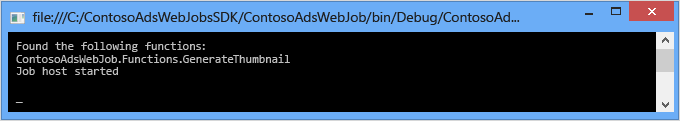
3. ブラウザーで、**[広告を作成]**をクリックします。
4. 何らかのテスト データを入力し、アップロードする画像を選択したら、 **[Create]**をクリックします。

    

    [Index] ページが表示されますが、新しい広告の処理が完了していないため、縮小表示はまだ表示されません。

    その間、しばらく待機した後、コンソール アプリケーション ウィンドウのログ メッセージによって、キュー メッセージが受信され処理されたことが示されます。

    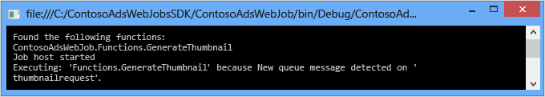
5. コンソール アプリケーション ウィンドウでログ メッセージを確認した後、[インデックス] ページを更新すると縮小表示が現れます。

    
6. 広告に対応する **[Details]** をクリックすると、フルサイズの画像が表示されます。

    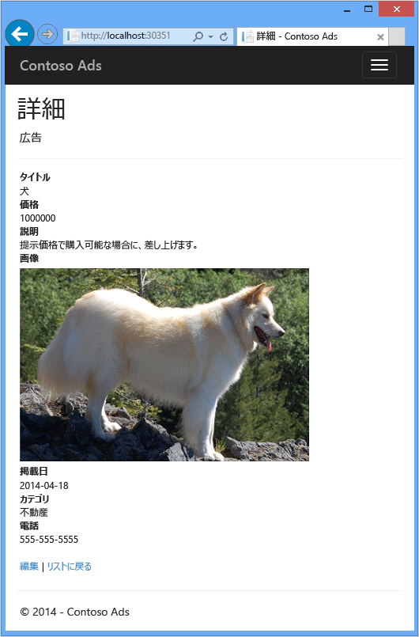

アプリケーションはローカル コンピューター上で実行されており、同じコンピューター上の SQL Server データベースを使用していますが、クラウド内のキューおよび BLOB と連携動作しています。 次のセクションでは、クラウド データベースおよびクラウドの BLOB とキューを使用して、アプリケーションをクラウド内で実行します。  

## クラウドでアプリケーションを実行する
アプリケーションをクラウドで実行するには、次の手順を実行します。

* Web アプリにデプロイします。 Visual Studio では、App Service の新しい Web アプリと SQL Database インスタンスが自動的に作成されます。
* Azure SQL データベースとストレージ アカウントを使用するように Web アプリケーションを構成する

クラウド内で実行中にいくつかの広告が作成された後、Web ジョブ SDK ダッシュボードを表示して、提供される豊富な監視機能を確認できます。

### Web アプリへのデプロイ
1. ブラウザーとコンソール アプリケーション ウィンドウを閉じます。
2. **ソリューション エクスプローラー**で ContosoAdsWeb プロジェクトを右クリックし、**[発行]** をクリックします。
3. **Web の発行**ウィザードの **[プロファイル]** ステップで、**[Microsoft Azure Web アプリ]** をクリックします。

    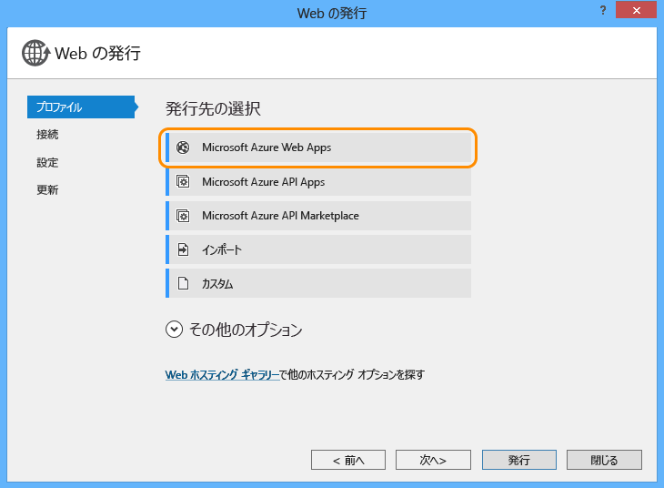
4. まだサインインしていない場合は Azure にサインインします。
5. **[新規]**をクリックします。

    ダイアログ ボックスの見た目は、インストールした Azure SDK for .NET のバージョンによって若干異なる場合があります。

    ![[新規] をクリック](./media/websites-dotnet-webjobs-sdk-get-started/clicknew.png)
6. **[Microsoft Azure で Web アプリを作成]** ダイアログ ボックスで、**[Web アプリ名]** ボックスに一意の名前を入力します。

    完全な URL は、ここに入力した内容に .azurewebsites.net を追加して構成されます ( **[Web アプリ名]** テキスト ボックスの横を参照)。 たとえば、Web アプリケーション名が ContosoAds の場合、URL は ContosoAds.azurewebsites.net となります。
7. [[App Service プラン]](../app-service/azure-web-sites-web-hosting-plans-in-depth-overview.md) ボックスの一覧で、 **[新しい App Service プランの作成]**を選択します。 ContosoAdsPlan など、App Service プランの名前を入力します。
8. [[リソース グループ]](../azure-resource-manager/resource-group-overview.md) ボックスの一覧で、**[新規リソース グループの作成]**を選択します。
9. ContosoAdsGroup など、リソース グループの名前を入力します。
10. **[リージョン]** ボックスの一覧で、ストレージ アカウント用に選択したリージョンと同じリージョンを選択します。

    この設定によって、Web アプリが実行される Azure データ センターが指定されます。 Web アプリとストレージ アカウントを同じデータセンターに保持することで、待ち時間とデータ送信料金が最小限に抑えられます。
11. **[データベース サーバー]** ボックスの一覧で、**[新しいサーバーの作成]** を選択します。
12. サーバー名が一意になるように、データベース サーバーの名前 (contosoadsserver に数字または名前を追加したもの) を入力します。

    サーバー名は一意にする必要があります。 小文字、数字、ハイフンを使用できます。 末尾にハイフンを使用することはできません。

    または、サブスクリプションに既にサーバーが設定されている場合は、ドロップダウン リストからそのサーバーを選択します。
13. **[データベースのユーザー名]** および **[データベース パスワード]** にそれぞれ管理者の該当する値を入力します。

    **[新しい SQL データベース サーバー]** を選択した場合は、既存の名前とパスワードではなく、このデータベースへのアクセス時に使用する新しい名前とパスワードを入力してください。 以前に作成したサーバーを選択した場合は、既に作成されている管理ユーザー アカウントのパスワードを入力します。
14. **[作成]**をクリックします。

    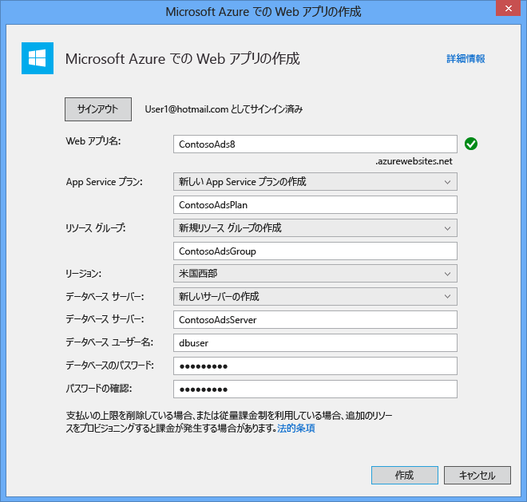

    Visual Studio でソリューション、Web プロジェクト、Azure の Web アプリ、および Azure SQL Database インスタンスが作成されます。
15. **Web の発行**ウィザードの **[接続]** ステップで、**[次へ]** をクリックします。

    ![[接続] ステップ](./media/websites-dotnet-webjobs-sdk-get-started/connstep.png)
16. **[設定]** ステップで、**[実行時にこの接続文字列を使用する]** チェック ボックスをオフにして **[次へ]** をクリックします。

    ![[設定] 手順
](./media/websites-dotnet-webjobs-sdk-get-started/settingsstep.png)

    SQL 接続文字列を設定するために発行ダイアログを使用する必要はありません。後から Azure 環境で値を設定します。

    このページでの警告は無視します。

    * 通常、Azure で実行する際に使用するストレージ アカウントとローカルで実行する際に使用するストレージ アカウントは異なりますが、このチュートリアルでは、両方の環境で同じものを使用しています。 そのため、AzureWebJobsStorage 接続文字列を変換する必要はありません。 クラウド内で異なるストレージ アカウントを使用することを希望した場合でも、アプリケーションは Azure 内で実行される際には Azure 環境設定を使用するため接続文字列を変換する必要はありません。 この点は後でチュートリアルの中で確認できます。
    * このチュートリアルでは、ContosoAdsContext データベース用に使用されるデータ モデルには変更を加えないため、デプロイのために Entity Framework Code First Migrations を使用する必要はありません。 Code First は、アプリケーションが SQL データへのアクセスを最初に試行したときに、新しいデータベースを自動的に作成します。

    このチュートリアルの場合、 **[ファイル発行オプション]** の下のオプションは既定値のままでかまいません。
17. **[プレビュー]** ステップで、**[プレビューの開始]** をクリックします。

    ![[プレビュー開始] をクリック](./media/websites-dotnet-webjobs-sdk-get-started/previewstep.png)

    データベースが発行されていないことに関する警告は無視します。 Entity Framework Code First によってデータベースが作成されます。発行する必要はありません。

    プレビュー ウィンドウに、Web ジョブ プロジェクトのバイナリ ファイルと構成ファイルが Web アプリの *app_data\jobs\continuous* フォルダーにコピーされることが示されます。

    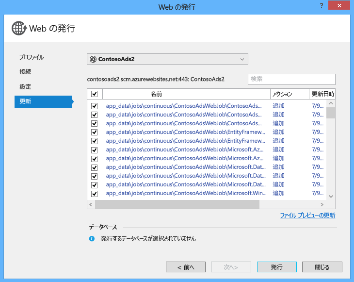
18. **[発行]**をクリックします。

    Visual Studio によってアプリケーションがデプロイされ、ブラウザーでホーム ページの URL が開かれます。

    次のセクションで、Azure 環境内で接続文字列を設定するまで、Web アプリケーションは使用できません。 以前に選択した Web アプリケーションおよびデータベースの作成オプションに応じて、エラー ページまたはホーム ページが表示されます。

### Azure SQL データベースとストレージ アカウントを使用するように Web アプリケーションを構成する
セキュリティ上のベスト プラクティスとして、[接続文字列などの機密情報をソース コード リポジトリに格納されるファイルに含めるのは避ける](http://www.asp.net/aspnet/overview/developing-apps-with-windows-azure/building-real-world-cloud-apps-with-windows-azure/source-control#secrets)必要があります。 Azure では、接続文字列とその他の設定値を Azure 環境内で設定できます。その後、アプリケーションを Azure 内で実行するときに、ASP.NET 構成 API が自動的にそれらの値を取り出します。 これらの値は、**サーバー エクスプローラー**、Azure ポータル、Windows PowerShell、クロスプラットフォーム コマンドライン インターフェイスを使用して、Azure で設定できます。 詳細については、[アプリケーション文字列と接続文字列の動作](https://azure.microsoft.com/blog/2013/07/17/windows-azure-web-sites-how-application-strings-and-connection-strings-work/)に関するページをご覧ください。

このセクションでは、 **サーバー エクスプローラー** を使用して Azure の接続文字列値を設定します。

1. **サーバー エクスプローラー**で、**[Azure]、[App Service]、{リソース グループ}** の下にある Web アプリを右クリックし、**[設定の表示]** をクリックします。

    **[構成]** タブで **[Azure Web アプリ]** ウィンドウが開きます。
2. DefaultConnection 接続文字列の名前を ContosoAdsContext に変更します。

    この接続文字列は、Web アプリケーションおよび関連付けられたデータベースを作成したときに Azure で自動的に作成されたものであるため、既に正しい接続文字列値になっています。 単に、コードで検索される名前へと変更しているだけです。
3. AzureWebJobsStorage および AzureWebJobsDashboard という名前の&2; つの新しい接続文字列を追加します。 型を [カスタム] に設定し、接続文字列値を *Web.config* および *App.config* で以前に使用した値と同じ値に設定します 引用符は含めないでください)。

    これらの接続文字列は Web ジョブ SDK によって、アプリケーション データ用とログ用に&1; つずつ使用されます。 以前に見たとおり、アプリケーション データ用の接続文字列は Web フロントエンド コードによっても使用されます。
4. **[保存]**をクリックします。

    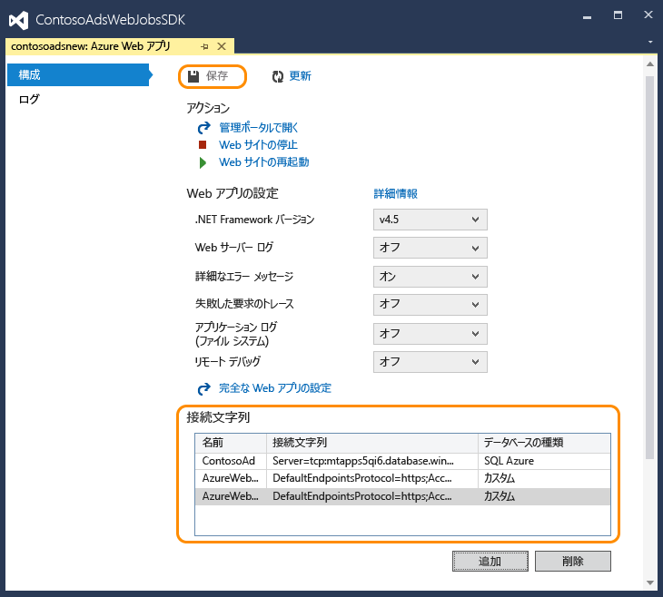
5. **サーバー エクスプローラー**で、Web アプリを右クリックし、**[停止]** をクリックします。
6. Web アプリが停止したら、その Web アプリをもう一度右クリックして **[開始]**をクリックします。

   Web ジョブは、発行時に自動的に起動されますが、構成を変更すると停止します。 再起動するには、Web アプリを再起動するか、 [Azure ポータル](http://go.microsoft.com/fwlink/?LinkId=529715)で Web ジョブを再起動します。 一般に、構成の変更後は Web アプリケーションを再起動することをお勧めします。
7. アドレス バーに Web アプリケーションの URL が示されているブラウザー ウィンドウを更新します。

    ホーム ページが表示されます。
8. アプリケーションをローカルで実行したときと同様に、広告を作成します。

   [インデックス] ページは最初に縮小表示なしで表示されます。
9. 数秒後、ページを更新すると、縮小表示が現れます。

   縮小表示が現れない場合は、Web ジョブが再開されるまで&1; 分ほど待機することがあります。 ページを更新してしばらくしても縮小表示が現れない場合は、Web ジョブが自動的に開始されなかった可能性があります。 その場合は、Web アプリの [クラシック ポータル](https://manage.windowsazure.com) ページで [Web ジョブ] タブに移動し、 **[開始]**をクリックしてください。

### Web ジョブ SDK ダッシュボードの表示
1. [クラシック ポータル](https://manage.windowsazure.com)で、Web アプリを選択します。
2. **[Web ジョブ]** タブをクリックします。
3. Web ジョブの [ログ] 列で URL をクリックします。

    ![[Web ジョブ] タブ](./media/websites-dotnet-webjobs-sdk-get-started/wjtab.png)

    新しいブラウザー タブが開き、Web ジョブ SDK ダッシュボードが表示されます。 ダッシュボードには、Web ジョブが実行中であることと、Web ジョブ SDK がトリガーしたコード内の関数の一覧が表示されます。
4. 関数のいずれかをクリックすると、その実行に関する詳細が表示されます。

    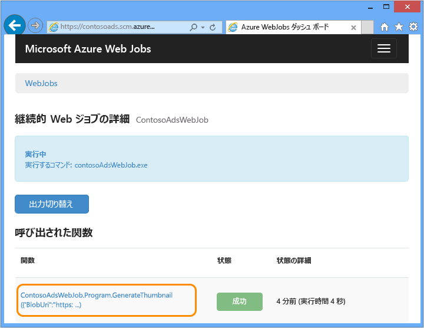

    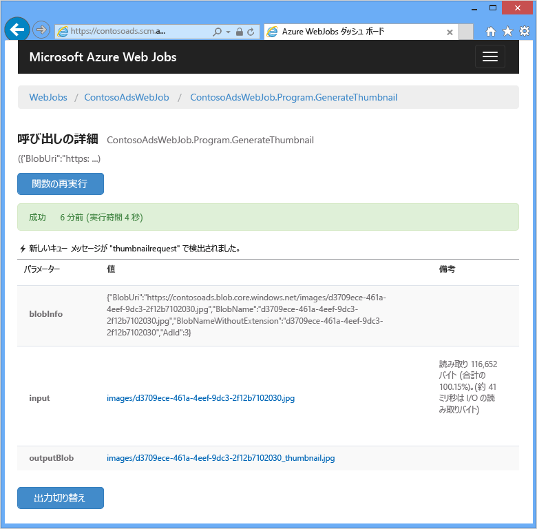

    このページの **[関数の再生]** をクリックすると、Web ジョブ SDK フレームワークは関数を再度呼び出すため、その機会に、最初に関数へ渡すデータを変更することができます。

> [!NOTE]
> テストを終了した時点で、Web アプリケーションと SQL Database インスタンスを削除してください。 Web アプリは無料ですが、SQL Database インスタンスとストレージ アカウントは有料です (サイズが小さいため少額)。 また、Web アプリケーションを実行したままにしておくと、その URL を見つけた他のユーザーが広告を作成して表示する可能性があります。 クラシック ポータルで、Web アプリの **[ダッシュボード]** タブに移動し、ページ下部の **[削除]** をクリックします。 その後、SQL データベース インスタンスを同時に削除するためのチェック ボックスをオンにします。 一時的に他のユーザーがこの Web アプリにアクセスできないようにするには、代わりに **[停止]** をクリックします。 その場合、引き続き、SQL Database とストレージ アカウントについては料金が生じます。 同様の手順で、不要になった SQL データベースとストレージ アカウントを削除できます。
>
>

## アプリケーションを最初から作成する
このセクションでは、次のタスクを実行します。

* Web プロジェクトを使用して Visual Studio ソリューションを作成します。
* フロントエンドとバックエンド間で共有されるデータ アクセス レイヤーのクラス ライブラリ プロジェクトを追加します。
* バックエンドのコンソール アプリケーション プロジェクトを追加し、Web ジョブのデプロイを有効にします。
* NuGet パッケージを追加します。
* プロジェクト参照を設定します。
* アプリケーション コードと構成ファイルを、チュートリアルの以前のセクションで作業したダウンロード済みのアプリケーションからコピーします。
* コード内で Azure の BLOB とキューおよび Web ジョブ SDK を操作する部分を確認します。

### Web プロジェクトおよびクラス ライブラリ プロジェクトを使用して Visual Studio ソリューションを作成する
1. Visual Studio で、**[ファイル]** メニューから **[新規]** > **[プロジェクト]** の順に選択します。
2. **[新しいプロジェクト]** ダイアログ ボックスで、**[Visual C#]** > **[Web]** > **[ASP.NET Web アプリケーション]** の順にクリックします。
3. プロジェクトに ContosoAdsWeb と名前を付け、ソリューションに ContosoAdsWebJobsSDK と名前を付けて (ダウンロードしたソリューションと同じフォルダーに入れる場合は、ソリューション名を変更します)、 **[OK]**をクリックします。

    ![[新しいプロジェクト]](./media/websites-dotnet-webjobs-sdk-get-started/newproject.png)
4. **[新しい ASP.NET プロジェクト]** ダイアログで、MVC テンプレートを選択し、**[Microsoft Azure]** の下の **[クラウドでのホスト]** チェック ボックスをオフにします。

    **[クラウドでのホスト]** を選択すると、Visual Studio で新しい Azure Web アプリと SQL Database を自動的に作成できるようになります。 これらは以前に作成済みのため、ここで、プロジェクトの作成時に再度作成する必要はありません。 新しいサイトとデータベースを作成する場合は、チェック ボックスをオンにします。 その後、以前にアプリケーションをデプロイしたときと同じ方法で、新しい Web アプリケーションと SQL Database を構成できます。
5. **[認証の変更]**をクリックします。

    ![[認証の変更]](./media/websites-dotnet-webjobs-sdk-get-started/chgauth.png)
6. **[認証の変更]** ダイアログで、**[認証なし]** をクリックし、**[OK]** をクリックします。

    ![[認証なし]](./media/websites-dotnet-webjobs-sdk-get-started/noauth.png)
7. **[新しい ASP.NET プロジェクト]** ダイアログで **[OK]** をクリックします。

    Visual Studio によって、ソリューションと Web プロジェクトが作成されます。
8. **ソリューション エクスプローラー**で (プロジェクトではなく) ソリューションを右クリックし、**[追加]** > **[新しいプロジェクト]** の順に選択します。
9. **[新しいプロジェクトの追加]** ダイアログ ボックスで、**[Visual C#]** > **[Windows デスクトップ]** > **[クラス ライブラリ]** テンプレートの順にクリックします。  
10. プロジェクトに *ContosoAdsCommon*という名前を付けて **[OK]**をクリックします。

    このプロジェクトには、Entity Framework コンテキストおよびフロントエンドとバックエンドの両方が使用するデータ モデルが含まれます。 代替として、Entity Framework に関連するクラスを Web プロジェクトに定義し、Web ジョブ プロジェクトからそのプロジェクトを参照することもできます。 ただしその場合、Web ジョブ プロジェクトは、必要としない Web アセンブリへの参照を含むことになります。

### Web ジョブのデプロイが有効なコンソール アプリケーション プロジェクトの追加
1. Web プロジェクト (ソリューションまたはクラス ライブラリ プロジェクトではなく) を右クリックし、 **[追加]** > **[新しい Azure Web ジョブ プロジェクト]**を使用する簡単な多層 ASP.NET MVC&5; アプリケーションのコードを記述する方法を示します。

    ![[新規 Azure Web ジョブ プロジェクト] メニュー選択](./media/websites-dotnet-webjobs-sdk-get-started/newawjp.png)
2. **[Azure Web ジョブの追加]** ダイアログで、**[プロジェクト名]** と **[Web ジョブ名]** の両方に「ContosoAdsWebJob」と入力します。 **[Web ジョブ実行モード]** は **[連続的に実行]** に設定したままにします。
3. **[OK]**をクリックします。

   Visual Studio は、Web プロジェクトがデプロイされたときに常に Web ジョブとしてデプロイするように構成されたコンソール アプリケーションを作成します。 そのために、プロジェクトの作成後に次のタスクが実行されました。

   * *webjob-publish-settings.json* ファイルが Web ジョブ プロジェクトの Properties フォルダーに追加されました。
   * *webjobs-list.json* ファイルが Web プロジェクトの Properties フォルダーに追加されました。
   * Microsoft.Web.WebJobs.Publish NuGet パッケージが Web ジョブ プロジェクトにインストールされました。

   これらの変更の詳細については、 [Visual Studio を使用して Web ジョブをデプロイする方法](websites-dotnet-deploy-webjobs.md)に関するページを参照してください。

### NuGet パッケージの追加
Web ジョブ プロジェクトの新しいプロジェクト テンプレートは、Web ジョブ SDK の NuGet パッケージ [Microsoft.Azure.WebJobs](http://www.nuget.org/packages/Microsoft.Azure.WebJobs) とその依存関係を自動的にインストールします。

Web ジョブ プロジェクトに自動的にインストールされる Web ジョブ SDK の依存関係の&1; つが、Azure Storage クライアント ライブラリ (SCL) です。 ただし、Blob およびキューで使用するには、これをWeb プロジェクトに追加する必要があります。

1. ソリューションの **[NuGet パッケージの管理]** ダイアログを開きます。
2. 左側のウィンドウで、 **[インストール済みのパッケージ]**を選択します。
3. *Azure Storage* パッケージを見つけ、 **[管理]**をクリックします。
4. **[プロジェクトの選択] **ボックスで、**[ContosoAdsWeb]** チェック ボックスをオンにし、**[OK]** をクリックします。

    3 つのプロジェクトすべてが Entity Framework を使用して SQL Database 内のデータを操作します。
5. 左側のウィンドウで、 **[オンライン]**を選択します。
6. *EntityFramework* NuGet パッケージを見つけて、3 つのプロジェクトすべてにインストールします。

### プロジェクト参照の設定
Web と Web ジョブ プロジェクトはどちらも SQL Database と連携して動作するため、両方に ContosoAdsCommon プロジェクトへの参照が必要です。

1. ContosoAdsWeb プロジェクトで、ContosoAdsCommon プロジェクトの参照を設定します。 (ContosoAdsWeb プロジェクトを右クリックし、**[追加]** > **[参照]** の順にクリックします。 **[参照マネージャー]** ダイアログ ボックスで、**[ソリューション]** > **[プロジェクト]** > **[ContosoAdsCommon]** の順に選択し、**[OK]** をクリックします。)
2. ContosoAdsWebJob プロジェクトで、ContosAdsCommon プロジェクトへの参照を設定します。

    Web ジョブ プロジェクトには、画像を操作し、接続文字列にアクセスするための参照が必要です。
3. ContosoAdsWebJob プロジェクトで、`System.Drawing` および `System.Configuration` への参照を設定します。

### コードと構成ファイルの追加
このチュートリアルでは、[スキャフォールディングを使用した MVC コントローラーおよびビューの作成方法](http://www.asp.net/mvc/tutorials/mvc-5/introduction/getting-started)、[SQL Server データベースで動作する Entity Framework コードの作成方法](http://www.asp.net/mvc/tutorials/getting-started-with-ef-using-mvc)、[ASP.NET 4.5 での非同期プログラミングの基礎](http://www.asp.net/aspnet/overview/developing-apps-with-windows-azure/building-real-world-cloud-apps-with-windows-azure/web-development-best-practices#async)については説明していません。 そのため、実行する必要のある残りの作業は、コードと構成ファイルをダウンロード済みのソリューションから新しいソリューションへコピーすることだけです。 コピーの実行後に、以降のセクションでコードの重要な部分について説明します。

プロジェクトまたはフォルダーにファイルを追加するには、プロジェクトまたはフォルダーを右クリックし、 **[追加]** > **[既存の項目]**を使用する簡単な多層 ASP.NET MVC&5; アプリケーションのコードを記述する方法を示します。 目的のファイルを選択し、 **[追加]**をクリックします。 既存のファイルを置き換えるかどうかをたずねるメッセージが表示されたら、 **[はい]**をクリックします。

1. ContosoAdsCommon プロジェクトで、*Class1.cs* ファイルを削除します。その場所に、ダウンロードしたプロジェクトから次のファイルを追加します。

   * *Ad.cs*
   * *ContosoAdscontext.cs*
   * *BlobInformation.cs*  
2. ContosoAdsWeb プロジェクトで、ダウンロードしたプロジェクトから次のファイルを追加します。

   * *Web.config*
   * *Global.asax.cs*  
   * *Controllers* フォルダー: *AdController.cs*
   * *Views\Shared* フォルダー: *_Layout.cshtml* ファイル
   * *Views\Home* フォルダー: *Index.cshtml*
   * *Views\Ad* フォルダー (最初にフォルダーを作成):&5; つの *.cshtml* ファイル  
3. ContosoAdsWebJob プロジェクトで、ダウンロードしたプロジェクトから次のファイルを追加します。

   * *App.config* (ファイルの種類のフィルターを **[すべてのファイル]**に変更します)
   * *Program.cs*
   * *Functions.cs*

これで、前の説明に従って、アプリケーションをビルド、実行、およびデプロイできます。 ただし、その前に、デプロイ先の最初の Web アプリケーションで実行中の Web ジョブを停止します。 停止しないと、すべてが同じストレージ アカウントを使用しているため、ローカルに作成されたキュー メッセージと新しい Web アプリケーションで実行するアプリケーションによって作成されたキュー メッセージの両方が、その Web ジョブによって処理されます。

## アプリケーション コードを確認する
以降のセクションでは、Web ジョブ SDK および Azure Storage の BLOB とキューの操作に関連するコードについて説明します。

> [!NOTE]
> Web ジョブ SDK に固有のコードについては、 [Program.cs と Functions.cs](#programcs) に関するセクションを参照してください。
>
>

### ContosoAdsCommon - Ad.cs
Ad.cs ファイルは、広告カテゴリの enum と広告情報の POCO エンティティ クラスを定義します。

        public enum Category
        {
            Cars,
            [Display(Name="Real Estate")]
            RealEstate,
            [Display(Name = "Free Stuff")]
            FreeStuff
        }

        public class Ad
        {
            public int AdId { get; set; }

            [StringLength(100)]
            public string Title { get; set; }

            public int Price { get; set; }

            [StringLength(1000)]
            [DataType(DataType.MultilineText)]
            public string Description { get; set; }

            [StringLength(1000)]
            [DisplayName("Full-size Image")]
            public string ImageURL { get; set; }

            [StringLength(1000)]
            [DisplayName("Thumbnail")]
            public string ThumbnailURL { get; set; }

            [DataType(DataType.Date)]
            [DisplayFormat(DataFormatString = "{0:yyyy-MM-dd}", ApplyFormatInEditMode = true)]
            public DateTime PostedDate { get; set; }

            public Category? Category { get; set; }
            [StringLength(12)]
            public string Phone { get; set; }
        }

### ContosoAdsCommon - ContosoAdsContext.cs
ContosoAdsContext クラスは、Entity Framework によって SQL Database に格納される DbSet コレクションで Ad クラスを使用することを指定します。

        public class ContosoAdsContext : DbContext
        {
            public ContosoAdsContext() : base("name=ContosoAdsContext")
            {
            }
            public ContosoAdsContext(string connString)
                : base(connString)
            {
            }
            public System.Data.Entity.DbSet<Ad> Ads { get; set; }
        }

このクラスには&2; つのコンストラクターがあります。 1 つ目のコンストラクターは Web プロジェクトによって使用され、Web.config ファイルまたは Azure ランタイム環境に格納される接続文字列の名前を指定します。 2 つ目のコンストラクターは、実際の接続文字列を渡すために使用します。 これは、Web ジョブ プロジェクトで必要になります。その理由は、Web ジョブ プロジェクトが Web.config ファイルを持たないためです。 この接続文字列がどこに格納されるかについては既に説明しました。後のセクションで、DbContext クラスを初期化するときに接続文字列がどのように取得されるかについて説明します。

### ContosoAdsCommon - BlobInformation.cs
`BlobInformation` クラスは、画像 BLOB に関する情報をキュー メッセージに格納するために使用されます。

        public class BlobInformation
        {
            public Uri BlobUri { get; set; }

            public string BlobName
            {
                get
                {
                    return BlobUri.Segments[BlobUri.Segments.Length - 1];
                }
            }
            public string BlobNameWithoutExtension
            {
                get
                {
                    return Path.GetFileNameWithoutExtension(BlobName);
                }
            }
            public int AdId { get; set; }
        }

### ContosoAdsWeb - Global.asax.cs
`Application_Start` メソッドから呼び出されるコードにより、*images* BLOB コンテナーと *images* キューが存在しない場合はこれらが作成されます。 これにより、新しいストレージ アカウントを使用して起動するたびに、必要な BLOB コンテナーとキューが自動的に作成されます。

次に、 *Web.config* ファイルまたは Azure ランタイム環境からのストレージ接続文字列を使用してストレージ アカウントへのアクセスが取得されます。

        var storageAccount = CloudStorageAccount.Parse
            (ConfigurationManager.ConnectionStrings["AzureWebJobsStorage"].ToString());

次に、 *images* BLOB コンテナーの参照が取得され、コンテナーがまだ存在していない場合はこれが作成され、新しいコンテナーのアクセス許可が設定されます。 既定では、新しいコンテナーは、ストレージ アカウント資格情報を持つクライアントのみに BLOB へのアクセスを許可します。 Web アプリケーションで画像 BLOB を指し示す URL を使用して画像を表示できるようにするには、BLOB をパブリックに設定する必要があります。

        var blobClient = storageAccount.CreateCloudBlobClient();
        var imagesBlobContainer = blobClient.GetContainerReference("images");
        if (imagesBlobContainer.CreateIfNotExists())
        {
            imagesBlobContainer.SetPermissions(
                new BlobContainerPermissions
                {
                    PublicAccess = BlobContainerPublicAccessType.Blob
                });
        }

似たようなコードを使用して、 *thumbnailrequest* キューの参照を取得し、新しいキューを作成できます。 この場合、アクセス許可の変更は必要ありません。

        CloudQueueClient queueClient = storageAccount.CreateCloudQueueClient();
        var imagesQueue = queueClient.GetQueueReference("thumbnailrequest");
        imagesQueue.CreateIfNotExists();

### ContosoAdsWeb - _Layout.cshtml
*_Layout.cshtml* ファイルは、アプリ名をヘッダーとフッターに設定し、"Ads" メニュー エントリを作成します。

### ContosoAdsWeb - Views\Home\Index.cshtml
*Views\Home\Index.cshtml* ファイルは、ホーム ページにカテゴリ リンクを表示します。 リンクは、querystring 変数の `Category` enum の整数値を Ads Index ページに渡します。

        <li>@Html.ActionLink("Cars", "Index", "Ad", new { category = (int)Category.Cars }, null)</li>
        <li>@Html.ActionLink("Real estate", "Index", "Ad", new { category = (int)Category.RealEstate }, null)</li>
        <li>@Html.ActionLink("Free stuff", "Index", "Ad", new { category = (int)Category.FreeStuff }, null)</li>
        <li>@Html.ActionLink("All", "Index", "Ad", null, null)</li>

### ContosoAdsWeb - AdController.cs
*AdController.cs* ファイル内では、コンストラクターによって `InitializeStorage` メソッドが呼び出され、BLOB およびキューを操作するための API を提供する Azure Storage クライアント ライブラリ オブジェクトが作成されます。

次に、*Global.asax.cs* と同様に、*images* BLOB コンテナーへの参照が取得されます。 この処理中に、Web アプリに適した既定の [再試行ポリシー](http://www.asp.net/aspnet/overview/developing-apps-with-windows-azure/building-real-world-cloud-apps-with-windows-azure/transient-fault-handling) が設定されます。 既定の指数関数的バックオフ再試行ポリシーでは、一時的な障害に対する反復的再試行操作によって Web アプリが&1; 分以上停止する可能性があります。 ここでは、再試行ごとに 3 秒待機し、再試行の回数を 3 回までとする再試行ポリシーを指定しています。

        var blobClient = storageAccount.CreateCloudBlobClient();
        blobClient.DefaultRequestOptions.RetryPolicy = new LinearRetry(TimeSpan.FromSeconds(3), 3);
        imagesBlobContainer = blobClient.GetContainerReference("images");

似たようなコードを使用して、 *images* キューの参照を取得できます。

        CloudQueueClient queueClient = storageAccount.CreateCloudQueueClient();
        queueClient.DefaultRequestOptions.RetryPolicy = new LinearRetry(TimeSpan.FromSeconds(3), 3);
        imagesQueue = queueClient.GetQueueReference("blobnamerequest");

コントローラー コードのほとんどは、DbContext クラスを使用した Entity Framework データ モデルの操作に典型的なものです。 ただし、ファイルをアップロードして Blob Storage に保存する HttpPost `Create` メソッドは例外です。 モデル バインダーは、このメソッドに [HttpPostedFileBase](http://msdn.microsoft.com/library/system.web.httppostedfilebase.aspx) オブジェクトを提供します。

        [HttpPost]
        [ValidateAntiForgeryToken]
        public async Task<ActionResult> Create(
            [Bind(Include = "Title,Price,Description,Category,Phone")] Ad ad,
            HttpPostedFileBase imageFile)

ユーザーがアップロードするファイルを選択すると、ファイルがアップロードされて BLOB に保存されます。さらに、Ad データベース レコードが更新され、その BLOB を示す URL が反映されます。

        if (imageFile != null && imageFile.ContentLength != 0)
        {
            blob = await UploadAndSaveBlobAsync(imageFile);
            ad.ImageURL = blob.Uri.ToString();
        }

アップロード操作を実行するコードは `UploadAndSaveBlobAsync` メソッドに含まれています。 このコードでは、BLOB の GUID 名が作成され、ファイルがアップロードおよび保存され、保存された BLOB への参照が返されます。

        private async Task<CloudBlockBlob> UploadAndSaveBlobAsync(HttpPostedFileBase imageFile)
        {
            string blobName = Guid.NewGuid().ToString() + Path.GetExtension(imageFile.FileName);
            CloudBlockBlob imageBlob = imagesBlobContainer.GetBlockBlobReference(blobName);
            using (var fileStream = imageFile.InputStream)
            {
                await imageBlob.UploadFromStreamAsync(fileStream);
            }
            return imageBlob;
        }

HttpPost `Create` メソッドは、BLOB をアップロードしてデータベースを更新した後、画像を縮小表示に変換する準備が整ったことをバックエンド プロセスに通知するキュー メッセージを作成します。

        BlobInformation blobInfo = new BlobInformation() { AdId = ad.AdId, BlobUri = new Uri(ad.ImageURL) };
        var queueMessage = new CloudQueueMessage(JsonConvert.SerializeObject(blobInfo));
        await thumbnailRequestQueue.AddMessageAsync(queueMessage);

HttpPost `Edit` メソッドのコードも似ていますが、ユーザーが新しい画像ファイルを選択した場合に、この広告に既存の BLOB を削除する必要がある点が異なります。

        if (imageFile != null && imageFile.ContentLength != 0)
        {
            await DeleteAdBlobsAsync(ad);
            imageBlob = await UploadAndSaveBlobAsync(imageFile);
            ad.ImageURL = imageBlob.Uri.ToString();
        }

次に示すのは、広告が削除されたときに BLOB を削除するコードです。

        private async Task DeleteAdBlobsAsync(Ad ad)
        {
            if (!string.IsNullOrWhiteSpace(ad.ImageURL))
            {
                Uri blobUri = new Uri(ad.ImageURL);
                await DeleteAdBlobAsync(blobUri);
            }
            if (!string.IsNullOrWhiteSpace(ad.ThumbnailURL))
            {
                Uri blobUri = new Uri(ad.ThumbnailURL);
                await DeleteAdBlobAsync(blobUri);
            }
        }
        private static async Task DeleteAdBlobAsync(Uri blobUri)
        {
            string blobName = blobUri.Segments[blobUri.Segments.Length - 1];
            CloudBlockBlob blobToDelete = imagesBlobContainer.GetBlockBlobReference(blobName);
            await blobToDelete.DeleteAsync();
        }

### ContosoAdsWeb - Views\Ad\Index.cshtml および Details.cshtml
*Index.cshtml* ファイルは、縮小表示を他の広告データと共に表示します。

        

*Details.cshtml* ファイルは、フルサイズの画像を表示します。

        

### ContosoAdsWeb - Views\Ad\Create.cshtml および Edit.cshtml
*Create.cshtml* ファイルと *Edit.cshtml* ファイルは、フォームのエンコードを指定してコントローラーが `HttpPostedFileBase` オブジェクトを取得できるようにします。

        @using (Html.BeginForm("Create", "Ad", FormMethod.Post, new { enctype = "multipart/form-data" }))

`<input>` 要素は、ファイル選択ダイアログを表示するようにブラウザーに指示します。

        <input type="file" name="imageFile" accept="image/*" class="form-control fileupload" />

### ContosoAdsWebJob - Program.cs
Web ジョブが起動すると、`Main` メソッドが Web ジョブ SDK `JobHost.RunAndBlock` メソッドを呼び出し、現在のスレッド上でトリガーされた関数の実行を開始します。

        static void Main(string[] args)
        {
            JobHost host = new JobHost();
            host.RunAndBlock();
        }

### ContosoAdsWebJob - Functions.cs - GenerateThumbnail メソッド
Web ジョブ SDK は、キュー メッセージを受信したときに、このメソッドを呼び出します。 メソッドは、縮小表示を作成し、縮小表示 URL をデータベースに登録します。

        public static void GenerateThumbnail(
        [QueueTrigger("thumbnailrequest")] BlobInformation blobInfo,
        [Blob("images/{BlobName}", FileAccess.Read)] Stream input,
        [Blob("images/{BlobNameWithoutExtension}_thumbnail.jpg")] CloudBlockBlob outputBlob)
        {
            using (Stream output = outputBlob.OpenWrite())
            {
                ConvertImageToThumbnailJPG(input, output);
                outputBlob.Properties.ContentType = "image/jpeg";
            }

            // Entity Framework context class is not thread-safe, so it must
            // be instantiated and disposed within the function.
            using (ContosoAdsContext db = new ContosoAdsContext())
            {
                var id = blobInfo.AdId;
                Ad ad = db.Ads.Find(id);
                if (ad == null)
                {
                    throw new Exception(String.Format("AdId {0} not found, can't create thumbnail", id.ToString()));
                }
                ad.ThumbnailURL = outputBlob.Uri.ToString();
                db.SaveChanges();
            }
        }

* `QueueTrigger` 属性は、thumbnailrequest キューで新しいメッセージを受信したときに、このメソッドを呼び出すように Web ジョブ SDK に指示します。

        [QueueTrigger("thumbnailrequest")] BlobInformation blobInfo,

    キュー メッセージ内の `BlobInformation` オブジェクトは、自動的に `blobInfo` パラメーターへ逆シリアル化されます。 メソッドが完了すると、キュー メッセージは削除されます。 完了前にメソッドが失敗した場合は、キュー メッセージは削除されません。10 分間のリースが期限切れになると、メッセージは開放され、再度選択され処理されます。 メッセージが常に例外を引き起こす場合、このシーケンスが無限に繰り返されることはありません。 メッセージの処理試行に 5 回失敗した後、メッセージは {queuename}-poison という名前のキューに移動されます。 最大試行回数は構成可能です。
* `Blob` の&2; つの属性は BLOB にバインドされているオブジェクトを提供します。1 つは既存の画像 BLOB で、もう&1; つはメソッドによって作成される新しい縮小表示の BLOB です。

        [Blob("images/{BlobName}", FileAccess.Read)] Stream input,
        [Blob("images/{BlobNameWithoutExtension}_thumbnail.jpg")] CloudBlockBlob outputBlob)

    BLOB 名は、キュー メッセージで受信した `BlobInformation` オブジェクトのプロパティに由来します (`BlobName` および `BlobNameWithoutExtension`)。 ストレージ クライアント ライブラリの機能性を最大限活用するために、 `CloudBlockBlob` クラスを使用して BLOB を操作できます。 `Stream` オブジェクトを操作するために記述したコードを再利用する場合は、`Stream` クラスを使用できます。

Web ジョブ SDK の属性を使用する関数を記述する方法の詳細については、以下のリソースをご覧ください。

* [Web ジョブ SDK を使用して Azure キュー ストレージを操作する方法](websites-dotnet-webjobs-sdk-storage-queues-how-to.md)
* [Web ジョブ SDK で Azure Blob Storage を使用する方法](websites-dotnet-webjobs-sdk-storage-blobs-how-to.md)
* [Web ジョブ SDK を使用して Azure Table Storage を使用する方法](websites-dotnet-webjobs-sdk-storage-tables-how-to.md)
* [Web ジョブ SDK で Azure Service Bus を使用する方法](websites-dotnet-webjobs-sdk-service-bus.md)

> [!NOTE]
> * Web アプリを複数の VM で実行している場合、複数の WebJobs が同時に実行し、一部のシナリオでは、これにより同じデータが複数回処理されることがあります。 これは、組み込みのキュー、BLOB、および Service Bus のトリガーを使用した場合は問題になりません。 SDK では、関数は各メッセージまたは BLOB に対して&1; 回のみ処理されます。
> * 正常なシャットダウンの実装方法の詳細については、 [正常なシャットダウン](websites-dotnet-webjobs-sdk-storage-queues-how-to.md#graceful)に関するページを参照してください。
> * `ConvertImageToThumbnailJPG` メソッドのコード (ここでは示していません) では、簡易化のために `System.Drawing` 名前空間のクラスを使用します。 ただし、この名前空間のクラスは Windows フォーム用に設計されています。 これらのクラスは、Windows または ASP.NET サービスでの使用に関してサポートされていません。 イメージの処理オプションの詳細については、「[イメージの動的生成](http://www.hanselman.com/blog/BackToBasicsDynamicImageGenerationASPNETControllersRoutingIHttpHandlersAndRunAllManagedModulesForAllRequests.aspx)」と「[イメージのサイズ変更の詳細](http://www.hanselminutes.com/313/deep-inside-image-resizing-and-scaling-with-aspnet-and-iis-with-imageresizingnet-author-na)」をご覧ください。
>
>

## 次のステップ
このチュートリアルでは、バックエンド処理に Web ジョブ SDK を使用するシンプルな多層アプリケーションについて取り上げました。 このセクションでは、ASP.NET 多層アプリケーションと Web ジョブの知識を深めるためにいくつかの点を示しています。

### 実装されていない機能
アプリケーションは、入門用のチュートリアル用にシンプルに作られています。 実際のアプリケーションでは、[依存関係の挿入](http://www.asp.net/mvc/tutorials/hands-on-labs/aspnet-mvc-4-dependency-injection)や[作業パターンのリポジトリと単位](http://www.asp.net/mvc/tutorials/getting-started-with-ef-using-mvc/advanced-entity-framework-scenarios-for-an-mvc-web-application#repo)を実装したり、[ログのためのインターフェイス](http://www.asp.net/aspnet/overview/developing-apps-with-windows-azure/building-real-world-cloud-apps-with-windows-azure/monitoring-and-telemetry#log)、データ モデルの変更を管理するための [EF Code First Migrations](http://www.asp.net/mvc/tutorials/getting-started-with-ef-using-mvc/migrations-and-deployment-with-the-entity-framework-in-an-asp-net-mvc-application)、一時的なネットワーク エラーを管理するための [EF 接続の回復性](http://www.asp.net/mvc/tutorials/getting-started-with-ef-using-mvc/connection-resiliency-and-command-interception-with-the-entity-framework-in-an-asp-net-mvc-application)を使用したりします。

### Web ジョブの拡張
Web ジョブは Web アプリケーションのコンテキストで実行され、個別に拡大縮小することはできません。 たとえば、1 つの標準の Web アプリケーション インスタンスがある場合、バックグラウンド プロセスを実行するインスタンスを&1; つだけ保持できます。それにはサーバー リソース (CPU、メモリなど) の一部が使用され、それ以外のリソースは Web コンテンツを処理するために使用できます。

トラフィックが時間帯や曜日によって変わる場合、および実行する必要のあるバックエンド処理を待機できる場合は、トラフィックの少ない時間帯に Web ジョブを実行するようにスケジュールできます。 そのソリューションの負荷が引き続き高すぎる場合は、その目的専用の個別の Web アプリで Web ジョブとしてバックエンドを実行できます。 その後、フロントエンド Web アプリから独立して、バックエンド Web アプリをスケールします。

詳細については、「 [Web ジョブの拡張](websites-webjobs-resources.md#scale)」を参照してください。

### Web アプリのタイムアウトによるシャットダウンの回避
Web ジョブが常に実行されている状態にするには、また、Web アプリのすべてのインスタンスで実行されている状態にするには、 [AlwaysOn](http://weblogs.asp.net/scottgu/archive/2014/01/16/windows-azure-staging-publishing-support-for-web-sites-monitoring-improvements-hyper-v-recovery-manager-ga-and-pci-compliance.aspx) 機能を有効にする必要があります。

### Web ジョブ以外での Web ジョブ SDK の使用
Web ジョブ SDK を使用するプログラムは、Azure の Web ジョブ内で実行する必要はありません。 ローカルで実行することも、クラウド サービス worker ロールや Windows サービスなどの他の環境内で実行することもできます。 ただし、Web ジョブ SDK ダッシュボードには、Azure Web アプリケーションを介してのみアクセス可能です。 ダッシュボードを使用するには、クラシック ポータルの **[構成]** タブで AzureWebJobsDashboard 接続文字列を設定して、使用しているストレージ アカウントに Web アプリを接続する必要があります。 その後、次の URL を使用してダッシュ ボードに接続できます。

https://{webappname}.scm.azurewebsites.net/azurejobs/#/functions

詳細については、「[Getting a dashboard for local development with the WebJobs SDK (Web ジョブ SDK を使用したローカル開発用ダッシュボードへのアクセス)](http://blogs.msdn.com/b/jmstall/archive/2014/01/27/getting-a-dashboard-for-local-development-with-the-webjobs-sdk.aspx)」をご覧ください。ただし、既に使用されていない接続文字列名が示されている点に注意してください。

### Web ジョブに関するその他のドキュメント
詳細については、「 [Azure WebJobs のドキュメント リソース](http://go.microsoft.com/fwlink/?LinkId=390226)」を参照してください。

