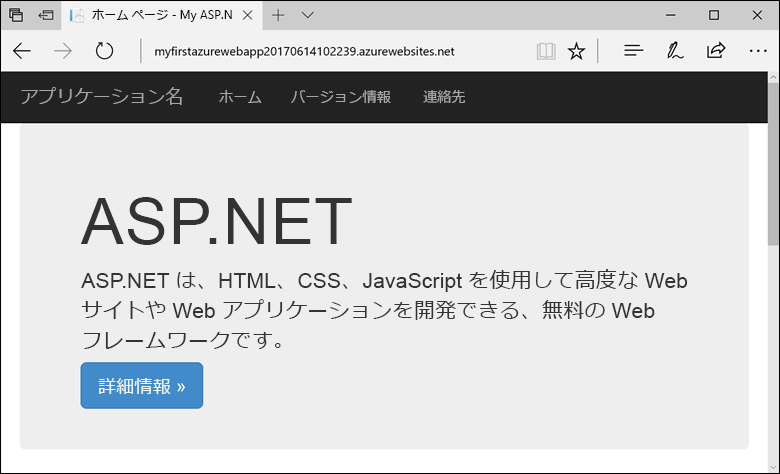
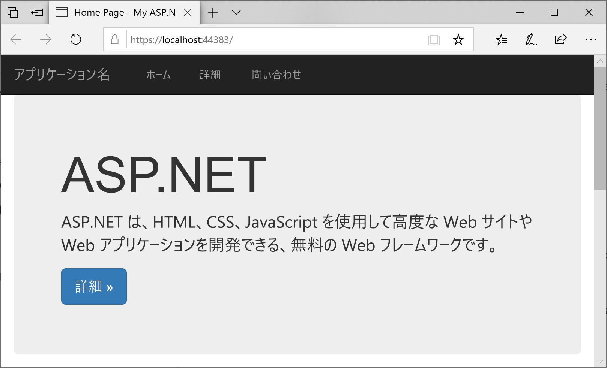
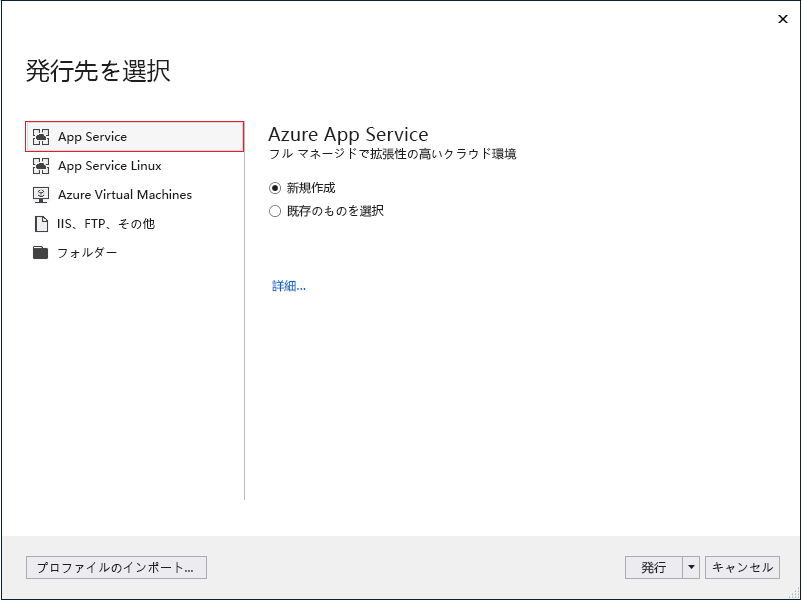
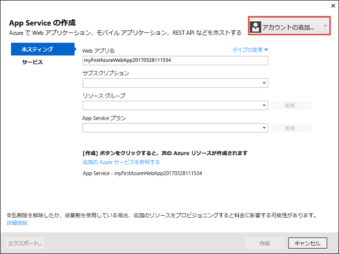
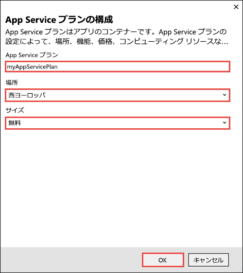
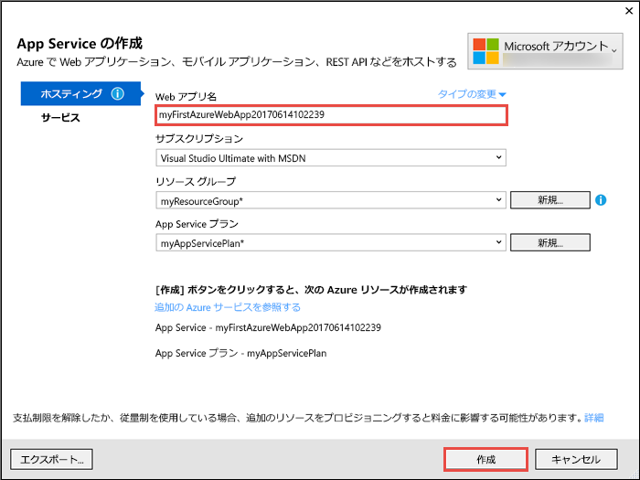
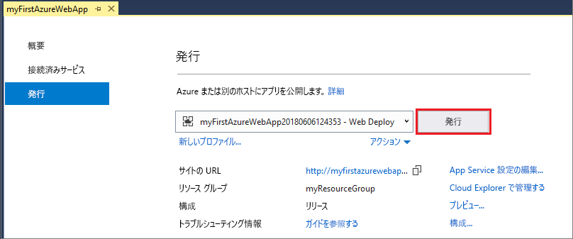
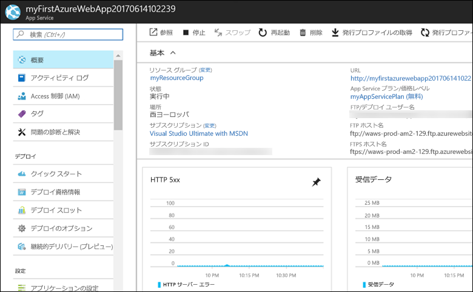

# <a name="create-an-aspnet-framework-web-app-in-azure"></a>Azure に ASP.NET Framework Web アプリを作成する

[Azure Web Apps](app-service-web-overview.md) では、高度にスケーラブルな自己適用型の Web ホスティング サービスを提供しています。  このクイック スタートでは、Azure Web Apps に初めての ASP.NET Web アプリをデプロイする方法を示します。 作業が完了すると、デプロイされた Web アプリケーションを使って、App Service プランと Azure Web アプリで構成されるリソース グループを入手できます。



[!INCLUDE [quickstarts-free-trial-note](../../includes/quickstarts-free-trial-note.md)]

## <a name="prerequisites"></a>前提条件

このチュートリアルを完了するには、**ASP.NET および Web 開発**のワークロードと共に、<a href="https://www.visualstudio.com/downloads/" target="_blank">Visual Studio 2017</a> をインストールします。

Visual Studio 2017 を既にインストールしている場合:

- **[ヘルプ]**、**[更新プログラムの確認]** の順にクリックし、Visual Studio に最新の更新プログラムをインストールします。
- **[ツール]**、**[ツールと機能を取得]** の順にクリックし、ワークロードを追加します。

## <a name="create-an-aspnet-web-app"></a>ASP.NET Web アプリを作成する

Visual Studio で、**[ファイル]、[新規作成]、[プロジェクト]** の順にクリックして、プロジェクトを作成します。 

**[新しいプロジェクト]** ダイアログで、**[Visual C#]、[Web]、[ASP.NET Web アプリケーション (.NET Framework)]** の順にクリックします。

アプリケーションに _myFirstAzureWebApp_ という名前を付けて、**[OK]** をクリックします。
   


任意の種類の ASP.NET Web アプリを Azure にデプロイできます。 このクイックスタートでは、**[MVC]** テンプレートを選択し、認証が **[認証なし]** に設定されていることを確認してください。
      
**[OK]** を選択します。

![[新しい ASP.NET プロジェクト] ダイアログ ボックス](./media/app-service-web-get-started-dotnet-framework/select-mvc-template.png)

メニューから、**[デバッグ]、[デバッグなしで開始]** の順にクリックし、ローカルで Web アプリを実行します。



## <a name="launch-the-publish-wizard"></a>発行ウィザードを起動する

**ソリューション エクスプローラー**で **myFirstAzureWebApp** プロジェクトを右クリックし、**[発行]** を選択します。


発行ウィザードが自動的に起動します。 **[App Service]**、**[発行]** の順に選択し、**[App Service の作成]** ダイアログを開きます。



## <a name="sign-in-to-azure"></a>Azure へのサインイン

**[App Service の作成]** ダイアログ ボックスで、**[アカウントの追加]** をクリックし、Azure サブスクリプションにサインインします。 既にサインインしている場合は、目的のサブスクリプションを含んだアカウントをドロップダウンから選択します。

> [!NOTE]
> 既にサインインしている場合は、まだ **[作成]** を選択しないでください。
>
>
   


## <a name="create-a-resource-group"></a>リソース グループの作成

[!INCLUDE [resource group intro text](../../includes/resource-group.md)]

**[リソース グループ]** の横にある **[新規]** をクリックします。

リソース グループに **myResourceGroup** という名前を付けて、**[OK]** をクリックします。

## <a name="create-an-app-service-plan"></a>App Service プランを作成する

[!INCLUDE [app-service-plan](../../includes/app-service-plan.md)]

**[ホスティング プラン]** の隣にある **[新規]** を選択します。 

**[ホスティング プランの構成]** ダイアログ ボックスで、スクリーン ショットの次の表に示した設定を使用します。



| Setting | 推奨値 | 説明 |
|-|-|-|
|App Service プラン| myAppServicePlan | App Service プランの名前です。 |
| 場所 | 西ヨーロッパ | Web アプリがホストされているデータ センターです。 |
| サイズ | 無料 | [価格レベル](https://azure.microsoft.com/pricing/details/app-service/?ref=microsoft.com&utm_source=microsoft.com&utm_medium=docs&utm_campaign=visualstudio)によって、ホスティング機能が決まります。 |

**[OK]** を選択します。

## <a name="create-and-publish-the-web-app"></a>Web アプリを作成して発行する

**[アプリ名]** に一意のアプリ名 (有効な文字は `a-z`、`0-9`、`-`) を入力するか、自動的に生成された一意の名前をそのまま使用します。 Web アプリの URL は `http://<app_name>.azurewebsites.net` です。`<app_name>` には自分のアプリの名前を指定します。

**[作成]** をクリックして、Azure リソースの作成を開始します。



ウィザードの完了後に、Azure に ASP.NET Web アプリを発行してから、既定のブラウザーでアプリを起動します。


アプリを[作成して発行する手順](#create-and-publish-the-web-app)で指定した名前が、`http://<app_name>.azurewebsites.net` 形式の URL プレフィックスとして使用されます。

ASP.NET Web アプリを Azure App Services でライブ実行することができました。

## <a name="update-the-app-and-redeploy"></a>アプリを更新して再デプロイする

**ソリューション エクスプローラー**で、_Views\Home\Index.cshtml_ を開きます。

上部の `<div class="jumbotron">` HTML タグを検索し、要素全体を次のコードに置き換えます。

```HTML
<div class="jumbotron">
    <h1>ASP.NET in Azure!</h1>
    <p class="lead">This is a simple app that we’ve built that demonstrates how to deploy a .NET app to Azure App Service.</p>
</div>
```

Azure に再デプロイするには、**ソリューション エクスプローラー**で **myFirstAzureWebApp** プロジェクトを右クリックし、**[発行]** を選択します。

発行ページで **[発行]** を選択します。


発行が完了すると、Visual Studio で Web アプリの URL のブラウザーが起動されます。


## <a name="manage-the-azure-web-app"></a>Azure Web アプリを管理する

<a href="https://portal.azure.com" target="_blank">Azure Portal</a> に移動して、Web アプリを管理します。

左側のメニューで、**[App Services]** を選択し、Azure Web アプリの名前をクリックします。


Web アプリの [概要] ページを確認します。 ここでは、参照、停止、開始、再開、削除のような基本的な管理タスクを行うことができます。 



左側のメニューは、アプリを構成するためのさまざまなページを示しています。 

## <a name="video"></a>ビデオ

このクイックスタートの手順が実行されているところを次の動画で確認したうえで、実際に手順に従って初めての .NET アプリを Azure に発行してください。

> [!VIDEO https://channel9.msdn.com/Shows/Azure-for-NET-Developers/Create-a-NET-app-in-Azure-Quickstart/player]

[!INCLUDE [Clean-up section](../../includes/clean-up-section-portal.md)]

## <a name="next-steps"></a>次の手順

> [!div class="nextstepaction"]
> [ASP.NET と SQL Database](app-service-web-tutorial-dotnet-sqldatabase.md)
