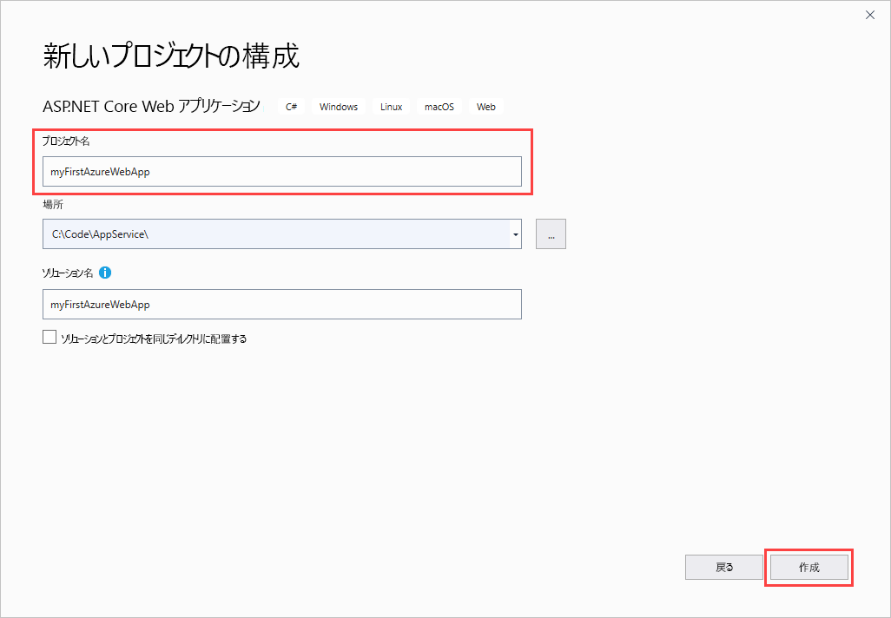
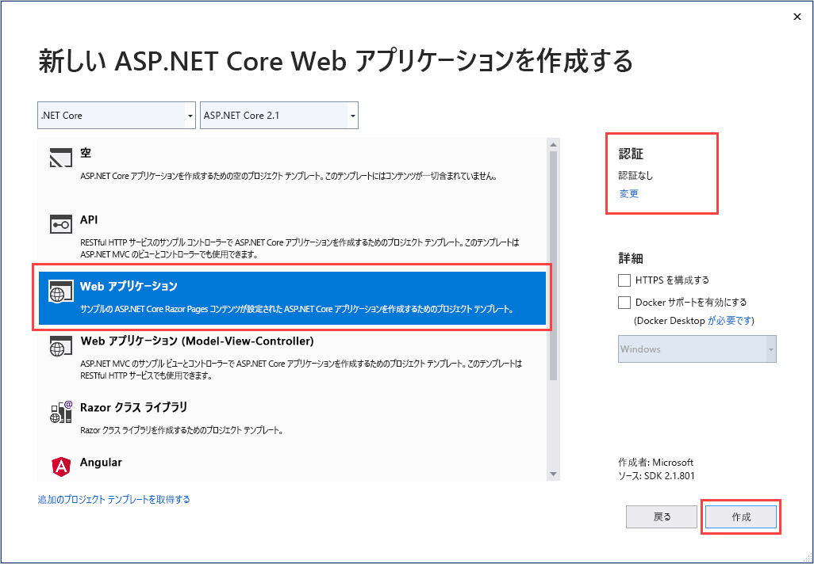
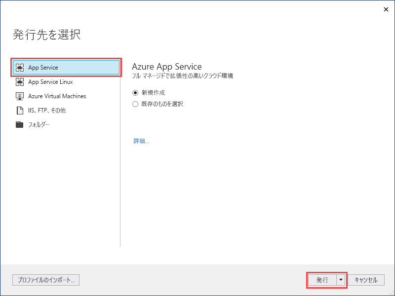
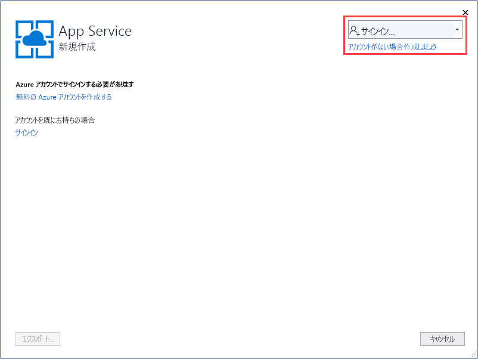
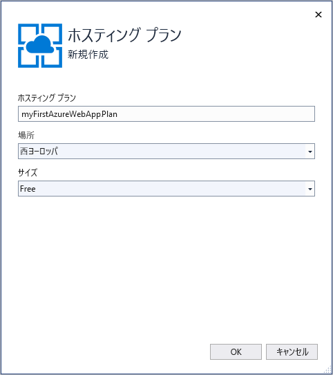
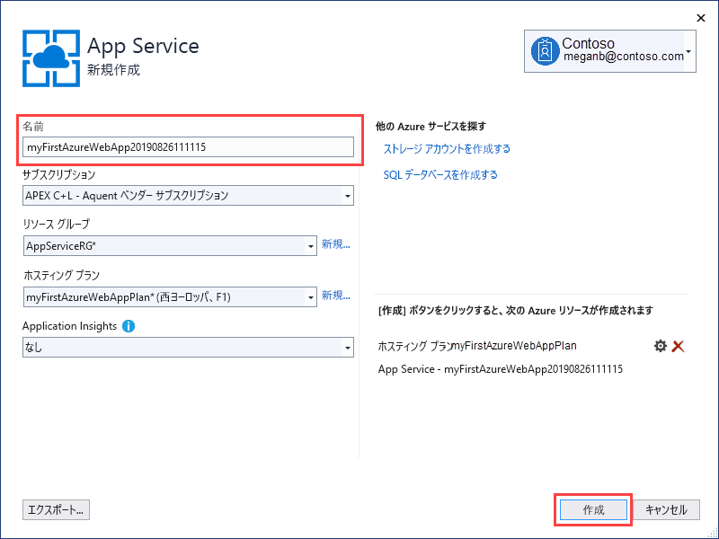
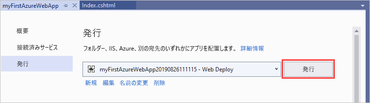
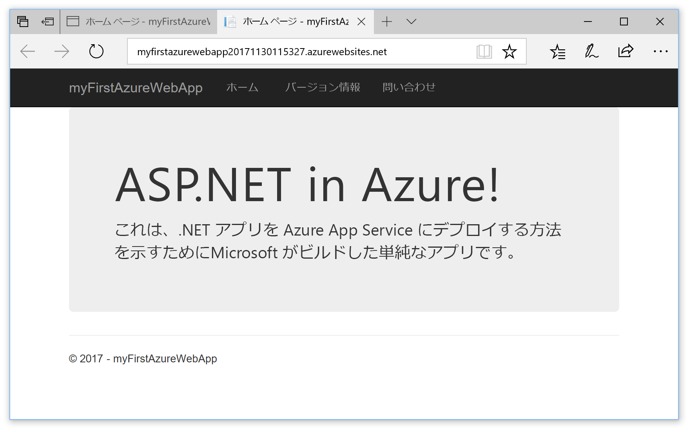
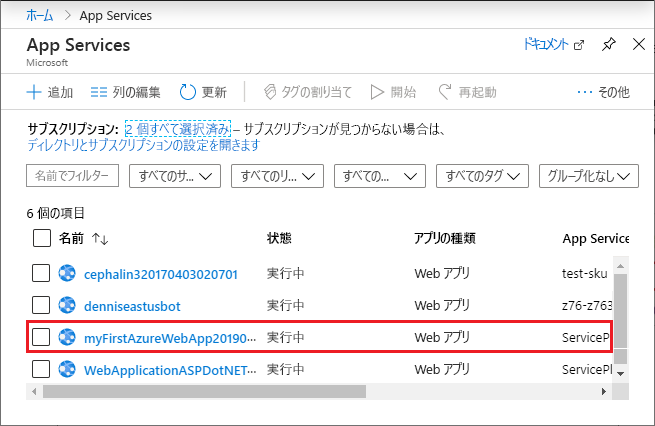
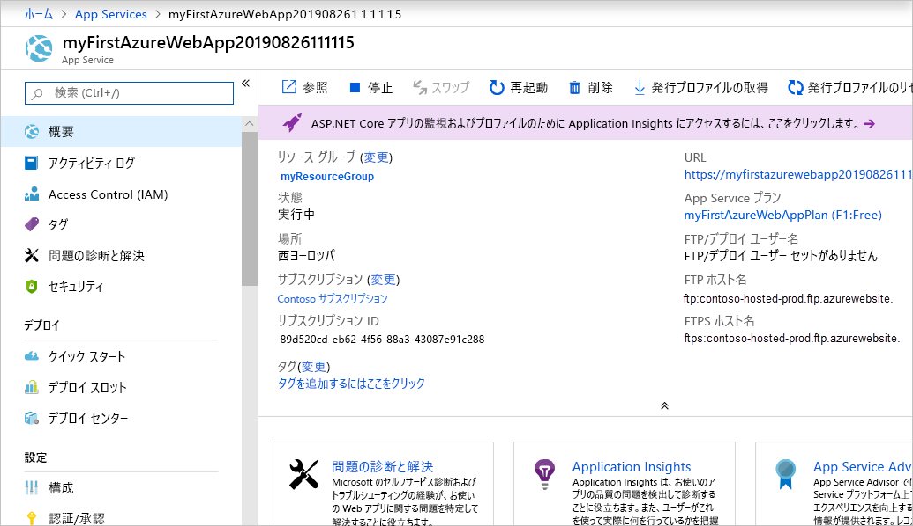

# <a name="create-an-aspnet-core-web-app-in-azure"></a>Azure に ASP.NET Core Web アプリを作成する

> [!NOTE]
> この記事では、Windows 上の App Service にアプリをデプロイします。 _Linux_ 上の App Service にデプロイするには、「[App Service on Linux での .NET Core Web アプリの作成](./containers/quickstart-dotnetcore.md)」をご覧ください。
>

[Azure App Service](overview.md) では、高度にスケーラブルな自己適用型の Web ホスティング サービスを提供しています。

このクイック スタートでは、Azure App Service に初めての ASP.NET Core Web アプリをデプロイする方法について説明します。 完了すると、デプロイされた Web アプリケーションを含む App Service アプリと App Service プランで構成されるリソース グループが完成します。

[!INCLUDE [quickstarts-free-trial-note](../../includes/quickstarts-free-trial-note.md)]

## <a name="prerequisites"></a>前提条件

このチュートリアルを完了するには、**ASP.NET および Web 開発**のワークロードと共に、<a href="https://www.visualstudio.com/downloads/" target="_blank">Visual Studio 2019</a> をインストールします。

Visual Studio 2019 を既にインストールしている場合:

- **[ヘルプ]**  >  **[更新プログラムの確認]** の順に選択して、Visual Studio に最新の更新プログラムをインストールします。
- **[ツール]**  >  **[ツールと機能を取得]** の順に選択し、ワークロードを追加します。

## <a name="create-an-aspnet-core-web-app"></a>ASP.NET Core Web アプリケーションの作成

次の手順に従って ASP.NET Core Web アプリを作成します。

1. Visual Studio を開き、 **[新しいプロジェクトの作成]** を選択します。

1. **[新しいプロジェクトの作成]** で、C# の **[ASP.NET Core Web アプリケーション]** を選択し、 **[次へ]** を選択します。

1. **[新しいプロジェクトの構成]** で、アプリケーションに _myFirstAzureWebApp_ という名前を付け、 **[作成]** を選択します。

   

1. このクイックスタートでは、 **[Web アプリケーション]** テンプレートを選択します。 認証が **[認証なし]** に設定されていること、また、その他のオプションがオフになっていることを確認します。 **作成** を選択します。

   

    任意の種類の ASP.NET Core Web アプリを Azure にデプロイできます。

1. Visual Studio のメニューから **[デバッグ]**  >  **[デバッグなしで開始]** の順に選択して、Web アプリをローカルで実行します。

   

## <a name="publish-your-web-app"></a>Web アプリを発行する

1. **ソリューション エクスプローラー**で **myFirstAzureWebApp** プロジェクトを右クリックし、 **[発行]** を選択します。

1. **App Service** を選択し、 **[発行]** を選択します。

   

1. **App Service の [新規作成]** に表示されるオプションは、既に Azure にサインインしているかどうかや、Visual Studio アカウントが Azure アカウントとリンクされているかどうかによって異なります。 **[アカウントの追加]** または **[サインイン]** を選択して Azure サブスクリプションにサインインします。 既にサインインしている場合は、目的のアカウントを選択します。

   > [!NOTE]
   > 既にサインインしている場合は、まだ **[作成]** を選択しないでください。
   >

   

   [!INCLUDE [resource group intro text](../../includes/resource-group.md)]

1. **[リソース グループ]** で、 **[新規]** を選択します。

1. **[新しいリソース グループ名]** に「*myResourceGroup*」と入力し、 **[OK]** を選択します。

   [!INCLUDE [app-service-plan](../../includes/app-service-plan.md)]

1. **[ホスティング プラン]** には **[新規]** を選択します。

1. **[ホスティング プランの構成]** ダイアログで、次の表の値を入力し、 **[OK]** を選択します。

   | Setting | 推奨値 | 説明 |
   |-|-|-|
   |App Service プラン| myAppServicePlan | App Service プランの名前です。 |
   | Location | 西ヨーロッパ | Web アプリがホストされているデータ センターです。 |
   | Size | 無料 | [価格レベル](https://azure.microsoft.com/pricing/details/app-service/?ref=microsoft.com&utm_source=microsoft.com&utm_medium=docs&utm_campaign=visualstudio)によって、ホスティング機能が決まります。 |

   

1. **[名前]** に、有効な文字 (`a-z`、`A-Z`、`0-9`、`-`) のみから成る一意のアプリ名を入力します。 自動的に生成される一意の名前をそのまま使用してもかまいません。 Web アプリの URL は `http://<app_name>.azurewebsites.net` です。`<app_name>` には自分のアプリの名前を指定します。

   

1. **[作成]** をクリックして、Azure リソースの作成を開始します。

ウィザードの完了後に、Azure に ASP.NET Core Web アプリを発行してから、既定のブラウザーでアプリを起動します。


**App Service の [新規作成]** ページで指定したアプリ名が、`http://<app_name>.azurewebsites.net` 形式の URL プレフィックスとして使用されます。

**お疲れさまでした。** ASP.NET Core Web アプリを Azure App Service でライブ実行することができました。

## <a name="update-the-app-and-redeploy"></a>アプリを更新して再デプロイする

1. **ソリューション エクスプローラー**で、対象プロジェクトから **[ページ]**  >  **[Index.cshtml]** の順に開きます。

1. 2 つの `<div>` タグを次のコードに置き換えます。

   ```HTML
   <div class="jumbotron">
       <h1>ASP.NET in Azure!</h1>
       <p class="lead">This is a simple app that we’ve built that demonstrates how to deploy a .NET app to Azure App Service.</p>
   </div>
   ```

1. Azure に再デプロイするには、**ソリューション エクスプローラー**で **myFirstAzureWebApp** プロジェクトを右クリックし、 **[発行]** を選択します。

1. **発行**の概要ページで **[発行]** を選択します。

   

発行が完了すると、Visual Studio で Web アプリの URL のブラウザーが起動されます。



## <a name="manage-the-azure-app"></a>Azure アプリの管理

Web アプリを管理するには、[Azure portal](https://portal.azure.com) にアクセスし、「**App Services**」を検索して選択します。

![[App Services] を選択します](./media/app-service-web-get-started-dotnet/app-services.png)

**[App Services]** ページで、Web アプリの名前を選択します。



Web アプリの [概要] ページを確認します。 ここでは、参照、停止、開始、再開、削除のような基本的な管理を行うことができます。



左側のメニューは、アプリを構成するためのさまざまなページを示しています。

[!INCLUDE [Clean-up section](../../includes/clean-up-section-portal.md)]

## <a name="next-steps"></a>次の手順

> [!div class="nextstepaction"]
> [ASP.NET Core と SQL Database](app-service-web-tutorial-dotnetcore-sqldb.md)
