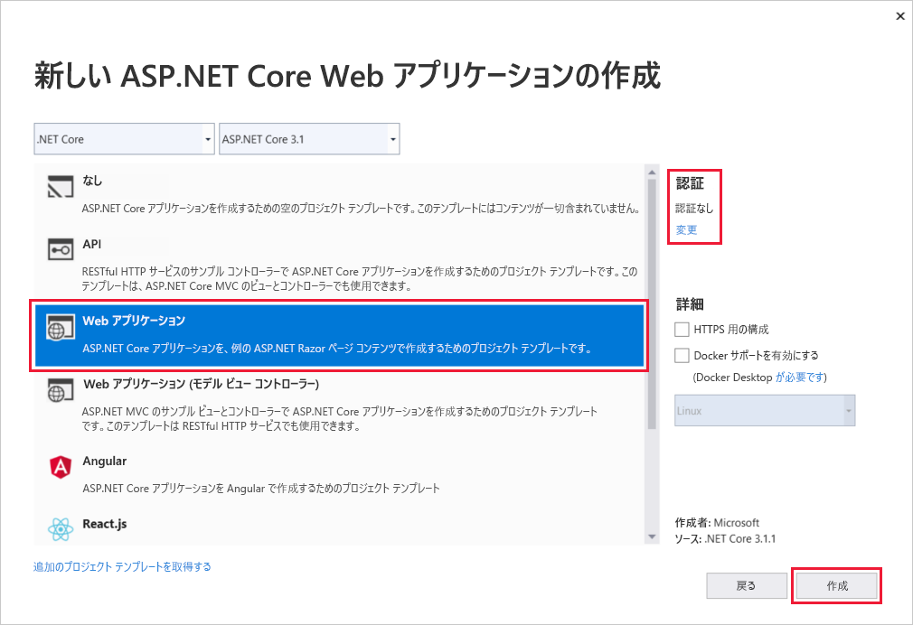
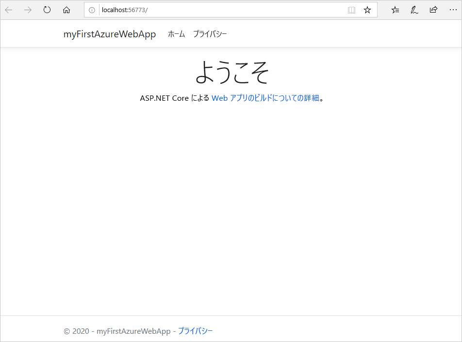
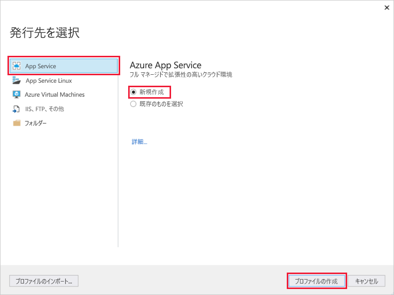
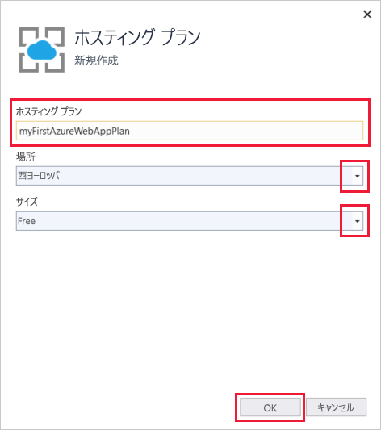
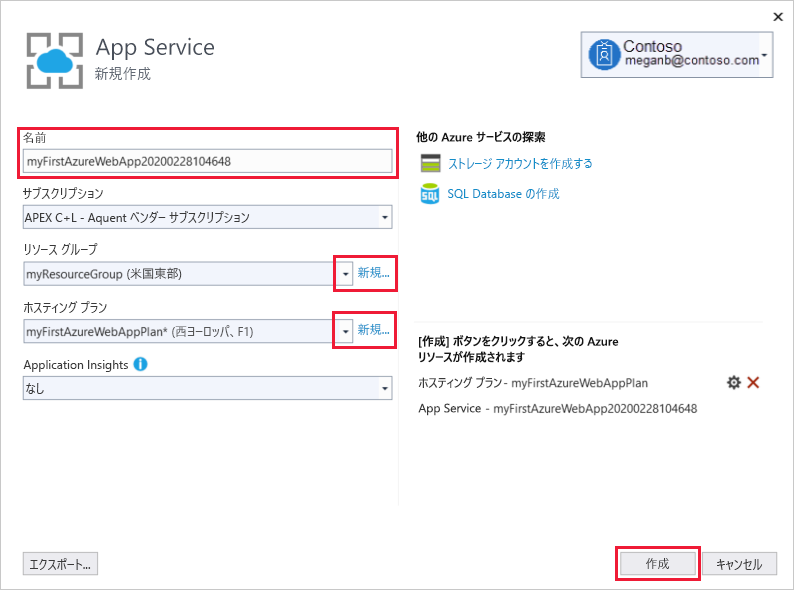
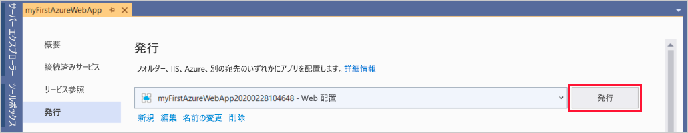
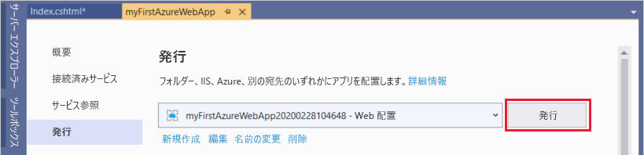
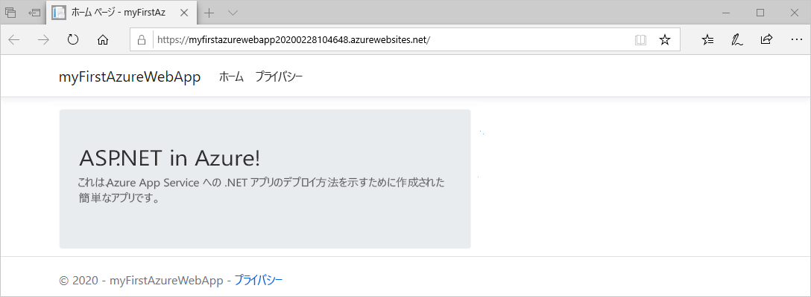
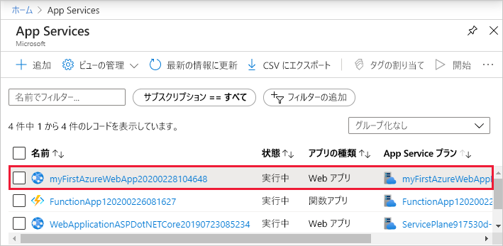
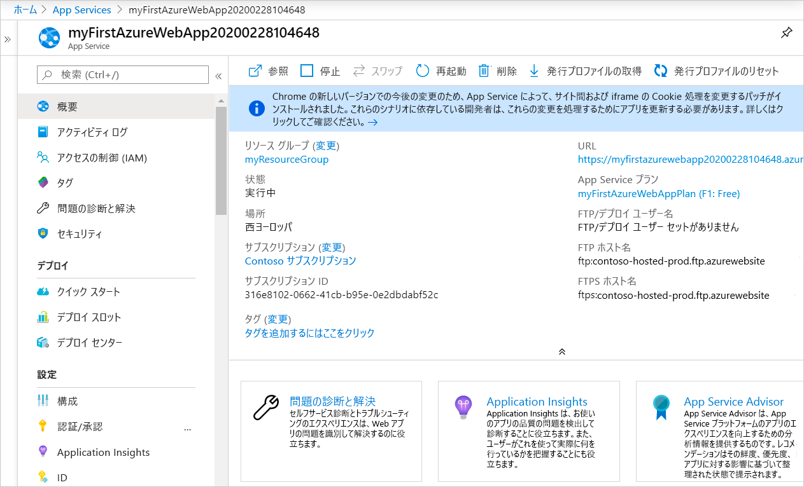

# <a name="quickstart-create-an-aspnet-core-web-app-in-azure"></a>クイック スタート:Azure に ASP.NET Core Web アプリを作成する

このクイック スタートでは、初めての ASP.NET Core Web アプリを作成し、[Azure App Service](overview.md) にデプロイする方法について説明します。 

完了すると、App Service ホスティング プランと、デプロイされた Web アプリケーションを含む App Service とで構成される、Azure リソース グループを作成できます。

## <a name="prerequisites"></a>前提条件

- アクティブなサブスクリプションが含まれる Azure アカウント。 [無料でアカウントを作成できます](https://azure.microsoft.com/free/dotnet/)。
- このクイック スタートでは、Windows 上の App Service にアプリをデプロイします。 _Linux_ 上の App Service にデプロイするには、「[App Service on Linux で ASP.NET Core アプリを作成する](./containers/quickstart-dotnetcore.md)」をご覧ください。
- **[ASP.NET および Web の開発]** ワークロードと共に <a href="https://www.visualstudio.com/downloads/" target="_blank">Visual Studio 2019</a> をインストールする。

  Visual Studio 2019 を既にインストールしている場合:

  - **[ヘルプ]**  >  **[更新プログラムの確認]** の順に選択して、Visual Studio に最新の更新プログラムをインストールします。
  - **[ツール]**  >  **[ツールと機能を取得]** の順に選択し、ワークロードを追加します。


## <a name="create-an-aspnet-core-web-app"></a>ASP.NET Core Web アプリケーションの作成

次の手順に従って、Visual Studio で ASP.NET Core Web アプリを作成します。

1. Visual Studio を開き、 **[新しいプロジェクトの作成]** を選択します。

1. **[新しいプロジェクトの作成]** で、 **[ASP.NET Core Web アプリケーション]** を選択し、その選択内容の言語に **[C#]** がリストされていることを確認してから、 **[次へ]** を選択します。

1. **[新しいプロジェクトの構成]** で、ご自分の Web アプリケーション プロジェクトに *myFirstAzureWebApp* という名前を指定し、 **[作成]** を選択します。

   

1. 任意の種類の ASP.NET Core Web アプリを Azure にデプロイできますが、このクイック スタートでは、 **[Web アプリケーション]** テンプレートを選択します。 **[認証]** が **[認証なし]** に設定されていて、他のオプションが選択されていないことを確認してください。 そのうえで **[Create]\(作成\)** を選択します。

    
   
1. Visual Studio のメニューから **[デバッグ]**  >  **[デバッグなしで開始]** を選択して、Web アプリをローカルで実行します。

   

## <a name="publish-your-web-app"></a>Web アプリを発行する

Web アプリを発行するには、まず、アプリの発行先となる新しい App Service を作成して構成する必要があります。 

App Service の設定の一環として、次のものを作成します。

- サービスのすべての Azure リソースを格納する新しい[リソース グループ](https://docs.microsoft.com/azure/azure-resource-manager/management/overview#terminology)。
- アプリをホストする Web サーバー ファームの場所、サイズ、および機能を指定する新しい[ホスティング プラン](https://docs.microsoft.com/azure/app-service/overview-hosting-plans)。

App Service を作成して Web アプリを発行するには、次の手順に従います。

1. **ソリューション エクスプローラー**で **myFirstAzureWebApp** プロジェクトを右クリックし、 **[発行]** を選択します。 まだ Visual Studio から Azure アカウントにサインインしていない場合は、 **[アカウントの追加]** または **[サインイン]** を選択します。 無料の Azure アカウントを作成することもできます。

1. **[発行先を選択]** ダイアログボックスで **[App Service]** を選択し、 **[新規作成]** を選択して、 **[プロファイルの作成]** を選択します。

   

1. **App Service の [新規作成]** ダイアログボックスで、既定の名前を受け入れるか、新しい名前を入力して、アプリに対してグローバルに一意の**名前**を指定します。 有効な文字は、`a-z`、`A-Z`、`0-9`、および `-` です。 この**名前**は、Web アプリの URL プレフィックスとして `http://<app_name>.azurewebsites.net` の形式で使用されます。

1. **[サブスクリプション]** で、リストされているサブスクリプションを受け入れるか、ドロップダウン リストから新しいサブスクリプションを選択します。

1. **[リソース グループ]** で、 **[新規]** を選択します。 **[新しいリソース グループ名]** に「*myResourceGroup*」と入力し、 **[OK]** を選択します。 

1. **[ホスティング プラン]** で、 **[新規]** を選択します。 

1. **ホスティング プランの [新規作成]** ダイアログで、次の表で指定されている値を使用します。

   | 設定  | 推奨値 | 説明 |
   | -------- | --------------- | ----------- |
   | **ホスティング プラン**  | *myFirstAzureWebAppPlan* | App Service プランの名前です。 |
   | **場所**      | "*西ヨーロッパ*" | Web アプリがホストされているデータ センターです。 |
   | **[サイズ]**          | *Free* | [価格レベル](https://azure.microsoft.com/pricing/details/app-service/?ref=microsoft.com&utm_source=microsoft.com&utm_medium=docs&utm_campaign=visualstudio)によって、ホスティング機能が決まります。 |
   
   

1. **[Application Insights]** は *[なし]* のままにします。

1. **App Service の [新規作成]** ダイアログ ボックスで **[作成]** をクリックして、Azure リソースの作成を開始します。

   

1. ウィザードが完了したら、 **[発行]** を選択します。

   

   Visual Studio によって ASP.NET Core Web アプリが Azure に発行され、既定のブラウザーでアプリが起動されます。 

   

**お疲れさまでした。** Azure App Service で ASP.NET Core Web アプリをライブ実行することができました。

## <a name="update-the-app-and-redeploy"></a>アプリを更新して再デプロイする

Web アプリを更新して再デプロイするには、次の手順に従います。

1. **ソリューション エクスプローラー**で、対象プロジェクトから **[ページ]**  >  **[Index.cshtml]** の順に開きます。

1. `<div>` タグ全体を次のコードに置き換えます。

   ```HTML
   <div class="jumbotron">
       <h1>ASP.NET in Azure!</h1>
       <p class="lead">This is a simple app that we've built that demonstrates how to deploy a .NET app to Azure App Service.</p>
   </div>
   ```

1. Azure に再デプロイするには、**ソリューション エクスプローラー**で **myFirstAzureWebApp** プロジェクトを右クリックし、 **[発行]** を選択します。

1. **発行**の概要ページで **[発行]** を選択します。

   

発行が完了すると、Visual Studio で Web アプリの URL のブラウザーが起動されます。



## <a name="manage-the-azure-app"></a>Azure アプリの管理

Web アプリを管理するには、[Azure portal](https://portal.azure.com) に移動し、 **[App Services]** を検索して選択します。

![[App Services] を選択します](./media/app-service-web-get-started-dotnet/app-services.png)

**[App Services]** ページで、Web アプリの名前を選択します。



Web アプリの **[概要]** ページには、参照、停止、開始、再起動、削除などの基本的な管理のためのオプションが含まれています。 左側のメニューは、アプリを構成するためのさらなるページを示しています。



[!INCLUDE [Clean-up section](../../includes/clean-up-section-portal.md)]

## <a name="next-steps"></a>次のステップ

このクイック スタートでは、Visual Studio を使用して ASP.NET Core Web アプリを作成し、Azure App Service にデプロイしました。

次の記事に進み、.NET Core アプリを作成して SQL Database に接続する方法を学習してください。

> [!div class="nextstepaction"]
> [ASP.NET Core と SQL Database](app-service-web-tutorial-dotnetcore-sqldb.md)
