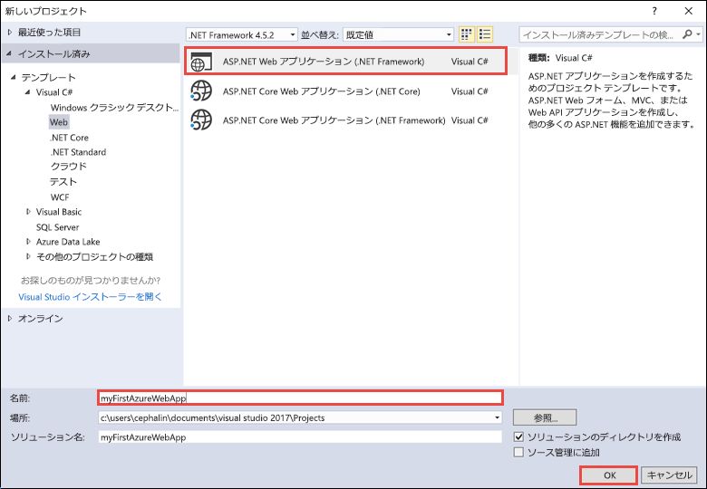
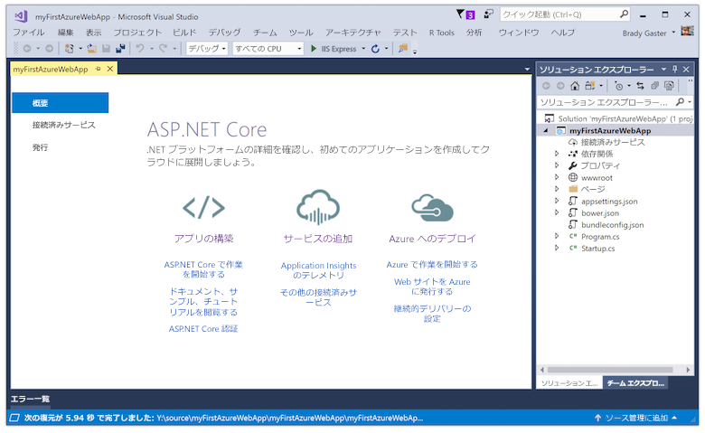
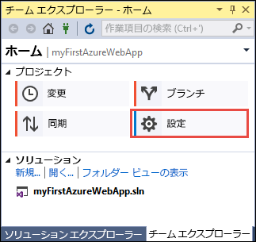
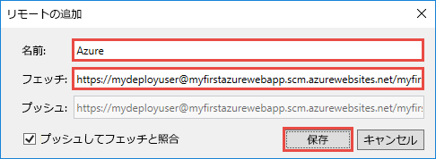
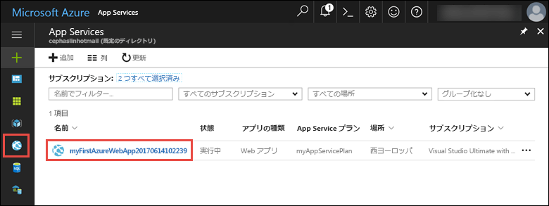

# <a name="create-an-aspnet-core-web-app-in-azure"></a>Azure に ASP.NET Core Web アプリを作成する

> [!NOTE]
> この記事では、Windows 上の App Service にアプリをデプロイします。 _Linux_ 上の App Service にデプロイするには、「[App Service on Linux での .NET Core Web アプリの作成](./containers/quickstart-dotnetcore.md)」をご覧ください。
>
> ASP.NET Framework アプリ用の手順については、「[Azure に ASP.NET Framework Web アプリを作成する](app-service-web-get-started-dotnet-framework.md)」をご覧ください。 
>

[Azure Web Apps](app-service-web-overview.md) では、高度にスケーラブルな自己適用型の Web ホスティング サービスを提供しています。  このクイック スタートでは、Azure Web Apps に初めての ASP.NET Core Web アプリをデプロイする方法を示します。 作業が完了すると、デプロイされた Web アプリケーションを使って、App Service プランと Azure Web アプリで構成されるリソース グループを入手できます。

[!INCLUDE [quickstarts-free-trial-note](../../includes/quickstarts-free-trial-note.md)]

## <a name="prerequisites"></a>前提条件

このチュートリアルを完了するには、以下が必要です。

* 次のワークロードを使って、<a href="https://www.visualstudio.com/downloads/" target="_blank">Visual Studio 2017</a> をインストールします。
    - **ASP.NET と Web 開発**
    - **Azure 開発**

    ![ASP.NET および Web 開発と Azure 開発 ([Web & Cloud\(Webとクラウド\)] 下)](media/app-service-web-tutorial-dotnet-sqldatabase/workloads.png)

## <a name="create-an-aspnet-core-web-app"></a>ASP.NET Core Web アプリケーションの作成

Visual Studio で、 **[ファイル]、[新規作成]、[プロジェクト]** の順にクリックして、プロジェクトを作成します。 

**[新しいプロジェクト]** ダイアログ ボックスで、**[Visual C#]、[Web]、[ASP.NET Core Web アプリケーション]** の順にクリックします。

アプリケーションに _myFirstAzureWebApp_ という名前を付けて **[新しい Git リポジトリの作成]** を選択し、**[OK]** を選択します。
   


任意の種類の ASP.NET Core Web アプリを Azure にデプロイできます。 このクイックスタートでは、**[Web アプリケーション]** テンプレートを選択し、認証が **[認証なし]** に設定されていることを確認してください。
      
**[OK]**を選択します。

![[新しい ASP.NET プロジェクト] ダイアログ ボックス](./media/app-service-web-get-started-dotnet/razor-pages-aspnet-dialog.png)

ASP.NET Core プロジェクトが作成されると、ASP.NET Core ウェルカム ページが開き、作業を開始する際に役立つリソースへのリンクが多数表示されます。 



メニューから、**[デバッグ]、[デバッグなしで開始]** の順にクリックし、ローカルで Web アプリを実行します。


[!INCLUDE [cloud-shell-try-it.md](../../includes/cloud-shell-try-it.md)]

[!INCLUDE [Configure deployment user](../../includes/configure-deployment-user.md)] 

[!INCLUDE [Create resource group](../../includes/app-service-web-create-resource-group.md)] 

[!INCLUDE [Create app service plan](../../includes/app-service-web-create-app-service-plan.md)] 

[!INCLUDE [Create web app](../../includes/app-service-web-create-web-app.md)] 


## <a name="push-to-azure-from-visual-studio"></a>Visual Studio から Azure へのプッシュ

Visual Studio に戻り、**[表示]** メニューから **[チーム エクスプローラー]** をクリックします。 **チーム エクスプローラー**が表示されます。

**[ホーム]** ビューで、**[設定]** > **[リポジトリの設定]** をクリックします。



**[リポジトリの設定]** の **[リモート]** セクションで、**[追加]** を選択します。 **[リモートの追加]** ダイアログ ボックスが表示されます。

**[名前]** フィールドを _[Azure]_ に設定し、**[フェッチ]** フィールドを、「[Web アプリの作成](#create-a-web-app)」で保存した URL に設定します。 **[Save]** をクリックします。



この設定は、Git コマンド `git remote add Azure <URL>` に相当します。

上部にある **[ホーム]** ボタンをクリックします。

**[設定]** > **[グローバル設定]** を選択します。 名前とメール アドレスが設定されていることを確認します。 必要に応じて **[更新]** を選択します。

Visual Studio によってプロジェクトが作成された時点で、既にすべてのファイルが Git リポジトリにコミットされています。 後は、それらのファイルを Azure にプッシュするだけです。

上部にある **[ホーム]** ボタンをクリックします。 **[同期]** > **[操作]** > **[コマンド プロンプトを開く]** を選択します。 

コマンド ウィンドウに次のコマンドを入力し、デプロイのパスワードを求められたらそれを入力します。

```
git push Azure master
```

このコマンドの実行には、数分かかる場合があります。 実行中、次の例のような情報が表示されます。

```
Counting objects: 4, done.
Delta compression using up to 8 threads.
Compressing objects: 100% (4/4), done.
Writing objects: 100% (4/4), 349 bytes | 349.00 KiB/s, done.
Total 4 (delta 3), reused 0 (delta 0)
remote: Updating branch 'master'.
remote: Updating submodules.
remote: Preparing deployment for commit id '9e20345e9c'.
remote: Generating deployment script.
remote: Project file path: .\myFirstAzureWebApp\myFirstAzureWebApp.csproj
remote: Solution file path: .\myFirstAzureWebApp.sln
remote: Generated deployment script files
remote: Running deployment command...
remote: Handling ASP.NET Core Web Application deployment.
remote:   Restoring packages for D:\home\site\repository\myFirstAzureWebApp\myFirstAzureWebApp.csproj...
remote:   Restoring packages for D:\home\site\repository\myFirstAzureWebApp\myFirstAzureWebApp.csproj...
...
remote: Finished successfully.
remote: Running post deployment command(s)...
remote: Deployment successful.
To https://<app_name>.scm.azurewebsites.net/<app_name>.git
 * [new branch]      master -> master
```

## <a name="browse-to-the-app"></a>アプリの参照

ブラウザーで、Azure Web アプリの URL (`http://<app_name>.azurewebsites.net`) に移動します。

ページは、Azure App Service Web アプリとして実行されています。


ASP.NET Core Web アプリを Azure App Service でライブ実行することができました。

## <a name="update-the-app-and-redeploy"></a>アプリを更新して再デプロイする

**ソリューション エクスプローラー**で、_Pages\Index.cshtml_ を開きます。

上部の `<div id="myCarousel" class="carousel slide" data-ride="carousel" data-interval="6000">` HTML タグを検索し、要素全体を次のコードに置き換えます。

```HTML
<div class="jumbotron">
    <h1>ASP.NET in Azure!</h1>
    <p class="lead">This is a simple app that we’ve built that demonstrates how to deploy a .NET app to Azure App Service.</p>
</div>
```

**ソリューション エクスプローラー**で _Pages/Index.cshtml_ を右クリックし、**[コミット]** をクリックします。 変更のコミット メッセージを入力し、**[すべてコミット]** をクリックします。

コマンド プロンプト ウィンドウに戻り、コードの変更を Azure にプッシュします。

```bash
git push Azure master
```

デプロイが完了したら、再度 `http://<app_name>.azurewebsites.net` に移動します。


## <a name="manage-the-azure-web-app"></a>Azure Web アプリを管理する

<a href="https://portal.azure.com" target="_blank">Azure Portal</a> に移動して、Web アプリを管理します。

左側のメニューで、**[App Services]** を選択し、Azure Web アプリの名前をクリックします。



Web アプリの [概要] ページを確認します。 ここでは、参照、停止、開始、再開、削除のような基本的な管理タスクを行うことができます。 

![Azure Portal の [App Service] ページ](./media/app-service-web-get-started-dotnet/web-app-blade.png)

左側のメニューは、アプリを構成するためのさまざまなページを示しています。 

[!INCLUDE [Clean-up section](../../includes/clean-up-section-portal.md)]

## <a name="next-steps"></a>次の手順

> [!div class="nextstepaction"]
> [ASP.NET Core と SQL Database](app-service-web-tutorial-dotnetcore-sqldb.md)
