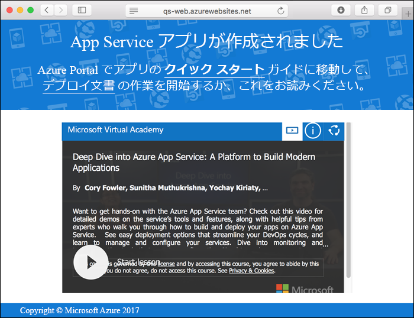

# <a name="create-a-static-html-web-app-in-azure"></a>Azure で静的な HTML Web アプリを作成する

[Azure Web Apps](app-service-web-overview.md) では、高度にスケーラブルな自己適用型の Web ホスティング サービスを提供しています。  このクイック スタートでは、基本的な HTML+CSS サイトを Azure Web Apps にデプロイする方法を示します。 [Azure CLI](https://docs.microsoft.com/cli/azure/get-started-with-azure-cli) を使って Web アプリを作成し、Git を使用して Web アプリにサンプルの HTML コンテンツをデプロイします。


以下の手順は、Mac、Windows、または Linux コンピューターを使用して実行できます。 前提条件のインストールを終えてから、以降の手順を完了するまでに約 5 分かかります。

## <a name="prerequisites"></a>前提条件

このクイック スタートを完了するには、以下が必要です。

- [Git をインストールする](https://git-scm.com/)

[!INCLUDE [quickstarts-free-trial-note](../../includes/quickstarts-free-trial-note.md)]

## <a name="download-the-sample"></a>サンプルのダウンロード

ターミナル ウィンドウで、次のコマンドを実行して、サンプル アプリのリポジトリをローカル コンピューターに複製します。

```bash
git clone https://github.com/Azure-Samples/html-docs-hello-world.git
```

このクイック スタートでは、ターミナル ウィンドウを使ってすべてのコマンドを実行します。

## <a name="view-the-html"></a>HTML を表示する

サンプル HTML が含まれているディレクトリに移動します。 ブラウザーで *index.html* ファイルを開きます。


[!INCLUDE [cloud-shell-try-it.md](../../includes/cloud-shell-try-it.md)]

[!INCLUDE [Configure deployment user](../../includes/configure-deployment-user.md)] 

[!INCLUDE [Create resource group](../../includes/app-service-web-create-resource-group.md)] 

[!INCLUDE [Create app service plan](../../includes/app-service-web-create-app-service-plan.md)] 

[!INCLUDE [Create web app](../../includes/app-service-web-create-web-app.md)] 



これで、Azure に空の新しい Web アプリが作成されました。

[!INCLUDE [Configure local git](../../includes/app-service-web-configure-local-git.md)] 

[!INCLUDE [Push to Azure](../../includes/app-service-web-git-push-to-azure.md)] 

```bash
Counting objects: 13, done.
Delta compression using up to 4 threads.
Compressing objects: 100% (11/11), done.
Writing objects: 100% (13/13), 2.07 KiB | 0 bytes/s, done.
Total 13 (delta 2), reused 0 (delta 0)
remote: Updating branch 'master'.
remote: Updating submodules.
remote: Preparing deployment for commit id 'cc39b1e4cb'.
remote: Generating deployment script.
remote: Generating deployment script for Web Site
remote: Generated deployment script files
remote: Running deployment command...
remote: Handling Basic Web Site deployment.
remote: KuduSync.NET from: 'D:\home\site\repository' to: 'D:\home\site\wwwroot'
remote: Deleting file: 'hostingstart.html'
remote: Copying file: '.gitignore'
remote: Copying file: 'LICENSE'
remote: Copying file: 'README.md'
remote: Finished successfully.
remote: Running post deployment command(s)...
remote: Deployment successful.
To https://<app_name>.scm.azurewebsites.net/<app_name>.git
 * [new branch]      master -> master
```

## <a name="browse-to-the-app"></a>アプリの参照

ブラウザーで、Azure Web アプリの URL に移動します。

```
http://<app_name>.azurewebsites.net
```

ページは、Azure App Service Web アプリとして実行されています。


**お疲れさまでした。** App Service に初めての HTML アプリをデプロイしました。

## <a name="update-and-redeploy-the-app"></a>アプリを更新して再デプロイする

テキスト エディターで *index.html* ファイルを開き、マークアップに変更を加えます。 たとえば、H1 の見出しを "Azure App Service - Sample Static HTML Site" から "Azure App Service" に変更します。

Git で変更をコミットしてから、コード変更を Azure にプッシュします。

```bash
git commit -am "updated HTML"
git push azure master
```

デプロイが完了したら、ブラウザーを更新して変更を表示します。


## <a name="manage-your-new-azure-web-app"></a>新しい Azure Web アプリを管理する

<a href="https://portal.azure.com" target="_blank">Azure Portal</a> に移動し、作成した Web アプリを管理します。

左側のメニューで **[App Services]** をクリックした後、Azure Web アプリの名前をクリックします。


Web アプリの [概要] ページを確認します。 ここでは、参照、停止、開始、再開、削除のような基本的な管理タスクを行うことができます。 


左側のメニューは、アプリを構成するためのさまざまなページを示しています。 

[!INCLUDE [cli-samples-clean-up](../../includes/cli-samples-clean-up.md)]

## <a name="next-steps"></a>次のステップ

> [!div class="nextstepaction"]
> [カスタム ドメインをマップする](app-service-web-tutorial-custom-domain.md)

