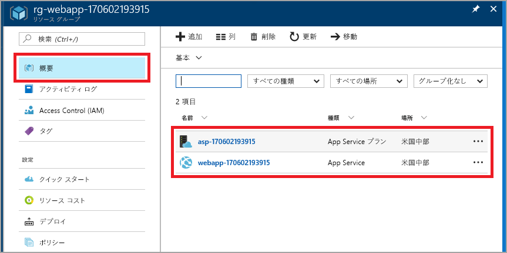

# <a name="create-your-first-java-web-app-in-azure"></a>Azure で初めての Java Web アプリを作成する

[Azure Web Apps](app-service-web-overview.md) では、高度にスケーラブルな自己適用型の Web ホスティング サービスを提供しています。 このクイックスタートでは、[Eclipse IDE for Java EE Developers](http://www.eclipse.org/) を使って、Java Web アプリを App Service にデプロイする方法を示します。


## <a name="prerequisites"></a>前提条件

このクイック スタートを完了するには、以下をインストールします。

* 無料の [Eclipse IDE for Java EE Developers](http://www.eclipse.org/downloads/)。 このクイック スタートでは Eclipse Neon を使用します。
* [Azure Toolkit for Eclipse](/azure/azure-toolkit-for-eclipse-installation)。

[!INCLUDE [quickstarts-free-trial-note](../../includes/quickstarts-free-trial-note.md)]

## <a name="create-a-dynamic-web-project-in-eclipse"></a>Eclipse で動的 Web プロジェクトを作成する

Eclipse で、**[ファイル]** > **[新規]** > **[Dynamic Web Project\(動的 Web プロジェクト\)]** の順にクリックします。

**[New Dynamic Web Project\(新しい動的 Web プロジェクト\)]** ダイアログ ボックスで、プロジェクトに **MyFirstJavaOnAzureWebApp** という名前を付けて、**[完了]**をクリックします。
   
![[New Dynamic Web Project\(新しい動的 Web プロジェクト\)] ダイアログ ボックス](./media/app-service-web-get-started-java/new-dynamic-web-project-dialog-box.png)

### <a name="add-a-jsp-page"></a>JSP ページを追加する

プロジェクト エクスプローラーが表示されない場合は、復元します。


プロジェクト エクスプローラーで、**[MyFirstJavaOnAzureWebApp]** プロジェクトを展開します。
**[WebContent]** を右クリックして、**[新規]** > **[JSP ファイル]**の順にクリックします。


**[New JSP File\(新しい JSP ファイル\)]** ダイアログ ボックス

* ファイル名を **index.jsp** にします。
* **[完了]** を選択します。

  ![[New JSP File\(新しい JSP ファイル\)] ダイアログ ボックス](./media/app-service-web-get-started-java/new-jsp-file-dialog-box-page-1.png)

Index.jsp ファイルで、`<body></body>` を次のマークアップに置き換えます。

```jsp
<body>
<h1><% out.println("Hello Azure!"); %></h1>
</body>
```

変更を保存します。

## <a name="publish-the-web-app-to-azure"></a>Web アプリを Azure に発行する

プロジェクト エクスプローラーで、プロジェクトを右クリックし、**[Azure]** > **[Publish as Azure Web App\(Azure Web アプリとして発行\)]** の順にクリックします。

![[Publish as Azure Web App\(Azure Web アプリとして発行\)] コンテキスト メニュー](./media/app-service-web-get-started-java/publish-as-azure-web-app-context-menu.png)

**[Azure Sign In\(Azure へのサインイン\)]** ダイアログ ボックスで、**[対話]** オプションをそのままにした状態で、**[サインイン]** をクリックします。

サインインの手順に従います。

### <a name="deploy-web-app-dialog-box"></a>[Deploy Web App\(Web アプリのデプロイ\)] ダイアログ ボックス

Azure アカウントにサインインしたら、**[Deploy Web App\(Web アプリのデプロイ\)]** ダイアログ ボックスが表示されます。

**[作成]**を選択します。

![[Deploy Web App\(Web アプリのデプロイ\)] ダイアログ ボックス](./media/app-service-web-get-started-java/deploy-web-app-dialog-box.png)

### <a name="create-app-service-dialog-box"></a>[App Service の作成] ダイアログ ボックス

既定値が設定された状態で**[App Service の作成]** ダイアログ ボックスが表示されます。 次の画像に示された **170602185241** という数値は、実際のダイアログ ボックスでは異なります。

![[App Service の作成] ダイアログ ボックス](./media/app-service-web-get-started-java/cas1.png)

**[App Service の作成]** ダイアログ ボックスで、次の操作を行います。

* 生成された Web アプリの名前をそのまま使用します。 この名前は Azure 全体で一意である必要があります。 名前は、Web アプリの URL アドレスの一部です。 例: Web アプリケーションの名前が **MyJavaWebApp** の場合、URL は *myjavawebapp.azurewebsites.net* です。
* 既定の Web コンテナーをそのまま使用します。
* Azure サブスクリプションを選択します。
* **[App Service プラン]** タブで、次の操作を行います。

  * **[新規作成]**。既定値の App Service プラン名をそのまま使用します。
  * **[場所]**。**[西ヨーロッパ]** または現在地付近を選択します。
  * **[価格レベル]**。無料オプションを選択します。 機能については、「[App Service の価格](https://azure.microsoft.com/pricing/details/app-service/)」をご覧ください。

   ![[App Service の作成] ダイアログ ボックス](./media/app-service-web-get-started-java/create-app-service-dialog-box.png)

[!INCLUDE [app-service-plan](../../includes/app-service-plan.md)]

### <a name="resource-group-tab"></a>[リソース グループ] タブ

**[リソース グループ]** タブを選択します。リソース グループのために生成された既定値をそのまま使用します。

![[リソース グループ] タブ](./media/app-service-web-get-started-java/create-app-service-resource-group.png)

[!INCLUDE [resource-group](../../includes/resource-group.md)]

**[作成]**を選択します。

<!--
### The JDK tab

Select the **JDK** tab. Keep the default, and then select **Create**.


-->

Azure Toolkit によって Web アプリが作成され、進行状況を示すダイアログ ボックスが表示されます。

![[Create App Service Progress\(App Service の作成の進行状況\)] ダイアログ ボックス](./media/app-service-web-get-started-java/create-app-service-progress-bar.png)

### <a name="deploy-web-app-dialog-box"></a>[Deploy Web App\(Web アプリのデプロイ\)] ダイアログ ボックス

**[Deploy Web App\(Web アプリのデプロイ\)]** ダイアログ ボックスで、**[Deploy to root\(ルートにデプロイする\)]** を選びます。 App Service が *wingtiptoys.azurewebsites.net* に存在している場合に、ルートにデプロイしないことを選択すると、Web アプリ **MyFirstJavaOnAzureWebApp** は *wingtiptoys.azurewebsites.net/MyFirstJavaOnAzureWebApp* にデプロイされます。

![[Deploy Web App\(Web アプリのデプロイ\)] ダイアログ ボックス](./media/app-service-web-get-started-java/deploy-web-app-to-root.png)

ダイアログ ボックスに、Azure、JDK、および Web コンテナーの選択内容が表示されます。

**[デプロイ]** を選択して、Web アプリを Azure に発行します。

発行が完了したら、**[Azure の活動ログ]** ダイアログ ボックスで **[発行済み]** リンクをクリックします。

![[Azure 活動ログ] ダイアログ ボックス](./media/app-service-web-get-started-java/aal.png)

お疲れさまでした。 Azure に Web アプリが正常にデプロイされました。 


## <a name="update-the-web-app"></a>Web アプリを更新する

サンプルの JSP コードを別のメッセージに変更します。

```jsp
<body>
<h1><% out.println("Hello again Azure!"); %></h1>
</body>
```

変更を保存します。

プロジェクト エクスプローラーで、プロジェクトを右クリックし、**[Azure]**、 > **[Publish as Azure Web App\(Azure Web アプリとして発行\)]** の順にクリックします。

**[Deploy Web App\(Web アプリのデプロイ\)]** ダイアログ ボックスが表示されます。ボックスには、以前に作成したアプリ サービスが表示されています。 

> [!NOTE]
> 発行するときは、毎回、**[Deploy to root\(ルートにデプロイする\)]** を選びます。
>

Web アプリを選択し、**[デプロイ]** をクリックして変更を発行します。

**[発行中]** リンクが表示されたら、リンクをクリックして Web アプリを参照し、変更を確認します。

## <a name="manage-the-web-app"></a>Web アプリを管理する

<a href="https://portal.azure.com" target="_blank">Azure Portal</a> に移動して、作成した Web アプリを確認します。

左のメニューから、**[リソース グループ]**を選びます。


リソース グループを選択します。 ページには、このクイック スタートで作成したリソースが表示されます。



Web アプリ (上の画像の **webapp-170602193915**) を選択します。

**[概要]** ページが表示されます。 このページでは、アプリの動作状態を見ることができます。 ここでは、参照、停止、開始、再開、削除のような基本的な管理タスクを行うことができます。 ページの左側にあるタブは、開くことができるさまざまな構成ページを示しています。 

![Azure Portal の [App Service] ページ](media/app-service-web-get-started-java/web-app-blade.png)

[!INCLUDE [clean-up-section-portal-web-app](../../includes/clean-up-section-portal-web-app.md)]

## <a name="next-steps"></a>次のステップ

> [!div class="nextstepaction"]
> [カスタム ドメインをマップする](app-service-web-tutorial-custom-domain.md)

