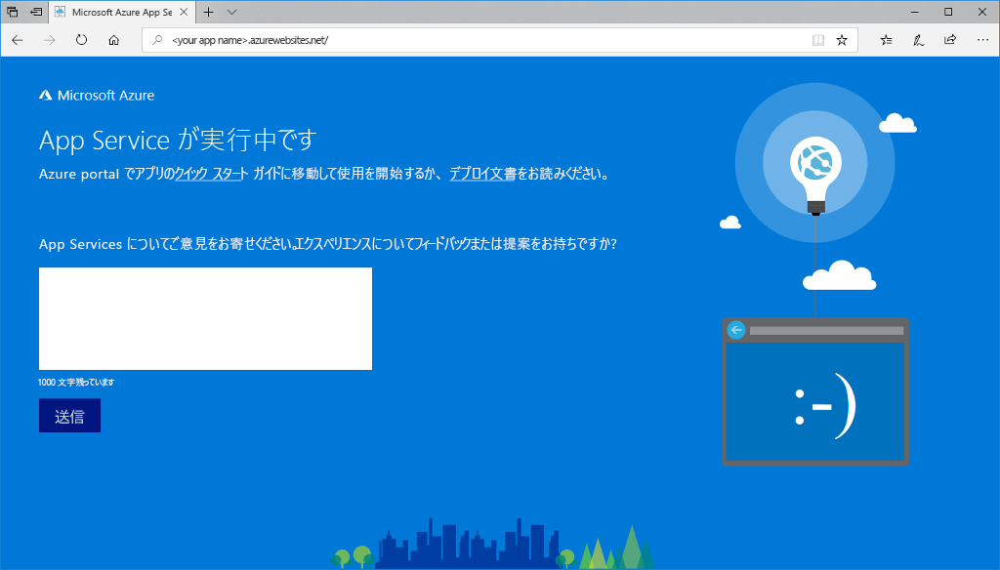

# <a name="create-a-nodejs-web-app-in-azure"></a>Azure で Node.js Web アプリを作成する

> [!NOTE]
> この記事では、Windows 上の App Service にアプリをデプロイします。 _Linux_ 上の App Service に展開するには、「[Azure App Service on Linux での Node.js Web アプリの作成](./containers/quickstart-nodejs.md)」をご覧ください。
>

[Azure App Service](overview.md) は、非常にスケーラブルな、自己適用型の Web ホスティング サービスを提供します。  このクイック スタートでは、Azure App Service に Node.js アプリをデプロイする方法を示します。 [Cloud Shell](https://docs.microsoft.com/azure/cloud-shell/overview) を使用して Web アプリを作成しますが、これらのコマンドは [Azure CLI](/cli/azure/install-azure-cli) を使用してローカルで実行することもできます。 [az webapp deployment source config-zip](/cli/azure/webapp/deployment/source?view=azure-cli-latest#az-webapp-deployment-source-config-zip) コマンドを使用して、Node.js のサンプル コードを Web アプリにデプロイします。  


以下の手順は、Mac、Windows、または Linux コンピューターを使って実行できます。 これらの手順を完了するには、約 3 分かかります。

[!INCLUDE [quickstarts-free-trial-note](../../includes/quickstarts-free-trial-note.md)]

[!INCLUDE [cloud-shell-try-it.md](../../includes/cloud-shell-try-it.md)]

## <a name="download-the-sample"></a>サンプルのダウンロード

Cloud Shell で、クイックスタートのディレクトリを作成し、それに変更します。

```console
mkdir quickstart

cd $HOME/quickstart
```

次に、以下のコマンドを実行して、サンプル アプリのリポジトリをクイックスタートのディレクトリに複製します。

```console
git clone https://github.com/Azure-Samples/nodejs-docs-hello-world
```

実行中、次の例のような情報が表示されます。

```output
Cloning into 'nodejs-docs-hello-world'...
remote: Counting objects: 40, done.
remote: Total 40 (delta 0), reused 0 (delta 0), pack-reused 40
Unpacking objects: 100% (40/40), done.
Checking connectivity... done.
```

> [!NOTE]
> サンプル index.js では、リッスン ポートが process.env.PORT に設定されます。 この環境変数は、App Service によって割り当てられます。
>

[!INCLUDE [Create resource group](../../includes/app-service-web-create-resource-group-scus.md)]

[!INCLUDE [Create app service plan](../../includes/app-service-web-create-app-service-plan-scus.md)]

## <a name="create-a-web-app"></a>Web アプリを作成する

Cloud Shell で [`az webapp create`](/cli/azure/webapp?view=azure-cli-latest#az-webapp-create) コマンドを使用して、`myAppServicePlan` App Service プランに Web アプリを作成します。

次の例では、`<app_name>` をグローバルに一意のアプリ名に置き換えてください (有効な文字は `a-z`、`0-9`、`-`)。

```azurecli-interactive
# Bash and Powershell
az webapp create --resource-group myResourceGroup --plan myAppServicePlan --name <app_name>
```

Web アプリが作成されると、Azure CLI によって次の例のような出力が表示されます。

<pre>
{
  "availabilityState": "Normal",
  "clientAffinityEnabled": true,
  "clientCertEnabled": false,
  "cloningInfo": null,
  "containerSize": 0,
  "dailyMemoryTimeQuota": 0,
  "defaultHostName": "&lt;app_name&gt;.azurewebsites.net",
  "enabled": true,
  &lt; JSON data removed for brevity. &gt;
}
</pre>

### <a name="set-nodejs-runtime"></a>Node.js ランタイムを設定する

Node ランタイムを 10.14.1 に設定します。 サポートされているすべてのランタイムを確認するには、[`az webapp list-runtimes`](/cli/azure/webapp?view=azure-cli-latest#az-webapp-list-runtimes) を実行します。

```azurecli-interactive
# Bash and Powershell
az webapp config appsettings set --resource-group myResourceGroup --name <app_name> --settings WEBSITE_NODE_DEFAULT_VERSION=10.14.1
```

新しく作成された Web アプリに移動します。 `<app_name>` を一意のアプリ名に置き換えます。

```http
http://<app_name>.azurewebsites.net
```

新しい Web アプリは次のようになります。

## <a name="deploy-zip-file"></a>ZIP ファイルのデプロイ

Cloud Shell で、アプリケーションのルート ディレクトリに移動し、サンプル プロジェクトの新しい ZIP ファイルを作成します。

```console
cd nodejs-docs-hello-world  

zip -r myUpdatedAppFiles.zip *.*
```

[az webapp deployment source config-zip](/cli/azure/webapp/deployment/source?view=azure-cli-latest#az-webapp-deployment-source-config-zip) コマンドを使用して、ZIP ファイルを Web アプリにデプロイします。  

```azurecli-interactive
az webapp deployment source config-zip --resource-group myResourceGroup --name <app_name> --src myUpdatedAppFiles.zip
```

このコマンドは、ファイルとディレクトリを ZIP ファイルから既定の App Service アプリケーション フォルダー (`\home\site\wwwroot`) にデプロイし、アプリを再起動します。 任意の追加のカスタム ビルド プロセスが構成されている場合、そのプロセスも実行されます。 詳しくは、[Kudu ドキュメント](https://github.com/projectkudu/kudu/wiki/Deploying-from-a-zip-file)をご覧ください。

## <a name="browse-to-the-app"></a>アプリの参照

Web ブラウザーを使用して、デプロイされたアプリケーションを参照します。

```http
http://<app_name>.azurewebsites.net
```

Node.js のサンプル コードは、Azure App Service の Web アプリで実行されています。


> [!NOTE]
> Azure App Service では、アプリは、[iisnode](https://github.com/Azure/iisnode) を使用して IIS で実行されます。 Iisnode でアプリを実行できるようにするために、アプリのルート ディレクトリに web.config ファイルが含まれています。 このファイルが IIS によって読み取られます。iisnode 関連の設定については、[iisnode GitHub リポジトリ](https://github.com/Azure/iisnode/blob/master/src/samples/configuration/web.config)を参照してください。

**お疲れさまでした。** App Service に初めての Node.js アプリをデプロイしました。

## <a name="update-and-redeploy-the-code"></a>コードを更新して再デプロイする

Cloud Shell で、「`code index.js`」と入力して Cloud Shell エディターを開きます。


`response.end` を呼び出すテキストに小さな変更を加えます。

```javascript
response.end("Hello Azure!");
```

変更内容を保存し、エディターを終了します。 コマンド `^S` を使用して保存し、`^Q` を使用して終了します。

ZIP ファイルを作成し、[az webapp deployment source config-zip](/cli/azure/webapp/deployment/source?view=azure-cli-latest#az-webapp-deployment-source-config-zip) コマンドを使用してデプロイします。  

```azurecli-interactive
# Bash
zip -r myUpdatedAppFiles.zip *.*

az webapp deployment source config-zip --resource-group myResourceGroup --name <app_name> --src myUpdatedAppFiles.zip
```

「**アプリの参照**」の手順で開いたブラウザー ウィンドウに戻り、ページを更新します。


## <a name="manage-your-new-azure-app"></a>新しい Azure アプリの管理

<a href="https://portal.azure.com" target="_blank">Azure Portal</a> に移動し、作成した Web アプリを管理します。

左側のメニューで **[App Services]** をクリックしてから、お客様の Azure アプリの名前をクリックします。


Web アプリの [概要] ページを確認します。 ここでは、参照、停止、開始、再開、削除のような基本的な管理タスクを行うことができます。

![Azure Portal の [App Service] ページ](media/app-service-web-get-started-nodejs-poc/nodejs-docs-hello-world-app-service-detail.png)

左側のメニューは、アプリを構成するためのさまざまなページを示しています。

[!INCLUDE [cli-samples-clean-up](../../includes/cli-samples-clean-up.md)]

## <a name="next-steps"></a>次のステップ

> [!div class="nextstepaction"]
> [Node.js と MongoDB](app-service-web-tutorial-nodejs-mongodb-app.md)
