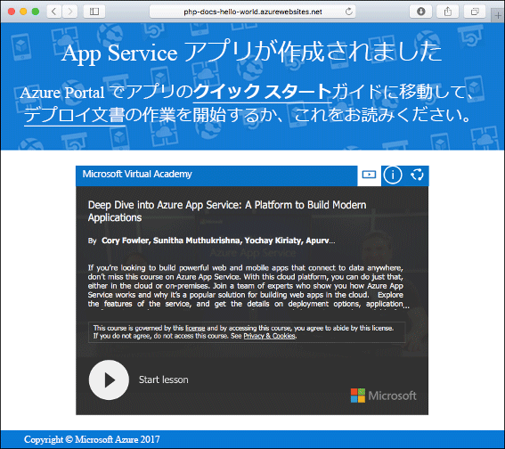
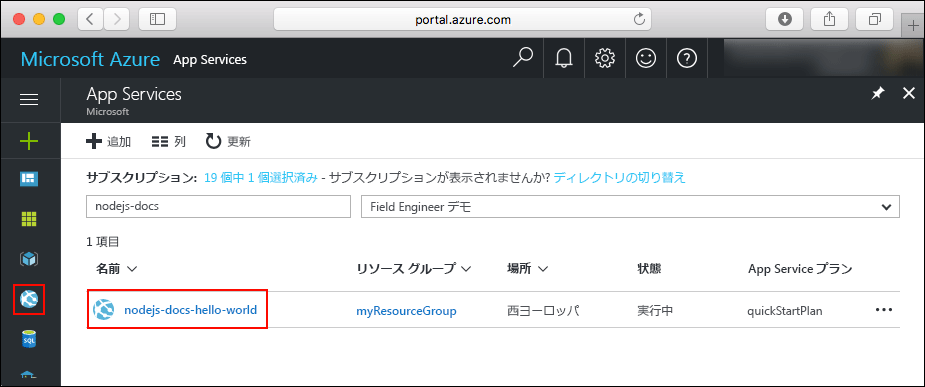

# <a name="create-a-nodejs-web-app-in-azure"></a>Azure で Node.js Web アプリを作成する

> [!NOTE]
> この記事では、Windows 上の App Service にアプリをデプロイします。 _Linux_ 上の App Service に展開するには、「[Azure App Service on Linux での Node.js Web アプリの作成](./containers/quickstart-nodejs.md)」をご覧ください。
>

[Azure Web Apps](app-service-web-overview.md) では、高度にスケーラブルな自己適用型の Web ホスティング サービスを提供しています。  このクイック スタートでは、Azure Web Apps に Node.js アプリをデプロイする方法を示します。 [Azure CLI](https://docs.microsoft.com/cli/azure/get-started-with-azure-cli) を使って Web アプリを作成し、Git を使用して Web アプリに Node.js のサンプル コードをデプロイします。


以下の手順は、Mac、Windows、または Linux コンピューターを使って実行できます。 前提条件のインストールを終えてから、以降の手順を完了するまでに約 5 分かかります。   

> [!VIDEO https://channel9.msdn.com/Shows/Azure-for-Node-Developers/Create-a-Nodejs-app-in-Azure-Quickstart/player]   

[!INCLUDE [quickstarts-free-trial-note](../../includes/quickstarts-free-trial-note.md)]

## <a name="prerequisites"></a>前提条件

このクイック スタートを完了するには、以下が必要です。

* <a href="https://nodejs.org/" target="_blank">Node.js および NPM をインストールする</a>

## <a name="download-the-sample"></a>サンプルのダウンロード

[https://github.com/Azure-Samples/nodejs-docs-hello-world/archive/master.zip](https://github.com/Azure-Samples/nodejs-docs-hello-world/archive/master.zip) からサンプル Node.js プロジェクトをダウンロードし、ZIP アーカイブを抽出します。

ターミナル ウィンドウで、Node.js のサンプル プロジェクトのルート ディレクトリに移動します (_index.js_ が含まれるディレクトリ)。

## <a name="run-the-app-locally"></a>アプリをローカルで実行する

ターミナル ウィンドウを開き、`npm start` スクリプトを使って組み込みの Node.js の HTTP サーバーを起動して、ローカルでアプリケーションを実行します。

```bash
npm start
```

Web ブラウザーを開き、`http://localhost:1337` のサンプル アプリに移動します。

ページに表示されているサンプル アプリの **Hello World** メッセージが表示されます。


ターミナル ウィンドウで **Ctrl + C** キーを押して、Web サーバーを終了します。

[!INCLUDE [Create ZIP file](../../includes/app-service-web-create-zip.md)]

[!INCLUDE [cloud-shell-try-it.md](../../includes/cloud-shell-try-it.md)]

[!INCLUDE [Create resource group](../../includes/app-service-web-create-resource-group.md)] 

[!INCLUDE [Create app service plan](../../includes/app-service-web-create-app-service-plan.md)] 

## <a name="create-a-web-app"></a>Web アプリを作成する

Cloud Shell で [`az webapp create`](/cli/azure/webapp?view=azure-cli-latest#az-webapp-create) コマンドを使用して、`myAppServicePlan` App Service プランに Web アプリを作成します。 

次の例では、`<app_name>` をグローバルに一意のアプリ名に置き換えてください (有効な文字は `a-z`、`0-9`、`-`)。 ランタイムは `NODE|6.9` に設定されています。 サポートされているすべてのランタイムを確認するには、[`az webapp list-runtimes`](/cli/azure/webapp?view=azure-cli-latest#az-webapp-list-runtimes) を実行します。 

```azurecli-interactive
# Bash
az webapp create --resource-group myResourceGroup --plan myAppServicePlan --name <app_name> --runtime "NODE|6.9"
# PowerShell
az --% webapp create --resource-group myResourceGroup --plan myAppServicePlan --name <app_name> --runtime "NODE|6.9"
```

Web アプリが作成されると、Azure CLI によって次の例のような出力が表示されます。

```json
{
  "availabilityState": "Normal",
  "clientAffinityEnabled": true,
  "clientCertEnabled": false,
  "cloningInfo": null,
  "containerSize": 0,
  "dailyMemoryTimeQuota": 0,
  "defaultHostName": "<app_name>.azurewebsites.net",
  "enabled": true,
  < JSON data removed for brevity. >
}
```

新しく作成された Web アプリに移動します。 _&lt;app name>_ は、アプリの一意の名前に置き換えてください。

```bash
http://<app name>.azurewebsites.net
```

新しい Web アプリは次のようになります。



[!INCLUDE [Deploy ZIP file](../../includes/app-service-web-deploy-zip.md)]

## <a name="browse-to-the-app"></a>アプリの参照

Web ブラウザーを使用して、デプロイされたアプリケーションを参照します。

```
http://<app_name>.azurewebsites.net
```

Node.js のサンプル コードは、Azure App Service の Web アプリで実行されています。


**お疲れさまでした。** App Service に初めての Node.js アプリをデプロイしました。

## <a name="update-and-redeploy-the-code"></a>コードを更新して再デプロイする

テキスト エディターを使用して、Node.js アプリ内の `index.js` ファイルを開き、`response.end` の呼び出し内のテキストを少し変更します。

```nodejs
response.end("Hello Azure!");
```

ローカルのターミナル ウィンドウで、アプリケーションのルート ディレクトリに移動し、更新されたプロジェクトの新しい ZIP ファイルを作成します。

```
# Bash
zip -r myUpdatedAppFiles.zip .

# PowerShell
Compress-Archive -Path * -DestinationPath myUpdatedAppFiles.zip
``` 

「[ZIP ファイルのアップロード](#upload-the-zip-file)」と同じ手順を使って、App Service にこの新しい ZIP ファイルをデプロイします。

「**アプリの参照**」の手順で開いたブラウザー ウィンドウに戻り、ページを更新します。


## <a name="manage-your-new-azure-web-app"></a>新しい Azure Web アプリを管理する

<a href="https://portal.azure.com" target="_blank">Azure Portal</a> に移動し、作成した Web アプリを管理します。

左側のメニューで **[App Services]** をクリックした後、Azure Web アプリの名前をクリックします。



Web アプリの [概要] ページを確認します。 ここでは、参照、停止、開始、再開、削除のような基本的な管理タスクを行うことができます。 

![Azure Portal の [App Service] ページ](media/app-service-web-get-started-nodejs-poc/nodejs-docs-hello-world-app-service-detail.png)

左側のメニューは、アプリを構成するためのさまざまなページを示しています。 

[!INCLUDE [cli-samples-clean-up](../../includes/cli-samples-clean-up.md)]

## <a name="next-steps"></a>次の手順

> [!div class="nextstepaction"]
> [Node.js と MongoDB](app-service-web-tutorial-nodejs-mongodb-app.md)
