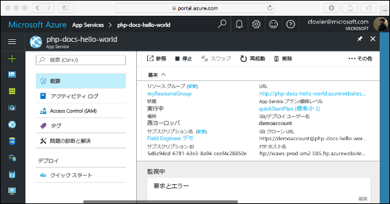

# <a name="create-a-php-web-app-in-azure"></a>Azure に PHP Web アプリを作成する

[Azure Web Apps](app-service-web-overview.md) では、高度にスケーラブルな自己適用型の Web ホスティング サービスを提供しています。  このクイック スタートでは、Azure Web Apps に PHP アプリをデプロイする方法を示します。 [Azure CLI](https://docs.microsoft.com/cli/azure/get-started-with-azure-cli) を使って Cloud Shell で Web アプリを作成し、Git を使用して Web アプリに PHP のサンプル コードをデプロイします。

![Azure で実行されるサンプル アプリ]](media/app-service-web-get-started-php/hello-world-in-browser.png)

以下の手順は、Mac、Windows、または Linux コンピューターを使用して実行できます。 前提条件のインストールを終えてから、以降の手順を完了するまでに約 5 分かかります。

## <a name="prerequisites"></a>前提条件

このクイック スタートを完了するには、以下が必要です。

* <a href="https://git-scm.com/" target="_blank">Git をインストールする</a>
* <a href="https://php.net" target="_blank">PHP をインストールする</a>

[!INCLUDE [quickstarts-free-trial-note](../../includes/quickstarts-free-trial-note.md)]

## <a name="download-the-sample-locally"></a>サンプルをローカルでダウンロードする

ターミナル ウィンドウで次のコマンドを実行します。 これにより、ローカル コンピューターにサンプル アプリケーションが複製され、サンプル コードを含むディレクトリに移動します。

```bash
git clone https://github.com/Azure-Samples/php-docs-hello-world
cd php-docs-hello-world
```

## <a name="run-the-app-locally"></a>アプリをローカルで実行する

ターミナル ウィンドウを開き、`php` コマンドを使って組み込みの PHP Web サーバーを起動して、ローカルでアプリケーションを実行します。

```bash
php -S localhost:8080
```

Web ブラウザーを開き、`http://localhost:8080` のサンプル アプリに移動します。

サンプル アプリケーションから "**Hello World!**"  というメッセージがページに表示されます。


ターミナル ウィンドウで **Ctrl + C** キーを押して、Web サーバーを終了します。

[!INCLUDE [cloud-shell-try-it.md](../../includes/cloud-shell-try-it.md)]

[!INCLUDE [Configure deployment user](../../includes/configure-deployment-user.md)]

[!INCLUDE [Create resource group](../../includes/app-service-web-create-resource-group.md)]

[!INCLUDE [Create app service plan](../../includes/app-service-web-create-app-service-plan.md)]

## <a name="create-a-web-app"></a>Web アプリを作成する

[!INCLUDE [Create web app](../../includes/app-service-web-create-web-app-php-no-h.md)]

新しく作成された Web アプリに移動します。 _&lt;app name>_ は、アプリの一意の名前に置き換えてください。

```bash
http://<app name>.azurewebsites.net
```


[!INCLUDE [Push to Azure](../../includes/app-service-web-git-push-to-azure.md)] 

```bash
Counting objects: 2, done.
Delta compression using up to 4 threads.
Compressing objects: 100% (2/2), done.
Writing objects: 100% (2/2), 352 bytes | 0 bytes/s, done.
Total 2 (delta 1), reused 0 (delta 0)
remote: Updating branch 'master'.
remote: Updating submodules.
remote: Preparing deployment for commit id '25f18051e9'.
remote: Generating deployment script.
remote: Running deployment command...
remote: Handling Basic Web Site deployment.
remote: Kudu sync from: '/home/site/repository' to: '/home/site/wwwroot'
remote: Copying file: '.gitignore'
remote: Copying file: 'LICENSE'
remote: Copying file: 'README.md'
remote: Copying file: 'index.php'
remote: Ignoring: .git
remote: Finished successfully.
remote: Running post deployment command(s)...
remote: Deployment successful.
To https://<app_name>.scm.azurewebsites.net/<app_name>.git
   cc39b1e..25f1805  master -> master
```

## <a name="browse-to-the-app-locally"></a>アプリをローカルで参照する

Web ブラウザーを使用して、デプロイされたアプリケーションを参照します。

```bash
http://<app_name>.azurewebsites.net
```

PHP のサンプル コードは、Azure App Service の Web アプリで実行されています。


**お疲れさまでした。** App Service に初めての PHP アプリをデプロイしました。

## <a name="update-locally-and-redeploy-the-code"></a>コードをローカルで更新して再デプロイする

ローカルのテキスト エディターを使用して、PHP アプリ内の `index.php` ファイルを開き、`echo` に続く文字列の中のテキストを少し変更します。

```php
echo "Hello Azure!";
```

ローカル ターミナル ウィンドウで、変更を Git にコミットし、コード変更を Azure にプッシュします。

```bash
git commit -am "updated output"
git push azure master
```

デプロイが完了したら、「**アプリの参照**」の手順で開いたブラウザー ウィンドウに戻り、ページを更新します。


## <a name="manage-your-new-azure-web-app"></a>新しい Azure Web アプリを管理する

<a href="https://portal.azure.com" target="_blank">Azure Portal</a> に移動し、作成した Web アプリを管理します。

左側のメニューで **[App Services]** をクリックした後、Azure Web アプリの名前をクリックします。


Web アプリの [概要] ページを確認します。 ここでは、参照、停止、開始、再開、削除のような基本的な管理タスクを行うことができます。



左側のメニューは、アプリを構成するためのさまざまなページを示しています。 

[!INCLUDE [cli-samples-clean-up](../../includes/cli-samples-clean-up.md)]

## <a name="next-steps"></a>次のステップ

> [!div class="nextstepaction"]
> [PHP と MySQL](app-service-web-tutorial-php-mysql.md)
