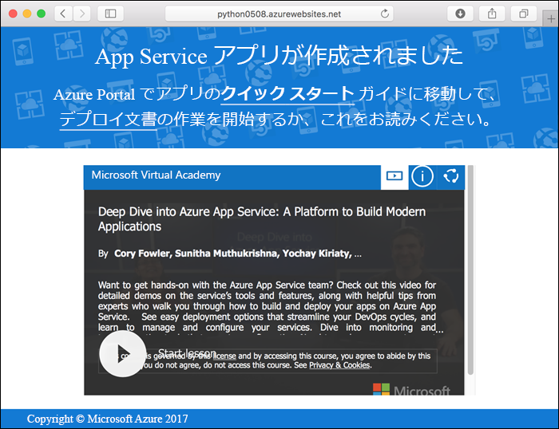
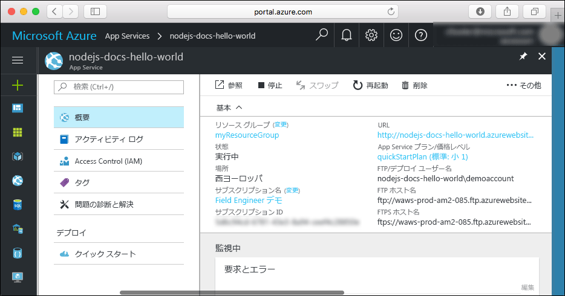

# <a name="create-a-python-web-app-in-azure"></a>Azure に Python Web アプリを作成する

[Azure Web Apps](app-service-web-overview.md) では、高度にスケーラブルな自己適用型の Web ホスティング サービスを提供しています。  このクイック スタートでは、Python アプリを開発して Azure Web Apps にデプロイする方法について説明します。 [Azure CLI](https://docs.microsoft.com/cli/azure/get-started-with-azure-cli) を使って Web アプリを作成し、Git を使用して Web アプリに Python のサンプル コードをデプロイします。


以下の手順は、Mac、Windows、または Linux コンピューターを使用して実行できます。 前提条件のインストールを終えてから、以降の手順を完了するまでに約 5 分かかります。

## <a name="prerequisites"></a>前提条件

このチュートリアルを完了するには、以下が必要です。

1. [Git をインストールする](https://git-scm.com/)
1. [Python をインストールする](https://www.python.org/downloads/)

[!INCLUDE [quickstarts-free-trial-note](../../includes/quickstarts-free-trial-note.md)]

## <a name="download-the-sample"></a>サンプルのダウンロード

ターミナル ウィンドウで、次のコマンドを実行して、サンプル アプリのリポジトリをローカル コンピューターに複製します。

```bash
git clone https://github.com/Azure-Samples/python-docs-hello-world
```

このクイック スタートでは、ターミナル ウィンドウを使ってすべてのコマンドを実行します。

サンプル コードが含まれているディレクトリに移動します。

```bash
cd python-docs-hello-world
```

## <a name="run-the-app-locally"></a>アプリをローカルで実行する

`pip` を使って必要なパッケージをインストールします。

```bash
pip install -r requirements.txt
```

ターミナル ウィンドウを開き、`Python` コマンドを使って組み込みの Python Web サーバーを起動して、ローカルでアプリケーションを実行します。

```bash
python main.py
```

Web ブラウザーを開き、`http://localhost:5000` のサンプル アプリに移動します。

ページに表示されているサンプル アプリの **Hello World** メッセージが表示されます。


ターミナル ウィンドウで **Ctrl + C** キーを押して、Web サーバーを終了します。

[!INCLUDE [cloud-shell-try-it.md](../../includes/cloud-shell-try-it.md)]

[!INCLUDE [Configure deployment user](../../includes/configure-deployment-user.md)]

[!INCLUDE [Create resource group](../../includes/app-service-web-create-resource-group.md)]

[!INCLUDE [Create app service plan](../../includes/app-service-web-create-app-service-plan.md)]

[!INCLUDE [Create web app](../../includes/app-service-web-create-web-app.md)]



これで、Azure に空の新しい Web アプリが作成されました。

## <a name="configure-to-use-python"></a>Python を使用するための構成

Python バージョン `3.4` を使用するように Web アプリを構成するには、[az webapp config set](/cli/azure/webapp/config#set) コマンドを使用します。

```azurecli-interactive
az webapp config set --python-version 3.4 --name <app_name> --resource-group myResourceGroup
```

上記のように Python バージョンを設定すると、プラットフォームから提供されている既定のコンテナーが使用されます。 独自のコンテナーを使用するには、[az webapp config container set](/cli/azure/webapp/config/container#set) コマンドの CLI リファレンスをご覧ください。

[!INCLUDE [Configure local git](../../includes/app-service-web-configure-local-git.md)]

[!INCLUDE [Push to Azure](../../includes/app-service-web-git-push-to-azure.md)]

```bash
Counting objects: 18, done.
Delta compression using up to 4 threads.
Compressing objects: 100% (16/16), done.
Writing objects: 100% (18/18), 4.31 KiB | 0 bytes/s, done.
Total 18 (delta 4), reused 0 (delta 0)
remote: Updating branch 'master'.
remote: Updating submodules.
remote: Preparing deployment for commit id '44e74fe7dd'.
remote: Generating deployment script.
remote: Generating deployment script for python Web Site
remote: Generated deployment script files
remote: Running deployment command...
remote: Handling python deployment.
remote: KuduSync.NET from: 'D:\home\site\repository' to: 'D:\home\site\wwwroot'
remote: Deleting file: 'hostingstart.html'
remote: Copying file: '.gitignore'
remote: Copying file: 'LICENSE'
remote: Copying file: 'main.py'
remote: Copying file: 'README.md'
remote: Copying file: 'requirements.txt'
remote: Copying file: 'virtualenv_proxy.py'
remote: Copying file: 'web.2.7.config'
remote: Copying file: 'web.3.4.config'
remote: Detected requirements.txt.  You can skip Python specific steps with a .skipPythonDeployment file.
remote: Detecting Python runtime from site configuration
remote: Detected python-3.4
remote: Creating python-3.4 virtual environment.
remote: .................................
remote: Pip install requirements.
remote: Successfully installed Flask click itsdangerous Jinja2 Werkzeug MarkupSafe
remote: Cleaning up...
remote: .
remote: Overwriting web.config with web.3.4.config
remote:         1 file(s) copied.
remote: Finished successfully.
remote: Running post deployment command(s)...
remote: Deployment successful.
To https://<app_name>.scm.azurewebsites.net/<app_name>.git
 * [new branch]      master -> master
```

## <a name="browse-to-the-app"></a>アプリの参照

Web ブラウザーを使用して、デプロイされたアプリケーションを参照します。

```bash
http://<app_name>.azurewebsites.net
```

Python のサンプル コードは、Azure App Service の Web アプリで実行されています。


**お疲れさまでした。** App Service に初めての Python アプリをデプロイしました。

## <a name="update-and-redeploy-the-code"></a>コードを更新して再デプロイする

ローカルのテキスト エディターを使用して、Python アプリ内の `main.py` ファイルを開き、`return` ステートメントの横のテキストを少し変更します。

```python
return 'Hello, Azure!'
```

Git で変更をコミットしてから、コード変更を Azure にプッシュします。

```bash
git commit -am "updated output"
git push azure master
```

デプロイが完了したら、「[アプリの参照](#browse-to-the-app)」の手順で開いたブラウザー ウィンドウに戻り、ページを更新します。


## <a name="manage-your-new-azure-web-app"></a>新しい Azure Web アプリを管理する

<a href="https://portal.azure.com" target="_blank">Azure Portal</a> に移動し、作成した Web アプリを管理します。

左側のメニューで **[App Services]** をクリックした後、Azure Web アプリの名前をクリックします。


Web アプリの [概要] ページを確認します。 ここでは、参照、停止、開始、再開、削除のような基本的な管理タスクを行うことができます。



左側のメニューは、アプリを構成するためのさまざまなページを示しています。

[!INCLUDE [cli-samples-clean-up](../../includes/cli-samples-clean-up.md)]

## <a name="next-steps"></a>次のステップ

> [!div class="nextstepaction"]
> [既存のカスタム DNS 名を Azure Web Apps にマップする](app-service-web-tutorial-custom-domain.md)

