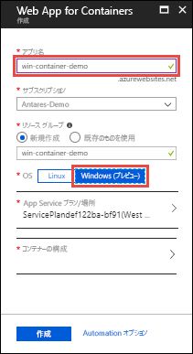
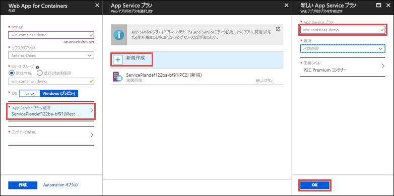
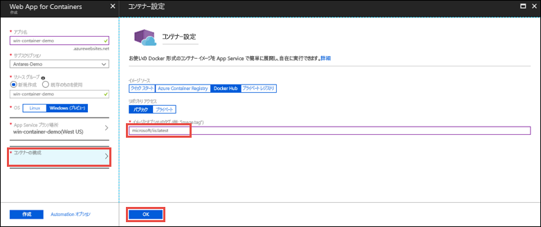
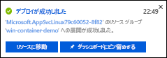
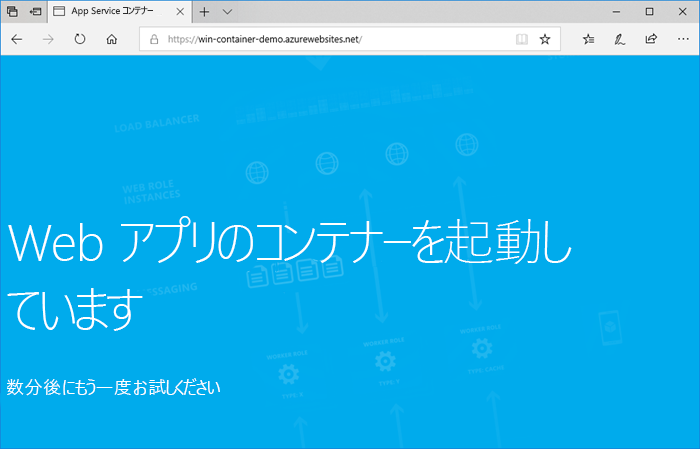

# <a name="run-a-custom-windows-container-in-azure-preview"></a>Azure でのカスタム Windows コンテナーの実行 (プレビュー)

[Azure App Service](app-service-web-overview.md) は、IIS 上で稼働する ASP.NET や IIS 上で稼働する Node.js など、Windows 上の定義済みのアプリケーション スタックを提供します。 Windows 環境があらかじめ構成されていることで、オペレーティング システムは、管理アクセスやソフトウェアのインストール、グローバル アセンブリ キャッシュへの変更などができないようにロックされます (「[Azure App Service におけるオペレーティング システムの機能](web-sites-available-operating-system-functionality.md)」を参照)。 アプリケーションから利用すべき領域が事前構成済みの環境を超える場合は、カスタムの Windows コンテナーをデプロイすることで対応できます。 このクイック スタートでは、[Docker Hub](https://hub.docker.com/) からカスタム IIS イメージを Azure App Service にデプロイします。


## <a name="sign-in-to-azure"></a>Azure へのサインイン

Azure Portal ( https://portal.azure.com ) にサインインします。

## <a name="create-a-windows-container-app"></a>Windows コンテナー アプリの作成

1. Azure portal の左上隅にある **[リソースの作成]** を選択します。

2. Azure Marketplace リソース一覧の上にある検索ボックスで、**[Web App for Containers]** を検索して選択します。

3. アプリ名 (*mywebapp* など) を入力し、既定値のまま新しいリソース グループを作成して、**[OS]** ボックスの **[Windows (プレビュー)]** をクリックします。

    

4. **[App Service プラン/場所]** > **[新規作成]** の順にクリックして App Service プランを作成します。 新しいプランに名前を付け、既定値のまま **[OK]** をクリックします。

    

5. **[コンテナーの構成]** をクリックし、**[イメージとオプションのタグ]** に「_microsoft/iis:latest_」と入力して、**[OK]** をクリックします。

    

    この記事では、パブリックの [microsoft/iis:latest](https://hub.docker.com/r/microsoft/iis/) Docker Hub イメージを使用します。 [Azure Container Registry](/azure/container-registry/) や他のプライベート リポジトリなど、どこか他の場所に目的の Web アプリケーションのカスタム イメージがある場合は、ここで構成することができます。

6. **[作成]** をクリックして、必要なリソースが Azure によって作成されるのを待ちます。

## <a name="browse-to-the-container-app"></a>コンテナー アプリにブラウザーでアクセスする

Azure の処理が完了すると、通知ボックスが表示されます。



1. **[リソースに移動]** をクリックします。

2. アプリ ページで、**[URL]** の下にあるリンクをクリックします。

新しいブラウザー ページが開いて次のページが表示されます。



数分待ってから再試行すると、IIS のウェルカム ページが表示されます。


**お疲れさまでした。** 初めてのカスタム Windows コンテナーを Azure App Service で実行することができました。

## <a name="see-container-start-up-logs"></a>コンテナーの起動ログの表示

Windows コンテナーが読み込まれるまでにしばらく時間がかかる場合があります。 進行状況を確認するには、*\<app_name>* をアプリの名前に置き換えて次の URL に移動します。
```
https://<app_name>.scm.azurewebsites.net/api/logstream
```

次のようなログがストリーム配信されます。

```
2018-07-27T12:03:11  Welcome, you are now connected to log-streaming service.
27/07/2018 12:04:10.978 INFO - Site: win-container-demo - Start container succeeded. Container: facbf6cb214de86e58557a6d073396f640bbe2fdec88f8368695c8d1331fc94b
27/07/2018 12:04:16.767 INFO - Site: win-container-demo - Container start complete
27/07/2018 12:05:05.017 INFO - Site: win-container-demo - Container start complete
27/07/2018 12:05:05.020 INFO - Site: win-container-demo - Container started successfully
```

## <a name="use-a-different-docker-image"></a>別の Docker イメージの使用

別のカスタム Docker イメージを使用してアプリを実行することもできます。 ただし、必要なフレームワークに合った適切な[親イメージ](https://docs.docker.com/develop/develop-images/baseimages/)を選ぶ必要があります。 

- .NET Framework のアプリをデプロイするには、Windows Server Core 2016 [Long-Term Servicing Channel (LTSC: 長期的なサービス チャネル)](https://docs.microsoft.com/windows-server/get-started/semi-annual-channel-overview#long-term-servicing-channel-ltsc) リリースに基づく親イメージを使用します。 
- .NET Core のアプリをデプロイするには、Windows Server Nano 2016 [Long-Term Servicing Channel (LTSC: 長期的なサービス チャネル)](https://docs.microsoft.com/windows-server/get-started/semi-annual-channel-overview#long-term-servicing-channel-ltsc) リリースに基づく親イメージを使用します。 

アプリの起動中は、親イメージのダウンロードに多少の時間がかかります。 ただし、Azure App Service にあらかじめキャッシュされている次のいずれかの親イメージを使用することで、起動時間を短縮することができます。

- [microsoft/iis](https://hub.docker.com/r/microsoft/iis/):windowsservercore-ltsc2016, latest
- [microsoft/iis](https://hub.docker.com/r/microsoft/iis/):nanoserver-sac2016
- [microsoft/aspnet](https://hub.docker.com/r/microsoft/aspnet/):4.7.2-windowsservercore-ltsc2016, 4.7.2, latest
- [microsoft/dotnet](https://hub.docker.com/r/microsoft/dotnet/):2.1-aspnetcore-runtime
- [microsoft/dotnet](https://hub.docker.com/r/microsoft/dotnet/):2.1-sdk
