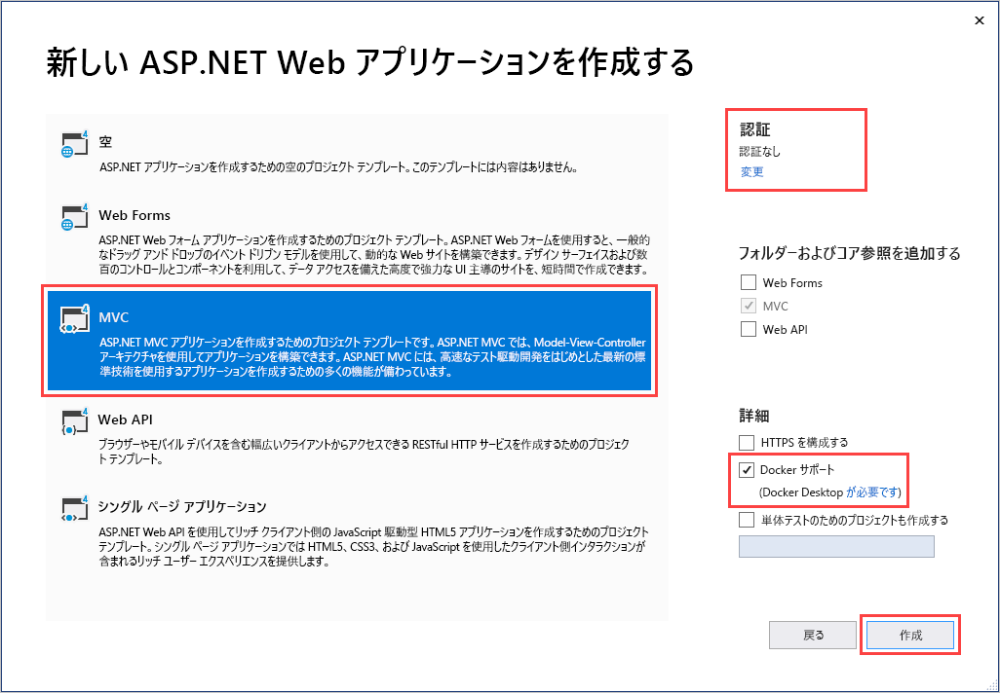
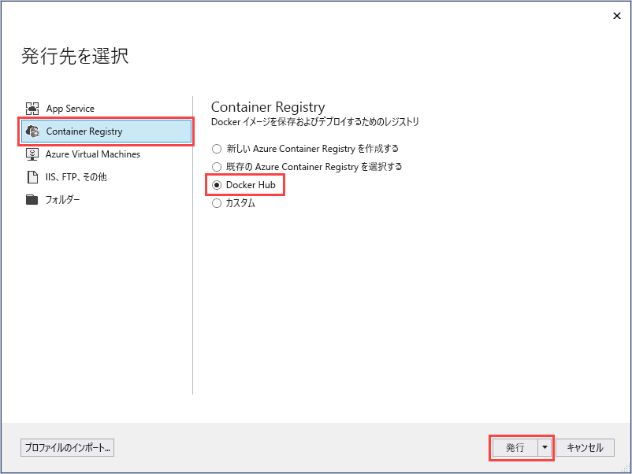
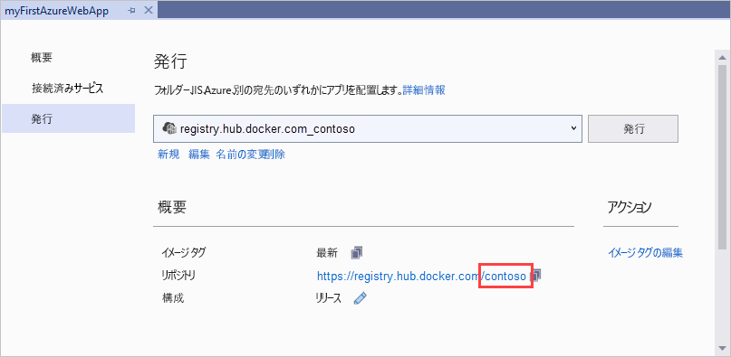
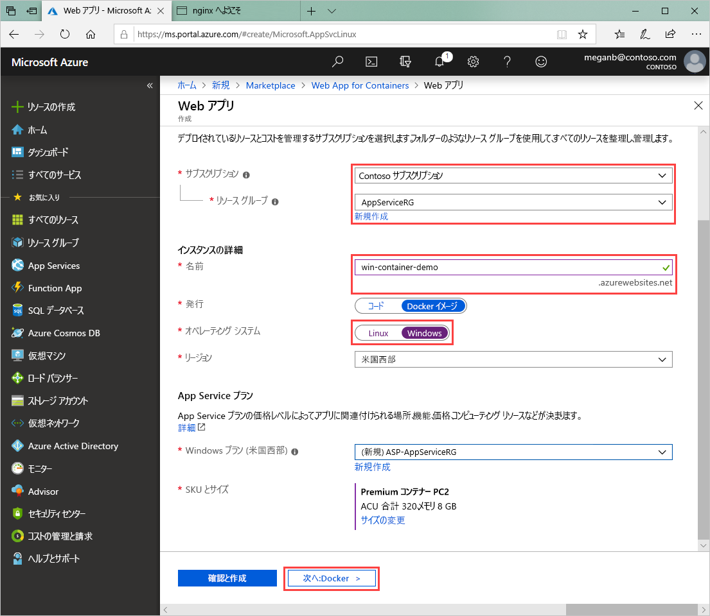
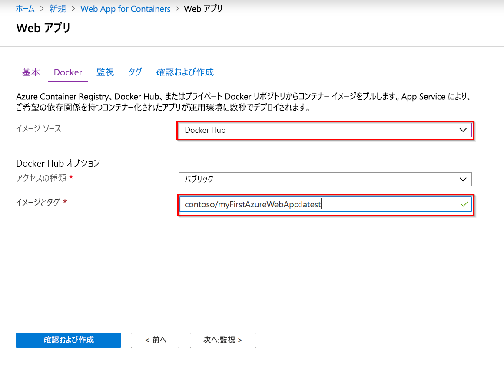

# <a name="run-a-custom-windows-container-in-azure-preview"></a>Azure でのカスタム Windows コンテナーの実行 (プレビュー)

[Azure App Service](overview.md) は、IIS 上で稼働する ASP.NET や IIS 上で稼働する Node.js など、Windows 上の定義済みのアプリケーション スタックを提供します。 Windows 環境があらかじめ構成されていることで、オペレーティング システムは、管理アクセスやソフトウェアのインストール、グローバル アセンブリ キャッシュへの変更などができないようにロックされます。 詳細については、「[Azure App Service におけるオペレーティング システムの機能](operating-system-functionality.md)」を参照してください。 アプリケーションから利用すべき領域が事前構成済みの環境を超える場合は、カスタムの Windows コンテナーをデプロイすることで対応できます。

このクイックスタートでは、Visual Studio から [Docker Hub](https://hub.docker.com/) に、Windows イメージで ASP.NET アプリをデプロイする方法について説明します。 アプリは、Azure App Service のカスタム コンテナーで実行します。

## <a name="prerequisites"></a>前提条件

このチュートリアルを完了するには、以下が必要です。

- <a href="https://hub.docker.com/" target="_blank">Docker Hub アカウントにサインアップする</a>
- <a href="https://docs.docker.com/docker-for-windows/install/" target="_blank">Docker for Windows をインストールする</a>。
- <a href="https://docs.microsoft.com/virtualization/windowscontainers/quick-start/quick-start-windows-10" target="_blank">Windows コンテナーを実行するように Docker を切り替える</a>。
- **ASP.NET と Web 開発**ワークロードと **Azure の開発**ワークロードを含めて <a href="https://www.visualstudio.com/downloads/" target="_blank">Visual Studio 2019 をインストールする</a>。 Visual Studio 2019 を既にインストールしている場合:

    - **[ヘルプ]**  >  **[更新プログラムの確認]** の順に選択して、Visual Studio に最新の更新プログラムをインストールします。
    - **[ツール]**  >  **[ツールと機能を取得]** の順に選択し、Visual Studio にワークロードを追加します。

## <a name="create-an-aspnet-web-app"></a>ASP.NET Web アプリを作成する

次の手順に従って ASP.NET Web アプリを作成します。

1. Visual Studio を開き、 **[新しいプロジェクトの作成]** を選択します。

1. **[新しいプロジェクトの作成]** で、C# の **[ASP.NET Web アプリケーション (.NET Framework)]** を選択し、 **[次へ]** を選択します。

1. **[新しいプロジェクトの構成]** で、アプリケーションに _myFirstAzureWebApp_ という名前を付け、 **[作成]** を選択します。

   

1. 任意の種類の ASP.NET Web アプリを Azure にデプロイできます。 このクイックスタートでは、 **[MVC]** テンプレートを選択します。

1. **[Docker サポート]** を選択し、認証が **[認証なし]** に設定されていることを確認します。 **作成** を選択します。

   

1. _Dockerfile_ ファイルが自動的に開かない場合は、**ソリューション エクスプローラー**から開きます。

1. [サポートされている親イメージ](#use-a-different-parent-image)が必要です。 `FROM` 行を次のコードに置き換えることで親イメージを変更し、ファイルを保存します。

   ```Dockerfile
   FROM mcr.microsoft.com/dotnet/framework/aspnet:4.7.2-windowsservercore-ltsc2019
   ```

1. Visual Studio のメニューから **[デバッグ]**  >  **[デバッグなしで開始]** の順に選択して、Web アプリをローカルで実行します。

   

## <a name="publish-to-docker-hub"></a>Docker Hub に発行する

1. **ソリューション エクスプローラー**で **myFirstAzureWebApp** プロジェクトを右クリックし、 **[発行]** を選択します。

1. **App Service** を選択し、 **[発行]** を選択します。

1. **[発行先を選択]** で **[コンテナー レジストリ]** と **[Docker Hub]** を選択し、 **[発行]** をクリックします。

   

1. Docker Hub アカウントの資格情報を指定し、 **[保存]** を選択します。

   デプロイが完了するまで待ちます。 **[発行]** ページに、後で使用するリポジトリ名が表示されるようになります。

   

1. 後で使用するのでこのリポジトリ名をコピーします。

## <a name="create-a-windows-container-app"></a>Windows コンテナー アプリの作成

1. [Azure Portal]( https://portal.azure.com) にサインインします。

1. Azure portal の左上隅にある **[リソースの作成]** を選択します。

1. Azure Marketplace リソース一覧の上にある検索ボックスで、 **[Web App for Containers]** を検索して、 **[作成]** を選択します。

1. **[Web App Create]\(Web アプリの作成\)** で、サブスクリプションと**リソース グループ**を選択します。 必要な場合は、新しいリソース グループを作成できます。

1. アプリ名 (例: *win-container-demo*) を入力し、 **[オペレーティング システム]** に **[Windows]** を選択します。 **[次へ:Docker]** を選択して続行します。

   

1. **[イメージのソース]** に **[Docker Hub]** を選択し、 **[イメージとタグ]** に、「[Docker Hub に発行する](#publish-to-docker-hub)」でコピーしたリポジトリ名を入力します。

   

    [Azure Container Registry](/azure/container-registry/) や他のプライベート リポジトリなど、どこか他の場所に目的の Web アプリケーションのカスタム イメージがある場合は、ここで構成することができます。

1. **[確認と作成]** 、 **[作成]** の順に選択して、必要なリソースが Azure によって作成されるまで待ちます。

## <a name="browse-to-the-container-app"></a>コンテナー アプリにブラウザーでアクセスする

Azure の処理が完了すると、通知ボックスが表示されます。


1. **[リソースに移動]** をクリックします。

1. このリソースの概要で、 **[URL]** の横にあるリンクに移動します。

新しいブラウザー ページが開いて次のページが表示されます。


数分待ってから再試行すると、既定の ASP.NET ホーム ページが表示されます。


**お疲れさまでした。** 初めてのカスタム Windows コンテナーを Azure App Service で実行することができました。

## <a name="see-container-start-up-logs"></a>コンテナーの起動ログの表示

Windows コンテナーが読み込まれるまでにしばらく時間がかかる場合があります。 進行状況を確認するには、 *\<app_name>* をアプリの名前に置き換えて次の URL に移動します。
```
https://<app_name>.scm.azurewebsites.net/api/logstream
```

次のようなログがストリーム配信されます。

```
2018-07-27T12:03:11  Welcome, you are now connected to log-streaming service.
27/07/2018 12:04:10.978 INFO - Site: win-container-demo - Start container succeeded. Container: facbf6cb214de86e58557a6d073396f640bbe2fdec88f8368695c8d1331fc94b
27/07/2018 12:04:16.767 INFO - Site: win-container-demo - Container start complete
27/07/2018 12:05:05.017 INFO - Site: win-container-demo - Container start complete
27/07/2018 12:05:05.020 INFO - Site: win-container-demo - Container started successfully
```

## <a name="update-locally-and-redeploy"></a>ローカルで更新して再デプロイする

1. Visual Studio の**ソリューション エクスプローラー**から、 **[表示]**  >  **[ホーム]**  >  **[Index.cshtml]** の順に開きます。

1. 上部の `<div class="jumbotron">` HTML タグを検索し、要素全体を次のコードに置き換えます。

   ```HTML
   <div class="jumbotron">
       <h1>ASP.NET in Azure!</h1>
       <p class="lead">This is a simple app that we’ve built that demonstrates how to deploy a .NET app to Azure App Service.</p>
   </div>
   ```

1. Azure に再デプロイするには、**ソリューション エクスプローラー**で **myFirstAzureWebApp** プロジェクトを右クリックし、 **[発行]** を選択します。

1. 発行ページで **[発行]** を選択し、発行が完了するまで待ちます。

1. App Service に Docker Hub から新しいイメージをプルするよう指示するには、アプリを再起動します。 ポータルでアプリ ページに戻り、 **[再起動]**  >  **[はい]** をクリックします。

   

再び[コンテナー アプリにブラウザーでアクセス](#browse-to-the-container-app)します。 Web ページを更新すると、アプリは最初に "起動" ページに戻った後、数分すると更新された Web ページが再び表示されます。


## <a name="use-a-different-parent-image"></a>別の親イメージを使用する

別のカスタム Docker イメージを使用してアプリを実行することもできます。 ただし、必要なフレームワークに合った適切な[親イメージ](https://docs.docker.com/develop/develop-images/baseimages/)を選ぶ必要があります。

- .NET Framework のアプリをデプロイするには、Windows Server Core 2019 [Long-Term Servicing Channel (LTSC: 長期的なサービス チャネル)](https://docs.microsoft.com/windows-server/get-started-19/servicing-channels-19#long-term-servicing-channel-ltsc) リリースに基づく親イメージを使用します。 
- .NET Core のアプリをデプロイするには、Windows Server Nano 1809 [Semi-Annual Servicing Channel (SAC: 半期サービス チャネル)](https://docs.microsoft.com/windows-server/get-started-19/servicing-channels-19#semi-annual-channel) リリースに基づく親イメージを使用します。 

アプリの起動中は、親イメージのダウンロードに多少の時間がかかります。 ただし、Azure App Service にあらかじめキャッシュされている次のいずれかの親イメージを使用することで、起動時間を短縮することができます。

- [mcr.microsoft.com/dotnet/framework/aspnet](https://hub.docker.com/_/microsoft-dotnet-framework-aspnet/):4.7.2-windowsservercore-ltsc2019
- [mcr.microsoft.com/windows/nanoserver](https://hub.docker.com/_/microsoft-windows-nanoserver/):1809 - このイメージは、Microsoft [ASP.NET Core](https://hub.docker.com/_microsoft-dotnet-cores-aspnet) の Microsoft Windows Nano Server イメージ全体で使用されるベース コンテナーです。

## <a name="next-steps"></a>次の手順

> [!div class="nextstepaction"]
> [Azure で Windows コンテナーに移行する](app-service-web-tutorial-windows-containers-custom-fonts.md)
