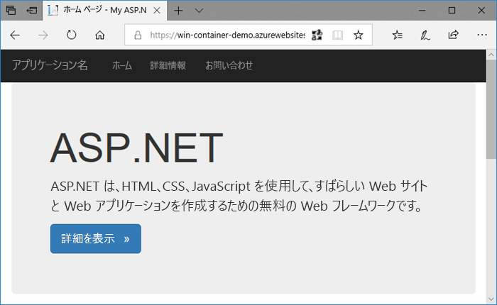
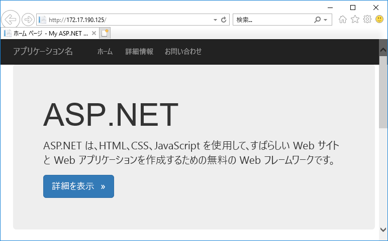
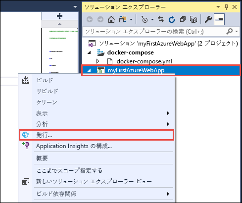
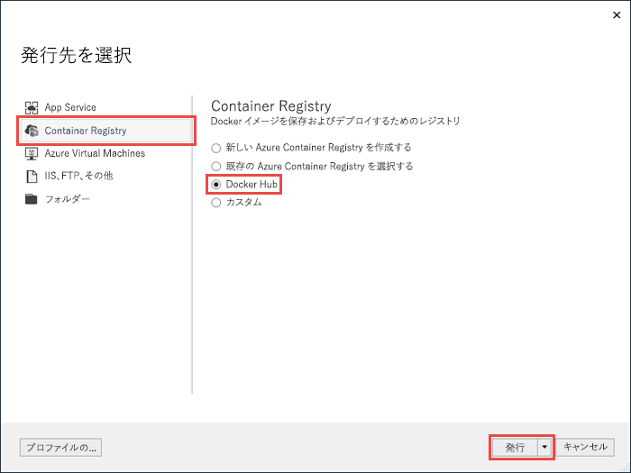
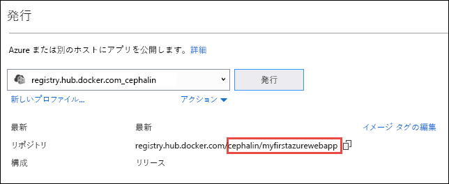
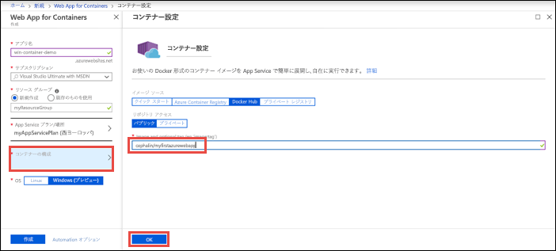
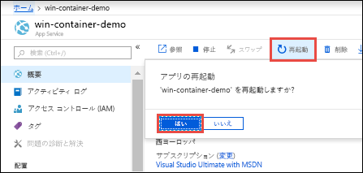
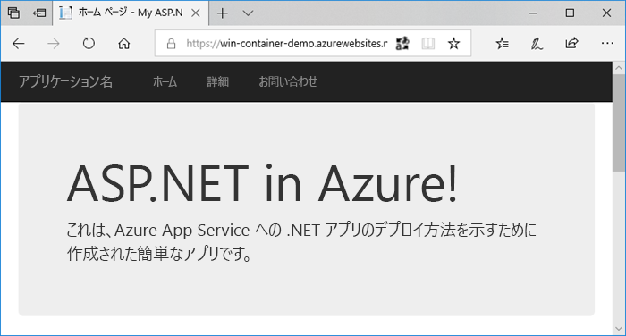

# <a name="run-a-custom-windows-container-in-azure-preview"></a>Azure でのカスタム Windows コンテナーの実行 (プレビュー)

[Azure App Service](overview.md) は、IIS 上で稼働する ASP.NET や IIS 上で稼働する Node.js など、Windows 上の定義済みのアプリケーション スタックを提供します。 Windows 環境があらかじめ構成されていることで、オペレーティング システムは、管理アクセスやソフトウェアのインストール、グローバル アセンブリ キャッシュへの変更などができないようにロックされます (「[Azure App Service におけるオペレーティング システムの機能](operating-system-functionality.md)」を参照)。 アプリケーションから利用すべき領域が事前構成済みの環境を超える場合は、カスタムの Windows コンテナーをデプロイすることで対応できます。 このクイック スタートでは、Visual Studio から Windows イメージ内の ASP.NET アプリを [Docker Hub](https://hub.docker.com/) にデプロイし、Azure App Service のカスタム コンテナーで実行する方法を示します。



## <a name="prerequisites"></a>前提条件

このチュートリアルを完了するには、以下が必要です。

- <a href="https://hub.docker.com/" target="_blank">Docker Hub アカウントにサインアップする</a>
- <a href="https://docs.docker.com/docker-for-windows/install/" target="_blank">Docker for Windows をインストールする</a>。
- <a href="https://docs.microsoft.com/virtualization/windowscontainers/quick-start/quick-start-windows-10#2-switch-to-windows-containers" target="_blank">Windows コンテナーを実行するように Docker を切り替える</a>。
- **ASP.NET と Web 開発**ワークロードと **Azure の開発**ワークロードを含めて <a href="https://www.visualstudio.com/downloads/" target="_blank">Visual Studio 2017 をインストールする</a>。 Visual Studio 2017 を既にインストールしている場合:
    - **[ヘルプ]** > **[更新プログラムの確認]** の順にクリックし、Visual Studio に最新の更新プログラムをインストールします。
    - **[ツール]** > **[ツールと機能を取得]** の順にクリックし、Visual Studio にワークロードを追加します。

## <a name="create-an-aspnet-web-app"></a>ASP.NET Web アプリを作成する

Visual Studio で、**[ファイル]、[新規作成]、[プロジェクト]** の順にクリックして、プロジェクトを作成します。 

**[新しいプロジェクト]** ダイアログで、**[Visual C#]、[Web]、[ASP.NET Web アプリケーション (.NET Framework)]** の順にクリックします。

アプリケーションに _myFirstAzureWebApp_ という名前を付けて、**[OK]** をクリックします。
   


任意の種類の ASP.NET Web アプリを Azure にデプロイできます。 このクイックスタートでは、**[MVC]** テンプレートを選択し、認証が **[認証なし]** に設定されていることを確認してください。

**[Docker Compose サポートを有効にする]** を選択します

**[OK]** を選択します。

![[新しい ASP.NET プロジェクト] ダイアログ ボックス](./media/app-service-web-get-started-windows-container/select-mvc-template.png)

_Dockerfile_ ファイルが自動的に開かない場合は、**ソリューション エクスプローラー**から開きます。

[サポートされている親イメージ](#use-a-different-parent-image)を使用する必要があります。 `FROM` 行を次のコードに置き換えることで親イメージを変更し、ファイルを保存します。

```Dockerfile
FROM microsoft/aspnet:4.7.1
```

メニューから、**[デバッグ]、[デバッグなしで開始]** の順にクリックし、ローカルで Web アプリを実行します。



## <a name="publish-to-docker-hub"></a>Docker Hub に発行する

**ソリューション エクスプローラー**で **myFirstAzureWebApp** プロジェクトを右クリックし、**[発行]** を選択します。



発行ウィザードが自動的に起動します。 **[Container Registry]** > **[Docker Hub]** > **[発行]** を選択します。



Docker Hub アカウントの資格情報を指定し、**[保存]** をクリックします。 

デプロイが完了するまで待ちます。 **[発行]** ページに、後で App Service で使用するリポジトリ名が表示されるようになります。



後で使用するのでこのリポジトリ名をコピーします。

## <a name="sign-in-to-azure"></a>Azure へのサインイン

Azure Portal ( https://portal.azure.com ) にサインインします。

## <a name="create-a-windows-container-app"></a>Windows コンテナー アプリの作成

1. Azure portal の左上隅にある **[リソースの作成]** を選択します。

2. Azure Marketplace リソース一覧の上にある検索ボックスで、**[Web App for Containers]** を検索して選択します。

3. アプリ名 (*win-container-demo* など) を入力し、既定値のまま新しいリソース グループを作成して、**[OS]** ボックスの **[Windows (プレビュー)]** をクリックします。

    

4. **[App Service プラン/場所]** > **[新規作成]** の順にクリックして App Service プランを作成します。 新しいプランに名前を付け、既定値のまま **[OK]** をクリックします。

    

5. **[コンテナーの構成]** をクリックします。 **[イメージとオプションのタグ]** では「[Docker Hub に発行する](#publish-to-docker-hub)」でコピーしたリポジトリ名を使用し、**[OK]** をクリックします。

    

    [Azure Container Registry](/azure/container-registry/) や他のプライベート リポジトリなど、どこか他の場所に目的の Web アプリケーションのカスタム イメージがある場合は、ここで構成することができます。

6. **[作成]** をクリックして、必要なリソースが Azure によって作成されるのを待ちます。

## <a name="browse-to-the-container-app"></a>コンテナー アプリにブラウザーでアクセスする

Azure の処理が完了すると、通知ボックスが表示されます。


1. **[リソースに移動]** をクリックします。

2. アプリ ページで、**[URL]** の下にあるリンクをクリックします。

新しいブラウザー ページが開いて次のページが表示されます。


数分待ってから再試行すると、既定の ASP.NET ホーム ページが表示されます。


**お疲れさまでした。** 初めてのカスタム Windows コンテナーを Azure App Service で実行することができました。

## <a name="see-container-start-up-logs"></a>コンテナーの起動ログの表示

Windows コンテナーが読み込まれるまでにしばらく時間がかかる場合があります。 進行状況を確認するには、*\<app_name>* をアプリの名前に置き換えて次の URL に移動します。
```
https://<app_name>.scm.azurewebsites.net/api/logstream
```

次のようなログがストリーム配信されます。

```
2018-07-27T12:03:11  Welcome, you are now connected to log-streaming service.
27/07/2018 12:04:10.978 INFO - Site: win-container-demo - Start container succeeded. Container: facbf6cb214de86e58557a6d073396f640bbe2fdec88f8368695c8d1331fc94b
27/07/2018 12:04:16.767 INFO - Site: win-container-demo - Container start complete
27/07/2018 12:05:05.017 INFO - Site: win-container-demo - Container start complete
27/07/2018 12:05:05.020 INFO - Site: win-container-demo - Container started successfully
```

## <a name="update-locally-and-redeploy"></a>ローカルで更新して再デプロイする

**ソリューション エクスプローラー**で、_Views\Home\Index.cshtml_ を開きます。

上部の `<div class="jumbotron">` HTML タグを検索し、要素全体を次のコードに置き換えます。

```HTML
<div class="jumbotron">
    <h1>ASP.NET in Azure!</h1>
    <p class="lead">This is a simple app that we’ve built that demonstrates how to deploy a .NET app to Azure App Service.</p>
</div>
```

Azure に再デプロイするには、**ソリューション エクスプローラー**で **myFirstAzureWebApp** プロジェクトを右クリックし、**[発行]** を選択します。

発行ページで **[発行]** を選択し、発行が完了するまで待ちます。

App Service に Docker Hub から新しいイメージをプルするよう指示するには、アプリを再起動します。 ポータルでアプリ ページに戻り、**[再起動]** > **[はい]** をクリックします。



再び[コンテナー アプリにブラウザーでアクセス](#browse-to-the-container-app)します。 Web ページを更新すると、アプリは最初に "起動" ページに戻った後、数分すると更新された Web ページが再び表示されます。



## <a name="use-a-different-parent-image"></a>別の親イメージを使用する

別のカスタム Docker イメージを使用してアプリを実行することもできます。 ただし、必要なフレームワークに合った適切な[親イメージ](https://docs.docker.com/develop/develop-images/baseimages/)を選ぶ必要があります。 

- .NET Framework のアプリをデプロイするには、Windows Server Core 2016 [Long-Term Servicing Channel (LTSC: 長期的なサービス チャネル)](https://docs.microsoft.com/windows-server/get-started/semi-annual-channel-overview#long-term-servicing-channel-ltsc) リリースに基づく親イメージを使用します。 
- .NET Core のアプリをデプロイするには、Windows Server Nano 2016 [Long-Term Servicing Channel (LTSC: 長期的なサービス チャネル)](https://docs.microsoft.com/windows-server/get-started/semi-annual-channel-overview#long-term-servicing-channel-ltsc) リリースに基づく親イメージを使用します。 

アプリの起動中は、親イメージのダウンロードに多少の時間がかかります。 ただし、Azure App Service にあらかじめキャッシュされている次のいずれかの親イメージを使用することで、起動時間を短縮することができます。

- [microsoft/iis](https://hub.docker.com/r/microsoft/iis/):windowsservercore-ltsc2016, latest
- [microsoft/iis](https://hub.docker.com/r/microsoft/iis/):nanoserver-sac2016
- [microsoft/aspnet](https://hub.docker.com/r/microsoft/aspnet/):4.7.2-windowsservercore-ltsc2016, 4.7.2, latest
- [microsoft/dotnet](https://hub.docker.com/r/microsoft/dotnet/):2.1-aspnetcore-runtime
- [microsoft/dotnet](https://hub.docker.com/r/microsoft/dotnet/):2.1-sdk

## <a name="next-steps"></a>次の手順

> [!div class="nextstepaction"]
> [Azure で Windows コンテナーに移行する](app-service-web-tutorial-windows-containers-custom-fonts.md)
