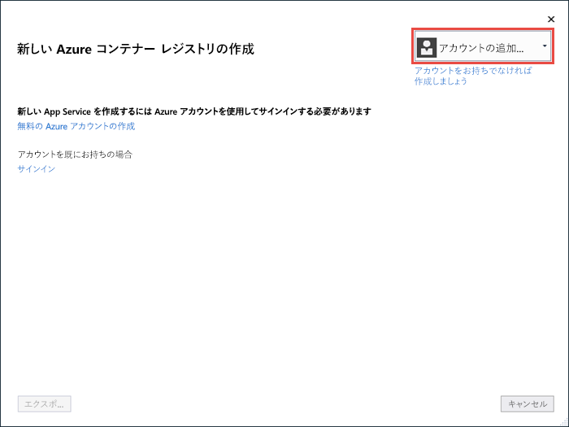
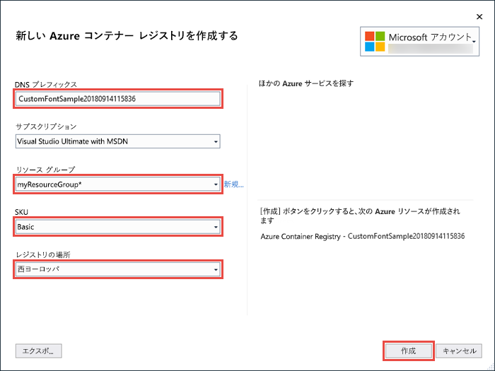
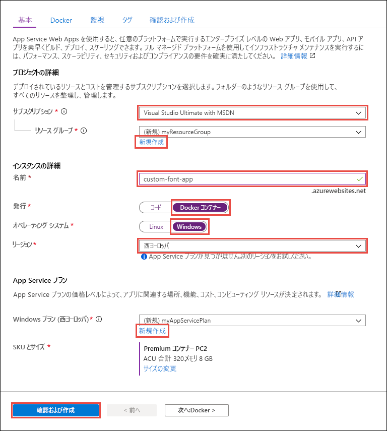

# <a name="migrate-an-aspnet-app-to-azure-app-service-using-a-windows-container-preview"></a>Windows コンテナー (プレビュー) を使用して Azure App Service に ASP.NET アプリを移行する

[Azure App Service](overview.md) は、IIS 上で稼働する ASP.NET や IIS 上で稼働する Node.js など、Windows 上の定義済みのアプリケーション スタックを提供します。 Windows 環境があらかじめ構成されていることで、オペレーティング システムは、管理アクセスやソフトウェアのインストール、グローバル アセンブリ キャッシュへの変更などができないようにロックされます (「[Azure App Service におけるオペレーティング システムの機能](operating-system-functionality.md)」を参照)。 ただし、App Service でカスタム Windows コンテナーを使用するとアプリで必要な OS の変更を行うことができるので、カスタム OS とソフトウェアの構成が必要なオンプレミスのアプリを簡単に移行できます。 このチュートリアルでは、Windows フォント ライブラリにインストールされているカスタム フォントを使用する ASP.NET アプリを App Service に移行する方法を示します。 Visual Studio からカスタム構成の Windows イメージを [Azure Container Registry](https://docs.microsoft.com/azure/container-registry/) に展開した後、App Service でそれを実行します。


## <a name="prerequisites"></a>前提条件

このチュートリアルを完了するには、以下が必要です。

- <a href="https://hub.docker.com/" target="_blank">Docker Hub アカウントにサインアップする</a>
- <a href="https://docs.docker.com/docker-for-windows/install/" target="_blank">Docker for Windows をインストールする</a>。
- <a href="https://docs.microsoft.com/virtualization/windowscontainers/quick-start/quick-start-windows-10" target="_blank">Windows コンテナーを実行するように Docker を切り替える</a>。
- **ASP.NET と Web 開発**ワークロードと **Azure の開発**ワークロードを含めて <a href="https://www.visualstudio.com/downloads/" target="_blank">Visual Studio 2019 をインストールする</a>。 Visual Studio 2019 を既にインストールしている場合:
    - **[ヘルプ]**  >  **[更新プログラムの確認]** の順にクリックし、Visual Studio に最新の更新プログラムをインストールします。
    - **[ツール]**  >  **[ツールと機能を取得]** の順にクリックし、Visual Studio にワークロードを追加します。

## <a name="set-up-the-app-locally"></a>アプリをローカルでセットアップする

### <a name="download-the-sample"></a>サンプルのダウンロード

この手順では、ローカルな .NET プロジェクトを設定します。

- [サンプル プロジェクトをダウンロードします](https://github.com/Azure-Samples/custom-font-win-container/archive/master.zip)。
- *custom-font-win-container.zip* ファイルを抽出 (解凍) します。

サンプル プロジェクトには、Windows フォント ライブラリにインストールされているカスタム フォントを使用する簡単な ASP.NET アプリケーションが含まれています。 フォントをインストールする必要はありませんが、基になる OS と統合されているアプリの一例です。 このようなアプリを App Service に移行するには、統合を削除するようにコードを再設計するか、またはカスタム Windows コンテナーにそのまま移行します。

### <a name="install-the-font"></a>フォントをインストールする

エクスプローラーで _custom-font-win-container-master/CustomFontSample_ に移動し、_FrederickatheGreat-Regular.ttf_ を右クリックして、 **[インストール]** を選択します。

このフォントは、[Google Fonts](https://fonts.google.com/specimen/Fredericka+the+Great) で一般公開されています。

### <a name="run-the-app"></a>アプリを実行する

*custom-font-win-container/CustomFontSample.sln* ファイルを Visual Studio で開きます。 

デバッグせずにアプリを実行するには、`Ctrl+F5` キーを押します。 アプリが既定のブラウザーに表示されます。 

![[新しい ASP.NET プロジェクト] ダイアログ ボックス](media/app-service-web-tutorial-windows-containers-custom-fonts/local-app-in-browser.png)

アプリはインストールされているフォントを使用するため、App Service サンド ボックスでは実行できません。 ただし、Windows コンテナーにフォントをインストールできるので、代わりに Windows コンテナーを使用して展開することができます。

### <a name="configure-windows-container"></a>Windows コンテナーを構成する

ソリューション エクスプローラーで **CustomFontSample** を右クリックし、 **[追加]**  >  **[Container Orchestration Support]\(コンテナー オーケストレーションのサポート\)** を選択します。

![[新しい ASP.NET プロジェクト] ダイアログ ボックス](media/app-service-web-tutorial-windows-containers-custom-fonts/enable-container-orchestration.png)

**[Docker Compose]**  >  **[OK]** を選択します。

プロジェクトが Windows コンテナーで実行するように設定されます。 _Dockerfile_ が **CustomFontSample** プロジェクトに追加され、**docker-compose** プロジェクトがソリューションに追加されます。 

ソリューション エクスプローラーで **Dockerfile** を開きます。

[サポートされている親イメージ](app-service-web-get-started-windows-container.md#use-a-different-parent-image)を使用する必要があります。 `FROM` 行を次のコードに置き換えることで、親イメージを変更します。

```Dockerfile
FROM mcr.microsoft.com/dotnet/framework/aspnet:4.7.2-windowsservercore-ltsc2019
```

ファイルの末尾に次の行を追加し、ファイルを保存します。

```Dockerfile
RUN ${source:-obj/Docker/publish/InstallFont.ps1}
```

**CustomFontSample** プロジェクトには _InstallFont.ps1_ があります。 これはフォントをインストールする簡単なスクリプトです。 さらに複雑なバージョンのスクリプトが[スクリプト センター](https://gallery.technet.microsoft.com/scriptcenter/fb742f92-e594-4d0c-8b79-27564c575133)にあります。

> [!NOTE]
> Windows コンテナーをローカルでテストするには、ローカル コンピューターで Docker が起動していることを確認します。
>

## <a name="publish-to-azure-container-registry"></a>Azure Container Registry に発行する

[Azure Container Registry](https://docs.microsoft.com/azure/container-registry/) では、コンテナーの展開用にイメージを格納することができます。 Azure Container Registry でホストされているイメージを使用するように App Service を構成できます。

### <a name="open-publish-wizard"></a>発行ウィザードを開く

ソリューション エクスプローラーで **CustomFontSample** プロジェクトを右クリックし、 **[発行]** を選択します。

![[新しい ASP.NET プロジェクト] ダイアログ ボックス](media/app-service-web-tutorial-windows-containers-custom-fonts/open-publish-wizard.png)

### <a name="create-registry-and-publish"></a>レジストリを作成して発行する

発行ウィザードで **[コンテナー レジストリ]**  >  **[新しい Azure コンテナー レジストリを作成する]**  >  **[発行]** を選択します。

![[新しい ASP.NET プロジェクト] ダイアログ ボックス](media/app-service-web-tutorial-windows-containers-custom-fonts/create-registry.png)

### <a name="sign-in-with-azure-account"></a>Azure アカウントでサインインする

**[新しい Azure コンテナー レジストリを作成する]** ダイアログ ボックスで、 **[アカウントの追加]** をクリックし、Azure サブスクリプションにサインインします。 既にサインインしている場合は、目的のサブスクリプションを含んだアカウントをドロップダウンから選択します。



### <a name="configure-the-registry"></a>レジストリを構成する

次の表の推奨値に基づいて新しいコンテナー レジストリを構成します。 完了したら、 **[作成]** をクリックします。

| 設定  | 推奨値 | 詳細情報 |
| ----------------- | ------------ | ----|
|**DNS プレフィックス**| 生成されたレジストリ名をそのまま使用するか、または別の一意名に変更します。 |  |
|**リソース グループ**| **[新規]** をクリックし、「**myResourceGroup**」と入力して、 **[OK]** をクリックします。 |  |
|**SKU**| Basic | [価格レベル](https://azure.microsoft.com/pricing/details/container-registry/)|
|**レジストリの場所**| 西ヨーロッパ | |



ターミナル ウィンドウが開き、イメージの展開の進行状況が表示されます。 デプロイが完了するまで待ちます。

## <a name="sign-in-to-azure"></a>Azure へのサインイン

Azure Portal ( https://portal.azure.com ) にサインインします。

## <a name="create-a-web-app"></a>Web アプリを作成する

左側のメニューから **[リソースの作成]**  >  **[Web]**  >  **[Web App for Containers]** を選択します。

### <a name="configure-app-basics"></a>アプリの基本情報を構成する

**基本** タブで、次の表に従って設定を構成し、**Next: Docker\(次へ: Docker** をクリックします。

| 設定  | 推奨値 | 詳細情報 |
| ----------------- | ------------ | ----|
|**サブスクリプション**| 正しいサブスクリプションが選択されていることを確認します。 |  |
|**リソース グループ**| **[新規作成]** を選択し、「**myResourceGroup**」と入力して、 **[OK]** をクリックします。 |  |
|**名前**| 一意の名前を入力します。 | Web アプリの URL は `http://<app-name>.azurewebsites.net` です。`<app-name>` には自分のアプリの名前を指定します。 |
|**発行**| Docker コンテナー | |
|**オペレーティング システム**| Windows | |
|**リージョン**| 西ヨーロッパ | |
|**Windows プラン**| **[新規作成]** を選択し、「**myAppServicePlan**」と入力して、 **[OK]** をクリックします。 | |

**[基本]** タブは、次のように表示されます。



### <a name="configure-windows-container"></a>Windows コンテナーを構成する

**[Docker]** タブで、次の表に示したようにカスタム Windows コンテナーを構成し、 **[確認および作成]** を選択します。

| 設定  | 推奨値 |
| ----------------- | ------------ |
|**イメージのソース**| Azure Container Register |
|**レジストリ**| [以前に作成したレジストリ](#publish-to-azure-container-registry)を選択します。 |
|**Image**| customfontsample |
|**Tag**| latest |

### <a name="complete-app-creation"></a>アプリの作成を完了する

**[作成]** をクリックして、必要なリソースが Azure によって作成されるのを待ちます。

## <a name="browse-to-the-web-app"></a>Web アプリを参照する

Azure の処理が完了すると、通知ボックスが表示されます。


1. **[リソースに移動]** をクリックします。

2. アプリ ページで、 **[URL]** の下にあるリンクをクリックします。

新しいブラウザー ページが開いて次のページが表示されます。


期待した美しいフォントでホーム ページが表示されるまで、数分待ってからもう一度試します。


**お疲れさまでした。** Windows コンテナーで Azure App Service に ASP.NET アプリケーションを移行しました。

## <a name="see-container-start-up-logs"></a>コンテナーの起動ログの表示

Windows コンテナーが読み込まれるまでにしばらく時間がかかる場合があります。 進行状況を確認するには、 *\<app_name>* をアプリの名前に置き換えて次の URL に移動します。
```
https://<app-name>.scm.azurewebsites.net/api/logstream
```

次のようなログがストリーム配信されます。

```
14/09/2018 23:16:19.889 INFO - Site: fonts-win-container - Creating container for image: customfontsample20180914115836.azurecr.io/customfontsample:latest.
14/09/2018 23:16:19.928 INFO - Site: fonts-win-container - Create container for image: customfontsample20180914115836.azurecr.io/customfontsample:latest succeeded. Container Id 329ecfedbe370f1d99857da7352a7633366b878607994ff1334461e44e6f5418
14/09/2018 23:17:23.405 INFO - Site: fonts-win-container - Start container succeeded. Container: 329ecfedbe370f1d99857da7352a7633366b878607994ff1334461e44e6f5418
14/09/2018 23:17:28.637 INFO - Site: fonts-win-container - Container ready
14/09/2018 23:17:28.637 INFO - Site: fonts-win-container - Configuring container
14/09/2018 23:18:03.823 INFO - Site: fonts-win-container - Container ready
14/09/2018 23:18:03.823 INFO - Site: fonts-win-container - Container start-up and configuration completed successfully
```

