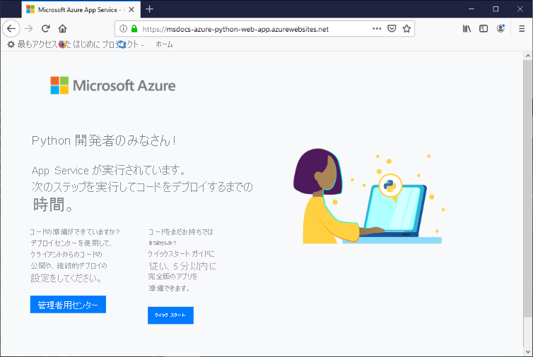

# <a name="configure-a-linux-python-app-for-azure-app-service"></a>Azure App Service 向けの Linux Python アプリを構成する

この記事では、[Azure App Service](overview.md) で Python アプリが実行される方法、既存のアプリを Azure に移行する方法、および必要に応じて App Service の動作をカスタマイズする方法について説明します。 Python アプリは、必要なすべての [pip](https://pypi.org/project/pip/) モジュールと共にデプロイする必要があります。

App Service デプロイ エンジンでは、[Git リポジトリ](deploy-local-git.md) (または [ZIP パッケージ](deploy-zip.md)) のデプロイ時に自動的に仮想環境をアクティブ化し、`pip install -r requirements.txt` を実行します。

このガイドでは、App Service の組み込み Linux コンテナーを使用する Python 開発者のために、主要な概念と手順を示します。 Azure App Service を使用したことがない場合は、まず [Python クイックスタート](quickstart-python.md)と [PostgreSQL を使った Python のチュートリアル](tutorial-python-postgresql-app.md)に従ってください。

構成には [Azure portal](https://portal.azure.com) と Azure CLI のいずれかを使用できます。

- **Azure portal**: 「[Azure portal で App Service アプリを構成する](configure-common.md)」で説明されているとおり、アプリの **[設定]**  >  **[構成]** ページを使用します。

- **Azure CLI**: 2 つのオプションがあります。

    - [Azure Cloud Shell](../cloud-shell/overview.md) でコマンドを実行します。
    - 最新バージョンの [Azure CLI](/cli/azure/install-azure-cli) をインストールしてコマンドをローカルで実行してから、[az login](/cli/azure/reference-index#az-login) を使用して Azure にサインインします。
    
> [!NOTE]
> Linux は現在、App Service で Python アプリを実行するための推奨されるオプションです。 Windows オプションについては、[Windows フレーバーの App Service での Python](/visualstudio/python/managing-python-on-azure-app-service) に関するページを参照してください。

## <a name="configure-python-version"></a>Python バージョンの構成

- **Azure portal**: Linux コンテナー向けに「[全般設定を構成する](configure-common.md#configure-general-settings)」で説明されているとおり、 **[構成]** ページで **[全般設定]** を使用します。

- **Azure CLI**:

    -  [az webapp config show](/cli/azure/webapp/config#az_webapp_config_show) を使用して現在の Python バージョンを表示します。
    
        ```azurecli
        az webapp config show --resource-group <resource-group-name> --name <app-name> --query linuxFxVersion
        ```
        
        `<resource-group-name>` と `<app-name>` は、Web アプリに適した名前に置き換えます。
    
    - [az webapp config set](/cli/azure/webapp/config#az_webapp_config_set) を使用して Python バージョンを設定します
        
        ```azurecli
        az webapp config set --resource-group <resource-group-name> --name <app-name> --linux-fx-version "PYTHON|3.7"
        ```
    
    - [az webapp list-runtimes](/cli/azure/webapp#az_webapp_list_runtimes) を使用して、Azure App Service でサポートされている Python バージョンをすべて表示します。
    
        ```azurecli
        az webapp list-runtimes --linux | grep PYTHON
        ```
    
サポートされない Python バージョンを実行するには、代わりに独自のコンテナー イメージを作成します。 詳細については、[カスタム Docker イメージの使用](tutorial-custom-container.md?pivots=container-linux)に関するページを参照してください。

<!-- <a> element here to preserve external links-->
<a name="access-environment-variables"></a>

## <a name="customize-build-automation"></a>ビルドの自動化のカスタマイズ

Oryx と呼ばれる App Service のビルド システムでは、Git または ZIP パッケージを使用してアプリをデプロイする際に、次のステップを実行します。

1. `PRE_BUILD_COMMAND` 設定を指定した場合は、カスタムのビルド前スクリプトを実行します。 このスクリプトはそれ自体で、他の Python スクリプトや Node.js スクリプト、pip コマンド、npm コマンド、さらに、yarn など Node ベースのツール (例: `yarn install`、`yarn build`) を実行できます。

1. `pip install -r requirements.txt` を実行します。 *requirements.txt* ファイルがプロジェクトのルート フォルダーに存在していなければなりません。 そうでないと、ビルド プロセスでエラーがレポートされます: "Could not find setup.py or requirements.txt; Not running pip install." (setup.py または requirements.txt が見つかりませんでした; pip install が実行されていません。)

1. (Django アプリを示す) リポジトリのルートに *manage.py* がある場合は、*manage.py collectstatic* を実行します。 ただし、`DISABLE_COLLECTSTATIC` 設定が `true` の場合、この設定はスキップされます。

1. `POST_BUILD_COMMAND` 設定を指定した場合は、カスタムのビルド後スクリプトを実行します。 (前述のように、このスクリプトは、他の Python スクリプトや Node.js スクリプト、pip コマンド、npm コマンド、さらに、Node ベースのツールを実行できます。)

既定では、`PRE_BUILD_COMMAND`、`POST_BUILD_COMMAND`、`DISABLE_COLLECTSTATIC` の設定は空です。 

- Django アプリをビルドするときに collectstatic の実行を無効にするには、`DISABLE_COLLECTSTATIC` 設定を true にします。

- ビルド前コマンドを実行するには、コマンド (`echo Pre-build command` など)、または自分のプロジェクトのルートからスクリプト ファイルへの相対パス (`scripts/prebuild.sh`) が含まれるように `PRE_BUILD_COMMAND` の設定を行います。 どのコマンドでも、プロジェクトのルート フォルダーへの相対パスを使用する必要があります。

- ビルド後コマンドを実行するには、コマンド (`echo Post-build command` など)、または自分のプロジェクトのルートからスクリプト ファイルへの相対パス (`scripts/postbuild.sh`) が含まれるように `POST_BUILD_COMMAND` の設定を行います。 どのコマンドでも、プロジェクトのルート フォルダーへの相対パスを使用する必要があります。

ビルドの自動化をカスタマイズする設定の詳細については、「[Oryx 構成](https://github.com/microsoft/Oryx/blob/master/doc/configuration.md)」を参照してください。 

ビルドとデプロイのログにアクセスするには、「[デプロイ ログにアクセスする](#access-deployment-logs)」を参照してください。

App Service で Linux の Python アプリを実行、ビルドする方法の詳細については、[Oryx による Python アプリの検出とビルド](https://github.com/microsoft/Oryx/blob/master/doc/runtimes/python.md)に関するページを参照してください。

> [!NOTE]
> `PRE_BUILD_SCRIPT_PATH` および `POST_BUILD_SCRIPT_PATH` の設定は `PRE_BUILD_COMMAND` および `POST_BUILD_COMMAND` と同一で、従来の目的でサポートされています。
> 
> `SCM_DO_BUILD_DURING_DEPLOYMENT` という名前の設定に `true` または 1 が含まれている場合、デプロイ中に Oryx によってビルドが行われます。 この設定は、Git、Azure CLI コマンド `az webapp up`、Visual Studio Code を使用してデプロイする場合に true になります。

> [!NOTE]
> すべてのビルド前後のスクリプトで常に相対パスを使用してください。Oryx が動作するビルド コンテナーは、アプリが動作するランタイム コンテナーとは異なるためです。 コンテナー内のアプリ プロジェクト フォルダーの正確な配置場所 (たとえば、*site/wwwroot* といった配置場所) は指定しないようにします。

## <a name="migrate-existing-applications-to-azure"></a>既存のアプリケーションを Azure に移行する

既存の Web アプリケーションは、次のように Azure に再デプロイできます。

1. **ソース リポジトリ**: ソース コードを GitHub などの適切なリポジトリに保持します。これにより、このプロセスの後半で継続的なデプロイを設定することができます。
    1. App Service が必要なパッケージを自動的にインストールできるようにするには、*requirements.txt* ファイルがリポジトリのルートにある必要があります。    

1. **データベース**:アプリがデータベースに依存している場合は、Azure 上に必要なリソースをプロビジョニングします。 「[チュートリアル:PostgreSQL を使用して Django Web アプリをデプロイする方法のチュートリアルの、データベースの作成に関するセクション](tutorial-python-postgresql-app.md#3-create-postgres-database-in-azure)の例を参照してください。

1. **App Service リソース**: 対象のアプリケーションをホストするためのリソース グループ、App Service プラン、および App Service Web アプリを作成します。 これは、Azure CLI コマンド `az webapp up` を使用してコードの初期デプロイを実行することで最も簡単に行うことができます。[PostgreSQL を使用して Django Web アプリをデプロイする方法のチュートリアルの、コードのデプロイに関するセクション](tutorial-python-postgresql-app.md#4-deploy-the-code-to-azure-app-service)を参照してください。 リソース グループ、App Service プラン、および Web アプリの名前を、対象のアプリケーションにより適した名前に置き換えます。

1. **環境変数**:対象のアプリケーションが環境変数を必要とする場合は、同等の [App Service アプリケーション設定](configure-common.md#configure-app-settings)を作成します。 これらの App Service 設定は、[環境変数へのアクセス](#access-app-settings-as-environment-variables)に関するセクションで説明されているように、環境変数としてコードに示されます。
    - たとえば、データベース接続は、多くの場合、このような設定によって管理されます。[PostgreSQL を使用して Django Web アプリをデプロイする方法のチュートリアルの、データベースに接続するための変数の構成に関するセクション](tutorial-python-postgresql-app.md#42-configure-environment-variables-to-connect-the-database)を参照してください。
    - 一般的な Django アプリの特定の設定については、「[Django アプリの運用設定](#production-settings-for-django-apps)」を参照してください。

1. **アプリの起動**: この記事の後半の「[コンテナーのスタートアップ プロセス](#container-startup-process)」セクションを参照して、App Service がアプリを実行する方法を理解します。 App Service では、既定で Gunicorn Web サーバーを使用します。このサーバーは、対象のアプリ オブジェクトまたは *wsgi.py* フォルダーを見つけることができる必要があります。 必要に応じて、[スタートアップ コマンドをカスタマイズ](#customize-startup-command)することができます。

1. **継続的なデプロイ**:「[Azure App Service への継続的デプロイ](deploy-continuous-deployment.md)」(Azure Pipelines または Kudu デプロイを使用している場合) または「[GitHub Actions を使用した App Service へのデプロイ](deploy-github-actions.md)」(GitHub アクションを使用している場合) の説明に従って、継続的デプロイを設定します。

1. **カスタム アクション**: 対象のアプリをホストする App Service コンテナー内で Django データベースの移行などのアクションを実行するには、[SSH 経由でコンテナーに接続](configure-linux-open-ssh-session.md)します。 Django データベースの移行を実行する例については、[PostgreSQL を使用して Django Web アプリをデプロイする方法のチュートリアルの、データベースの移行の実行に関するセクション](tutorial-python-postgresql-app.md#43-run-django-database-migrations)を参照してください。
    - 継続的デプロイを使用している場合は、前の「[ビルドの自動化のカスタマイズ](#customize-build-automation)」で説明したように、ビルド後コマンドを使用してこれらのアクションを実行できます。

これらの手順を完了すると、変更をソース リポジトリにコミットし、それらの更新を App Service に自動的にデプロイできるようになります。

### <a name="production-settings-for-django-apps"></a>Django アプリの運用設定

Azure App Service などの運用環境の場合、Django アプリは Django の[デプロイ チェックリスト](https://docs.djangoproject.com/en/3.1/howto/deployment/checklist/) (djangoproject.com) に準拠する必要があります。

次の表では、Azure に関連する運用設定について説明しています。 これらの設定は、アプリの *setting.py* ファイルで定義されます。

| Django 設定 | Azure での手順 |
| --- | --- |
| `SECRET_KEY` | 「[環境変数としてのアプリ設定へのアクセス](#access-app-settings-as-environment-variables)」の説明のとおりに、App Service 設定の値を格納します。 また、[この値は "シークレット" として Azure Key Vault に格納](../key-vault/secrets/quick-create-python.md)することもできます。 |
| `DEBUG` | 値を 0 (false) にして App Service で `DEBUG` 設定を作成してから、その値を環境変数として読み込みます。 実際の開発環境では、値を 1 (true) にして `DEBUG` 環境変数を作成してください。 |
| `ALLOWED_HOSTS` | 運用環境の Django では、*settings.py* の `ALLOWED_HOSTS` 配列にアプリの URL が含まれている必要があります。 この URL は、`os.environ['WEBSITE_HOSTNAME']` というコードを使用して実行時に取得できます。 App Service によって、`WEBSITE_HOSTNAME` 環境変数がアプリの URL に自動的に設定されます。 |
| `DATABASES` | データベースに接続するための App Service の設定を定義し、それらを環境変数として読み込んで [`DATABASES`](https://docs.djangoproject.com/en/3.1/ref/settings/#std:setting-DATABASES) ディクショナリを設定します。 または、値 (特にユーザー名とパスワード) を [Azure Key Vault シークレット](../key-vault/secrets/quick-create-python.md)として格納することもできます。 |

## <a name="serve-static-files-for-django-apps"></a>Django アプリの静的ファイルを応答として返す

Django Web アプリに静的なフロントエンド ファイルが含まれる場合はまず、Django ドキュメントの「[静的ファイルの管理](https://docs.djangoproject.com/en/3.1/howto/static-files/)」に記載の手順に従います。

次に、App Service に対して次の変更を行います。

1. 環境変数 (ローカル開発の場合) およびアプリ設定 (クラウドにデプロイする場合) を使用して、Django の `STATIC_URL` 変数と `STATIC_ROOT` 変数を動的に設定することを検討してください。 次に例を示します。    

    ```python
    STATIC_URL = os.environ.get("DJANGO_STATIC_URL", "/static/")
    STATIC_ROOT = os.environ.get("DJANGO_STATIC_ROOT", "./static/")    
    ```

    ローカル環境とクラウド環境の `DJANGO_STATIC_URL` と `DJANGO_STATIC_ROOT` は、必要に応じて変更できます。 たとえば静的ファイルのビルド プロセスで、それらを `django-static` という名前のフォルダーに配置した場合、`DJANGO_STATIC_URL` を `/django-static/` に設定することで既定値の使用を避けることができます。

1. ビルド前のスクリプトで、静的ファイルが別のフォルダーに生成されるようになっている場合は、Django の `collectstatic` プロセスで検出されるように、そのフォルダーを Django の `STATICFILES_DIRS` 変数に追加してください。 たとえば、フロントエンド フォルダーで `yarn build` を実行し、静的ファイルを含んだ `build/static` フォルダーが yarn によって生成される場合、次のようにしてそのフォルダーを追加します。

    ```python
    FRONTEND_DIR = "path-to-frontend-folder" 
    STATICFILES_DIRS = [os.path.join(FRONTEND_DIR, 'build', 'static')]    
    ```

    ここでは、yarn などのビルド ツールが実行される場所のパスを構築して `FRONTEND_DIR` に代入しています。 ここでも、必要に応じて環境変数とアプリ設定を使用できます。

1. *requirements.txt* ファイルに `whitenoise` を追加します。 [Whitenoise](http://whitenoise.evans.io/en/stable/) (whitenoise.evans.io) は、運用環境の Django アプリから応答として静的ファイルを返すための作業を省力化する Python パッケージです。 具体的に言うと、Django の `STATIC_ROOT` 変数で指定されたフォルダーに見つかったファイルを Whitenoise が応答として返します。

1. Whitenoise に関する次の行を *settings.py* ファイルに追加します。

    ```python
    STATICFILES_STORAGE = ('whitenoise.storage.CompressedManifestStaticFilesStorage')
    ```

1. さらに、`MIDDLEWARE` リストと `INSTALLED_APPS` リストに Whitenoise を追加します。

    ```python
    MIDDLEWARE = [
        "whitenoise.middleware.WhiteNoiseMiddleware",
        # Other values follow
    ]

    INSTALLED_APPS = [
        "whitenoise.runserver_nostatic",
        # Other values follow
    ]
    ```

## <a name="container-characteristics"></a>コンテナーの特性

Python アプリは App Service にデプロイされると、[App Service Python GitHub リポジトリ](https://github.com/Azure-App-Service/python)で定義された Linux Docker コンテナー内で動作します。 イメージの構成は、バージョン固有のディレクトリ内で見つけることができます。

このコンテナーには次の特性があります。

- アプリは、[Gunicorn WSGI HTTP サーバー](https://gunicorn.org/)を使用して実行されます。このとき、追加の引数 `--bind=0.0.0.0 --timeout 600` が使用されます。
    - [Gunicorn の構成の概要](https://docs.gunicorn.org/en/stable/configure.html#configuration-file)に関するページ (docs.gunicorn.org) で説明されているとおり、プロジェクトのルートにある *gunicorn.conf.py* ファイルを使用して Gunicorn の構成設定を指定できます。 また、[スタートアップ コマンドをカスタマイズ](#customize-startup-command)することもできます。

    - 「[Gunicorn のデプロイ](https://docs.gunicorn.org/en/latest/deploy.html)」(docs.gunicorn.org) で説明されているとおり、偶発的または意図的な DDoS 攻撃から Web アプリを防御するために、Gunicorn は Nginx リバース プロキシの背後で実行されます。

- 既定では、基本のコンテナー イメージには Flask Web フレームワークのみが含まれています。ただし、コンテナーは、WSGI に準拠していて Python 3.6 以上と互換性のある他のフレームワーク (Django など) をサポートしています。

- Django など、追加のパッケージをインストールするには、直接的な依存関係を指定したプロジェクトのルートに [*requirements.txt*](https://pip.pypa.io/en/stable/user_guide/#requirements-files) ファイルを作成します。 そうすることで、App Service によって、それらの依存関係がプロジェクトのデプロイ時に自動的にインストールされます。

    依存関係がインストールされるには、*requirements.txt* ファイルがプロジェクトのルートに "*なければなりません*"。 そうでないと、ビルド プロセスでエラーがレポートされます: "Could not find setup.py or requirements.txt; Not running pip install." (setup.py または requirements.txt が見つかりませんでした; pip install が実行されていません。) このエラーが発生した場合は、自分の requirements ファイルの場所を確認してください。

- App Service では、Web アプリの URL (`msdocs-hello-world.azurewebsites.net` など) を使用して、`WEBSITE_HOSTNAME` という名前の環境変数が自動的に定義されます。 また、アプリの名前 (`msdocs-hello-world` など) を使用して `WEBSITE_SITE_NAME` も定義されます。 
   
- Node ベースのビルド ツール (yarn など) を実行できるよう、コンテナーには npm と Node.js がインストールされます。

## <a name="container-startup-process"></a>コンテナーのスタートアップ プロセス

App Service on Linux コンテナーでは、起動中に次の手順が実行されます。

1. [カスタム スタートアップ コマンド](#customize-startup-command)が提供されている場合は、これを使用します。
2. [Django アプリ](#django-app)の存在を確認し、検出された場合はそれための Gunicorn を起動します。
3. [Flask アプリ](#flask-app)の存在を確認し、検出された場合はそれための Gunicorn を起動します。
4. 他のアプリが見つからない場合は、コンテナーに組み込まれている既定のアプリを起動します。

次のセクションでは、各オプションについてさらに詳しく説明します。

### <a name="django-app"></a>Django アプリ

Django アプリの場合、App Service によってお客様のアプリ コード内で `wsgi.py` という名前のファイルが検索され、次のコマンドを使用して Gunicorn が実行されます。

```bash
# <module> is the name of the folder that contains wsgi.py
gunicorn --bind=0.0.0.0 --timeout 600 <module>.wsgi
```

スタートアップ コマンドをより細かくコントロールしたい場合、[カスタム スタートアップ コマンド](#customize-startup-command)を使用し、`<module>` を *wsgi.py* が含まれているフォルダーの名前に置き換えます。そのモジュールがプロジェクトのルートにない場合は `--chdir` 引数を追加してください。 たとえば、自分のプロジェクトのルートを基準として *knboard/backend/config* に *wsgi.py* が配置されている場合は、引数 `--chdir knboard/backend config.wsgi` を使用します。

運用ログを有効にするには、[カスタム スタートアップ コマンド](#customize-startup-command)の例で示しているとおり、`--access-logfile` および `--error-logfile` パラメーターを追加します。

### <a name="flask-app"></a>Flask アプリ

Flask の場合、App Service によって *application.py* または *app.py* という名前のファイルが検索され、Gunicorn が次のように起動されます。

```bash
# If application.py
gunicorn --bind=0.0.0.0 --timeout 600 application:app

# If app.py
gunicorn --bind=0.0.0.0 --timeout 600 app:app
```

お客様のメイン アプリ モジュールが別のファイルに含まれている場合は、アプリ オブジェクトに別の名前を使用します。また、Gunicorn に追加の引数を指定したい場合は、[カスタム スタートアップ コマンド](#customize-startup-command)を使用します。

### <a name="default-behavior"></a>既定の動作

カスタム コマンド、Django アプリ、または Flask アプリが App Service によって検出されない場合は、_opt/defaultsite_ フォルダーにある既定の読み取り専用アプリ (以下の画像を参照) が実行されます。

コードをデプロイしても既定のアプリが表示される場合は、[「トラブルシューティング」の「アプリが表示されない」](#app-doesnt-appear)を参照してください。

[](#app-doesnt-appear)

繰り返しになりますが、既定のアプリではなく、デプロイしたアプリを表示する必要がある場合は、[「トラブルシューティング」の「アプリが表示されない」](#app-doesnt-appear)を参照してください。

## <a name="customize-startup-command"></a>スタートアップ コマンドのカスタマイズ

この記事で前に述べたように、[Gunicorn の構成の概要](https://docs.gunicorn.org/en/stable/configure.html#configuration-file)に関するページで説明されているとおり、プロジェクトのルートにある *gunicorn.conf.py* ファイルを使用して Gunicorn の構成設定を指定できます。

このような構成では十分でない場合は、スタートアップ コマンド ファイルでカスタム スタートアップ コマンドまたは複数のコマンドを指定して、コンテナーのスタートアップ動作をコントロールできます。 スタートアップ コマンド ファイルでは、*startup.sh*、*startup.cmd*、*startup.txt* など、任意の名前を使用することができます。

どのコマンドでも、プロジェクトのルート フォルダーへの相対パスを使用する必要があります。

スタートアップ コマンドまたはコマンド ファイルを指定するには:

- **Azure portal**: アプリの **[構成]** ページを選択してから、 **[全般設定]** を選択します。 **[スタートアップ コマンド]** フィールドで、自分のスタートアップ コマンドの完全なテキスト、または自分のスタートアップ コマンド ファイルの名前を入力します。 次に、 **[保存]** を選択して変更を適用します。 Linux コンテナー用に「[全般設定を構成する](configure-common.md#configure-general-settings)」を参照してください。

- **Azure CLI**: `--startup-file` パラメーターをスタートアップ コマンドまたはファイルに設定して、[az webapp config set](/cli/azure/webapp/config#az_webapp_config_set) コマンドを使用します。

    ```azurecli
    az webapp config set --resource-group <resource-group-name> --name <app-name> --startup-file "<custom-command>"
    ```
        
    `<custom-command>` は、自分のスタートアップ コマンドの完全なテキスト、または自分のスタートアップ コマンド ファイルの名前に置き換えます。
        
App Service では、カスタム スタートアップ コマンドまたはファイルの処理中に発生したエラーが無視されて、Django および Flask アプリが検索されることでスタートアップ プロセスが続行されます。 想定どおりの動作にならない場合は、自分のスタートアップ コマンドまたはファイルに問題がないこと、スタートアップ コマンド ファイルがアプリのコードと共に App Service にデプロイされていることを確認してください。 [診断ログ](#access-diagnostic-logs)で詳細な情報を確認することもできます。 また、[Azure portal](https://portal.azure.com) でアプリの **[問題の診断と解決]** ページも確認してください。

### <a name="example-startup-commands"></a>スタートアップ コマンドの例

- **Gunicorn 引数の追加**: 次の例では、Django アプリを起動するための Gunicorn コマンド ラインに `--workers=4` を追加します。 

    ```bash
    # <module-path> is the relative path to the folder that contains the module
    # that contains wsgi.py; <module> is the name of the folder containing wsgi.py.
    gunicorn --bind=0.0.0.0 --timeout 600 --workers=4 --chdir <module_path> <module>.wsgi
    ```    

    詳細については、「[Running Gunicorn (Gunicorn の実行)」](https://docs.gunicorn.org/en/stable/run.html) (docs.gunicorn.org) を参照してください。

- **Django での運用ログの有効化**: `--access-logfile '-'` および `--error-logfile '-'` 引数をコマンド ラインに追加します。

    ```bash    
    # '-' for the log files means stdout for --access-logfile and stderr for --error-logfile.
    gunicorn --bind=0.0.0.0 --timeout 600 --workers=4 --chdir <module_path> <module>.wsgi --access-logfile '-' --error-logfile '-'
    ```    

    これらのログは [App Service ログ ストリーム](#access-diagnostic-logs)に表示されます。

    詳細については、[Gunicorn のログ](https://docs.gunicorn.org/en/stable/settings.html#logging)に関するページ (docs.gunicorn.org) を参照してください。
    
- **カスタムの Flask メイン モジュール**: 既定では、Flask アプリのメイン モジュールは *application.py* か *app.py* であると App Service によって想定されています。 メイン モジュールに別の名前を使用する場合は、スタートアップ コマンドをカスタマイズする必要があります。 たとえば、メイン モジュールが *hello.py* で、そのファイルにおける Flask アプリ オブジェクトの名前が `myapp` である Flask アプリがある場合、コマンドは次のようになります。

    ```bash
    gunicorn --bind=0.0.0.0 --timeout 600 hello:myapp
    ```
    
    メイン モジュールがサブフォルダー (`website` など) に存在する場合、そのフォルダーを `--chdir` 引数で指定します。
    
    ```bash
    gunicorn --bind=0.0.0.0 --timeout 600 --chdir website hello:myapp
    ```
    
- **Gunicorn 以外のサーバーの使用**: 別の Web サーバー ([aiohttp](https://aiohttp.readthedocs.io/en/stable/web_quickstart.html) など) を使用する場合は、スタートアップ コマンドとして、またはスタートアップ コマンド ファイルで、適切なコマンドを使用します。

    ```bash
    python3.7 -m aiohttp.web -H localhost -P 8080 package.module:init_func
    ```

## <a name="access-app-settings-as-environment-variables"></a>環境変数としてのアプリ設定へのアクセス

「[アプリケーションの設定の構成](configure-common.md#configure-app-settings)」で説明されているとおり、アプリの設定は、お客様のアプリのためにクラウドに格納された値です。 これらの設定は、環境変数として自分のアプリのコードで利用できます。アクセスには標準の [os.environ](https://docs.python.org/3/library/os.html#os.environ) パターンを使用します。

たとえば、`DATABASE_SERVER` というアプリ設定を作成したら、その設定の値は次のコードで取得します。

```python
db_server = os.environ['DATABASE_SERVER']
```

## <a name="detect-https-session"></a>HTTPS セッションの検出

App Service では、[SSL 終了](https://wikipedia.org/wiki/TLS_termination_proxy) (wikipedia.org) がネットワーク ロード バランサーで発生するため、すべての HTTPS リクエストは暗号化されていない HTTP リクエストとしてアプリに到達します。 ユーザー要求が暗号化されているかどうかをアプリ ロジックが確認する必要がある場合は、`X-Forwarded-Proto` ヘッダーを調べます。

```python
if 'X-Forwarded-Proto' in request.headers and request.headers['X-Forwarded-Proto'] == 'https':
# Do something when HTTPS is used
```

一般的な Web フレームワークでは、標準のアプリ パターンで `X-Forwarded-*` 情報にアクセスできます。 [CodeIgniter](https://codeigniter.com/) では、[is_https ()](https://github.com/bcit-ci/CodeIgniter/blob/master/system/core/Common.php#L338-L365) は既定で `X_FORWARDED_PROTO` の値をチェックします。

## <a name="access-diagnostic-logs"></a>診断ログにアクセスする

[!INCLUDE [Access diagnostic logs](../../includes/app-service-web-logs-access-linux-no-h.md)]

Azure portal を使用してログにアクセスするには、アプリの左側のメニューにある **[監視]**  >  **[ログ ストリーム]** を選択します。

## <a name="access-deployment-logs"></a>デプロイ ログにアクセスする

コードをデプロイすると、「[ビルドの自動化のカスタマイズ](#customize-build-automation)」セクションで説明したビルド プロセスが App Service によって実行されます。 ビルドはそれ独自のコンテナー内で実行されるため、ビルド ログは、アプリの診断ログとは別に格納されます。

デプロイ ログにアクセスするには、次の手順を使用します。

1. Web アプリの Azure portal で、左側のメニューから **[デプロイ]**  >  **[デプロイ センター (プレビュー)]** を選択します。
1. **[ログ]** タブで、最新のコミットの **[コミット ID]** を選択します。
1. 表示された **[ログの詳細]** ページで、"Running oryx build... (oryx のビルドを実行しています...)" の横に表示される **[ログの表示]** リンクを選択します。

これらのログには、*requirements.txt* 内の不適切な依存関係、ビルド前またはビルド後のスクリプトのエラーなど、ビルドの問題が出力されます。 要件ファイルが厳密に *requirements.txt* という名前になっていない場合やプロジェクトのルート フォルダーに存在しない場合も、エラーが出力されます。

## <a name="open-ssh-session-in-browser"></a>ブラウザーで SSH セッションを開く

[!INCLUDE [Open SSH session in browser](../../includes/app-service-web-ssh-connect-builtin-no-h.md)]

SSH セッションへの接続に成功すると、ウィンドウ下部に "SSH CONNECTION ESTABLISHED (SSH 接続が確立されました)" というメッセージが表示されます。 "SSH_CONNECTION_CLOSED" などのエラーや、コンテナーが再起動されているというメッセージが表示される場合は、エラーが原因でアプリ コンテナーが起動できなくなっている可能性があります。 考えられる問題を調査する手順については、「[トラブルシューティング](#troubleshooting)」を参照してください。

## <a name="troubleshooting"></a>トラブルシューティング

一般に、トラブルシューティングにおける最初の手順は、App Service 診断を使用することです。

1. Web アプリの Azure portal で、左側のメニューから **[問題の診断と解決]** を選択します。
1. **[Availability and performance]\(可用性とパフォーマンス\)** を選択します。
1. 最も一般的な問題が表示される、 **[アプリケーション ログ]** 、 **[Container crash]\(コンテナーのクラッシュ\)** 、 **[Container Issues]\(コンテナーの問題\)** の各オプションの情報を調べます。

次に、[デプロイ ログ](#access-deployment-logs)と[アプリ ログ](#access-diagnostic-logs)の両方で、エラー メッセージが出力されていないかを調べます。 アプリのデプロイや起動を妨げる特定の問題が、これらのログによって明らかになることが少なくありません。 たとえば、*requirements.txt* ファイルがプロジェクトのルート フォルダーに存在しない場合やファイル名に誤りがある場合は、ビルドに失敗する可能性があります。

具体的な問題の詳細なガイダンスについては、次のセクションを参照してください。

- [アプリが表示されない - 既定のアプリが表示される](#app-doesnt-appear)
- [アプリが表示されない - "サービスを利用できません" というメッセージ](#service-unavailable)
- [setup.py または requirements.txt が見つからない](#could-not-find-setuppy-or-requirementstxt)
- [スタートアップ時の ModuleNotFoundError](#modulenotfounderror-when-app-starts)
- [SSH セッションで、入力したパスワードが表示されない](#other-issues)
- [SSH セッションで、コマンドが途切れたように表示される](#other-issues)
- [Django アプリに静的資産が表示されない](#other-issues)
- [致命的: SSL 接続が必要](#other-issues)

#### <a name="app-doesnt-appear"></a>アプリが表示されない

- **自分のアプリ コードをデプロイした後に既定のアプリが表示される。** [既定のアプリ](#default-behavior)は、アプリ コードが App Service にデプロイされていない場合、またはアプリ コードが App Service によって検出されず、代わりに既定のアプリが実行された場合に表示されます。

    - App Service を再起動し、15 から 20 秒待って、アプリをもう一度確認します。
    
    - Windows ベースのインスタンスではなく、App Service for Linux が使用されていることを確認してください。 Azure CLI から `az webapp show --resource-group <resource-group-name> --name <app-name> --query kind` コマンドを実行します。`<resource-group-name>` と `<app-name>` は適宜置き換えてください。 出力として `app,linux` が表示されるはずです。それ以外の場合は、App Service を再作成し、Linux を選択してください。
    
    - [SSH](#open-ssh-session-in-browser) を使用して App Service コンテナーに直接接続し、ファイルが *site/wwwroot* に存在することを確認します。 ファイルが存在しない場合は、次の手順を実行します。
      1. `SCM_DO_BUILD_DURING_DEPLOYMENT` という名前のアプリ設定を作成し、その値を 1 とします。コードを再デプロイして、数分待ってから、再度アプリにアクセスを試みます。 アプリ設定の作成の詳細については、「[Azure portal で App Service アプリを構成する](configure-common.md)」を参照してください。
      1. デプロイ プロセスを確認し、[デプロイ ログ](#access-deployment-logs)をチェックしてエラーがあれば修正し、アプリを再デプロイします。
    
    - ファイルが存在する場合は、お客様固有のスタートアップ ファイルを App Service が識別できていません。 [Django](#django-app) または [Flask](#flask-app) に関して App Service で想定されているとおりにお客様のアプリが構造化されていることをチェックします。または、[カスタム スタートアップ コマンド](#customize-startup-command)を使用します。

- <a name="service-unavailable"></a>**ブラウザーに "サービスは利用できません" というメッセージが表示される。** ブラウザーは App Service からの応答を待ってタイムアウトしました。これは、App Service によって Gunicorn サーバーが起動されたものの、アプリ自体が起動しなかったことを示しています。 この状況は、Gunicorn の引数が正しくないか、アプリのコードにエラーがあることを示しています。

    - ブラウザーを最新の情報に更新します (特に、お客様が App Service プランの最も低い価格レベルを使用している場合)。 たとえば、無料のレベルを使用しているときは、アプリの起動にかかる時間が長くなることがあります。その場合、ブラウザーを最新の情報に更新すると、応答が速くなります。

    - [Django](#django-app) または [Flask](#flask-app) に関して App Service で想定されているとおりにお客様のアプリが構造化されていることをチェックします。または、[カスタム スタートアップ コマンド](#customize-startup-command)を使用します。

    - [アプリ ログ ストリーム](#access-diagnostic-logs)にエラー メッセージがないか調べます。 このログには、アプリ コードのエラーがすべて表示されます。

#### <a name="could-not-find-setuppy-or-requirementstxt"></a>setup.py または requirements.txt が見つからない

- **ログ ストリームに "Could not find setup.py or requirements.txt; Not running pip install." (setup.py または requirements.txt が見つかりませんでした; pip install が実行されていません。) と表示される。** Oryx のビルド プロセスで、*requirements.txt* ファイルの検出が失敗しました。

    - [SSH](#open-ssh-session-in-browser) を介して Web アプリのコンテナーに接続し、*requirements.txt* が正しい名前になっていることと *site/wwwroot* の直下に存在することを確認します。 存在しない場合は、ファイルが自分のリポジトリに存在していて、自分のデプロイに含まれている場所を作ります。 別のフォルダーに存在する場合は、それをルートに移動させてください。

#### <a name="modulenotfounderror-when-app-starts"></a>アプリ起動時の ModuleNotFoundError

`ModuleNotFoundError: No module named 'example'` のようなエラーが表示される場合、これは Python の起動時に 1 つ以上のモジュールが見つからなかったことを意味します。 これは、コードを使用して仮想環境をデプロイする場合によく発生します。 仮想環境は移植可能ではないため、アプリケーション コードを使用して仮想環境をデプロイしないでください。 代わりに、Oryx を使用して仮想環境を作成し、アプリ設定 `SCM_DO_BUILD_DURING_DEPLOYMENT` を作成し、それを `1` に設定して、Web アプリにパッケージをインストールします。 こうすることで、App Service にデプロイするたびに、Oryx によってパッケージが強制的にインストールされます。 詳細については、[仮想環境の移植性に関するこの記事](https://azure.github.io/AppService/2020/12/11/cicd-for-python-apps.html)を参照してください。

#### <a name="other-issues"></a>その他の問題

- **SSH セッションで、入力したパスワードが表示されない**: SSH セッションでは、セキュリティ上の理由により、入力中のパスワードは非表示になります。 ただし文字は記録されているので、通常どおりにパスワードを入力し、終わったら **Enter** キーを押してください。

- **SSH セッションで、コマンドが途切れたように表示される**: エディターでコマンドのテキストが折り返されないことがありますが、その場合でも正しく実行されます。

- **Django アプリに静的資産が表示されない**: [whitenoise モジュール](http://whitenoise.evans.io/en/stable/django.html)を有効にしていることを確認してください。

- **"Fatal SSL Connection is Required (致命的: SSL 接続が必要です)" というメッセージが表示される**: アプリ内からリソース (データベースなど) へのアクセスに使用したユーザー名とパスワードを確認してください。

## <a name="next-steps"></a>次のステップ

> [!div class="nextstepaction"]
> [チュートリアル:PostgreSQL を使った Python アプリ](tutorial-python-postgresql-app.md)

> [!div class="nextstepaction"]
> [チュートリアル:プライベート コンテナー リポジトリからデプロイする](tutorial-custom-container.md?pivots=container-linux)

> [!div class="nextstepaction"]
> [App Service Linux の FAQ](faq-app-service-linux.md)
