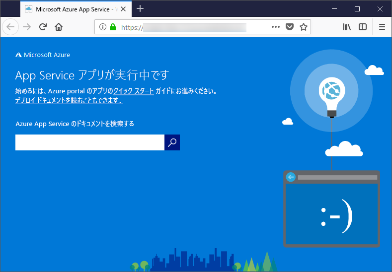

# <a name="configure-your-python-app-for-the-azure-app-service-on-linux"></a>Azure App Service on Linux 向けに Python アプリを構成する

この記事では、[Azure App Service on Linux](app-service-linux-intro.md) で Python アプリが実行される方法と、必要に応じて App Service の動作をカスタマイズする方法について説明します。

## <a name="set-python-version"></a>Python バージョンの設定

2 つの基本イメージを使用できます。Python 3.6 および Python 3.7。 どちらの Python ベースのイメージでも、アプリを作成できます。 たとえば、Python 3.7 を使用してアプリを作成するには、Cloud Shell で次のコマンドを実行します。

```azurecli-interactive
az webapp create --resource-group <group_name> --plan <plan_name> --name <app_name> --runtime "PYTHON|3.7"
```

Python バージョン (基本イメージ) を、たとえば Python 3.6 に変更するには、Cloud Shell で次のコマンドを実行します。

```azurecli-interactive
az webapp config set --resource-group <group_name> --name <app_name> --linux-fx-version "PYTHON|3.6"
```

Python の異なるバージョンが必要な場合は、代わりにお客様独自のコンテナー イメージをビルドしてデプロイする必要があります。 詳細については、「[Web App for Containers のカスタム Docker イメージを使用する](tutorial-custom-docker-image.md)」を参照してください。

## <a name="container-characteristics"></a>コンテナーの特性

App Service on Linux にデプロイされた Python アプリは、GitHub リポジトリの [Python 3.6](https://github.com/Azure-App-Service/python/tree/master/3.6.6) または [Python 3.7](https://github.com/Azure-App-Service/python/tree/master/3.7.0) で定義されている Docker コンテナー内で実行されます。

このコンテナーには次の特性があります。

- アプリは、[Gunicorn WSGI HTTP サーバー](https://gunicorn.org/)を使用して実行されます。このとき、追加の引数 `--bind=0.0.0.0 --timeout 600` が使用されます。

- 既定では、基本のイメージに Flask Web フレームワークが含まれています。ただし、コンテナーは、WSGI に準拠していて Python 3.7 と互換性のある他のフレームワーク (Django など) をサポートしています。

- Django など、追加のパッケージをインストールするには、`pip freeze > requirements.txt` を使用して、お客様のプロジェクトのルートに [*requirements.txt*](https://pip.pypa.io/en/stable/user_guide/#requirements-files) ファイルを作成します。 次に、Git デプロイを使用してお客様のプロジェクトを App Service に公開します。これにより、コンテナー内で `pip install -r requirements.txt` が自動的に実行され、お客様のアプリの依存関係がインストールされます。

## <a name="container-startup-process-and-customizations"></a>コンテナーのスタートアップ プロセスとカスタマイズ

App Service on Linux コンテナーでは、起動中に次の手順が実行されます。

1. カスタム スタートアップ コマンドが指定されているかどうかをチェックし、指定されている場合はこれを適用します。
2. Django アプリの *wsgi.py* ファイルが存在するかどうかをチェックし、存在する場合はそのファイルを使用して Gunicorn を起動します。
3. *application.py* という名前のファイルがあるかどうかをチェックし、ある場合は Flask アプリを想定して `application:app` を使って Gunicorn を起動します。
4. 他のアプリが見つからない場合は、コンテナーに組み込まれている既定のアプリを起動します。

次のセクションでは、各オプションについてさらに詳しく説明します。

### <a name="django-app"></a>Django アプリ

Django アプリの場合、App Service によってお客様のアプリ コード内で `wsgi.py` という名前のファイルが検索され、次のコマンドを使用して Gunicorn が実行されます。

```bash
# <module> is the path to the folder containing wsgi.py
gunicorn --bind=0.0.0.0 --timeout 600 <module>.wsgi
```

スタートアップ コマンドをより細かく制御したい場合は、[カスタム スタートアップ コマンド](#custom-startup-command)を使用し、`<module>` を、*wsgi.py* が含まれているモジュールの名前に置き換えます。

### <a name="flask-app"></a>Flask アプリ

Flask の場合、App Service によって *application.py* という名前のファイルが検索され、Gunicorn が次のように起動されます。

```bash
gunicorn --bind=0.0.0.0 --timeout 600 application:app
```

お客様のメイン アプリ モジュールが別のファイルに含まれている場合は、アプリ オブジェクトに別の名前を使用します。また、Gunicorn に追加の引数を指定したい場合は、[カスタム スタートアップ コマンド](#custom-startup-command)を使用します。 このセクションでは、*hello.py* 内のエントリ コードと `myapp` という名前の Flask アプリ オブジェクトを使用して Flask の例を示します。

### <a name="custom-startup-command"></a>カスタム スタートアップ コマンド

カスタム Gunicorn スタートアップ コマンドを指定することで、コンテナーの起動動作を制御できます。 たとえば、メイン モジュールが *hello.py* で、そのファイルにおける Flask アプリ オブジェクトの名前が `myapp` である Flask アプリがある場合、コマンドは次のようになります。

```bash
gunicorn --bind=0.0.0.0 --timeout 600 hello:myapp
```

メイン モジュールがサブフォルダー (`website` など) に存在する場合、そのフォルダーを `--chdir` 引数で指定します。

```bash
gunicorn --bind=0.0.0.0 --timeout 600 --chdir website hello:myapp
```

また、`--workers=4` のように、Gunicorn の追加の引数をコマンドに指定することもできます。 詳細については、「[Running Gunicorn (Gunicorn の実行)」](https://docs.gunicorn.org/en/stable/run.html) (docs.gunicorn.org) を参照してください。

カスタム コマンドを指定するには、次の手順を実行します。

1. Azure portal の [[アプリケーション設定]](../web-sites-configure.md?toc=%2fazure%2fapp-service%2fcontainers%2ftoc.json) ページに移動します。

1. **[ランタイム]** 設定で、**[スタック]** オプションを **[Python 3.7]** に設定し、**[スタートアップ ファイル]** フィールドにコマンドを直接入力します。

    または、*startup.txt* などの名前 (または任意の名前) を使用して、お客様のプロジェクトのルートにあるテキスト ファイルにコマンドを保存することができます。 次に、そのファイルを App Service にデプロイし、**[スタートアップ ファイル]** フィールドでそのファイル名を指定します。 このオプションを使用すると、Azure portal を通じてではなく、お客様のソース コード リポジトリ内でコマンドを管理できます。

1. **[保存]** を選択します。 App Service が自動的に再起動され、数秒後にカスタム スタートアップ コマンドが適用されるのがわかります。

> [!Note]
> App Service では、カスタム コマンド ファイルの処理中に発生したエラーが無視されて、Django アプリおよび Flask アプリが検索されることでスタートアップ プロセスが続行されます。 意図した動作が得られない場合は、お客様のスタートアップ ファイルが App Service にデプロイされていること、およびそのファイルにエラーが含まれていないことを確認してください。

### <a name="default-behavior"></a>既定の動作

カスタム コマンド、Django アプリ、または Flask アプリが App Service によって検出されない場合は、_opt/defaultsite_ フォルダーにある既定の読み取り専用アプリが実行されます。 既定のアプリは次のように表示されます。



## <a name="troubleshooting"></a>トラブルシューティング

- **自分のアプリ コードをデプロイした後に既定のアプリが表示される。**  既定のアプリは、お客様のアプリ コードが実際には App Service にデプロイされていない場合、またはお客様のアプリ コードが App Service によって検出されず、代わりに既定のアプリが実行された場合に表示されます。
  - App Service を再起動し、15 から 20 秒待って、アプリをもう一度確認します。
  - Windows ベースのインスタンスではなく、App Service for Linux が使用されていることを確認してください。 Azure CLI から `az webapp show --resource-group <resource_group_name> --name <app_service_name> --query kind` コマンドを実行します。`<resource_group_name>` と `<app_service_name>` は適宜置き換えてください。 出力として `app,linux` が表示されるはずです。それ以外の場合は、App Service を再作成し、Linux を選択してください。
    - SSH または Kudu コンソールを使用して App Service に直接接続し、お客様のファイルが *site/wwwroot* に存在することを確認します。 ファイルが存在しない場合は、デプロイ プロセスを見直してアプリを再デプロイします。
  - ファイルが存在する場合は、お客様固有のスタートアップ ファイルを App Service が識別できていません。 [Django](#django-app) または [Flask](#flask-app) に関して App Service で想定されているとおりにお客様のアプリが構造化されていることをチェックします。または、[カスタム スタートアップ コマンド](#custom-startup-command)を使用します。
  
- **ブラウザーに "サービスは利用できません" というメッセージが表示される。** ブラウザーは App Service からの応答を待ってタイムアウトしました。これは、App Service によって Gunicorn サーバーが起動されたもののアプリ コードを指定する引数が正しくないことを示しています。
  - ブラウザーを最新の情報に更新します (特に、お客様が App Service プランの最も低い価格レベルを使用している場合)。 たとえば、無料のレベルを使用しているときは、アプリの起動にかかる時間が長くなることがあります。その場合、ブラウザーを最新の情報に更新すると、応答が速くなります。
  - [Django](#django-app) または [Flask](#flask-app) に関して App Service で想定されているとおりにお客様のアプリが構造化されていることをチェックします。または、[カスタム スタートアップ コマンド](#custom-startup-command)を使用します。
  - SSH または Kudu コンソールを使用して App Service に接続し、*LogFiles* フォルダーに保存されている診断ログを調べます。 ログの詳細については、「[Azure App Service の Web アプリの診断ログの有効化](../web-sites-enable-diagnostic-log.md)」を参照してください。
