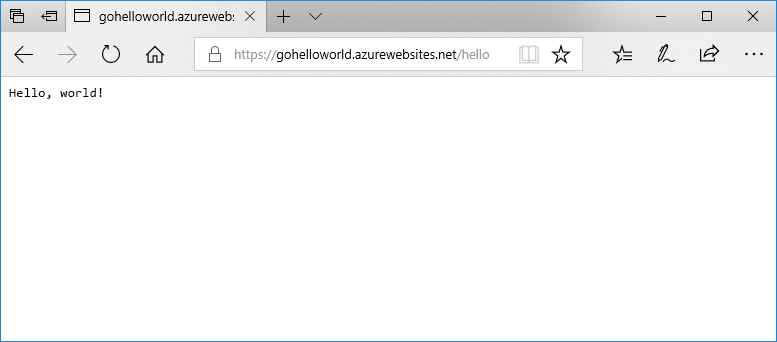

# <a name="deploy-a-dockergo-web-app-in-web-app-for-containers"></a>Web App for Containers で Docker/Go Web アプリをデプロイする

[App Service Linux](app-service-linux-intro.md) は、事前定義済みのアプリケーション スタックを Linux 上で提供し、.NET、PHP、Node.js などの言語をサポートします。 まだ Azure で定義されていないアプリケーション スタックで Web アプリを実行する場合にも、カスタム Docker イメージを使用できます。 このクイック スタートでは、Web アプリを作成し、Docker Hub から Go イメージをデプロイする方法を示します。 Web アプリは、[Azure CLI](https://docs.microsoft.com/cli/azure/get-started-with-azure-cli) を使用して作成します。



[!INCLUDE [quickstarts-free-trial-note](../../../includes/quickstarts-free-trial-note.md)]

[!INCLUDE [cloud-shell-try-it.md](../../../includes/cloud-shell-try-it.md)]

[!INCLUDE [Configure deployment user](../../../includes/configure-deployment-user.md)]

[!INCLUDE [Create resource group](../../../includes/app-service-web-create-resource-group-linux.md)]

[!INCLUDE [Create app service plan](../../../includes/app-service-web-create-app-service-plan-linux.md)]

## <a name="create-a-web-app"></a>Web アプリを作成する

[az webapp create](/cli/azure/webapp?view=azure-cli-latest#az-webapp-create) コマンドを使って、`myAppServicePlan`App Service プランに [Web アプリ](../app-service-web-overview.md)を作成します。 忘れずに `<app name>` をグローバルに一意のアプリ名に置き換えてください。

```azurecli-interactive
az webapp create --resource-group myResourceGroup --plan myAppServicePlan --name <app name> --deployment-container-image-name microsoft/azure-appservices-go-quickstart
```

上記のコマンドにある `--deployment-container-image-name` は、パブリック Docker Hub イメージ [microsoft/azure-appservices-go-quickstart](https://hub.docker.com/r/microsoft/azure-appservices-go-quickstart/) を指しています。

Web アプリが作成されると、Azure CLI によって次の例のような出力が表示されます。

```json
{
  "availabilityState": "Normal",
  "clientAffinityEnabled": true,
  "clientCertEnabled": false,
  "cloningInfo": null,
  "containerSize": 0,
  "dailyMemoryTimeQuota": 0,
  "defaultHostName": "<app name>.azurewebsites.net",
  "deploymentLocalGitUrl": "https://<username>@<app name>.scm.azurewebsites.net/<app name>.git",
  "enabled": true,
  < JSON data removed for brevity. >
}
```

## <a name="browse-to-the-app"></a>アプリの参照

```bash
http://<app_name>.azurewebsites.net/hello
```


**お疲れさまでした。** Go アプリケーションを実行しているカスタム Docker イメージが Web App for Containers にデプロイされました。

[!INCLUDE [Clean-up section](../../../includes/cli-script-clean-up.md)]

## <a name="next-steps"></a>次の手順

> [!div class="nextstepaction"]
> [カスタム Docker イメージを使用する](tutorial-custom-docker-image.md)
