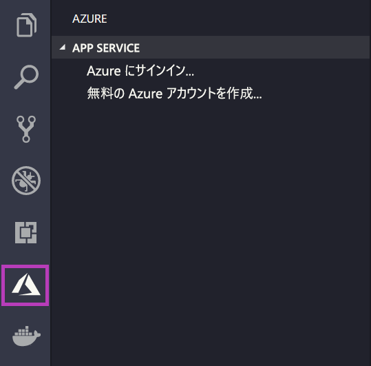
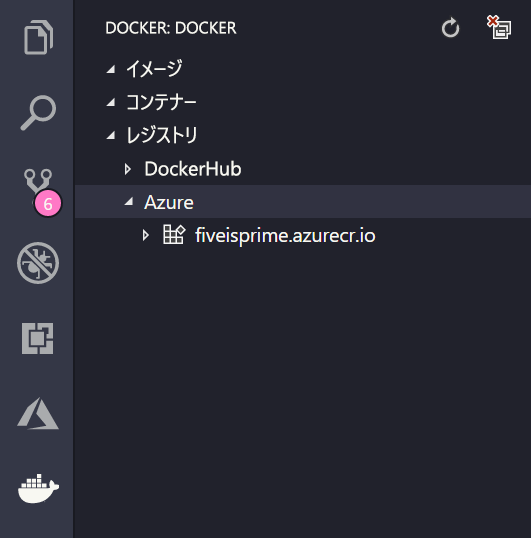

# <a name="deploy-a-custom-linux-container-to-azure-app-service"></a>Azure App Service にカスタム Linux コンテナーをデプロイする

App Service on Linux は、事前定義済みのアプリケーション スタックを Linux 上で提供し、.NET、PHP、Node.js などの言語をサポートします。 まだ Azure で定義されていないアプリケーション スタックで Web アプリを実行する場合にも、カスタム Docker イメージを使用できます。 このクイックスタートでは、[Azure Container Registry](/azure/container-registry) (ACR) から App Service にイメージをデプロイする方法について説明します。

## <a name="prerequisites"></a>前提条件

* [Azure アカウント](https://azure.microsoft.com/free/?utm_source=campaign&utm_campaign=vscode-tutorial-docker-extension&mktingSource=vscode-tutorial-docker-extension)
* [Docker](https://www.docker.com/community-edition)
* [Visual Studio Code](https://code.visualstudio.com/)
* [VS Code 用 Azure App Service 拡張情報](vscode:extension/ms-azuretools.vscode-azureappservice)。 この拡張機能を使用して、Azure PaaS (サービスとしてのプラットフォーム) 上に Linux Web Apps を作成、管理、デプロイすることができます。
* [VS Code 用 Docker 拡張機能](vscode:extension/ms-azuretools.vscode-docker)。 この拡張機能を使用して、ローカルの Docker イメージと Docker コマンドの管理を簡素化し、作成したアプリ イメージを Azure にデプロイすることができます。

## <a name="create-an-image"></a>イメージを作成する

このクイックスタートを完了するには、[Azure Container Registry](/azure/container-registry) に格納されている適切な Web アプリ イメージが必要です。 「[クイックスタート: Azure portal を使用したプライベート コンテナー レジストリの作成](/azure/container-registry/container-registry-get-started-portal)」の手順に従ってください。ただし、使用するイメージは、`hello-world` ではなく `mcr.microsoft.com/azuredocs/go` となります。 [Azure Samples リポジトリにサンプル Dockerfile があります](https://github.com/Azure-Samples/go-docs-hello-world)。ご参考ください。

> [!IMPORTANT]
> コンテナー レジストリを作成するときは必ず、 **[管理者ユーザー]** オプションを **[有効]** に設定してください。 Azure portal のレジストリ ページの **[アクセス キー]** セクションから設定することもできます。 App Service にアクセスするためには、この設定が必要となります。

## <a name="sign-in"></a>サインイン

次に、VS Code を起動し、App Service 拡張機能を使用して Azure アカウントにログインします。 そのためには、アクティビティ バーで Azure ロゴを選択し、 **[APP SERVICE]** エクスプローラーに移動して **[Azure にサインイン]** を選択し、画面の指示に従います。



## <a name="check-prerequisites"></a>前提条件を確認する

それでは、すべての前提条件がインストールされ、適切に構成されていることを確認しましょう。

VS Code では、ステータス バーに自分の Azure メール アドレスが、**APP SERVICE** エクスプローラーに自分のサブスクリプションが表示されます。

次に、Docker がインストールされ、実行されていることを確認します。 次のコマンドは、Docker が実行されている場合に、そのバージョンを表示するものです。

```bash
docker --version
```

最後に、Azure Container Registry が接続されていることを確認します。 そのためには、アクティビティ バーで Docker ロゴを選択し、 **[レジストリ]** に移動します。



## <a name="deploy-the-image-to-azure-app-service"></a>Azure App Service にイメージをデプロイする

すべての構成が済んだら、Docker 拡張機能エクスプローラーから直接 [Azure App Service](https://azure.microsoft.com/services/app-service/) にイメージをデプロイできます。

**DOCKER** エクスプローラーで **[レジストリ]** ノードからイメージを見つけて展開し、そのタグを表示します。 タグを右クリックし、 **[Deploy Image to Azure App Service]\(Azure App Service にイメージをデプロイ\)** を選択します。

そこからプロンプトに従って、サブスクリプション、グローバルに一意なアプリ名、リソース グループ、App Service プランを選択します。 価格レベルには **[B1 Basic]** を選択し、リージョンを選択してください。

デプロイ後は、`http://<app name>.azurewebsites.net` でアプリにアクセスできます。

**リソース グループ**は、Azure で利用するすべてのアプリケーションのリソースをまとめた名前付きのコレクションです。 たとえば、Web サイトやデータベース、Azure 関数への参照をリソース グループに含めることができます。

Web サイトをホストするために使用される物理リソースは、**App Service プラン**によって定義されます。 このクイックスタートでは、**Linux** インフラストラクチャ上の **Basic** ホスティング プランを使用します。つまりサイトは Linux マシン上で、他の Web サイトと一緒にホストされます。 **Basic** プランから開始すれば、マシン上で自分のサイトだけが実行されるように、Azure portal を使用してスケールアップすることができます。

## <a name="browse-the-website"></a>Web サイトの閲覧

デプロイ中は、 **[出力]** パネルが開いてデプロイ操作の状態が表示されます。 その操作が完了したら、**APP SERVICE** エクスプローラーで作成したアプリを見つけて右クリックし、 **[Web サイトの参照]** を選択して、ブラウザーでサイトを開きます。

> [!div class="nextstepaction"]
> [問題が発生しました](https://www.research.net/r/PWZWZ52?tutorial=quickstart-docker&step=deploy-app)

## <a name="next-steps"></a>次のステップ

おめでとうございます。このクイックスタートを正常に完了できました。

次は、他の Azure 拡張機能もチェックしてみましょう。

* [Cosmos DB](https://marketplace.visualstudio.com/items?itemName=ms-azuretools.vscode-cosmosdb)
* [Azure Functions](https://marketplace.visualstudio.com/items?itemName=ms-azuretools.vscode-azurefunctions)
* [Azure CLI Tools](https://marketplace.visualstudio.com/items?itemName=ms-vscode.azurecli)
* [Azure リソース マネージャー ツール](https://marketplace.visualstudio.com/items?itemName=msazurermtools.azurerm-vscode-tools)

または、[Azure Tools](https://marketplace.visualstudio.com/items?itemName=ms-vscode.vscode-node-azure-pack) 拡張機能パックをインストールして、これらすべてを入手しましょう。
