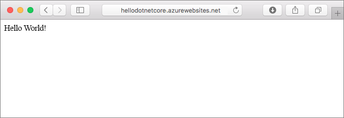
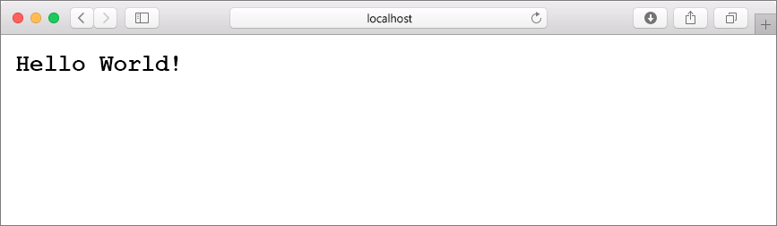
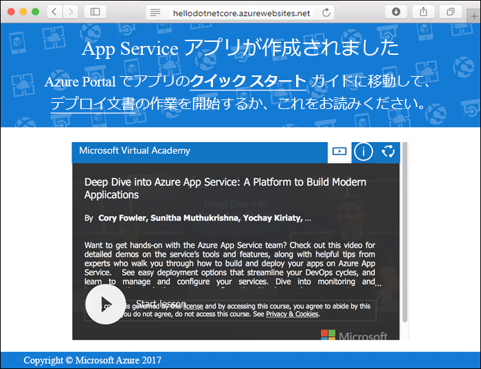
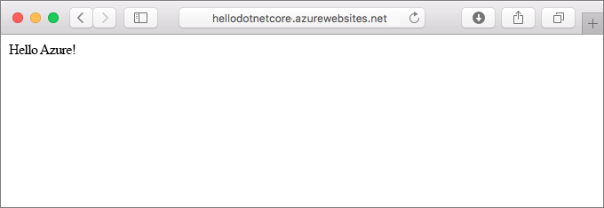
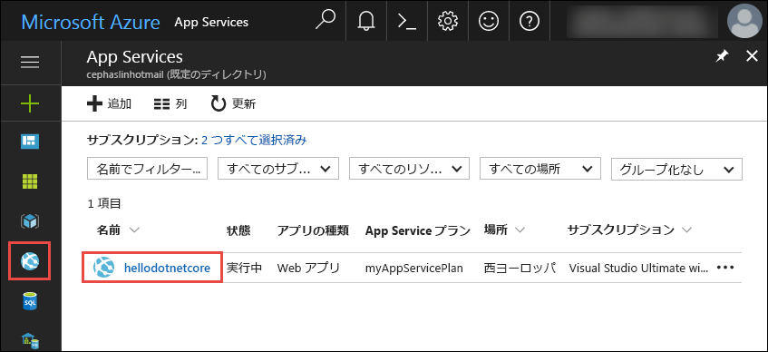

# <a name="create-a-net-core-web-app-in-app-service-on-linux"></a>App Service on Linux での .NET Core Web アプリの作成

> [!NOTE]
> この記事では、Linux 上の App Service にアプリをデプロイします。 _Windows_ 上の App Service にデプロイするには、「[Azure で ASP.NET Core Web アプリを作成する](../app-service-web-get-started-dotnet.md)」を参照してください。
>

[App Service on Linux](app-service-linux-intro.md) は、Linux オペレーティング システムを使用する、高度にスケーラブルな自己適用型の Web ホスティング サービスを提供します。 このクイックスタートでは、App Service on Linux に [.NET Core](https://docs.microsoft.com/aspnet/core/) アプリを作成する方法を示します。 [Azure CLI](https://docs.microsoft.com/cli/azure/get-started-with-azure-cli) を使用して Web アプリを作成し、Git を使用して Web アプリに .NET Core コードをデプロイします。



この記事の手順は、Mac、Windows、または Linux コンピューターを使って実行できます。

[!INCLUDE [quickstarts-free-trial-note](../../../includes/quickstarts-free-trial-note.md)]

## <a name="prerequisites"></a>前提条件

このクイック スタートを完了するには、以下が必要です。

* <a href="https://git-scm.com/" target="_blank">Git をインストールする</a>
* <a href="https://www.microsoft.com/net/core/" target="_blank">.NET Core をインストールする</a>

## <a name="create-the-app-locally"></a>アプリをローカルで作成する

コンピューターのターミナル ウィンドウで、`hellodotnetcore` という名前のディレクトリを作成し、現在のディレクトリをそのディレクトリに変更します。

```bash
md hellodotnetcore
cd hellodotnetcore
```

新しい .NET Core Web アプリを作成します。

```bash
dotnet new web
```

## <a name="run-the-app-locally"></a>アプリをローカルで実行する

NuGet パッケージを復元し、アプリを実行します。

```bash
dotnet restore
dotnet run
```

Web ブラウザーを開き、`http://localhost:5000` のアプリに移動します。

ページに表示されているサンプル アプリの **Hello World** メッセージが表示されます。



ターミナル ウィンドウで **Ctrl + C** キーを押して、Web サーバーを終了します。 .NET Core プロジェクト用の Git リポジトリを初期化します。

```bash
git init
git add .
git commit -m "first commit"
```

[!INCLUDE [cloud-shell-try-it.md](../../../includes/cloud-shell-try-it.md)]

[!INCLUDE [Configure deployment user](../../../includes/configure-deployment-user.md)]

[!INCLUDE [Create resource group](../../../includes/app-service-web-create-resource-group-linux.md)]

[!INCLUDE [Create app service plan](../../../includes/app-service-web-create-app-service-plan-linux.md)]

## <a name="create-a-web-app"></a>Web アプリを作成する

[!INCLUDE [Create web app](../../../includes/app-service-web-create-web-app-dotnetcore-linux-no-h.md)]

新しく作成された Web アプリに移動します。 _&lt;app_name>_ は、Web アプリの名前に置き換えます。

```bash
http://<app name>.azurewebsites.net
```

新しい Web アプリは次のようになります。



[!INCLUDE [Push to Azure](../../../includes/app-service-web-git-push-to-azure.md)] 

```bash
Counting objects: 22, done.
Delta compression using up to 8 threads.
Compressing objects: 100% (18/18), done.
Writing objects: 100% (22/22), 51.21 KiB | 3.94 MiB/s, done.
Total 22 (delta 1), reused 0 (delta 0)
remote: Updating branch 'master'.
remote: Updating submodules.
remote: Preparing deployment for commit id '741f16d1db'.
remote: Generating deployment script.
remote: Project file path: ./hellodotnetcore.csproj
remote: Generated deployment script files
remote: Running deployment command...
remote: Handling ASP.NET Core Web Application deployment.
remote: ...............................................................................................
remote:   Restoring packages for /home/site/repository/hellodotnetcore.csproj...
remote: ....................................
remote:   Installing System.Xml.XPath 4.0.1.
remote:   Installing System.Diagnostics.Tracing 4.1.0.
remote:   Installing System.Threading.Tasks.Extensions 4.0.0.
remote:   Installing System.Reflection.Emit.ILGeneration 4.0.1.
remote:   ...
remote: Finished successfully.
remote: Running post deployment command(s)...
remote: Deployment successful.
To https://cephalin-dotnetcore.scm.azurewebsites.net/cephalin-dotnetcore.git
 * [new branch]      master -> master
```

## <a name="browse-to-the-app"></a>アプリの参照

Web ブラウザーを使用して、デプロイされたアプリケーションを参照します。

```bash
http://<app_name>.azurewebsites.net
```

.NET Core のサンプル コードが、組み込みイメージを使用する Web アプリで実行されています。


**お疲れさまでした。** App Service on Linux に初めての .NET Core アプリをデプロイしました。

## <a name="update-and-redeploy-the-code"></a>コードを更新して再デプロイする

ローカル ディレクトリで、_Startup.cs_ ファイルを開きます。 メソッド呼び出し `context.Response.WriteAsync` 内のテキストに小さな変更を加えます。

```csharp
await context.Response.WriteAsync("Hello Azure!");
```

Git で変更をコミットしてから、コード変更を Azure にプッシュします。

```bash
git commit -am "updated output"
git push azure master
```

デプロイが完了したら、「**アプリの参照**」の手順で開いた元のブラウザー ウィンドウに切り替えて、更新をクリックします。



## <a name="manage-your-new-azure-web-app"></a>新しい Azure Web アプリを管理する

<a href="https://portal.azure.com" target="_blank">Azure Portal</a> に移動し、作成した Web アプリを管理します。

左側のメニューで **[App Services]** をクリックした後、Azure Web アプリの名前をクリックします。



Web アプリの [概要] ページを確認します。 ここでは、参照、停止、開始、再開、削除のような基本的な管理タスクを行うことができます。 

![Azure Portal の [App Service] ページ](media/quickstart-dotnetcore/portal-app-overview.png)

左側のメニューは、アプリを構成するためのさまざまなページを示しています。 

[!INCLUDE [cli-samples-clean-up](../../../includes/cli-samples-clean-up.md)]

## <a name="next-steps"></a>次の手順

> [!div class="nextstepaction"]
> [Azure App Service on Linux での .NET Core および SQL Database の Web アプリの作成](tutorial-dotnetcore-sqldb-app.md)
