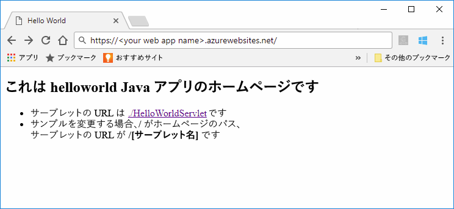
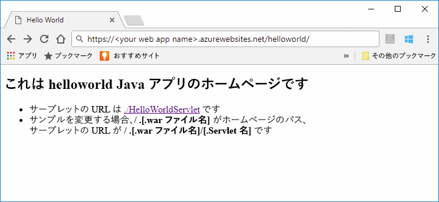

# <a name="quickstart-create-a-java-web-app-in-app-service-on-linux"></a>クイック スタート: App Service on Linux で Java Web アプリを作成する

App Service on Linux は、現在、Java Web アプリをサポートするためのプレビュー機能を提供しています。 プレビューの詳細については、「[Microsoft Azure プレビューの追加使用条件](https://azure.microsoft.com/support/legal/preview-supplemental-terms/)」を参照してください。 

[App Service on Linux](app-service-linux-intro.md) は、Linux オペレーティング システムを使用する、高度にスケーラブルな自己適用型の Web ホスティング サービスを提供します。 このクイック スタートでは、[Azure CLI](https://docs.microsoft.com/cli/azure/get-started-with-azure-cli) と [Maven Plugin for Azure Web Apps (プレビュー)](https://github.com/Microsoft/azure-maven-plugins/tree/develop/azure-webapp-maven-plugin) を使用して、Java Web アプリと組み込み Linux イメージをデプロイする方法を示します。



[Azure Toolkit for IntelliJ を使用してクラウドの Linux コンテナーに Java Web アプリをデプロイする](https://docs.microsoft.com/java/azure/intellij/azure-toolkit-for-intellij-hello-world-web-app-linux)ことは、独自のコンテナーに Java アプリをデプロイするための代替方法です。

[!INCLUDE [quickstarts-free-trial-note](../../../includes/quickstarts-free-trial-note.md)]


## <a name="prerequisites"></a>前提条件

このクイック スタートを完了するには、以下が必要です。 

* ローカルにインストールされている [Azure CLI 2.0 以降](https://docs.microsoft.com/cli/azure/install-azure-cli?view=azure-cli-latest)。
* [Apache Maven](http://maven.apache.org/)。


## <a name="create-a-java-app"></a>Java アプリを作成する

Maven を使用して次のコマンドを実行し、新しい *helloworld* Web アプリを作成します。  

    mvn archetype:generate -DgroupId=example.demo -DartifactId=helloworld -DarchetypeArtifactId=maven-archetype-webapp

新しい *helloworld* プロジェクト ディレクトリに移動し、次のコマンドを使用してすべてのモジュールをビルドします。

    mvn verify

このコマンドは、*helloworld/target* サブディレクトリにある *helloworld.war* ファイルを含むすべてのモジュールを確認して作成します。


## <a name="deploying-the-java-app-to-app-service-on-linux"></a>App Service on Linux への Java アプリのデプロイ

Java Web アプリを App Service on Linux にデプロイするには、複数のデプロイ オプションがあります。 設定できるオプションは次のとおりです。

* [Maven Plugin for Azure Web Apps によるデプロイ](https://github.com/Microsoft/azure-maven-plugins/tree/develop/azure-webapp-maven-plugin)
* [ZIP または WAR によるデプロイ](https://docs.microsoft.com/azure/app-service/app-service-deploy-zip)
* [FTP によるデプロイ](https://docs.microsoft.com/azure/app-service/app-service-deploy-ftp)

このクイック スタートでは、Maven Plugin for Azure Web Apps を使用します。 Maven から使いやすく、必要な Azure リソース (リソース グループ、App Service プラン、および Web アプリ) が自動的に作成されるという利点があります。

### <a name="deploy-with-maven"></a>Maven でデプロイする

Maven からデプロイするには、*pom.xml* ファイルの `<build>` 要素内に次のプラグイン定義を追加します。

```xml
    <plugins>
      <plugin>
        <groupId>com.microsoft.azure</groupId> 
        <artifactId>azure-webapp-maven-plugin</artifactId> 
        <version>1.2.0</version>
        <configuration> 
          <resourceGroup>YOUR_RESOURCE_GROUP</resourceGroup> 
          <appName>YOUR_WEB_APP</appName> 
          <linuxRuntime>tomcat 9.0-jre8</linuxRuntime>
          <deploymentType>ftp</deploymentType> 
          <resources> 
              <resource> 
                  <directory>${project.basedir}/target</directory> 
                  <targetPath>webapps</targetPath> 
                  <includes> 
                      <include>*.war</include> 
                  </includes> 
                  <excludes> 
                      <exclude>*.xml</exclude> 
                  </excludes> 
              </resource> 
          </resources> 
        </configuration>
      </plugin>
    </plugins>
```    

プラグイン構成で、次のプレースホルダーを更新します。

| Placeholder | 説明 |
| ----------- | ----------- |
| `YOUR_RESOURCE_GROUP` | Web アプリの作成先となる新しいリソース グループの名前。 アプリのすべてのリソースを 1 つのグループ内に配置することで、それらを一緒に管理できます。 たとえば、リソース グループを削除すれば、そのアプリに関連付けられているすべてのリソースが削除されます。 この値を一意の新しいリソース グループ名 (たとえば、*TestResources*) で更新します。 このリソース グループ名を使用して、後のセクションですべての Azure リソースをクリーンアップします。 |
| `YOUR_WEB_APP` | Azure にデプロイされると、アプリ名は Web アプリのホスト名の一部になります (YOUR_WEB_APP.azurewebsites.net)。 この値を、Java アプリをホストする新しい Azure Web アプリの一意の名前 (たとえば、*contoso*) で更新します。 |

構成の `linuxRuntime` 要素は、アプリケーションでどの組み込みの Linux イメージが使用されるかを制御します。 サポートされているすべてのランタイム スタックは、[こちらのリンク](https://github.com/Microsoft/azure-maven-plugins/tree/develop/azure-webapp-maven-plugin#runtime-stacks)に見つかります。 


> [!NOTE] 
> この記事では、WAR ファイルのみを取り扱います。 ただし、このプラグインは、*pom.xml* ファイルの `<build>` 要素内に次のプラグイン定義を使用することで、JAR Web アプリケーションをサポートします。
>
>```xml
>    <plugins>
>      <plugin>
>        <groupId>com.microsoft.azure</groupId> 
>        <artifactId>azure-webapp-maven-plugin</artifactId> 
>        <version>1.2.0</version>
>        <configuration> 
>          <resourceGroup>YOUR_RESOURCE_GROUP</resourceGroup> 
>          <appName>YOUR_WEB_APP</appName> 
>          <linuxRuntime>jre8</linuxRuntime>   
>          <!-- This is to make sure the jar file will not be occupied during the deployment -->
>          <stopAppDuringDeployment>true</stopAppDuringDeployment>
>          <deploymentType>ftp</deploymentType> 
>          <resources> 
>              <resource> 
>                  <directory>${project.basedir}/target</directory> 
>                  <targetPath>webapps</targetPath> 
>                  <includes> 
>                      <!-- Currently it is required to set as app.jar -->
>                      <include>app.jar</include> 
>                  </includes>  
>              </resource> 
>          </resources> 
>        </configuration>
>      </plugin>
>    </plugins>
>```    

次のコマンドを実行し、すべての指示に従って Azure CLI で認証を行います。

    az login

次のコマンドを使用して、Java アプリを Web アプリにデプロイします。

    mvn clean package azure-webapp:deploy


デプロイが完了したら、Web ブラウザーで次の URL を使用して、デプロイされたアプリケーションに移動します。

```bash
http://<app_name>.azurewebsites.net/helloworld
```

組み込みイメージを使用する Web アプリで、Java のサンプル コードが実行されています。



**お疲れさまでした。** App Service on Linux に初めての Java アプリをデプロイしました。


[!INCLUDE [cli-samples-clean-up](../../../includes/cli-samples-clean-up.md)]


## <a name="next-steps"></a>次の手順

このクイック スタートでは、Maven を使用して Java Web アプリを作成した後、Java Web アプリを App Service on Linux にデプロイしました。 Azure で Java を使用する方法の詳細については、以下のリンクを参照してください。

> [!div class="nextstepaction"]
> [Java 開発者向けの Azure](https://docs.microsoft.com/java/azure/)

