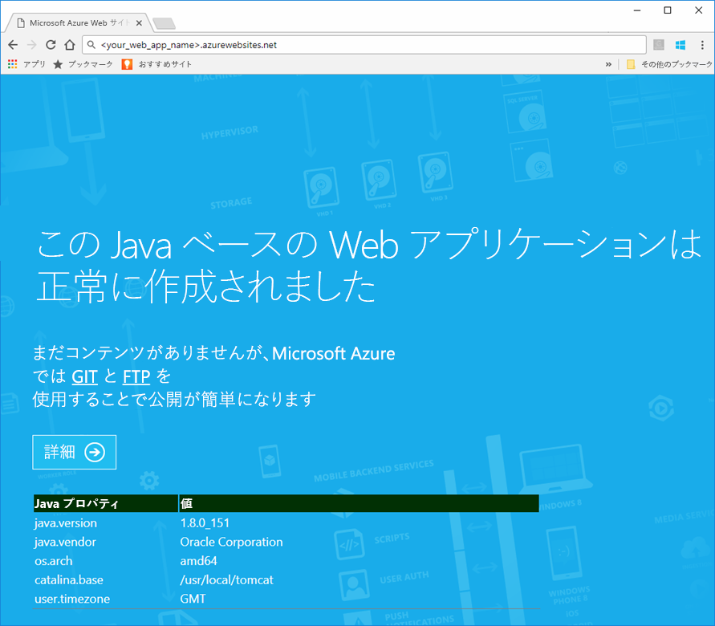
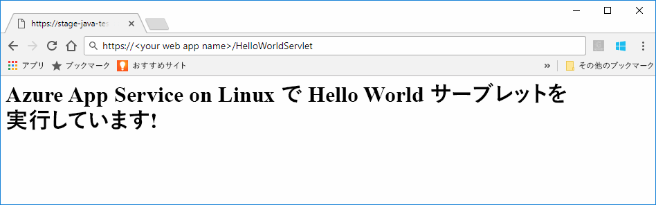
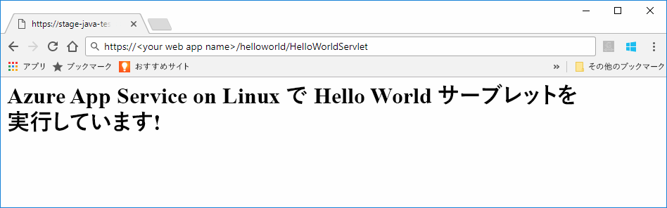

# <a name="preview-create-a-java-web-app-in-app-service-on-linux"></a>プレビュー: App Service on Linux で Java Web アプリを作成する

App Service on Linux は、現在、Java Web アプリをサポートするためのプレビュー機能を提供しています。 プレビューの詳細については、「[Microsoft Azure プレビューの追加使用条件](https://azure.microsoft.com/support/legal/preview-supplemental-terms/)」を参照してください。 [Azure Toolkit for IntelliJ を使用してクラウドの Linux コンテナーに Java Web アプリをデプロイする](https://docs.microsoft.com/java/azure/intellij/azure-toolkit-for-intellij-hello-world-web-app-linux)ことは、独自のコンテナーに Java アプリをデプロイするための代替方法です。

> [!NOTE]
> この記事では、Java Web アプリを App Service on Linux にデプロイします。
>

[App Service on Linux](app-service-linux-intro.md) は、Linux オペレーティング システムを使用する、高度にスケーラブルな自己適用型の Web ホスティング サービスを提供します。 このクイック スタートでは、組み込みイメージを使用して App Service on Linux に Java アプリをデプロイする方法を示します。 [Azure CLI](https://docs.microsoft.com/cli/azure/get-started-with-azure-cli) を使用して、組み込みイメージを使用する Web アプリを作成し、その Web アプリに Java アプリをデプロイします。


[!INCLUDE [quickstarts-free-trial-note](../../../includes/quickstarts-free-trial-note.md)]


## <a name="prerequisites"></a>前提条件

このクイック スタートを完了するには、以下が必要です。 

* Azure サブスクリプションが必要です。 Azure サブスクリプションをお持ちでない場合は、開始する前に [無料アカウント](https://azure.microsoft.com/free/?ref=microsoft.com&utm_source=microsoft.com&utm_medium=docs&utm_campaign=visualstudio) を作成してください。
* [Git をインストールします](https://git-scm.com/)。
* [Eclipse](https://www.eclipse.org/downloads/) をインストールします。


[!INCLUDE [cloud-shell-try-it.md](../../../includes/cloud-shell-try-it.md)]

[!INCLUDE [Configure deployment user](../../../includes/configure-deployment-user.md)]

[!INCLUDE [Create resource group](../../../includes/app-service-web-create-resource-group-linux.md)]

[!INCLUDE [Create app service plan](../../../includes/app-service-web-create-app-service-plan-linux.md)]


## <a name="create-a-web-app"></a>Web アプリを作成する

Cloud Shell で、`myAppServicePlan` App Service プランに [Web アプリ](../app-service-web-overview.md)を作成します。 これは、[`az webapp create`](/cli/azure/webapp?view=azure-cli-latest#az_webapp_create) コマンドを使用して実行できます。 次の例では、*\<app_name>* をグローバルに一意のアプリ名に置き換えてください (有効な文字は `a-z`、`0-9`、`-`)。 

```azurecli-interactive
# Bash
az webapp create --name <app_name> --resource-group myResourceGroup --plan myAppServicePlan --runtime "TOMCAT|8.5-jre8"
# PowerShell
az --% webapp create --name <app_name> --resource-group myResourceGroup --plan myAppServicePlan --runtime "TOMCAT|8.5-jre8"
```

**runtime** パラメーターには、以下のいずれかのランタイムを使用します。
 * TOMCAT|8.5-jre8
 * TOMCAT|9.0-jre8


Web アプリが作成されると、Azure CLI によって次の例のような情報が表示されます。

```json
{
  "additionalProperties": {},
  "availabilityState": "Normal",
  "clientAffinityEnabled": true,
  "clientCertEnabled": false,
  "cloningInfo": null,
  "containerSize": 0,
  "dailyMemoryTimeQuota": 0,
  "defaultHostName": "<your web app name>.azurewebsites.net",
  "enabled": true,
  "enabledHostNames": [
    "<your web app name>.azurewebsites.net",
    "<your web app name>.scm.azurewebsites.net"
  ],
  "ftpPublishingUrl": "ftp://<your ftp URL>",  
  < JSON data removed for brevity. >
}
```

**ftpPublishingUrl** の値をコピーします。 FTP デプロイを選択した場合、これを後で使用します。

新しく作成された Web アプリに移動します。

```
http://<app_name>.azurewebsites.net
```

Web アプリが起動中である場合は、次の図のような既定の画面が表示されます。




## <a name="download-the-sample-java-app"></a>サンプル Java アプリのダウンロード

コンピューターのターミナル ウィンドウで、次のコマンドを実行して、サンプル アプリのリポジトリをローカル コンピューターに複製します。 後の手順で、このサンプル アプリをデプロイします。

```bash
git clone https://github.com/Azure-Samples/java-docs-hello-world
```


## <a name="deploying-the-java-app-to-app-service-on-linux"></a>App Service on Linux への Java アプリのデプロイ

[Eclipse](https://www.eclipse.org/downloads/) でサンプル プロジェクトを開き、[Java アプリを `helloworld.war` という名前の Web アーカイブ (WAR) ファイルにエクスポート](http://help.eclipse.org/kepler/index.jsp?topic=%2Forg.eclipse.wst.webtools.doc.user%2Ftopics%2Ftwcrewar.html)します。

Java アプリ WAR ファイルをデプロイするには、WarDeploy (現在は[プレビュー](https://azure.microsoft.com/support/legal/preview-supplemental-terms/)) または FTP を使用できます。

どのデプロイ方法を使用するかによって、Java Web アプリを参照する相対パスは少し異なります。

### <a name="deploy-with-wardeploy"></a>WarDeploy によるデプロイ 

WarDeploy で WAR ファイルをデプロイするには、次の cURL サンプル コマンド ラインを使用して、*https://<your app name>.scm.azurewebsites.net/api/wardeploy* に POST 要求を送信します。 POST 要求のメッセージの本文に .war ファイルを含める必要があります。 アプリの展開資格情報は、HTTP 基本認証を使って要求で提供します。 WarDeploy の詳細については、「[Deploy your app to Azure App Service with a ZIP or WAR file (ZIP または WAR ファイルを使用した Azure App Service へのアプリのデプロイ)](../app-service-deploy-zip.md)」を参照してください。

```bash
curl -X POST -u <username> --data-binary @"<war_file_path>" https://<app_name>.scm.azurewebsites.net/api/wardeploy
```

以下を更新します。

* `username` - 前に作成したデプロイ資格情報ユーザー名を使用します。
* `war_file_path` - ローカルの WAR ファイル パスを使用します。
* `app_name` - 前に作成したアプリ名を使用します。

コマンドを実行します。 入力を求める cURL のメッセージが表示されたら、デプロイ資格情報のパスワードを入力します。

Web ブラウザーで次の URL を使用して、デプロイされたアプリケーションに移動します。

```bash
http://<app_name>.azurewebsites.net
```

組み込みイメージを使用する Web アプリで、Java のサンプル コードが実行されています。


Web ブラウザーでサーブレットに移動します。

```bash
http://<app_name>.azurewebsites.net/HelloWorldServlet
```

組み込みイメージを使用する Web アプリで、サーブレットが実行されています。




**お疲れさまでした。** App Service on Linux に初めての Java アプリをデプロイしました。


### <a name="ftp-deployment"></a>FTP デプロイ

また、WAR ファイルをデプロイするために、FTP を使用することもできます。 

FTP でファイルを Web アプリの */home/site/wwwroot/webapps* ディレクトリに送信します。 以下のコマンド ラインの例では、cURL を使用します。

```bash
curl -T war_file_path -u "app_name\username" ftp://webappFTPURL/site/wwwroot/webapps/
```

以下を更新します。

* `war_file_path` - ローカルの WAR ファイル パスを使用します。
* `app_name` - 前に作成したアプリ名を使用します。
* `username` - 前に作成したデプロイ資格情報ユーザー名を使用します。
* `webappFTPURL` - 前にコピーした Web アプリの **FTP ホスト名**の値を使用します。 FTP ホスト名は、[Azure Portal](https://portal.azure.com/) で Web アプリの **[概要]** ブレードの一覧にも表示されます。

コマンドを実行します。 入力を求める cURL のメッセージが表示されたら、デプロイ資格情報のパスワードを入力します。


Web ブラウザーで次の URL を使用して、デプロイされたアプリケーションに移動します。

```bash
http://<app_name>.azurewebsites.net/helloworld
```

組み込みイメージを使用する Web アプリで、Java のサンプル コードが実行されています。


Web ブラウザーでサーブレットに移動します。

```bash
http://<app_name>.azurewebsites.net/helloworld/HelloWorldServlet
```

組み込みイメージを使用する Web アプリで、Java のサンプル コードが実行されています。




**お疲れさまでした。** App Service on Linux に初めての Java アプリをデプロイしました。


[!INCLUDE [cli-samples-clean-up](../../../includes/cli-samples-clean-up.md)]


## <a name="next-steps"></a>次の手順

Azure での Java の使用方法の詳細については、以下のリンクを参照してください。

* [Java 開発者向けの Azure](https://docs.microsoft.com/java/azure/)
* [Azure Toolkit for IntelliJ を使用して Hello World Web アプリをクラウドの Linux コンテナーにデプロイする](https://docs.microsoft.com/java/azure/intellij/azure-toolkit-for-intellij-hello-world-web-app-linux)
* [Java Tools for Visual Studio Team Services](https://java.visualstudio.com/)
