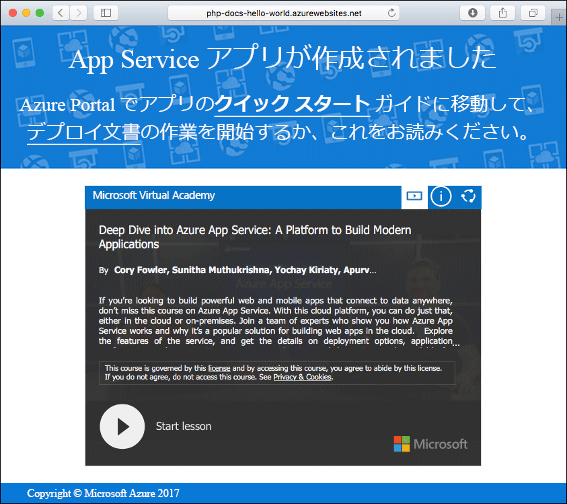
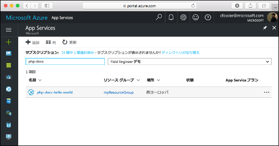

# <a name="create-a-php-app-in-app-service-on-linux"></a>App Service on Linux での PHP アプリの作成

> [!NOTE]
> この記事では、Linux 上の App Service にアプリをデプロイします。 _Windows_ 上の App Service にデプロイするには、[Azure での PHP アプリの作成](../app-service-web-get-started-php.md)に関するページを参照してください。
>

[App Service on Linux](app-service-linux-intro.md) は、Linux オペレーティング システムを使用する、高度にスケーラブルな自己適用型の Web ホスティング サービスを提供します。 このチュートリアルでは、[Cloud Shell](https://docs.microsoft.com/azure/cloud-shell/overview) を使用して Azure App Service on Linux に PHP アプリをデプロイする方法を示します。


この記事の手順は、Mac、Windows、または Linux コンピューターを使って実行できます。

[!INCLUDE [quickstarts-free-trial-note](../../../includes/quickstarts-free-trial-note.md)]

## <a name="prerequisites"></a>前提条件

このクイック スタートを完了するには、以下が必要です。

* <a href="https://git-scm.com/" target="_blank">Git をインストールする</a>
* <a href="https://php.net" target="_blank">PHP をインストールする</a>

## <a name="download-the-sample"></a>サンプルのダウンロード

ターミナル ウィンドウで、次のコマンドを実行して、ローカル コンピューターにサンプル アプリケーションを複製し、サンプル コードを含むディレクトリに移動します。

```bash
git clone https://github.com/Azure-Samples/php-docs-hello-world
cd php-docs-hello-world
```

## <a name="run-the-app-locally"></a>アプリをローカルで実行する

アプリケーションをローカルで実行すると、アプリケーションを Azure にデプロイするとどう表示されるかを把握できます。 ターミナル ウィンドウを開き、`php` コマンドを使用して組み込みの PHP Web サーバーを起動します。

```bash
php -S localhost:8080
```

Web ブラウザーを開き、`http://localhost:8080` のサンプル アプリに移動します。

サンプル アプリケーションから "**Hello World!** " というメッセージがページに表示されます。


ターミナル ウィンドウで **Ctrl + C** キーを押して、Web サーバーを終了します。

[!INCLUDE [cloud-shell-try-it.md](../../../includes/cloud-shell-try-it.md)]

[!INCLUDE [Configure deployment user](../../../includes/configure-deployment-user.md)]

[!INCLUDE [Create resource group](../../../includes/app-service-web-create-resource-group-linux.md)]

[!INCLUDE [Create app service plan](../../../includes/app-service-web-create-app-service-plan-linux.md)]

## <a name="create-a-web-app"></a>Web アプリを作成する

[!INCLUDE [Create web app](../../../includes/app-service-web-create-web-app-php-linux-no-h.md)] 

サイトを参照して、お客様が新しく作成した組み込みのイメージによるアプリを確認します。 _&lt;app name>_ は、アプリの名前に置き換えます。

```bash
http://<app_name>.azurewebsites.net
```

新しいアプリは次のようになります。



[!INCLUDE [Push to Azure](../../../includes/app-service-web-git-push-to-azure.md)] 

```bash
Counting objects: 2, done.
Delta compression using up to 4 threads.
Compressing objects: 100% (2/2), done.
Writing objects: 100% (2/2), 352 bytes | 0 bytes/s, done.
Total 2 (delta 1), reused 0 (delta 0)
remote: Updating branch 'master'.
remote: Updating submodules.
remote: Preparing deployment for commit id '25f18051e9'.
remote: Generating deployment script.
remote: Running deployment command...
remote: Handling Basic Web Site deployment.
remote: Kudu sync from: '/home/site/repository' to: '/home/site/wwwroot'
remote: Copying file: '.gitignore'
remote: Copying file: 'LICENSE'
remote: Copying file: 'README.md'
remote: Copying file: 'index.php'
remote: Ignoring: .git
remote: Finished successfully.
remote: Running post deployment command(s)...
remote: Deployment successful.
To https://<app_name>.scm.azurewebsites.net/<app_name>.git
   cc39b1e..25f1805  master -> master
```

## <a name="browse-to-the-app"></a>アプリの参照

Web ブラウザーを使用して、デプロイされたアプリケーションを参照します。

```bash
http://<app_name>.azurewebsites.net
```

App Service on Linux で組み込みのイメージを使用して PHP サンプル コードが実行されています。


**お疲れさまでした。** App Service on Linux に初めての PHP アプリをデプロイしました。

## <a name="update-locally-and-redeploy-the-code"></a>コードをローカルで更新して再デプロイする

ローカル ディレクトリで、PHP アプリ内の `index.php` ファイルを開き、`echo` に続く文字列の中のテキストを少し変更します。

```php
echo "Hello Azure!";
```

Git で変更をコミットしてから、コード変更を Azure にプッシュします。

```bash
git commit -am "updated output"
git push azure master
```

デプロイが完了したら、「**アプリの参照**」の手順で開いたブラウザー ウィンドウに戻り、ページを更新します。


## <a name="manage-your-new-azure-app"></a>新しい Azure アプリの管理

<a href="https://portal.azure.com" target="_blank">Azure portal</a> に移動し、お客様が作成したアプリを管理します。

左側のメニューで **[App Services]** をクリックしてから、お客様の Azure アプリの名前をクリックします。



お客様のアプリの [概要] ページを確認します。 ここでは、参照、停止、開始、再開、削除のような基本的な管理タスクを行うことができます。

![Azure Portal の [App Service] ページ](media/quickstart-php/php-docs-hello-world-app-service-detail.png)

左側のメニューは、アプリを構成するためのさまざまなページを示しています。 

[!INCLUDE [cli-samples-clean-up](../../../includes/cli-samples-clean-up.md)]

## <a name="next-steps"></a>次の手順

> [!div class="nextstepaction"]
> [チュートリアル:PHP アプリと MySQL](tutorial-php-mysql-app.md)

> [!div class="nextstepaction"]
> [PHP アプリの構成](configure-language-php.md)
