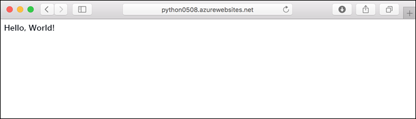
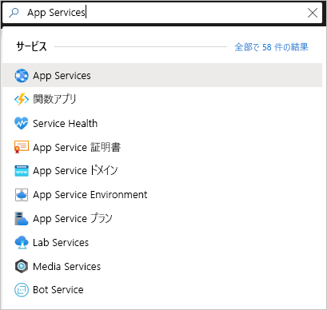

# <a name="quickstart-create-a-python-app-in-azure-app-service-on-linux"></a>クイック スタート:Azure App Service on Linux で Python アプリを作成する

このクイック スタートでは、Azure のスケーラビリティに優れた自己適用型の Web ホスティング サービスである [App Service on Linux](app-service-linux-intro.md) に、Python Web アプリをデプロイします。 Mac、Linux、または Windows コンピューター上で、ローカルの [Azure コマンド ライン インターフェイス (CLI)](/cli/azure/install-azure-cli) を使用します。 構成する Web アプリでは、App Service の Free レベルを使用するため、この記事の中で料金が発生することはありません。

IDE を使用してアプリをデプロイする場合は、[Visual Studio Code から App Service への Python アプリのデプロイ](/azure/python/tutorial-deploy-app-service-on-linux-01)に関する記事をご覧ください。

## <a name="prerequisites"></a>前提条件

- Azure サブスクリプション - [無料アカウントを作成する](https://azure.microsoft.com/free/?ref=microsoft.com&utm_source=microsoft.com&utm_medium=docs&utm_campaign=visualstudio)
- <a href="https://www.python.org/downloads/" target="_blank">Python 3.7</a> (Python 3.6 もサポートされています)
- <a href="https://git-scm.com/downloads" target="_blank">Git</a>
- <a href="https://docs.microsoft.com/cli/azure/install-azure-cli" target="_blank">Azure CLI</a>

## <a name="download-the-sample"></a>サンプルのダウンロード

ターミナル ウィンドウで、次のコマンドを実行して、サンプル アプリケーションをお使いのローカル コンピューターに複製します。 

```terminal
git clone https://github.com/Azure-Samples/python-docs-hello-world
```

次に、そのフォルダーに移動します。

```terminal
cd python-docs-hello-world
```

このリポジトリには、*application.py* ファイルが含まれています。これによって、コードに Flask アプリが含まれていることが App Service に伝えられます。 詳細については、「[コンテナーのスタートアップ プロセスとカスタマイズ](how-to-configure-python.md)」を参照してください。

## <a name="sign-in-to-azure"></a>Azure へのサインイン

Azure CLI には、コマンド ラインから Azure リソースをプロビジョニングおよび管理するための、ローカル ターミナルから使用できる便利なコマンドが、多数用意されています。 コマンドを使用して、ブラウザーの Azure portal を通じて実行するのと同じタスクを完了することができます。 また、スクリプト内で CLI コマンドを使用して、管理プロセスを自動化することもできます。

Azure CLI で Azure コマンドを実行するには、最初に `az login` コマンドを使ってサインインする必要があります。 このコマンドを実行すると、お客様の資格情報を収集するためにブラウザーが開かれます。

```azurecli
az login
```

## <a name="deploy-the-sample"></a>サンプルのデプロイ

[`az webapp up`](/cli/azure/webapp#az-webapp-up) コマンドを実行すると、App Service 上に Web アプリが作成され、コードがデプロイされます。

サンプル コードが含まれている *python-docs-hello-world* フォルダーで、次の `az webapp up` コマンドを実行します。 `<app-name>` を、グローバルに一意であるアプリ名に置き換えてください ("*有効な文字は、`a-z`、`0-9`、および `-` です*")。 また、`<location-name>` を、**centralus**、**eastasia**、**westeurope**、**koreasouth**、**brazilsouth**、**centralindia** などの Azure リージョンに置き換えてください。 ([`az account locations-list`](/cli/azure/appservice?view=azure-cli-latest.md#az-appservice-list-locations) コマンドを実行すると、お使いの Azure アカウントで使用可能なリージョンの一覧を取得できます。)


```azurecli
az webapp up --sku F1 -n <app-name> -l <location-name>
```

このコマンドの実行が完了するまでに、数分かかる場合があります。 実行中、次の例のような情報が表示されます。

```output
The behavior of this command has been altered by the following extension: webapp
Creating Resource group 'appsvc_rg_Linux_centralus' ...
Resource group creation complete
Creating App service plan 'appsvc_asp_Linux_centralus' ...
App service plan creation complete
Creating app '<app-name>' ....
Webapp creation complete
Creating zip with contents of dir /home/username/quickstart/python-docs-hello-world ...
Preparing to deploy contents to app.
All done.
{
  "app_url": "https:/<app-name>.azurewebsites.net",
  "location": "Central US",
  "name": "<app-name>",
  "os": "Linux",
  "resourcegroup": "appsvc_rg_Linux_centralus ",
  "serverfarm": "appsvc_asp_Linux_centralus",
  "sku": "BASIC",
  "src_path": "/home/username/quickstart/python-docs-hello-world ",
  "version_detected": "-",
  "version_to_create": "python|3.7"
}
```

[!INCLUDE [AZ Webapp Up Note](../../../includes/app-service-web-az-webapp-up-note.md)]

## <a name="browse-to-the-app"></a>アプリの参照

URL `http://<app-name>.azurewebsites.net` を使って、お使いの Web ブラウザーでデプロイされたアプリケーションを参照します。

Python サンプル コードによって、App Service 内で、組み込みのイメージを使用して、Linux コンテナーが実行されています。



**お疲れさまでした。** App Service on Linux に Python アプリをデプロイすることができました。

## <a name="run-the-sample-app-locally"></a>サンプル アプリをローカルで実行する

ターミナル ウィンドウで、(お使いのオペレーティング システムに合わせて) 次のコマンドを使用し、必要な依存関係をインストールして、組み込みの開発サーバーを起動します。 

# <a name="bash"></a>[Bash](#tab/bash)

```bash
python3 -m venv venv
source venv/bin/activate
pip install -r requirements.txt
FLASK_APP=application.py
flask run
```

# <a name="powershell"></a>[PowerShell](#tab/powershell)

```powershell
py -3 -m venv env
env\scripts\activate
pip install -r requirements.txt
Set-Item Env:FLASK_APP ".\application.py"
flask run
```

# <a name="cmd"></a>[Cmd](#tab/cmd)

```cmd
py -3 -m venv env
env\scripts\activate
pip install -r requirements.txt
SET FLASK_APP=application.py
flask run
```

---

Web ブラウザーを開き、`http://localhost:5000/` のサンプル アプリに移動します。 アプリによって、"**Hello World!** " というメッセージが表示されます。


ターミナル ウィンドウで **Ctrl**+**C** キーを押して、Web サーバーを終了します。

## <a name="redeploy-updates"></a>更新の再デプロイ

任意のコード エディターで *application.py* を開き、最後の行の `return` ステートメントを、以下のコードと一致するように変更します。 `print` ステートメントがここに含まれているのは、次のセクションで使用するログ出力を生成するためです。 

```python
print("Handling request to home page.")
return "Hello Azure!"
```

変更内容を保存し、エディターを終了します。 

次の `az webapp up` コマンドを使用して、アプリを再デプロイします。アプリを最初にデプロイしたときに使用したのと同じコマンドを使用し、`<app-name>` と `<location-name>` は前に使用したのと同じ名前に置き換えます。 

```azurecli
az webapp up --sku F1 -n <app-name> -l <location-name>
```

デプロイが完了したら、`http://<app-name>.azurewebsites.net` が開かれているブラウザー ウィンドウに戻り、ページを更新します。これにより、変更されたメッセージが表示されます。


> [!TIP]
> Visual Studio Code には、Python と Azure App Service 用の強力な拡張機能が用意されています。これを使うと、App Service に Python Web アプリをデプロイするプロセスが簡単になります。 詳細については、[Visual Studio Code から App Service への Python アプリのデプロイ](/azure/python/tutorial-deploy-app-service-on-linux-01)に関する記事をご覧ください。

## <a name="stream-logs"></a>ログのストリーミング

アプリ、およびそれを実行するコンテナー内から生成されたコンソール ログに、アクセスすることができます。 ログには、`print` ステートメントを使って生成されたすべての出力が含まれます。

まず、ターミナルで次のコマンドを実行して、コンテナーのログ記録を有効にします。`<app-name>` は使用するアプリの名前に置き換え、`<resource-group-name>` は、使用した `az webapp up` コマンドの出力に示されているリソース グループの名前 ("appsvc_rg_Linux_centralus" など) に置き換えます。

```azurecli
az webapp log config --name <app-name> --resource-group <resource-group-name> --docker-container-logging filesystem
```

コンテナーのログ記録が有効になったら、次のコマンドを実行して、ログのストリームを表示します。

```azurecli
az webapp log tail --name <app-name> --resource-group <resource-group-name>
```

ブラウザーでアプリを更新して、コンソール ログを生成します。これにより、次のテキストのような行が追加されます。 すぐに出力が表示されない場合は、30 秒後にもう一度お試しください。

```output
2019-10-23T12:40:03.815574424Z Handling request to home page.
2019-10-23T12:40:03.815602424Z 172.16.0.1 - - [23/Oct/2019:12:40:03 +0000] "GET / HTTP/1.1" 200 12 "-" "Mozilla/5.0 (Windows NT 10.0; Win64; x64) AppleWebKit/537.36 (KHTML, like Gecko) Chrome/78.0.3904.63 Safari/537.36 Edg/78.0.276.19"
```

`https://<app-name>.scm.azurewebsites.net/api/logs/docker` で、ブラウザーからログ ファイルを検査することもできます。

任意のタイミングでログのストリーミングを停止するには、`Ctrl`+`C` と入力します。

## <a name="manage-the-azure-app"></a>Azure アプリの管理

<a href="https://portal.azure.com" target="_blank">Azure portal</a> に移動し、お客様が作成したアプリを管理します。 **[App Services]** を検索して選択します。



使用する Azure アプリの名前を選択します。


お客様のアプリの [概要] ページを確認します。 ここでは、参照、停止、開始、再開、削除のような基本的な管理タスクを行うことができます。

![Azure portal の [概要] ページで Python アプリを管理する](./media/quickstart-python/manage-an-app-in-app-services-in-the-azure-portal.png)

App Service のメニューには、アプリを構成するためのさまざまなページが用意されています。

## <a name="clean-up-resources"></a>リソースをクリーンアップする

前の手順では、リソース グループ内に Azure リソースを作成しました。 リソース グループには、お客様の場所に応じて "appsvc_rg_Linux_CentralUS" のような名前が付いています。 無料の F1 レベル以外の App Service SKU を使用する場合は、これらのリソースによって継続的なコストが発生します。

今後これらのリソースを必要とする予定がない場合は、次のコマンドを実行して、リソース グループを削除します。`<resource-group-name>` は、`az webapp up` コマンドの出力に示されているリソース グループ ("appsvc_rg_Linux_centralus" など) に置き換えます。 このコマンドは、完了するまでに少し時間がかかる場合があります。

```azurecli
az group delete -n <resource-group-name>
```

## <a name="next-steps"></a>次のステップ

> [!div class="nextstepaction"]
> [チュートリアル:PostgreSQL を使った Python (Django) Web アプリ](tutorial-python-postgresql-app.md)

> [!div class="nextstepaction"]
> [Python アプリの構成](how-to-configure-python.md)

> [!div class="nextstepaction"]
> [チュートリアル:Python アプリをカスタム コンテナーで実行する](tutorial-custom-docker-image.md)
