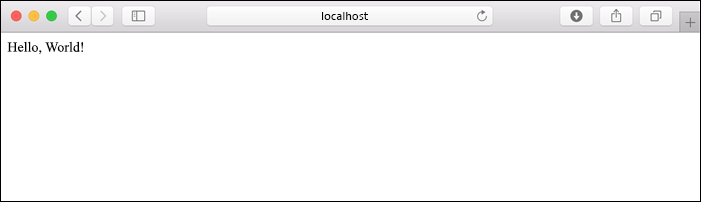

# <a name="quickstart-create-a-python-app-in-azure-app-service-on-linux"></a>クイック スタート:Azure App Service on Linux で Python アプリを作成する

このクイック スタートでは、Azure のスケーラビリティに優れた自己適用型の Web ホスティング サービスである [App Service on Linux](app-service-linux-intro.md) に、Python Web アプリをデプロイします。 Mac、Linux、または Windows コンピューター上で、ローカルの [Azure コマンド ライン インターフェイス (CLI)](/cli/azure/install-azure-cli) を使用します。 構成する Web アプリでは、App Service の Free レベルを使用するため、この記事の中で料金が発生することはありません。

IDE を使用してアプリをデプロイする場合は、[Visual Studio Code から App Service への Python アプリのデプロイ](/azure/python/tutorial-deploy-app-service-on-linux-01)に関する記事をご覧ください。

## <a name="prerequisites"></a>前提条件

- Azure サブスクリプション - [無料アカウントを作成する](https://azure.microsoft.com/free/?ref=microsoft.com&utm_source=microsoft.com&utm_medium=docs&utm_campaign=visualstudio)
- <a href="https://www.python.org/downloads/" target="_blank">Python 3.7</a> (Python 3.6 もサポートされています)
- <a href="https://git-scm.com/downloads" target="_blank">Git</a>
- <a href="https://docs.microsoft.com/cli/azure/install-azure-cli" target="_blank">Azure CLI</a> 2.0.80 以降。 バージョンを確認するには `az --version` を実行します。

## <a name="download-the-sample"></a>サンプルのダウンロード

ターミナル ウィンドウで、次のコマンドを実行して、サンプル アプリケーションをお使いのローカル コンピューターに複製します。 

```terminal
git clone https://github.com/Azure-Samples/python-docs-hello-world
```

次に、そのフォルダーに移動します。

```terminal
cd python-docs-hello-world
```

このリポジトリには、*application.py* ファイルが含まれています。これによって、コードに Flask アプリが含まれていることが App Service に伝えられます。 詳細については、「[コンテナーのスタートアップ プロセスとカスタマイズ](how-to-configure-python.md)」を参照してください。

## <a name="run-the-sample"></a>サンプルを実行する

ターミナル ウィンドウで、(お使いのオペレーティング システムに合わせて) 次のコマンドを使用し、必要な依存関係をインストールして、組み込みの開発サーバーを起動します。 

# <a name="bash"></a>[Bash](#tab/bash)

```bash
python3 -m venv venv
source venv/bin/activate
pip install -r requirements.txt
export FLASK_APP=application.py
flask run
```

# <a name="powershell"></a>[PowerShell](#tab/powershell)

```powershell
py -3 -m venv env
env\scripts\activate
pip install -r requirements.txt
Set-Item Env:FLASK_APP ".\application.py"
flask run
```

# <a name="cmd"></a>[Cmd](#tab/cmd)

```cmd
py -3 -m venv env
env\scripts\activate
pip install -r requirements.txt
SET FLASK_APP=application.py
flask run
```

---

Web ブラウザーを開き、`http://localhost:5000/` のサンプル アプリに移動します。 アプリによって、"**Hello World!** " というメッセージが表示されます。



ターミナル ウィンドウで **Ctrl**+**C** キーを押して、Web サーバーを終了します。

## <a name="sign-in-to-azure"></a>Azure へのサインイン

Azure CLI には、コマンド ラインから Azure リソースをプロビジョニングおよび管理するための、ローカル ターミナルから使用できる便利なコマンドが、多数用意されています。 コマンドを使用して、ブラウザーの Azure portal を通じて実行するのと同じタスクを完了することができます。 また、スクリプト内で CLI コマンドを使用して、管理プロセスを自動化することもできます。

Azure CLI で Azure コマンドを実行するには、最初に `az login` コマンドを使ってサインインする必要があります。 このコマンドを実行すると、お客様の資格情報を収集するためにブラウザーが開かれます。

```azurecli
az login
```

## <a name="deploy-the-sample"></a>サンプルのデプロイ

[`az webapp up`](/cli/azure/webapp#az-webapp-up) コマンドを実行すると、App Service 上に Web アプリが作成され、コードがデプロイされます。

サンプル コードが含まれている *python-docs-hello-world* フォルダーで、次の `az webapp up` コマンドを実行します。 `<app-name>` を、グローバルに一意であるアプリ名に置き換えてください ("*有効な文字は、`a-z`、`0-9`、および `-` です*")。


```azurecli
az webapp up --sku F1 -n <app-name>
```
> [!CAUTION]
> **Azure-CLI バージョン 2.5.0** を使用している場合、前のバージョンにはなかった不具合が `az webapp up` に存在します。`-l <location-name>` パラメーターが指定されないと、特定のシナリオでエラーが発生します。 この問題は、[こちらで追跡](https://github.com/Azure/azure-cli/issues/13257)されています。  
> 
>使用している Azure CLI のバージョンは、`az --version` コマンドを使用して確認できます。
>

`--sku F1` 引数を使用すると、Free 価格レベルで Web アプリが作成されます。 この引数を省略すると、代わりに Premium レベルを使用することができます。その場合、時間単位のコストが発生します。

オプションで引数 `-l <location-name>` を含めることができます。ここで、`<location_name>` は、**centralus**、**eastasia**、**westeurope**、**koreasouth**、**brazilsouth**、**centralindia** などの Azure リージョンです。 [`az account list-locations`](/cli/azure/appservice?view=azure-cli-latest.md#az-appservice-list-locations) コマンドを実行すると、お使いの Azure アカウントで使用可能なリージョンの一覧を取得できます。

`az webapp up` コマンドの実行が完了するまでに、数分かかる場合があります。 実行中、次の例のような情報が表示されます。ここで、`<app-name>` は、前に入力した名前です。

<pre>
Creating Resource group 'appsvc_rg_Linux_centralus' ...
Resource group creation complete
Creating App service plan 'appsvc_asp_Linux_centralus' ...
App service plan creation complete
Creating app '&lt;app-name&gt;' ....
Configuring default logging for the app, if not already enabled
Creating zip with contents of dir D:\Examples\python-docs-hello-world ...
Getting scm site credentials for zip deployment
Starting zip deployment. This operation can take a while to complete ...
Deployment endpoint responded with status code 202
You can launch the app at http://&lt;app-name&gt;.azurewebsites.net
{
  "URL": "http://&lt;app-name&gt;.net",
  "appserviceplan": "appsvc_asp_Linux_centralus",
  "location": "eastus",
  "name": "&lt;app-name&gt;",
  "os": "Linux",
  "resourcegroup": "appsvc_rg_Linux_centralus",
  "runtime_version": "python|3.7",
  "runtime_version_detected": "-",
  "sku": "FREE",
  "src_path": "D:\\Examples\\python-docs-hello-world"
}
</pre>

[!INCLUDE [AZ Webapp Up Note](../../../includes/app-service-web-az-webapp-up-note.md)]

## <a name="browse-to-the-app"></a>アプリの参照

URL `http://<app-name>.azurewebsites.net` を使って、お使いの Web ブラウザーでデプロイされたアプリケーションを参照します。

Python サンプル コードによって、App Service 内で、組み込みのイメージを使用して、Linux コンテナーが実行されています。


**お疲れさまでした。** App Service on Linux に Python アプリをデプロイすることができました。

## <a name="redeploy-updates"></a>更新の再デプロイ

好みのコード エディターで *application.py* を開き、`hello` 関数を次のように更新します。 この変更では、次のセクションで使用するログ出力を生成するための `print` ステートメントを追加しています。 

```python
def hello():
    print("Handling request to home page.")
    return "Hello Azure!"
```

変更内容を保存し、エディターを終了します。 

`az webapp up` コマンドを使用してアプリを再デプロイします。

```azurecli
az webapp up
```

このコマンドでは、 *.azure/config* ファイルにキャッシュされている、アプリ名、リソース グループ、App Service プランなどの値を使用します。

デプロイが完了したら、`http://<app-name>.azurewebsites.net` が開かれているブラウザー ウィンドウに戻り、ページを更新します。これにより、変更されたメッセージが表示されます。


> [!TIP]
> Visual Studio Code には、Python と Azure App Service 用の強力な拡張機能が用意されています。これを使うと、App Service に Python Web アプリをデプロイするプロセスが簡単になります。 詳細については、[Visual Studio Code から App Service への Python アプリのデプロイ](/azure/python/tutorial-deploy-app-service-on-linux-01)に関する記事をご覧ください。

## <a name="stream-logs"></a>ログのストリーミング

アプリ、およびそれを実行するコンテナー内から生成されたコンソール ログに、アクセスすることができます。 ログには、`print` ステートメントを使って生成されたすべての出力が含まれます。

ログをストリーム配信するには、次のコマンドを実行します。

```azurecli
az webapp log tail
```

ブラウザーでアプリを更新して、コンソール ログを生成します。これにより、次のテキストのような行が追加されます。 すぐに出力が表示されない場合は、30 秒後にもう一度お試しください。

<pre>
2020-04-03T22:54:04.236405938Z Handling request to home page.
2020-04-03T22:54:04.236497641Z 172.16.0.1 - - [03/Apr/2020:22:54:04 +0000] "GET / HTTP/1.1" 200 12 "-" "Mozilla/5.0 (Windows NT 10.0; Win64; x64) AppleWebKit/537.36 (KHTML, like Gecko) Chrome/81.0.4044.83 Safari/537.36 Edg/81.0.416.41"
</pre>

`https://<app-name>.scm.azurewebsites.net/api/logs/docker` で、ブラウザーからログ ファイルを検査することもできます。

任意のタイミングでログのストリーミングを停止するには、`Ctrl`+`C` と入力します。

## <a name="manage-the-azure-app"></a>Azure アプリの管理

<a href="https://portal.azure.com" target="_blank">Azure portal</a> に移動し、お客様が作成したアプリを管理します。 **[App Services]** を検索して選択します。


使用する Azure アプリの名前を選択します。


お客様のアプリの [概要] ページを確認します。 ここでは、参照、停止、開始、再開、削除のような基本的な管理タスクを行うことができます。

![Azure portal の [概要] ページで Python アプリを管理する](./media/quickstart-python/manage-an-app-in-app-services-in-the-azure-portal.png)

App Service のメニューには、アプリを構成するためのさまざまなページが用意されています。

## <a name="clean-up-resources"></a>リソースをクリーンアップする

前の手順では、リソース グループ内に Azure リソースを作成しました。 リソース グループには、お客様の場所に応じて "appsvc_rg_Linux_CentralUS" のような名前が付いています。 無料の F1 レベル以外の App Service SKU を使用する場合は、これらのリソースによって継続的なコストが発生します (「[App Service の価格](https://azure.microsoft.com/pricing/details/app-service/linux/)」を参照してください)。

今後これらのリソースを必要とする予定がない場合は、次のコマンドを実行して、リソース グループを削除します。`<resource-group-name>` は、`az webapp up` コマンドの出力に示されているリソース グループ ("appsvc_rg_Linux_centralus" など) に置き換えます。 このコマンドは、完了するまでに少し時間がかかる場合があります。

```azurecli
az group delete -n <resource-group-name>
```

## <a name="next-steps"></a>次のステップ

> [!div class="nextstepaction"]
> [チュートリアル:PostgreSQL を使った Python (Django) Web アプリ](tutorial-python-postgresql-app.md)

> [!div class="nextstepaction"]
> [Python Web アプリにユーザーのサインインを追加する](../../active-directory/develop/quickstart-v2-python-webapp.md)

> [!div class="nextstepaction"]
> [Python アプリの構成](how-to-configure-python.md)

> [!div class="nextstepaction"]
> [チュートリアル:Python アプリをカスタム コンテナーで実行する](tutorial-custom-docker-image.md)
