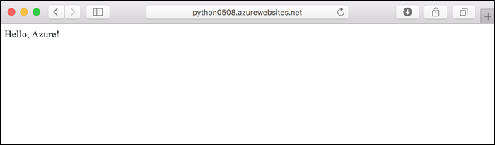
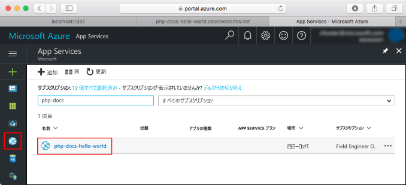

# <a name="deploy-a-python-web-app-in-web-app-for-containers"></a>Web App for Containers で Python Web アプリをデプロイする

[App Service on Linux](app-service-linux-intro.md) は、Linux オペレーティング システムを使用する、高度にスケーラブルな自己適用型の Web ホスティング サービスを提供します。 このクイック スタートでは、Web アプリを作成した後、カスタム Docker Hub イメージを使用して、シンプルな Flask アプリを Web アプリにデプロイする方法を示します。 Web アプリは、[Azure CLI](https://docs.microsoft.com/cli/azure/get-started-with-azure-cli) を使用して作成します。


[!INCLUDE [quickstarts-free-trial-note](../../../includes/quickstarts-free-trial-note.md)]

## <a name="prerequisites"></a>前提条件

このチュートリアルを完了するには、以下が必要です。

* <a href="https://git-scm.com/" target="_blank">Git をインストールする</a>
* <a href="https://www.docker.com/community-edition" target="_blank">Docker Community Edition をインストールする</a>
* <a href="https://hub.docker.com/" target="_blank">Docker Hub アカウントにサインアップする</a>

## <a name="download-the-sample"></a>サンプルのダウンロード

ターミナル ウィンドウで、次のコマンドを実行して、ローカル コンピューターにサンプル アプリケーションを複製し、サンプル コードを含むディレクトリに移動します。

```bash
git clone https://github.com/Azure-Samples/python-docs-hello-world
cd python-docs-hello-world
```

このリポジトリには、_/app_ フォルダー内のシンプルな Flask アプリケーションと、次の 3 つを指定する _Dockerfile_ が含まれています。

- [tiangolo/uwsgi-nginx-flask:python3.6-alpine3.7](https://hub.docker.com/r/tiangolo/uwsgi-nginx-flask/) 基本イメージを使用する。
- コンテナーはポート 8000 をリッスンする必要がある。
- `/app` ディレクトリをコンテナーの `/app` ディレクトリにコピーする。

構成は、[基本イメージの説明](https://hub.docker.com/r/tiangolo/uwsgi-nginx-flask/)に従います。

## <a name="run-the-app-locally"></a>アプリをローカルで実行する

アプリを Docker コンテナーで実行します。

```bash
docker build --rm -t flask-quickstart .
docker run --rm -it -p 8000:8000 flask-quickstart
```

Web ブラウザーを開き、`http://localhost:8000` のサンプル アプリに移動します。

ページに表示されているサンプル アプリの **Hello World** メッセージが表示されます。


ターミナル ウィンドウで **Ctrl + C** キーを押して、コンテナーを停止します。

## <a name="deploy-image-to-docker-hub"></a>イメージを Docker Hub にデプロイする

Docker Hub アカウントにサインインします。 画面の指示に従って、Docker Hub の資格情報を入力します。

```bash
docker login
```

イメージをタグ付けし、Docker Hub アカウントの新しい "_パブリック_" リポジトリである `flask-quickstart` にプッシュします。 *\<dockerhub_id>* は、Docker Hub ID に置き換えます。

```bash
docker tag flask-quickstart <dockerhub_id>/flask-quickstart
docker push <dockerhub_id>/flask-quickstart
```

> [!NOTE]
> `docker push` は、指定されたリポジトリが見つからない場合、パブリック リポジトリを作成します。 このクイック スタートでは、Docker Hub 内の パブリック リポジトリを想定しています。 プライベート リポジトリにプッシュする場合は、後で Azure App Service を使用して Docker Hub の資格情報を構成する必要があります。 「[Web アプリを作成する](#create-a-web-app)」を参照してください。

イメージのプッシュが完了すると、Azure Web アプリでそのイメージを使用できるようになります。

[!INCLUDE [cloud-shell-try-it.md](../../../includes/cloud-shell-try-it.md)]

[!INCLUDE [Create resource group](../../../includes/app-service-web-create-resource-group-linux.md)]

[!INCLUDE [Create app service plan](../../../includes/app-service-web-create-app-service-plan-linux.md)]

## <a name="create-a-web-app"></a>Web アプリを作成する

[az webapp create](/cli/azure/webapp?view=azure-cli-latest#az-webapp-create) コマンドを使って、`myAppServicePlan`App Service プランに [Web アプリ](../app-service-web-overview.md)を作成します。 *\<app name>* は、グローバルに一意なアプリ名、*\<dockerhub_id>* は、Docker Hub ID に置き換えます。

```azurecli-interactive
az webapp create --resource-group myResourceGroup --plan myAppServicePlan --name <app name> --deployment-container-image-name <dockerhub_id>/flask-quickstart
```

Web アプリが作成されると、Azure CLI によって次の例のような出力が表示されます。

```json
{
  "availabilityState": "Normal",
  "clientAffinityEnabled": true,
  "clientCertEnabled": false,
  "cloningInfo": null,
  "containerSize": 0,
  "dailyMemoryTimeQuota": 0,
  "defaultHostName": "<app name>.azurewebsites.net",
  "deploymentLocalGitUrl": "https://<username>@<app name>.scm.azurewebsites.net/<app name>.git",
  "enabled": true,
  < JSON data removed for brevity. >
}
```

プライベート リポジトリに以前アップロードした場合は、App Service で Docker Hub の資格情報を構成する必要もあります。 詳細については、「[Docker Hub からプライベート イメージを使用する](tutorial-custom-docker-image.md#use-a-private-image-from-docker-hub-optional)」を参照してください。

### <a name="specify-container-port"></a>コンテナー ポートを指定する

_Dockerfile_ に指定されているように、コンテナーはポート 8000 をリッスンします。 App Service が要求を正しいポートにルーティングするには、*WEBSITES_PORT* アプリ設定を設定する必要があります。

Cloud Shell 内で、[`az webapp config appsettings set`](/cli/azure/webapp/config/appsettings?view=azure-cli-latest#az-webapp-config-appsettings-set) コマンドを実行します。


```azurecli-interactive
az webapp config appsettings set --name <app_name> --resource-group myResourceGroup --settings WEBSITES_PORT=8000
```

## <a name="browse-to-the-app"></a>アプリの参照

```bash
http://<app_name>.azurewebsites.net/
```


> [!NOTE]
> Web アプリの起動には少し時間がかかります。これは、アプリが最初に要求されたときは、Docker Hub イメージをダウンロードして実行する必要があるためです。 だいぶ時間が経ってから最初にエラーが表示された場合は、ページを更新してください。

**お疲れさまでした。** Python アプリを実行しているカスタム Docker イメージが Web App for Containers にデプロイされました。

## <a name="update-locally-and-redeploy"></a>ローカルで更新して再デプロイする

ローカルのテキスト エディターを使用して、Python アプリ内の `app/main.py` ファイルを開き、`return` ステートメントの横のテキストを少し変更します。

```python
return 'Hello, Azure!'
```

イメージをリビルドして、もう一度 Docker Hub にプッシュします。

```bash
docker build --rm -t flask-quickstart .
docker tag flask-quickstart <dockerhub_id>/flask-quickstart
docker push <dockerhub_id>/flask-quickstart
```

Cloud Shell 内で、アプリを再起動します。 アプリを再起動すると、すべての設定が適用され、最新のコンテナーがレジストリからプルされます。

```azurecli-interactive
az webapp restart --resource-group myResourceGroup --name <app_name>
```

更新されたイメージを App Service がプルするには、15 秒ほどかかります。 「**アプリの参照**」の手順で開いたブラウザー ウィンドウに戻り、ページを更新します。



## <a name="manage-your-azure-web-app"></a>Azure Web アプリを管理する

[Azure Portal](https://portal.azure.com) に移動し、作成した Web アプリを表示します。

左側のメニューで **[App Services (App Services)]** をクリックした後、Azure Web アプリの名前をクリックします。



既定では、ポータルは Web アプリの **[概要]** ページを表示します。 このページでは、アプリの動作状態を見ることができます。 ここでは、参照、停止、開始、再開、削除のような基本的な管理タスクも行うことができます。 ページの左側にあるタブは、開くことができるさまざまな構成ページを示しています。

![Azure Portal の [App Service] ページ](./media/quickstart-python/app-service-detail.png)

[!INCLUDE [Clean-up section](../../../includes/cli-script-clean-up.md)]

## <a name="next-steps"></a>次の手順

> [!div class="nextstepaction"]
> [Python と PostgreSQL](tutorial-docker-python-postgresql-app.md)

> [!div class="nextstepaction"]
> [カスタム イメージを使用する](tutorial-custom-docker-image.md)