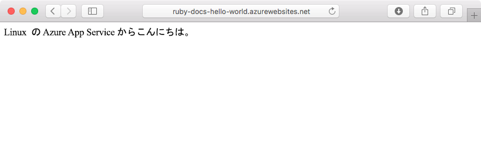
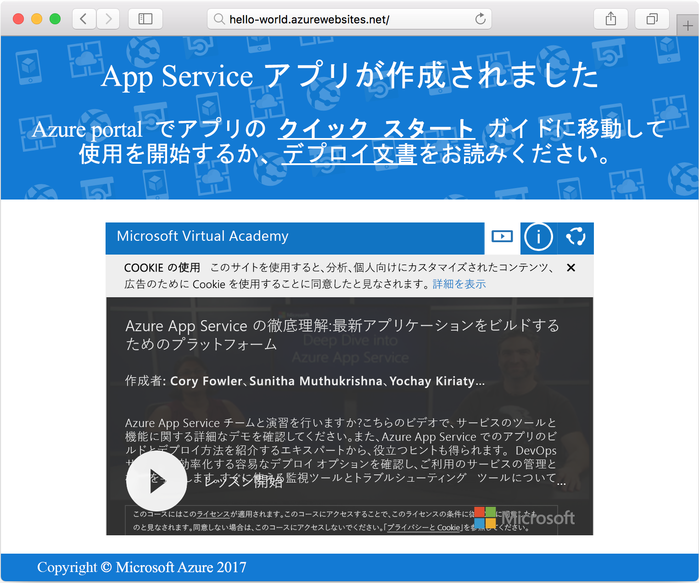

# <a name="create-a-ruby-app-in-app-service-on-linux"></a>App Service on Linux での Ruby アプリの作成

[App Service on Linux](app-service-linux-intro.md) では、高度にスケーラブルな自己適用型の Web ホスティング サービスを提供しています。 このクイック スタートでは、基本的な Ruby on Rails アプリケーションを作成した後、Web App on Linux として Azure にデプロイする方法を示します。


## <a name="prerequisites"></a>前提条件

* <a href="https://www.ruby-lang.org/en/documentation/installation/#rubyinstaller" target="_blank">Ruby 2.4.1 以降のインストール</a>
* <a href="https://git-scm.com/" target="_blank">Git をインストールする</a>

[!INCLUDE [quickstarts-free-trial-note](../../../includes/quickstarts-free-trial-note.md)]

## <a name="download-the-sample"></a>サンプルのダウンロード

ターミナル ウィンドウで、次のコマンドを実行して、サンプル アプリのリポジトリをローカル コンピューターに複製します。

```bash
git clone https://github.com/Azure-Samples/ruby-docs-hello-world
```

## <a name="run-the-application-locally"></a>ローカルでアプリケーションを実行する

アプリケーションを動作させるために、Rails サーバーを実行します。 *hello-world* ディレクトリに変更し、`rails server` コマンドでサーバーを起動します。

```bash
cd hello-world\bin
rails server
```

Web ブラウザーで `http://localhost:3000` に移動して、ローカルでアプリケーションをテストします。


## <a name="modify-app-to-display-welcome-message"></a>ウェルカム メッセージを表示するようにアプリを変更する

ウェルカム メッセージを表示するようにアプリケーションを変更します。 最初にルートを設定する必要があります。そのためには、*~/workspace/ruby-docs-hello-world/config/routes.rb* ファイルを編集して `hello` という名前のルートを含めます。

  ```ruby
  Rails.application.routes.draw do
      #For details on the DSL available within this file, see http://guides.rubyonrails.org/routing.html
      root 'application#hello'
  end
  ```

ブラウザーに HTML としてメッセージを返すように、アプリケーションのコントローラーを変更します。 

編集するために *~/workspace/hello-world/app/controllers/application_controller.rb* を開きます。 次のコード サンプルになるように `ApplicationController` クラスを変更します。

  ```ruby
  class ApplicationController > ActionController :: base
    protect_from_forgery with: :exception
    def hello
      render html: "Hello, world from Azure Web App on Linux!"
    end
  end
  ```

これでアプリの構成は完了です。 Web ブラウザーで `http://localhost:3000` に移動して、ルート ランディング ページを確認します。



[!INCLUDE [Try Cloud Shell](../../../includes/cloud-shell-try-it.md)]

[!INCLUDE [Configure deployment user](../../../includes/configure-deployment-user.md)]

## <a name="create-a-ruby-web-app-on-azure"></a>Azure で Ruby Web アプリを作成する

Web アプリに必要なアセットを格納するリソース グループが必要です。 リソース グループを作成するには、[az group create]() コマンドを使用します。

```azurecli-interactive
az group create --location westeurope --name myResourceGroup
```

[az appservice plan create](https://docs.microsoft.com/cli/azure/appservice/plan#az_appservice_plan_create) コマンドで、Web アプリの App Service プランを作成します。

```azurecli-interactive
az appservice plan create --name myAppServicePlan --resource-group myResourceGroup --is-linux
```

次に、[az webapp create](https://docs.microsoft.com/cli/azure/webapp) コマンドを発行して、新しく作成されたサービス プランを使用する Web アプリを作成します。 ランタイムが `ruby|2.3` に設定されていることに注意してください。 `<app name>` を固有のアプリ名に置き換えることを忘れないでください。

```azurecli-interactive
az webapp create --resource-group myResourceGroup --plan myAppServicePlan --name <app name> \
--runtime "ruby|2.3" --deployment-local-git
```

コマンドの出力に、新規作成された Web アプリに関する情報とデプロイ先の URL が表示されます。 出力は次のようになります。 このチュートリアルで後から使用するので、URL をコピーしておきます。

```bash
https://<deployment user name>@<app name>.scm.azurewebsites.net/<app name>.git
```

Web アプリが作成されたら、**概要**ページを表示できます。 そこに移動します。 次のスプラッシュ ページが表示されます。




## <a name="deploy-your-application"></a>アプリケーションをデプロイする

次のコマンドを実行して、ローカル アプリケーションを Azure Web サイトにデプロイします。

```bash
git remote add azure <Git deployment URL from above>
git add -A
git commit -m "Initial deployment commit"
git push azure master
```

リモート デプロイ操作が正しく報告されていることを確認します。 これらのコマンドは、次のテキストに似た出力を生成します。

```bash
remote: Using sass-rails 5.0.6
remote: Updating files in vendor/cache
remote: Bundle gems are installed into ./vendor/bundle
remote: Updating files in vendor/cache
remote: ~site/repository
remote: Finished successfully.
remote: Running post deployment command(s)...
remote: Deployment successful.
To https://<your web app name>.scm.azurewebsites.net/<your web app name>.git
  579ccb....2ca5f31  master -> master
myuser@ubuntu1234:~workspace/<app name>$
```

デプロイが完了したら、次に示すように [az webapp restart](https://docs.microsoft.com/cli/azure/webapp#az_webapp_restart) コマンドを使用して Web アプリを再起動してデプロイが有効になるようにします。

```azurecli-interactive
az webapp restart --name <app name> --resource-group myResourceGroup
```

サイトに移動して結果を確認します。

```bash
http://<app name>.azurewebsites.net
```


> [!NOTE]
> アプリの再起動中にサイトを参照しようとすると、結果は HTTP 状態コード `Error 503 Server unavailable` になります。 完全に再起動するまで、数分かかる場合があります。
>

[!INCLUDE [Clean-up section](../../../includes/cli-script-clean-up.md)]

## <a name="next-steps"></a>次のステップ

[Azure App Service on Linux の FAQ](https://docs.microsoft.com/azure/app-service-web/app-service-linux-faq.md)
