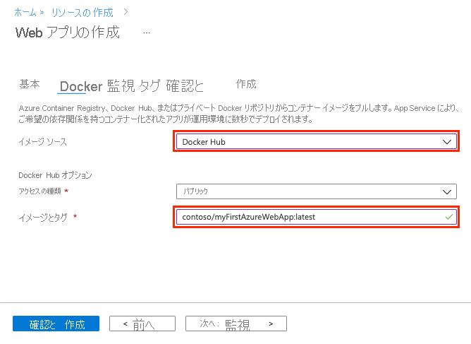
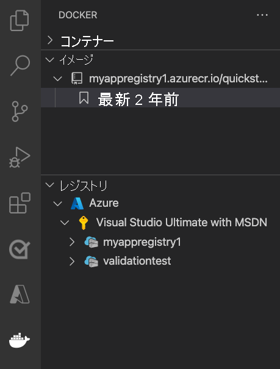
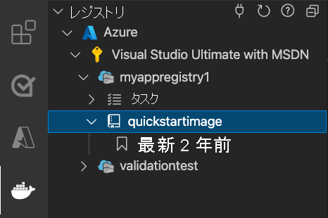

# <a name="run-a-custom-container-in-azure"></a>Azure でカスタム コンテナーを実行する

::: zone pivot="container-windows"
[Azure App Service](overview.md) は、IIS 上で稼働する ASP.NET や IIS 上で稼働する Node.js など、Windows 上の定義済みのアプリケーション スタックを提供します。 ただし、構成済みのアプリケーション スタックでは、[オペレーティング システムがロック ダウンされ、低レベルのアクセスが阻止されます](operating-system-functionality.md)。 カスタムの Windows コンテナーにはこれらの制限はないため、開発者はコンテナーを完全にカスタマイズし、コンテナー化されたアプリケーションに Windows 機能へのフルアクセスを与えることができます。 

このクイックスタートでは、Visual Studio から [Azure Container Registry](../container-registry/container-registry-intro.md) に、Windows イメージで ASP.NET アプリをデプロイする方法について説明します。 アプリは、Azure App Service のカスタム コンテナーで実行します。

## <a name="prerequisites"></a>前提条件

このチュートリアルを完了するには、次のものが必要です。

- <a href="https://docs.docker.com/docker-for-windows/install/" target="_blank">Docker for Windows をインストールする</a>。
- <a href="/virtualization/windowscontainers/quick-start/quick-start-windows-10" target="_blank">Windows コンテナーを実行するように Docker を切り替える</a>。
- **ASP.NET と Web 開発** ワークロードと **Azure の開発** ワークロードを含めて <a href="https://www.visualstudio.com/downloads/" target="_blank">Visual Studio 2022 をインストールする</a>。 *Visual Studio 2022 Community* で、**ASP.NET と Web 開発ワークロード** とともに **[.NET Framework project and item templates]\(.NET Framework プロジェクトと項目テンプレート\)** コンポーネントが選択されていることを確認してください。 Visual Studio 2022 を既にインストールしている場合:
    - **[ヘルプ]**  >  **[更新プログラムの確認]** の順に選択して、Visual Studio に最新の更新プログラムをインストールします。
    - **[ツール]**  >  **[ツールと機能を取得]** の順に選択し、Visual Studio にワークロードを追加します。

## <a name="create-an-aspnet-web-app"></a>ASP.NET Web アプリを作成する

次の手順に従って ASP.NET Web アプリを作成します。

1. Visual Studio を開き、 **[新しいプロジェクトの作成]** を選択します。

1. **[新しいプロジェクトの作成]** で、C# の **[ASP.NET Web アプリケーション (.NET Framework)]** を選択し、 **[次へ]** を選択します。

   :::image type="content" source="./media/quickstart-custom-container/create-new-project.png?text=VS create a new project" alt-text="新しいプロジェクトを作成する":::

1. **[新しいプロジェクトの構成]** の **[プロジェクト名]** で、アプリケーションに _myfirstazurewebapp_ という名前を付けます。 **[フレームワーク]** で、 **.NET Framework 4.8** を選択してから、 **[作成]** を選択します。

    :::image type="content" source="./media/quickstart-custom-container/configure-web-app-project-container.png?text=Configure your web app project" alt-text="Web アプリ プロジェクトを構成する":::

1. 任意の種類の ASP.NET Web アプリを Azure にデプロイできます。 このクイックスタートでは、 **[MVC]** テンプレートを選択します。

1. **[認証]** で、 **[なし]** を選択します **[詳細設定]** で **[Docker support]\(Docker サポート\)** を選択し、 **[Configure for HTTPS]\(HTTPS 用に構成する\)** チェック ボックスをオフにします。 **［作成］** を選択します

     :::image type="content" source="./media/quickstart-custom-container/select-mvc-template-for-container.png?text=Create ASP.NET Web Application" alt-text="ASP.NET Web アプリケーションを作成する":::

1. _Dockerfile_ ファイルが自動的に開かない場合は、**ソリューション エクスプローラー** から開きます。

1. [サポートされている親イメージ](configure-custom-container.md#supported-parent-images)が必要です。 `FROM` 行を次のコードに置き換えることで親イメージを変更し、ファイルを保存します。

   ```dockerfile
   FROM mcr.microsoft.com/dotnet/framework/aspnet:4.8-windowsservercore-ltsc2019
   ```

1. Visual Studio のメニューから **[デバッグ]**  >  **[デバッグなしで開始]** の順に選択して、Web アプリをローカルで実行します。

    :::image type="content" source="./media/quickstart-custom-container/local-web-app.png?text=Run app locally" alt-text="アプリをローカルで実行する":::

## <a name="publish-to-azure-container-registry"></a>Azure Container Registry に発行する

1. **ソリューション エクスプローラー** で **myfirstazurewebapp** プロジェクトを右クリックし、 **[発行]** を選択します。

1. **[ターゲット]** で **[Docker Container Registry]** を選択し、 **[次へ]** をクリックします。

    :::image type="content" source="./media/quickstart-custom-container/select-docker-container-registry-visual-studio-2022.png?text=Select Docker Container Registry" alt-text="Docker Container Registry を選択する":::

1. **[特定のターゲット]** で **[Azure Container Registry]** を選択し、 **[次へ]** をクリックします。

    :::image type="content" source="./media/quickstart-custom-container/publish-to-azure-container-registry-visual-studio-2022.png?text=Publish to Azure Container Registry" alt-text="プロジェクトの概要ページから発行する":::

1. **[発行]** で、正しいサブスクリプションが選択されていることを確認します。 **[コンテナー レジストリ]** で、 **+** ボタンを選択して新しい Azure Container Registry を作成します。

    :::image type="content" source="./media/quickstart-custom-container/create-new-azure-container-registry.png?text=Create new Azure Container Registry" alt-text="新しい Azure Container Registry を作成する":::

1. **[新規作成]** で、正しいサブスクリプションが選択されていることを確認します。 **[リソース グループ]** で、 **[新規]** を選択し、名前として「*myResourceGroup*」と入力して、 **[OK]** をクリックします。 **[SKU]** で、 **[Basic]** を選択します。 **[レジストリの場所]** で、レジストリの場所を選択してから、 **[作成]** を選択します。

    :::image type="content" source="./media/quickstart-custom-container/new-azure-container-registry-details.png?text=Azure Container Registry details" alt-text="Azure Container Registry の詳細":::

1. **[発行]** の **[コンテナー レジストリ]** で、作成したレジストリを選択し、 **[完了]** を選択します。

    :::image type="content" source="./media/quickstart-custom-container/select-existing-azure-container-registry.png?text=Select existing Azure Container Registry" alt-text="既存の Azure Container Registry を選択する":::

   デプロイが完了するまで待ちます。 **[発行]** ページに、リポジトリ名が表示されるようになります。 後で使用するために **リポジトリ** 名をコピーするには、"コピー ボタン" を選択します *。*

    :::image type="content" source="./media/quickstart-custom-container/published-docker-repository-visual-studio-2022.png?text=Screenshot that highlights the repository name." alt-text="リポジトリ名が強調表示されているスクリーンショット。":::

## <a name="create-a-windows-container-app"></a>Windows コンテナー アプリの作成

1. [Azure portal](https://portal.azure.com) にサインインします。

1. Azure portal の左上隅にある **[リソースの作成]** を選択します。

1. **[人気のあるサービス]** の **[Web アプリ]** で、 **[作成]** を選択します。

1. **[Web アプリの作成]** で、サブスクリプションと **リソース グループ** を選択します。 必要な場合は、新しいリソース グループを作成できます。

1. アプリ名 (*win-container-demo* など) を指定します。 **[発行]** に **[Docker コンテナー]** 、 **[オペレーティング システム]** に **[Windows]** を選択します。 **Docker** を選択して続行します。

   

1. **[イメージのソース]** に **[Docker Hub]** を選択し、 **[イメージとタグ]** に、「[Azure Container Registry に発行する](#publish-to-azure-container-registry)」でコピーしたリポジトリ名を入力します。

   

    [Azure Container Registry](../container-registry/index.yml) や他のプライベート リポジトリなど、どこか他の場所に目的の Web アプリケーションのカスタム イメージがある場合は、ここで構成することができます。

1. **[確認と作成]** 、 **[作成]** の順に選択して、必要なリソースが Azure によって作成されるまで待ちます。

## <a name="browse-to-the-container-app"></a>コンテナー アプリにブラウザーでアクセスする

Azure の処理が完了すると、通知ボックスが表示されます。


1. **[リソースに移動]** をクリックします。

1. このリソースの概要で、 **[URL]** の横にあるリンクに移動します。

新しいブラウザー ページが開いて次のページが表示されます。


数分待ってから再試行すると、既定の ASP.NET ホーム ページが表示されます。


**お疲れさまでした。** 初めてのカスタム Windows コンテナーを Azure App Service で実行することができました。

## <a name="see-container-start-up-logs"></a>コンテナーの起動ログの表示

Windows コンテナーが読み込まれるまでにしばらく時間がかかる場合があります。 進行状況を確認するには、 *\<app_name>* をアプリの名前に置き換えて次の URL に移動します。
```
https://<app_name>.scm.azurewebsites.net/api/logstream
```

次のようなログがストリーム配信されます。

```
2018-07-27T12:03:11  Welcome, you are now connected to log-streaming service.
27/07/2018 12:04:10.978 INFO - Site: win-container-demo - Start container succeeded. Container: facbf6cb214de86e58557a6d073396f640bbe2fdec88f8368695c8d1331fc94b
27/07/2018 12:04:16.767 INFO - Site: win-container-demo - Container start complete
27/07/2018 12:05:05.017 INFO - Site: win-container-demo - Container start complete
27/07/2018 12:05:05.020 INFO - Site: win-container-demo - Container started successfully
```

## <a name="update-locally-and-redeploy"></a>ローカルで更新して再デプロイする

1. Visual Studio の **ソリューション エクスプローラー** から、 **[表示]**  >  **[ホーム]**  >  **[Index.cshtml]** の順に開きます。

1. 上部の `<div class="jumbotron">` HTML タグを検索し、要素全体を次のコードに置き換えます。

   ```html
   <div class="jumbotron">
       <h1>ASP.NET in Azure!</h1>
       <p class="lead">This is a simple app that we've built that demonstrates how to deploy a .NET app to Azure App Service.</p>
   </div>
   ```

1. Azure に再デプロイするには、**ソリューション エクスプローラー** で **myfirstazurewebapp** プロジェクトを右クリックし、 **[発行]** を選択します。

1. 発行ページで **[発行]** を選択し、発行が完了するまで待ちます。

1. App Service に Docker Hub から新しいイメージをプルするよう指示するには、アプリを再起動します。 ポータルでアプリ ページに戻り、 **[再起動]**  >  **[はい]** をクリックします。

   

再び[コンテナー アプリにブラウザーでアクセス](#browse-to-the-container-app)します。 Web ページを更新すると、アプリは最初に "起動" ページに戻った後、数分すると更新された Web ページが再び表示されます。


## <a name="next-steps"></a>次のステップ

> [!div class="nextstepaction"]
> [Azure で Windows コンテナーに移行する](tutorial-custom-container.md)

または、他のリソースを参照してください。

> [!div class="nextstepaction"]
> [カスタム コンテナーの構成](configure-custom-container.md)

::: zone-end  

::: zone pivot="container-linux"
App Service on Linux は、事前定義済みのアプリケーション スタックを Linux 上で提供し、.NET、PHP、Node.js などの言語をサポートします。 まだ Azure で定義されていないアプリケーション スタックで Web アプリを実行する場合にも、カスタム Docker イメージを使用できます。 このクイックスタートでは、[Azure Container Registry](../container-registry/index.yml) (ACR) から App Service にイメージをデプロイする方法について説明します。

## <a name="prerequisites"></a>前提条件

* [Azure アカウント](https://azure.microsoft.com/free/?utm_source=campaign&utm_campaign=vscode-tutorial-docker-extension&mktingSource=vscode-tutorial-docker-extension)
* [Docker](https://www.docker.com/community-edition)
* [Visual Studio Code](https://code.visualstudio.com/)
* [VS Code 用 Azure App Service 拡張情報](https://marketplace.visualstudio.com/items?itemName=ms-azuretools.vscode-azureappservice)。 この拡張機能を使用して、Azure PaaS (サービスとしてのプラットフォーム) 上に Linux Web Apps を作成、管理、デプロイすることができます。
* [VS Code 用 Docker 拡張機能](https://marketplace.visualstudio.com/items?itemName=ms-azuretools.vscode-docker)。 この拡張機能を使用して、ローカルの Docker イメージと Docker コマンドの管理を簡素化し、作成したアプリ イメージを Azure にデプロイすることができます。

## <a name="create-a-container-registry"></a>コンテナー レジストリを作成する

このクイックスタートでは、選択するレジストリとして Azure Container Registry を使用します。 他のレジストリは自由に使用できますが、手順は若干異なる場合があります。

[Azure portal を使用してプライベート コンテナー レジストリを作成するためのクイックスタート](../container-registry/container-registry-get-started-portal.md)の手順に従って、コンテナー レジストリを作成します。

> [!IMPORTANT]
> Azure コンテナー レジストリを作成するときは必ず、 **[管理者ユーザー]** オプションを **[有効]** に設定してください。 Azure portal のレジストリ ページの **[アクセス キー]** セクションから設定することもできます。 App Service にアクセスするためには、この設定が必要となります。 マネージド ID については、[「ACR からのデプロイ」のチュートリアル](tutorial-custom-container.md?pivots=container-linux#configure-app-service-to-deploy-the-image-from-the-registry)を参照してください。

## <a name="sign-in"></a>サインイン

1. Visual Studio Code を起動します。 
1. [アクティビティ バー](https://code.visualstudio.com/docs/getstarted/userinterface)で **[Azure]** ロゴを選択し、 **[APP SERVICE]** エクスプローラーに移動して **[Azure にサインイン]** を選択し、画面の指示に従います。

    

1. 下部の[ステータス バー](https://code.visualstudio.com/docs/getstarted/userinterface)で、Azure アカウントのメール アドレスが表示されていることを確認します。 **[APP SERVICE]** エクスプローラーに、サブスクリプションが表示されます。

1. アクティビティ バーで、 **[Docker]** ロゴを選択します。 **[レジストリ]** エクスプローラーで、作成したコンテナー レジストリが表示されていることを確認します。

    ![[Azure] が展開されている [レジストリ] の値を示すスクリーンショット。](./media/quickstart-docker/registries.png)

## <a name="check-prerequisites"></a>前提条件を確認する

Docker がインストールされ、実行されていることを確認します。 次のコマンドは、Docker が実行されている場合に、そのバージョンを表示するものです。

```bash
docker --version
```

## <a name="create-and-build-image"></a>イメージを作成およびビルドする

1. Visual Studio Code で空のフォルダーを開き、`Dockerfile` という名前のファイルを追加します。 Dockerfile で、目的の言語フレームワークに基づいてコンテンツを貼り付けます。

# <a name="net"></a>[.NET](#tab/dotnet)

<!-- https://mcr.microsoft.com/v2/appsvc%2Fdotnetcore/tags/list -->
```dockerfile
FROM mcr.microsoft.com/appsvc/dotnetcore:lts

ENV PORT 8080
EXPOSE 8080

ENV ASPNETCORE_URLS "http://*:${PORT}"

ENTRYPOINT ["dotnet", "/defaulthome/hostingstart/hostingstart.dll"]
```

この Dockerfile では、親イメージは App Service の組み込み .NET コンテナーの 1 つです。 そのソース ファイルは、[Azure-App-Service/ImageBuilder GitHub リポジトリの GenerateDockerFiles/dotnetcore](https://github.com/Azure-App-Service/ImageBuilder/tree/master/GenerateDockerFiles/dotnetcore) にあります。 その [Dockerfile](https://github.com/Azure-App-Service/ImageBuilder/blob/master/GenerateDockerFiles/dotnetcore/debian-9/Dockerfile) では、単純な .NET アプリが `/defaulthome/hostingstart` にコピーされます。 Dockerfile により、そのアプリが起動されます。

# <a name="nodejs"></a>[Node.js](#tab/node)

<!-- https://mcr.microsoft.com/v2/appsvc%2Fnode/tags/list -->
```dockerfile
FROM mcr.microsoft.com/appsvc/node:10-lts

ENV HOST 0.0.0.0
ENV PORT 8080
EXPOSE 8080

ENTRYPOINT ["pm2", "start", "--no-daemon", "/opt/startup/default-static-site.js"]
```

この Dockerfile では、親イメージは App Service の組み込みの Node.js コンテナーの 1 つです。 そのソース ファイルは、[Azure-App-Service/ImageBuilder GitHub リポジトリの GenerateDockerFiles/node/node-template](https://github.com/Azure-App-Service/ImageBuilder/tree/master/GenerateDockerFiles/node/node-template) にあります。 その [Dockerfile](https://github.com/Azure-App-Service/ImageBuilder/blob/master/GenerateDockerFiles/node/node-template/Dockerfile) では、単純な Node.js アプリが `/opt/startup` にコピーされます。 Dockerfile により、親イメージで既にインストールされている PM2 を使用して、そのアプリが起動されます。

# <a name="python"></a>[Python](#tab/python)

<!-- https://mcr.microsoft.com/v2/appsvc%2Fpython/tags/list -->
```dockerfile
FROM mcr.microsoft.com/appsvc/python:latest

ENV PORT 8080
EXPOSE 8080

ENTRYPOINT ["gunicorn", "--timeout", "600", "--access-logfile", "'-'", "--error-logfile", "'-'", "--chdir=/opt/defaultsite", "application:app"]
```

この Dockerfile では、親イメージは App Service の組み込み Python コンテナーの 1 つです。 そのソース ファイルは、[Azure-App-Service/ImageBuilder GitHub リポジトリの GenerateDockerFiles/python/template-3.9](https://github.com/Azure-App-Service/ImageBuilder/tree/master/GenerateDockerFiles/python/template-3.9) にあります。 その [Dockerfile](https://github.com/Azure-App-Service/ImageBuilder/blob/master/GenerateDockerFiles/python/template-3.9/Dockerfile) では、単純な Python アプリが `/opt/defaultsite` にコピーされます。 Dockerfile により、親イメージで既にインストールされている Gunicorn を使用して、そのアプリが起動されます。

# <a name="java"></a>[Java](#tab/java)

<!-- https://mcr.microsoft.com/v2/azure-app-service%2Fjava/tags/list -->
```dockerfile
FROM mcr.microsoft.com/azure-app-service/java:11-java11_stable

ENV PORT 80
EXPOSE 80

ENTRYPOINT ["java", "-Dserver.port=80", "-jar", "/tmp/appservice/parkingpage.jar"]
```

この Dockerfile では、親イメージは App Service の組み込み Java コンテナーの 1 つです。 そのソース ファイルは、[Azure-App-Service/java GitHub リポジトリの java/tree/dev/java11-alpine](https://github.com/Azure-App-Service/java/tree/dev/java11-alpine) にあります。 その [Dockerfile](https://github.com/Azure-App-Service/java/blob/dev/java11-alpine/Dockerfile) では、単純な Java アプリが `/tmp/appservice` にコピーされます。 Dockerfile により、そのアプリが起動されます。

-----

2. [コマンド パレット](https://code.visualstudio.com/docs/getstarted/userinterface#_command-palette)を開き、「**Docker Images: Build Image**」と入力します。 「**Enter**」と入力して、コマンドを実行します。

3. イメージ タグ ボックスで、目的のタグを `<acr-name>.azurecr.io/<image-name>/<tag>` の形式で指定します。ここで、`<acr-name>` は、作成したコンテナー レジストリの名前です。 **Enter** キーを押します。

4. イメージのビルドが終了したら、 **[イメージ]** エクスプローラーの上部にある **[更新]** をクリックして、イメージが正常にビルドされていることを確認します。

    

## <a name="deploy-to-container-registry"></a>コンテナー レジストリにデプロイする

1. アクティビティ バーで、 **[Docker]** アイコンをクリックします。 **[イメージ]** エクスプローラーで、先ほどビルドしたイメージを見つけます。
1. イメージを展開し、目的のタグを右クリックして、 **[プッシュ]** をクリックします。
1. イメージ タグの先頭が `<acr-name>.azurecr.io` であることを確認し、**Enter** キーを押します。
1. Visual Studio Code でコンテナー レジストリへのイメージのプッシュが完了したら、 **[レジストリ]** エクスプローラーの上部にある **[更新]** をクリックして、イメージが正常にプッシュされたことを確認します。

    

## <a name="deploy-to-app-service"></a>App Service に配置する

1. **[レジストリ]** エクスプローラーでイメージを展開し、タグを右クリックして、 **[Deploy image to Azure App Service]\(Azure App Service にイメージをデプロイする\)** をクリックします。
1. プロンプトに従って、サブスクリプション、グローバルに一意なアプリ名、リソース グループ、App Service プランを選択します。 価格レベルには **[B1 Basic]** を選択し、現在地に近いリージョンを選択します。

デプロイ後は、`http://<app-name>.azurewebsites.net` でアプリにアクセスできます。

**リソース グループ** は、Azure で利用するすべてのアプリケーションのリソースをまとめた名前付きのコレクションです。 たとえば、Web サイトやデータベース、Azure 関数への参照をリソース グループに含めることができます。

Web サイトをホストするために使用される物理リソースは、**App Service プラン** によって定義されます。 このクイックスタートでは、**Linux** インフラストラクチャ上の **Basic** ホスティング プランを使用します。つまりサイトは Linux マシン上で、他の Web サイトと一緒にホストされます。 **Basic** プランから開始すれば、マシン上で自分のサイトだけが実行されるように、Azure portal を使用してスケールアップすることができます。 価格については、「[App Service の価格](https://azure.microsoft.com/pricing/details/app-service/linux)」をご覧ください。

## <a name="browse-the-website"></a>Web サイトを閲覧する

**[出力]** パネルに、デプロイ操作の状態が表示されます。 操作が完了したら、ポップアップ通知の **[サイトを開く]** をクリックして、サイトをブラウザーで開きます。

> [!div class="nextstepaction"]
> [問題が発生しました](https://www.research.net/r/PWZWZ52?tutorial=quickstart-docker&step=deploy-app)

## <a name="next-steps"></a>次のステップ

おめでとうございます。このクイックスタートを正常に完了できました。

App Service アプリでは、起動のたびにコンテナー レジストリからプルされます。 イメージをリビルドする場合は、コンテナー レジストリにプッシュするだけで済み、アプリの再起動時に更新されたイメージが取得されます。 更新されたイメージをすぐにプルするようにアプリに指示するには、アプリを再起動します。

> [!div class="nextstepaction"]
> [カスタム コンテナーの構成](configure-custom-container.md)

> [!div class="nextstepaction"]
> [カスタム コンテナーのチュートリアル](tutorial-custom-container.md)

> [!div class="nextstepaction"]
> [複数コンテナー アプリのチュートリアル](tutorial-multi-container-app.md)

その他の Azure 拡張機能は次のとおりです。

* [Cosmos DB](https://marketplace.visualstudio.com/items?itemName=ms-azuretools.vscode-cosmosdb)
* [Azure Functions](https://marketplace.visualstudio.com/items?itemName=ms-azuretools.vscode-azurefunctions)
* [Azure CLI Tools](https://marketplace.visualstudio.com/items?itemName=ms-vscode.azurecli)
* [Azure Resource Manager Tools](https://marketplace.visualstudio.com/items?itemName=msazurermtools.azurerm-vscode-tools)
* [Azure Tools](https://marketplace.visualstudio.com/items?itemName=ms-vscode.vscode-node-azure-pack) 拡張機能パックには、上記のすべての拡張機能が含まれています。

::: zone-end
