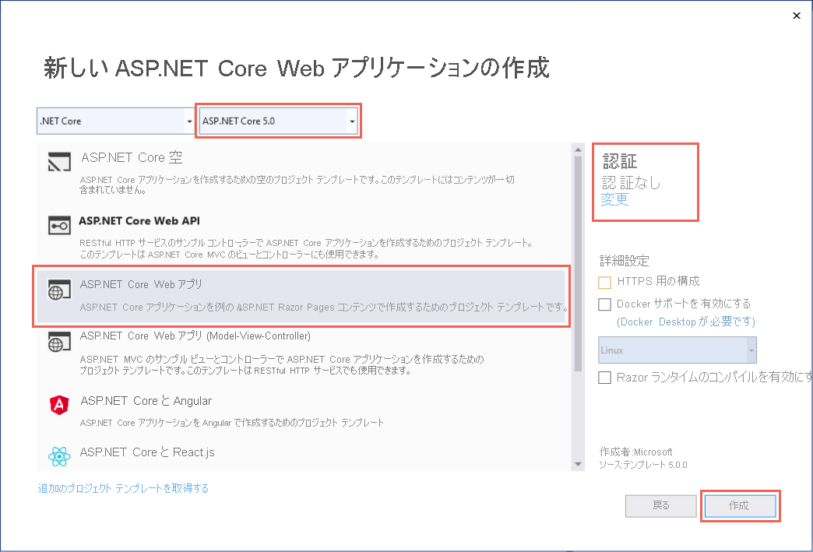
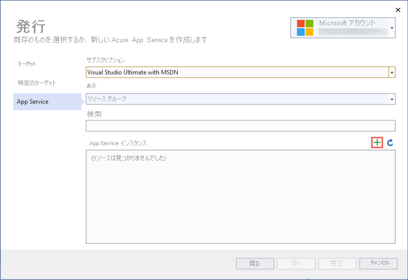
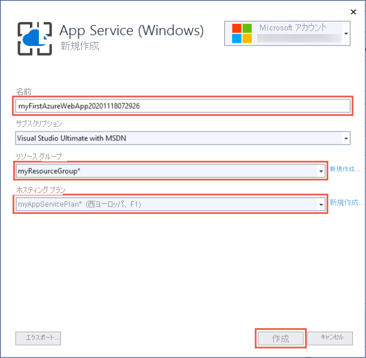

# <a name="quickstart-create-an-aspnet-core-web-app-in-azure"></a>クイック スタート:Azure に ASP.NET Core Web アプリを作成する

::: zone pivot="platform-windows"  

このクイックスタートでは、初めての ASP.NET Core Web アプリを作成し、デプロイする方法について説明します。 <abbr title="Web アプリケーション、REST API、およびモバイル バックエンド アプリケーションをホストするための HTTP ベースのサービス。">Azure App Service</abbr>. App Service は .NET 5.0 のアプリをサポートします。

完了すると、デプロイされたサンプル ASP.NET Core アプリケーションを含む App Service アプリと App Service プランで構成される Azure リソース グループが完成します。 <abbr title="1 つの単位として管理できる関連する Azure リソースの論理コンテナー。">resource group</abbr>構成する <abbr title="アプリをホストする Web サーバー ファームの場所、サイズ、機能を指定するプラン。">App Service プラン</abbr>  および  <abbr title="Web アプリの表現。アプリのコード、DNS ホスト名、証明書、関連リソースが含まれています。">App Service アプリ</abbr> デプロイされたサンプル ASP.NET Core アプリケーションを使用します。

<hr/> 

## <a name="1-prepare-your-environment"></a>1.環境を準備する

- アクティブなサブスクリプションが含まれる **Azure アカウント** を取得します。 <abbr title="Azure 内のリソース管理に使用される基本的な組織構造。通常、組織内の部門または個人に関連付けられます。">subscription</abbr>. [無料でアカウントを作成できます](https://azure.microsoft.com/free/dotnet/)。
- ****[ASP.NET および Web の開発]** ワークロードと共に <a href="https://www.visualstudio.com/downloads/" target="_blank">Visual Studio 2019</a>** をインストールする。

<details>
<summary>既に Visual Studio 2019 をお持ちの場合</summary>
Visual Studio 2019 を既にインストールしている場合:

<ul>
<li><strong>[ヘルプ]</strong> &gt; <strong>[更新プログラムの確認]</strong> の順に選択して、Visual Studio に<strong>最新の更新プログラムをインストール</strong>します。 最新の更新プログラムには、.NET 5.0 SDK が含まれています。</li>
<li><strong>[ツール]</strong> &gt; <strong>[ツールと機能を取得]</strong> の順に選択し、<strong>ワークロードを追加</strong>します。</li>
</ul>
</details>

<hr/> 

## <a name="2-create-an-aspnet-core-web-app"></a>2. ASP.NET Core Web アプリケーションの作成

1. Visual Studio を開き、 **[新しいプロジェクトの作成]** を選択します。

1. **[新しいプロジェクトの作成]** で、 **[ASP.NET Core Web アプリケーション]** を選択し、その選択内容の言語に **[C#]** がリストされていることを確認してから、 **[次へ]** を選択します。

1. **[新しいプロジェクトの構成]** で、ご自分の Web アプリケーション プロジェクトに *myFirstAzureWebApp* という名前を指定し、 **[作成]** を選択します。

   

1. .NET 5.0 アプリの場合は、ドロップダウンから **[ASP.NET Core 5.0]** を選択します。 わからない場合は、既定値を使用します。

1. 任意の種類の ASP.NET Core Web アプリを Azure にデプロイできますが、このクイックスタートでは、 **[ASP.NET Core Web アプリ]** テンプレートを選択します。 **[認証]** が **[認証なし]** に設定されていて、他のオプションが選択されていないことを確認してください。 そのうえで **[Create]\(作成\)** を選択します。

    
   
1. Visual Studio のメニューから **[デバッグ]**  >  **[デバッグなしで開始]** を選択して、Web アプリをローカルで実行します。

   

<hr/> 

## <a name="3-publish-your-web-app"></a>3. Web アプリを発行する

1. **ソリューション エクスプローラー** で **myFirstAzureWebApp** プロジェクトを右クリックし、 **[発行]** を選択します。 

1. **[発行]** で **[Azure]** を選択し、 **[次へ]** をクリックします。

1. 表示されるオプションは、既に Azure にサインインしているかどうかや、Visual Studio アカウントが Azure アカウントとリンクされているかどうかによって異なります。 **[アカウントの追加]** または **[サインイン]** を選択して Azure サブスクリプションにサインインします。 既にサインインしている場合は、目的のアカウントを選択します。

   

1. **[App Service インスタンス]** の右側の **[+]** をクリックします。

   

1. **[サブスクリプション]** で、リストされているサブスクリプションを受け入れるか、ドロップダウン リストから新しいサブスクリプションを選択します。

1. **[リソース グループ]** で、 **[新規]** を選択します。 **[新しいリソース グループ名]** に「*myResourceGroup*」と入力し、 **[OK]** を選択します。 

1. **[ホスティング プラン]** で、 **[新規]** を選択します。 

1. **ホスティング プランの [新規作成]** ダイアログで、次の表で指定されている値を使用します。

   | 設定  | 推奨値 |
   | -------- | --------------- |
   | **ホスティング プラン**  | *myFirstAzureWebAppPlan* |
   | **場所**      | "*西ヨーロッパ*" |
   | **[サイズ]**          | *Free* |
   
   

1. **[名前]** に一意のアプリ名を入力します。

    <details>
        <summary>どの文字を使用できますか?</summary>
        有効な文字は a-z、A-Z、0-9、- (ハイフン) です。 自動的に生成される一意の名前をそのまま使用してもかまいません。 Web アプリの URL は http://<code>&lt;app-name&gt;.azurewebsites.net</code> です。<code>&lt;app-name&gt;</code> には自分のアプリの名前を指定します。
    </details>

1. **[作成]** を選択して、Azure リソースを作成します。 

   

1. ウィザードで Azure リソースの作成が完了するまで待ちます。 **[完了]** を選択して、ウィザードを終了します。

1. **[発行]** ページの **[発行]** をクリックしてプロジェクトをデプロイします。 

    <details>
        <summary>Visual Studio によって何が行われているのですか?</summary>
        Visual Studio によってアプリのビルド、パッケージ化、および Azure への発行が行われた後、既定のブラウザーでアプリが起動されます。
    </details>

   

<hr/> 

## <a name="4-update-the-app-and-redeploy"></a>4.アプリを更新して再デプロイする

1. **ソリューション エクスプローラー** で、対象プロジェクトから **[ページ]**  >  **[Index.cshtml]** の順に開きます。

1. `<div>` タグ全体を次のコードに置き換えます。

   ```html
   <div class="jumbotron">
       <h1>ASP.NET in Azure!</h1>
       <p class="lead">This is a simple app that we've built that demonstrates how to deploy a .NET app to Azure App Service.</p>
   </div>
   ```

1. Azure に再デプロイするには、**ソリューション エクスプローラー** で **myFirstAzureWebApp** プロジェクトを右クリックし、 **[発行]** を選択します。

1. **発行** の概要ページで **[発行]** を選択します。

   <!--  -->

    発行が完了すると、Visual Studio で Web アプリの URL のブラウザーが起動されます。

    

<hr/> 

## <a name="5-manage-the-azure-app"></a>5.Azure アプリの管理

1. [Azure portal](https://portal.azure.com) に移動し、**App Services** を検索して選択します。

    ![[App Services] を選択します](./media/quickstart-dotnetcore/app-services.png)
    
1. **[App Services]** ページで、Web アプリの名前を選択します。

    :::image type="content" source="./media/quickstart-dotnetcore/select-app-service.png" alt-text="サンプル Web アプリが選択されている App Service ページのスクリーンショット。":::

1. Web アプリの **[概要]** ページには、参照、停止、開始、再起動、削除などの基本的な管理のためのオプションが含まれています。 左側のメニューは、アプリを構成するためのさらなるページを示しています。

    
    
<hr/> 

## <a name="6-clean-up-resources"></a>6.リソースをクリーンアップする

1. Azure portal メニューまたは **[ホーム]** ページから、 **[リソース グループ]** を選択します。 次に、 **[リソース グループ]** ページで **[myResourceGroup]** を選択します。

1. **[myResourceGroup]** ページで、一覧表示されたリソースが、削除しようとするリソースであることを確認します。

1. **[リソース グループの削除]** を選択し、確認のためテキスト ボックスに「**myResourceGroup**」と入力して、 **[削除]** を選択します。

<hr/> 

## <a name="next-steps"></a>次のステップ

次の記事に進み、.NET Core アプリを作成して SQL Database に接続する方法を学習してください。

- [ASP.NET Core と SQL Database](tutorial-dotnetcore-sqldb-app.md)
- [ASP.NET Core アプリの構成](configure-language-dotnetcore.md)

::: zone-end  

::: zone pivot="platform-linux"
このクイックスタートでは、[.NET Core](/aspnet/core/) アプリを作成する方法を示します。 <abbr title="App Service on Linux は、Linux オペレーティング システムを使用する、高度にスケーラブルな自己適用型の Web ホスティング サービスを提供します。">App Service on Linux</abbr>. [Azure CLI](/cli/azure/get-started-with-azure-cli) を使用してアプリを作成し、Git を使用してアプリに .NET Core コードをデプロイします。

<hr/> 

## <a name="1-prepare-your-environment"></a>1.環境を準備する

- アクティブなサブスクリプションが含まれる **Azure アカウントを取得** します。 [無料でアカウントを作成できます](https://azure.microsoft.com/free/dotnet/)。
- 最新の <a href="https://dotnet.microsoft.com/download/dotnet-core/3.1" target="_blank">.NET Core 3.1 SDK</a> または <a href="https://dotnet.microsoft.com/download/dotnet/5.0" target="_blank">.NET 5.0 SDK</a> を **インストール** します。
- **<a href="/cli/azure/install-azure-cli" target="_blank">最新の Azure CLI をインストールします</a>** 。

[問題がある場合は、お知らせください。](https://aka.ms/DotNetAppServiceLinuxQuickStart)

<hr/> 

## <a name="2-create-the-app-locally"></a>2. アプリをローカルで作成する

1. `mkdir hellodotnetcore` を実行してディレクトリを作成します。

    ```bash
    mkdir hellodotnetcore
    ```

1. `cd hellodotnetcore` を実行してそのディレクトリに移動します。 

    ```bash
    cd hellodotnetcore
    ```

1. `dotnet new web` を実行して新しい .NET Core アプリを作成します。

    ```bash
    dotnet new web
    ```

<hr/> 

## <a name="3-run-the-app-locally"></a>3. アプリをローカルで実行する

1. `dotnet run` を実行して、Azure にデプロイしたときにどのように見えるかを確認します。

    ```bash
    dotnet run
    ```
    
1. **Web ブラウザーを開き**、`http://localhost:5000` のアプリに移動します。


[問題がある場合は、お知らせください。](https://aka.ms/DotNetAppServiceLinuxQuickStart)

<hr/> 

## <a name="4-sign-into-azure"></a>4.Azure へのサインイン

`az login` を実行して Azure にサインインします。

```azurecli
az login
```

[問題がある場合は、お知らせください。](https://aka.ms/DotNetAppServiceLinuxQuickStart)

<hr/> 

## <a name="5-deploy-the-app"></a>5.アプリケーションのデプロイ

1. ローカル フォルダーで `az webapp up` を **実行** します。 <app-name> は、グローバルに一意の名前に **置き換え** てください。

    ```azurecli
    az webapp up --sku F1 --name <app-name> --os-type linux
    ```
    
    <details>
    <summary>トラブルシューティング</summary>
    <ul>
    <li><code>az</code> コマンドが認識されない場合は、「<a href="#1-prepare-your-environment">環境を準備する</a>」の説明に従って Azure CLI がインストールされていることを確認してください。</li>
    <li><code>&lt;app-name&gt;</code> を Azure 全体で一意の名前で置き換えます ("<em>有効な文字は、<code>a-z</code>、<code>0-9</code>、および <code>-</code> です</em>")。 会社名とアプリ識別子を組み合わせて使用すると、適切なパターンになります。</li>
    <li><code>--sku F1</code> 引数を使用すると、Free 価格レベルで Web アプリが作成されます。 この引数を省略するとより高速な Premium レベルが使用されるため、時間単位のコストが発生します。</li>
    <li>必要に応じて、引数 <code>--location &lt;location-name&gt;</code> を含めることができます。ここで、<code>&lt;location-name&gt;</code> は利用可能な Azure リージョンです。 <a href="/cli/azure/appservice#az_appservice_list_locations"><code>az account list-locations</code></a> コマンドを実行すると、お使いの Azure アカウントで使用可能なリージョンの一覧を取得できます。</li>
    </ul>
    </details>
    
1. コマンドが完了するまで待機します。 この処理には数分かかる場合があります。終了すると、"http://&lt;app-name&gt;.azurewebsites.net でアプリを起動することができます" という内容のメッセージが表示されます。

    <details>
    <summary><code>az webapp up</code> の処理の内容</summary>
    <p><code>az webapp up</code> コマンドは、次の処理を実行します。</p>
    <ul>
    <li>既定のリソース グループを作成する。</li>
    <li>既定の App Service プランを作成する。</li>
    <li>指定された名前で <a href="/cli/azure/webapp#az_webapp_create">App Service アプリを作成</a>する。</li>
    <li>現在の作業ディレクトリからアプリにファイルを <a href="/azure/app-service/deploy-zip">zip してデプロイ</a>する。</li>
    <li>実行中、リソースの作成、ログ記録、ZIP デプロイに関するメッセージが表示されます。</li>
    </ul>
    </details>
    
# <a name="net-core-31"></a>[.NET Core 3.1](#tab/netcore31)


# <a name="net-50"></a>[.NET 5.0](#tab/net50)


---

[問題がある場合は、お知らせください。](https://aka.ms/DotNetAppServiceLinuxQuickStart)

<hr/> 

## <a name="6-browse-to-the-app"></a>6.アプリの参照

Web ブラウザーを使用して、**デプロイされたアプリケーションを参照** します。

```bash
http://<app_name>.azurewebsites.net
```


[問題がある場合は、お知らせください。](https://aka.ms/DotNetAppServiceLinuxQuickStart)

<hr/> 

## <a name="7-update-and-redeploy-the-code&quot;></a>7.コードを更新して再デプロイする

1. ローカル ディレクトリで、**_Startup.cs_ ファイルを開き** ます。 

1. メソッド呼び出し `context.Response.WriteAsync` 内のテキストに **小さな変更を加え** ます。

    ```csharp
    await context.Response.WriteAsync(&quot;Hello Azure!");
    ```
    
1. **変更を保存** します。

1. `az webapp up` を **実行** して再デプロイします。

    ```azurecli
    az webapp up --os-type linux
    ```
    
    <details>
    <summary>今回、<code>az webapp up</code> は何を行っているのですか?</summary>
    このコマンドを最初に実行したときは、プロジェクト ルートの <i>.azure/config</i> ファイルに、アプリ名、リソース グループ、App Service プランが保存されました。 プロジェクト ルートからもう一度実行すると、<i>.azure/config</i> に保存されている値を使用して、App Service のリソースが既に存在することが検出され、ZIP デプロイが再実行されます。
    </details>
    
1. デプロイが完了したら、先ほど開いたブラウザー ウィンドウで **最新の情報に更新するためのボタンをクリック** します。

    
    
[問題がある場合は、お知らせください。](https://aka.ms/DotNetAppServiceLinuxQuickStart)

<hr/> 

## <a name="8-manage-your-new-azure-app"></a>8.新しい Azure アプリの管理

1. <a href="https://portal.azure.com" target="_blank">Azure ポータル</a>にアクセスします。

1. 左側のメニューで **[App Services]** をクリックしてから、お客様の Azure アプリの名前をクリックします。

    :::image type="content" source="./media/quickstart-dotnetcore/portal-app-service-list-up.png" alt-text="サンプル Azure アプリの選択状態を示す App Service ページのスクリーンショット。":::

1. 概要ページでは、参照、停止、開始、再開、削除のような基本的な管理タスクを行うことができます。 左側のメニューは、アプリを構成するためのさまざまなページを示しています。 

    ![Azure Portal の [App Service] ページ](media/quickstart-dotnetcore/portal-app-overview-up.png)
    
<hr/> 

## <a name="9-clean-up-resources"></a>9.リソースをクリーンアップする

`az group delete --name myResourceGroup` を **実行** してリソース グループを削除します。

```azurecli-interactive
az group delete --name myResourceGroup
```

[問題がある場合は、お知らせください。](https://aka.ms/DotNetAppServiceLinuxQuickStart)

<hr/> 

## <a name="next-steps"></a>次のステップ

- [チュートリアル:ASP.NET Core アプリと SQL Database](tutorial-dotnetcore-sqldb-app.md)
- [ASP.NET Core アプリの構成](configure-language-dotnetcore.md)

::: zone-end
