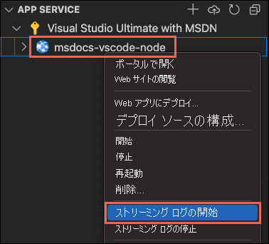

# <a name="create-a-nodejs-web-app-in-azure"></a>Azure で Node.js Web アプリを作成する

はじめに: <abbr title="Web アプリケーション、REST API、およびモバイル バックエンド アプリケーションをホストするための HTTP ベースのサービス。">Azure App Service</abbr> Visual Studio Code を使用して Node.js または Express アプリをローカルに作成し、アプリを Azure クラウドにデプロイすることによって、 お客様は <abbr title="その他のアプリ (他の顧客のアプリなど) と同じ VM でアプリを実行する、Azure App Service の基本レベル。 このレベルは開発とテストを目的としています。">Free レベル</abbr>を使用するため、このクイックスタートを完了するのにコストはかかりません。

## <a name="1-prepare-your-environment"></a>1.環境を準備する

- アクティブなサブスクリプションが含まれる Azure アカウント。 <abbr title="Azure サブスクリプションは、Azure でリソースをプロビジョニングするために使用される論理コンテナーです。 仮想マシン (VM) やデータベースなどのすべてのリソースの詳細が保持されます。">subscription</abbr>. [無料でアカウントを作成できます](https://azure.microsoft.com/free/?utm_source=campaign&utm_campaign=vscode-tutorial-app-service-extension&mktingSource=vscode-tutorial-app-service-extension)。
- <a href="https://git-scm.com/" target="_blank">Git をインストールする</a>
- [Node.js および npm](https://nodejs.org)。 `node --version` コマンドを実行して、Node.js がインストールされていることを確認します。
- [Visual Studio Code](https://code.visualstudio.com/)。
- Visual Studio Code 用の [Azure App Service 拡張機能](https://marketplace.visualstudio.com/items?itemName=ms-azuretools.vscode-azureappservice)。

[問題を報告する](https://www.research.net/r/PWZWZ52?tutorial=node-deployment-azure-app-service&prepare-your-environment)


<br>
<hr/>

## <a name="2-clone-and-run-a-local-nodejs-application"></a>2.ローカル Node.js アプリケーションを複製して実行する

1. お使いのローカル コンピューターで、ターミナルを開き、サンプル リポジトリを複製します。

    ```bash
    git clone https://github.com/Azure-Samples/nodejs-docs-hello-world
    ```

1. 新しいアプリ フォルダーに移動します。

    ```bash
    cd nodejs-docs-hello-world
    ```

1. 依存関係をインストールする:

    ```bash
    npm install
    ```

1. アプリを起動してローカルでテストします。

    ```bash
    npm start
    ```
    
1. ブラウザーを開き、`http://localhost:1337` に移動します。 ブラウザーに "Hello World!" と表示されます。

1. ターミナルで <kbd>Ctrl</kbd>  +  <kbd>C</kbd> キーを押してサーバーを停止します。

[問題を報告する](https://www.research.net/r/PWZWZ52?tutorial=node-deployment-azure-app-service&prepare-your-environment)


<br>
<hr/>


<!-- VS Code extension works differently for Windows/Linus - Step 3 -->

::: zone pivot="platform-windows"  

[!INCLUDE [Windows](./includes/quickstart-nodejs-uiex-windows.md)]


::: zone-end

::: zone pivot="platform-linux"  

[!INCLUDE [Windows](./includes/quickstart-nodejs-uiex-linux.md)]

::: zone-end


## <a name="4-viewing-logs-from-visual-studio-code"></a>4.Visual Studio Code でログを表示する

表示 <abbr title="アプリでの `console.log` の呼び出しはすべて、Visual Studio Code の出力ウィンドウに表示されます。">log</abbr> 実行中の App Service アプリの

1. **Azure App Service** エクスプローラーでアプリを探し、アプリ名を右クリックして、 **[Start Streaming Logs]\(ログのストリーム配信を開始する\)** を選択します。

1. Visual Studio Code の出力ウィンドウが開きます。

    

    :::image type="content" source="./media/quickstart-nodejs/enable-restart.png" alt-text="[はい] ボタンが選択されている、ファイルのログを有効にし、Web アプリを再起動するための VS Code プロンプトのスクリーンショット。":::

1. 数秒後、ログストリーミング サービスに接続されていることを示すメッセージが表示されます。 
1. 数回ページを更新して、さらにアクティビティを表示します。

    <pre class="is-monospace is-size-small has-padding-medium has-background-tertiary has-text-tertiary-invert">
    2020-09-20 20:37:39.574 INFO  - Initiating warmup request to container msdocs-vscode-node_2_00ac292a for site msdocs-vscode-node
    2020-09-20 20:37:55.011 INFO  - Waiting for response to warmup request for container msdocs-vscode-node_2_00ac292a. Elapsed time = 15.4373071 sec
    2020-09-20 20:38:08.233 INFO  - Container msdocs-vscode-node_2_00ac292a for site msdocs-vscode-node initialized successfully and is ready to serve requests.
    2020-09-20T20:38:21  Startup Request, url: /Default.cshtml, method: GET, type: request, pid: 61,1,7, SCM_SKIP_SSL_VALIDATION: 0, SCM_BIN_PATH: /opt/Kudu/bin, ScmType: None
    </pre>

<br>

[問題を報告する](https://www.research.net/r/PWZWZ52?tutorial=node-deployment-azure-app-service&prepare-your-environment)

<br>
<hr/>

## <a name="5-clean-up-resources"></a>5.リソースをクリーンアップする

**Azure App Service** エクスプローラーでアプリを探し、アプリ名を右クリックして、 **[削除]** を選択します。 

:::image type="content" source="./media/quickstart-nodejs/delete-resource-ieux.png" alt-text="&quot;**&quot;Azure App Service&quot;**&quot; エクスプローラーでアプリを探し、アプリ名を右クリックして、[削除] を選択する":::

## <a name="next-steps"></a>次のステップ

おめでとうございます。このクイックスタートを正常に完了できました。 同じプロセスを使用し、新しいアプリを作成する代わりに既存のものを選択することで、このアプリに対する変更をデプロイできます。

次は、他の Azure 拡張機能もチェックしてみましょう。

* [Cosmos DB](https://marketplace.visualstudio.com/items?itemName=ms-azuretools.vscode-cosmosdb)
* [Azure Functions](https://marketplace.visualstudio.com/items?itemName=ms-azuretools.vscode-azurefunctions)
* [Docker ツール](https://marketplace.visualstudio.com/items?itemName=PeterJausovec.vscode-docker)
* [Azure CLI Tools](https://marketplace.visualstudio.com/items?itemName=ms-vscode.azurecli)
* [Azure Resource Manager Tools](https://marketplace.visualstudio.com/items?itemName=msazurermtools.azurerm-vscode-tools)

または、[Node Pack for Azure](https://marketplace.visualstudio.com/items?itemName=ms-vscode.vscode-node-azure-pack) 拡張機能パックをインストールして、これらすべてを入手しましょう。