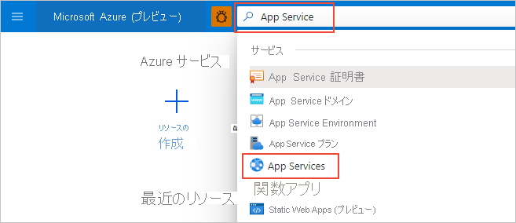
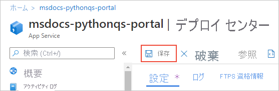
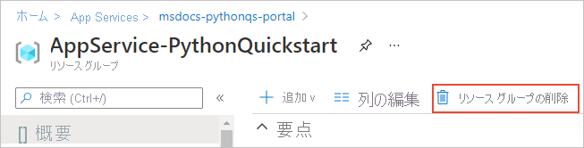

# クイックスタート: Azure App Service on Linux を使用して Python アプリを作成する (Azure portal)

このクイック スタートでは、Azure のスケーラビリティに優れた自己適用型の Web ホスティング サービスである [App Service on Linux](overview.md#app-service-on-linux) に、Python Web アプリをデプロイします。 Flask と Django のどちらかのフレームワークを使用したサンプルを、Azure portal を使ってデプロイします。 構成する Web アプリでは、Basic App Service レベルが使用され、Azure サブスクリプションにわずかなコストが発生します。

## アカウントの構成

- Azure アカウントとアクティブなサブスクリプションをお持ちでない場合は、[無料でアカウントを作成](https://azure.microsoft.com/free/?ref=microsoft.com&utm_source=microsoft.com&utm_medium=docs&utm_campaign=visualstudio)してください。

- GitHub アカウントをお持ちでない場合には、[github.com](https://github.com) で作成してください。 

## サンプルの GitHub リポジトリをフォークする

1. [github.com](https://github.com) を開いてサインインします。

1. 次のいずれかのサンプル リポジトリに移動します。
    - [Flask Hello World](https://github.com/Azure-Samples/python-docs-hello-world)
    - [Django Hello World](https://github.com/Azure-Samples/python-docs-hello-django)

1. GitHub ページの右上にある **[Fork]** \(フォーク\) を選択して、ご自分の GitHub アカウント内にリポジトリのコピーを作成します。

    

    Azure では、そのリポジトリが含まれる GitHub 組織にユーザー自身がアクセスできなければならないことになっています。 サンプルを自分の GitHub アカウントにフォークすることによって、必要なアクセス権が自動で付与されると共に、コードを変更できるようになります。

## App Service Web アプリをプロビジョニングする

App Service Web アプリは、コードのデプロイ先とする Web サーバーです。

1. [https://portal.azure.com](https://portal.azure.com) で Azure portal を開いて、必要に応じてサインインします。

1. Azure portal の上部にある検索バーで「App Service」と入力し、 **[App Services]** を選択します。

    

1. **[App Services]** ページで、 **[+ 追加]** を選択します。

    

1. **[Web アプリの作成]** ページで、次の操作を行います。
    
    | フィールド | アクション |
    | --- | --- |
    | サブスクリプション | 使用する Azure サブスクリプションを選択します。 |
    | リソース グループ | ドロップダウンの下にある **[新規作成]** を選択します。 ポップアップで「AppService-PythonQuickstart」と入力し、 **[OK]** を選択します。 |
    | 名前 | Azure 全体で一意の名前を入力します。典型例は *contoso-testapp-123* のように、個人名や会社名を組み合わせたものです。 |
    | 発行 | **[コード]** を選択します。 |
    | ランタイム スタック | **[Python 3.8]** を選択します。 |
    | オペレーティング システム | **[Linux]** を選択します (Python は、Linux でのみサポートされています)。 |
    | リージョン | 近くのリージョンを選択します。 |
    | Linux プラン | 既存の App Service プランを選択するか、 **[新規作成]** を使用して新しいものを作成します。 使用をお勧めするのは、**Basic B1** プランです。 |

    

1. ページ下部で **[確認と作成]** を選択し、詳細を確認してから **[作成]** を選択します。

1. プロビジョニングが完了したら、 **[リソースに移動]** を選択して新しい App Service のページに移動します。 この時点の Web アプリは既定のページのみが含まれている状態であるため、次の手順ではサンプル コードをデプロイします。

問題がある場合は、 [お知らせください](https://aka.ms/FlaskPortalQuickstartHelp)。

## サンプル コードをデプロイする

1. Azure portal の Web アプリ ページで、 **[デプロイ センター]** を選択します。
    
    ![App Service のメニューの [デプロイ センター] コマンド](media/quickstart-python-portal/deployment-center-command.png)

1. **[デプロイ センター]** ページで **[設定]** タブを選択します (開いていない場合のみ)。

    ![デプロイ センターの [設定] タブ](media/quickstart-python-portal/deployment-center-settings-tab.png)

1. **[ソース]** で **[GitHub]** を選択し、表示された **[GitHub]** フォームで、以下の操作を実行します。

    | フィールド | アクション |
    | --- | --- |
    | 次のユーザーとしてサインイン | まだ GitHub にサインインしていない場合には、サインインするか、必要に応じて *"*アカウントを変更*" します。 |
    | Organization | 必要に応じて、GitHub 組織を選択します。 |
    | リポジトリ | 先ほどフォークしたサンプル リポジトリの名前 (**python-docs-hello-world** (Flask) と **python-docs-hello-django** (Django) のいずれか) を選択します。 |
    | [Branch]\(ブランチ) | **[main]\(メイン\)** を選択します。 |

    

1. ページ上部で **[保存]** を選択して、設定を適用します。

    

1. **[ログ]** タブを選択して、デプロイの状態を確認します。 サンプルのビルドとデプロイには、数分かかります。このプロセスの間は、追加のログが表示されます。 完了すると、ログの [状態] が **[Success (Active)]** \(成功 (アクティブ)\) に変わります。

    ![デプロイ センターの [ログ] タブ](media/quickstart-python-portal/deployment-center-logs.png)

問題がある場合は、 [お知らせください](https://aka.ms/FlaskPortalQuickstartHelp)。

## アプリの参照

1. デプロイが完了したら、左側のメニューで **[概要]** を選択し、Web アプリのメイン ページに戻ります。

1. Web アプリのアドレスが含まれる **URL** を選択します。

    ![[概要] ページの Web アプリの URL](media/quickstart-python-portal/web-app-url.png)

1. アプリの出力が "Hello, World!" になっていることを確認します。

    

問題がある場合は、 まず、[トラブルシューティング ガイド](configure-language-python.md#troubleshooting)を参照し、それでも解決しない場合は[お知らせください](https://aka.ms/FlaskPortalQuickstartHelp)。

## 変更を加えて再度デプロイする

App Service をリポジトリに接続したので、ソース リポジトリにコミットした変更が、Web アプリに自動でデプロイされるようになりました。

1. GitHub でフォークしたリポジトリに直接変更を加えることも、リポジトリをローカルに複製し、変更とコミットを済ませたうえで、その変更点を GitHub にプッシュすることもできます。 どちらの方法でも、App Service に接続されているリポジトリに変更が実施されます。

1. **フォークしたリポジトリの中で**、アプリのメッセージを "Hello, World!" から "Hello, Azure!" に変更します 。
    - Flask (python-docs-hello-world のサンプル): *application.py* ファイルの 6 行目のテキスト文字列を変更します。
    - Django (python-docs-hello-django のサンプル): *hello* フォルダーにある *views.py* ファイルの 5 行目のテキスト文字列を変更します。

1. 変更をリポジトリにコミットします。

    ローカルに複製したものを使用している場合には、変更を GitHub にプッシュします。

1. Web アプリの Azure portal で、**デプロイ センター** に戻り、 **[ログ]** タブを選択します。新しいデプロイの処理が進行中になっているはずです。

1. デプロイが完了したら、Web アプリの **[概要]** ページに戻って Web アプリの URL をもう一度開き、アプリが変更されていることを確認します。

    

問題がある場合は、 まず、[トラブルシューティング ガイド](configure-language-python.md#troubleshooting)を参照し、それでも解決しない場合は[お知らせください](https://aka.ms/FlaskCLIQuickstartHelp)。

## リソースをクリーンアップする

ここまでの手順では、いくつかの Azure リソースを "AppService-PythonQuickstart" というリソース グループに作成しました。このリソース グループは、Web アプリの *[概要]* * ページに表示されます。 Web アプリを実行し続けると、継続的なコストが発生します (「[App Service の価格](https://azure.microsoft.com/pricing/details/app-service/linux/)」をご覧ください)。

今回のリソースが今後必要ないと考えられる場合には、Web アプリの **[概要]** ページでリソース グループの名前を選択し、リソース グループの概要に移動します。 **[リソース グループの削除]** を選択し、プロンプトに従います。

問題がある場合は、 [お知らせください](https://aka.ms/FlaskCLIQuickstartHelp)。

## 次のステップ

> [!div class="nextstepaction"]
> [チュートリアル:PostgreSQL を使った Python (Django) Web アプリ](/azure/developer/python/tutorial-python-postgresql-app-portal)

> [!div class="nextstepaction"]
> [Python アプリの構成](configure-language-python.md)

> [!div class="nextstepaction"]
> [Python Web アプリにユーザーのサインインを追加する](../active-directory/develop/quickstart-v2-python-webapp.md)

> [!div class="nextstepaction"]
> [チュートリアル:Python アプリをカスタム コンテナーで実行する](tutorial-custom-container.md)
