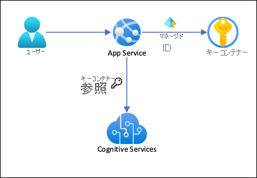
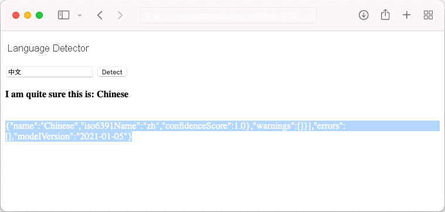

# <a name="tutorial-secure-cognitive-service-connection-from-app-service-using-key-vault"></a>チュートリアル: Key Vault を使用して App Service からの Cognitive Service 接続をセキュリティで保護する

[Azure App Service](overview.md) では、[マネージド ID](overview-managed-identity.md) を使用して接続文字列なしでバックエンド サービスに接続できます。これにより接続シークレットを管理する必要がなくなるため、運用環境でのバックエンド接続のセキュリティが維持されます。 マネージド ID をサポートしないため接続シークレットが必要なバックエンド サービスの場合は、Key Vault を使用して接続シークレットを管理できます。 このチュートリアルでは、例として Cognitive Services を使用して、実際の実行方法を示します。 完了すると、App Service 内に接続シークレットを格納せずに、プログラムで Cognitive Services を呼び出すアプリが作成されます。

> [!TIP]
> Azure Cognitive Services は[マネージド ID による認証をサポート](../cognitive-services/authentication.md#authorize-access-to-managed-identities)していますが、このチュートリアルでは[サブスクリプション キー認証](../cognitive-services/authentication.md#authenticate-with-a-single-service-subscription-key)を使用して、マネージド ID をサポートしない Azure サービスに App Services から接続する方法を示します。



このアーキテクチャでは、次のことが行われます。 

- Key Vault への接続がマネージド ID によって保護される
- App Service は、アプリケーション設定として [Key Vault 参照](app-service-key-vault-references.md)を使用してシークレットにアクセスする。
- キー コンテナーへのアクセスはこのアプリに制限される。 アプリの共同作成者 (管理者など) は、App Service リソースを完全に制御できる場合がありますが、同時に、Key Vault シークレットにアクセスすることはできません。
- アプリケーション コードが既にアプリ設定を使用して接続シークレットにアクセスしている場合、変更は必要ありません。

学習内容

> [!div class="checklist"]
> * マネージド ID を有効にする
> * マネージド ID を使用して Key Vault に接続する
> * Key Vault 参照を使用する
> * Cognitive Services にアクセスする

## <a name="prerequisites"></a>前提条件

Azure CLI の環境を準備します。

[!INCLUDE [azure-cli-prepare-your-environment-no-header.md](../../includes/azure-cli-prepare-your-environment-no-header.md)]

## <a name="create-app-with-connectivity-to-cognitive-services"></a>Cognitive Services に接続できるアプリを作成する

1. すべてのリソースを含むリソース グループを作成します。

    ```azurecli-interactive
    # Save resource group name as variable for convenience
    groupName=myKVResourceGroup
    region=westeurope

    az group create --name $groupName --location $region
    ```

1. Cognitive Services リソースを作成します。 *\<cs-resource-name>* を任意の一意の名前で置き換えます。

    ```azurecli-interactive
    # Save resource name as variable for convenience. 
    csResourceName=<cs-resource-name>

    az cognitiveservices account create --resource-group $groupName --name $csResourceName --location $region --kind TextAnalytics --sku F0 --custom-domain $csResourceName
    ```

    > [!NOTE]
    > `--sku F0` によって、Free レベルの Cognitive Services リソースが作成されます。 サブスクリプションごとに、1 つの Free レベル `TextAnalytics` リソースというクォータに制限されています。 既にクォータを超えている場合は、代わりに `--sku S` を使用します。

1. サンプル リポジトリをローカルにクローンし、サンプル アプリケーションを App Service にデプロイします。 *\<app-name>* を一意の名前で置き換えます。

    ### <a name="net-5"></a>[.NET 5](#tab/dotnet)

    ```azurecli-interactive
    # Save app name as variable for convenience
    appName=<app-name>

    # Clone sample application
    git clone https://github.com/Azure-Samples/app-service-language-detector.git
    cd app-service-language-detector/dotnet
    
    az webapp up --sku F1 --resource-group $groupName --name $appName --plan $appName --location $region
    ```

    ### <a name="php"></a>[PHP](#tab/php)

    ```azurecli-interactive
    # Clone and prepare sample application
    git clone https://github.com/Azure-Samples/app-service-language-detector.git
    cd app-service-language-detector/php
    zip default.zip index.php
    
    # Save app name as variable for convenience
    appName=<app-name>

    az appservice plan create --resource-group $groupName --name $appName --sku FREE --location $region
    az webapp create --resource-group $groupName --plan $appName --name $appName
    az webapp deployment source config-zip --resource-group $groupName --name $appName --src ./default.zip
    ```

    -----

1. Cognitive Services のシークレットを、アプリケーション設定 `CS_ACCOUNT_NAME` および `CS_ACCOUNT_KEY` として構成します。

    ```azurecli-interactive
    # Get subscription key for Cognitive Services resource
    csKey1=$(az cognitiveservices account keys list --resource-group $groupName --name $csResourceName --query key1 --output tsv)

    az webapp config appsettings set --resource-group $groupName --name $appName --settings CS_ACCOUNT_NAME="$csResourceName" CS_ACCOUNT_KEY="$csKey1"
    ````

1. ブラウザーで、`<app-name>.azurewebsites.net` のデプロイ アプリに移動し、さまざまな言語の文字列で言語検出アプリを試します。

    

    アプリケーション コードを見ていると、検出結果のデバッグ出力が背景色と同じフォント色で表示される場合があります。 これは、結果の直下の空白を強調表示することで表示できます。

## <a name="secure-back-end-connectivity"></a>バックエンド接続をセキュリティで保護する

現時点では、接続シークレットはアプリ設定として App Service アプリに格納されています。 この方法では、接続シークレットをアプリケーション コードベースから既にセキュリティで保護できています。 ただし、アプリを管理できる共同作成者はアプリの設定を表示することもできます。 この手順では、自分だけがこれを管理でき、App Service アプリだけがマネージド ID を使用して読み取ることができるように、接続シークレットをキー コンテナーに移動し、アクセスをロックダウンします。

1. Key Vault を作成します。 *\<vault-name>* を一意の名前で置き換えます。

    ```azurecli-interactive
    # Save app name as variable for convenience
    vaultName=<vault-name>

    az keyvault create --resource-group $groupName --name $vaultName --location $region --sku standard --enable-rbac-authorization
    ```

    `--enable-rbac-authorization` パラメーターによって、[Azure のロールベースのアクセス制御 (RBAC) がアクセス許可モデルとして設定されます](../key-vault/general/rbac-guide.md#using-azure-rbac-secret-key-and-certificate-permissions-with-key-vault)。 この設定では、既定ですべてのアクセス ポリシーのアクセス許可が無効になります。

1. 自分に、コンテナーに対する *Key Vault Secrets Officer* RBAC ロールを付与します。
    
    ```azurecli-interactive
    vaultResourceId=$(az keyvault show --name $vaultName --query id --output tsv)
    myId=$(az ad signed-in-user show --query objectId --output tsv)
    az role assignment create --role "Key Vault Secrets Officer" --assignee-object-id $myId --assignee-principal-type User --scope $vaultResourceId
    ```

1. アプリに対してシステム割り当てマネージド ID を有効にし、これにコンテナーの *Key Vault Secrets Officer* RBAC ロールを付与します。

    ```azurecli-interactive
    az webapp identity assign --resource-group $groupName --name $appName --scope $vaultResourceId --role  "Key Vault Secrets User"
    ```

1. コンテナーにシークレットとして Cognitive Services リソース名とサブスクリプション キーを追加し、次の手順のためにその ID を環境変数として保存します。

    ```azurecli-interactive
    csResourceKVUri=$(az keyvault secret set --vault-name $vaultName --name csresource --value $csResourceName --query id --output tsv)
    csKeyKVUri=$(az keyvault secret set --vault-name $vaultName --name cskey --value $csKey1 --query id --output tsv)
    ```

1. 先ほど、アプリでシークレットをアプリ設定 `CS_ACCOUNT_NAME` および `CS_ACCOUNT_KEY` として設定しました。 ここでは、代わりにこれらを[キー コンテナー参照](app-service-key-vault-references.md)として設定します。

    ```azurecli-interactive
    az webapp config appsettings set --resource-group $groupName --name $appName --settings CS_ACCOUNT_NAME="@Microsoft.KeyVault(SecretUri=$csResourceKVUri)" CS_ACCOUNT_KEY="@Microsoft.KeyVault(SecretUri=$csKeyKVUri)"
    ```

1. ブラウザーで、もう一度 `<app-name>.azurewebsites.net` に移動します。 検出結果が返された場合は、キー コンテナー参照を使用して Cognitive Services エンドポイントに接続しています。

これで、お使いのアプリは、アプリケーション コードを変更することなく、キー コンテナーに格納されたシークレットを使用して Cognitive Services に接続できました。

## <a name="clean-up-resources"></a>リソースをクリーンアップする

前の手順では、リソース グループ内に Azure リソースを作成しました。 これらのリソースが将来必要になると想定していない場合、Cloud Shell で次のコマンドを実行して、リソース グループを削除します。

```azurecli-interactive
az group delete --name $groupName
```

このコマンドの実行には、少し時間がかかる場合があります。

## <a name="next-steps"></a>次のステップ

- [チュートリアル: 仮想ネットワーク統合を使用してバックエンド通信を分離する](tutorial-networking-isolate-vnet.md)
- [アプリを Azure 仮想ネットワークに統合する](overview-vnet-integration.md)
- [App Service のネットワーク機能](networking-features.md)