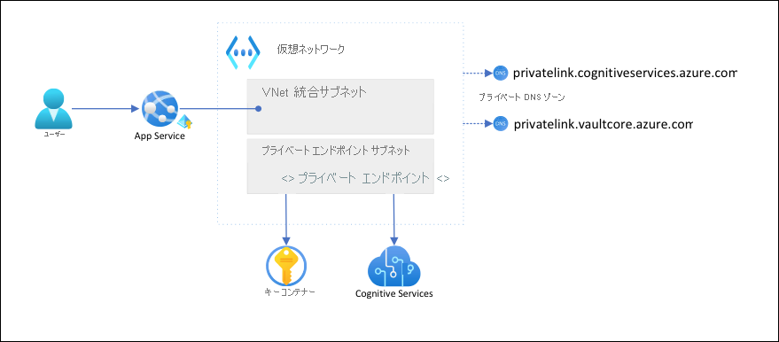

# <a name="tutorial-isolate-back-end-communication-in-azure-app-service-with-virtual-network-integration"></a>チュートリアル: 仮想ネットワーク統合を使用して Azure App Service のバックエンド通信を分離する

この記事では、ネットワーク分離によってバックエンド サービスと安全に通信を行う App Service アプリを構成します。 「[チュートリアル: Key Vault を使用して App Service からの Cognitive Services 接続を保護する](tutorial-connect-msi-key-vault.md)」のシナリオを例として使用しています。 完了すると、[Azure 仮想ネットワーク](../virtual-network/virtual-networks-overview.md) (VNet) を介して Key Vault と Cognitive Services の両方にアクセスする App Service アプリが完成します。これらのバックエンド リソースに他のトラフィックがアクセスすることはできません。 VNet 内では、[VNet 統合](web-sites-integrate-with-vnet.md)と[プライベート エンドポイント](../private-link/private-endpoint-overview.md)を使用して、すべてのトラフィックが分離されます。

App Service アプリから他の Azure サービスに向かうアウトバウンド ネットワーク トラフィックは、マルチテナントのサービスとして、他のアプリや他のサブスクリプションと同じ環境を共有します。 トラフィック自体を暗号化することもできますが、一部のシナリオでは、バックエンド通信を他のネットワーク トラフィックから分離することでいっそう高いセキュリティが求められることがあります。 一般に、そのようなシナリオに対応できるのは高度なノウハウを持つ大企業に限られますが、App Service では、VNet 統合によってそれが身近なものになります。  



このアーキテクチャでは、次のことが行われます。 

- バックエンド サービスへのパブリック トラフィックがブロックされます。
- App Service からのアウトバウンド トラフィックが VNet にルーティングされてバックエンド サービスに到達できます。
- App Service はプライベート DNS ゾーンを通じて、バックエンド サービスへの DNS 解決を実行できます。

学習内容

> [!div class="checklist"]
> * App Service の VNet 統合に使用する VNet とサブネットを作成する
> * プライベート DNS ゾーンを作成する
> * プライベート エンドポイントを作成する
> * App Service で VNet 統合を構成する

## <a name="prerequisites"></a>前提条件

このチュートリアルは、読者が「[チュートリアル: Key Vault を使用して App Service からの Cognitive Services 接続を保護する](tutorial-connect-msi-key-vault.md)」に従って言語検出アプリを作成済みであることを想定しています。 

前のチュートリアルでも使用していた次の環境変数を引き続き使用します。 適切に設定されていることを確認してください。

```azurecli-interactive
    groupName=myKVResourceGroup
    region=westeurope
    csResourceName=<cs-resource-name>
    appName=<app-name>
    vaultName=<vault-name>
```

## <a name="create-vnet-and-subnets"></a>VNet とサブネットを作成する

1. VNet を作成する。 *\<virtual-network-name>* を一意の名前に置き換えます。

    ```azurecli-interactive
    # Save vnet name as variable for convenience
    vnetName=<virtual-network-name>

    az network vnet create --resource-group $groupName --location $region --name $vnetName --address-prefixes 10.0.0.0/16
    ```

1. App Service の VNet 統合に使用するサブネットを作成します。

    ```azurecli-interactive
    az network vnet subnet create --resource-group $groupName --vnet-name $vnetName --name vnet-integration-subnet --address-prefixes 10.0.0.0/24 --delegations Microsoft.Web/serverfarms
    ```

    App Service の VNet 統合サブネットには、少なくとも `/26` の CIDR ブロックを割り当てることをお勧めします ([VNet 統合のサブネット要件](overview-vnet-integration.md#subnet-requirements)を参照)。 `/24` では、必要以上のサイズになってしまいます。 `--delegations Microsoft.Web/serverfarms` は、[App Service の VNet 統合にサブネットを委任](../virtual-network/subnet-delegation-overview.md)するための指定です。

1. プライベート エンドポイント用に別のサブネットを作成します。

    ```azurecli-interactive
    az network vnet subnet create --resource-group $groupName --vnet-name $vnetName --name private-endpoint-subnet --address-prefixes 10.0.1.0/24 --disable-private-endpoint-network-policies
    ```

    プライベート エンドポイントのサブネットでは、[プライベート エンドポイントのネットワーク ポリシーを無効](../private-link/disable-private-endpoint-network-policy.md)にする必要があります。

## <a name="create-private-dns-zones"></a>プライベート DNS ゾーンを作成する

Key Vault と Cognitive Services のリソースは、[プライベート エンドポイント](../private-link/private-endpoint-overview.md)の内側に置かれるため、その[プライベート DNS ゾーン](../dns/private-dns-privatednszone.md)を定義する必要があります。 これらのゾーンはプライベート エンドポイントの DNS レコードのホストとして使用され、クライアントは、このゾーンがあることで、バックエンド サービスを名前で見つけることができます。 

1. Cognitive Services リソース用と Key Vault 用に 2 つのプライベート DNS ゾーンを作成します。

    ```azurecli-interactive
    az network private-dns zone create --resource-group $groupName --name privatelink.cognitiveservices.azure.com
    az network private-dns zone create --resource-group $groupName --name privatelink.vaultcore.azure.net
    ```

    これらの設定の詳細については、「[Azure プライベート エンドポイントの DNS 構成](../private-link/private-endpoint-dns.md#azure-services-dns-zone-configuration)」を参照してください。

1. プライベート DNS ゾーンを VNet にリンクさせます。

    ```azurecli-interactive
    az network private-dns link vnet create --resource-group $groupName --name cognitiveservices-zonelink --zone-name privatelink.cognitiveservices.azure.com --virtual-network $vnetName --registration-enabled False
    az network private-dns link vnet create --resource-group $groupName --name vaultcore-zonelink --zone-name privatelink.vaultcore.azure.net --virtual-network $vnetName --registration-enabled False
    ```

## <a name="create-private-endpoints"></a>プライベート エンドポイントを作成する

1. VNet のプライベート エンドポイント サブネットに、Key Vault 用のプライベート エンドポイントを作成します。

    ```azurecli-interactive
    # Get Cognitive Services resource ID
    csResourceId=$(az cognitiveservices account show --resource-group $groupName --name $csResourceName --query id --output tsv)

    az network private-endpoint create --resource-group $groupName --name securecstext-pe --location $region --connection-name securecstext-pc --private-connection-resource-id $csResourceId --group-id account --vnet-name $vnetName --subnet private-endpoint-subnet
    ```

1. Cognitive Services プライベート エンドポイントの DNS ゾーン グループを作成します。 DNS ゾーン グループは、プライベート DNS ゾーンとプライベート エンドポイント間のリンクです。 このリンクを使用すると、プライベート エンドポイントに更新がある場合に、プライベート DNS ゾーンを自動更新できます。  

    ```azurecli-interactive
    az network private-endpoint dns-zone-group create --resource-group $groupName --endpoint-name securecstext-pe --name securecstext-zg --private-dns-zone privatelink.cognitiveservices.azure.com --zone-name privatelink.cognitiveservices.azure.com
    ```

1. Cognitive Services リソースに対するパブリック トラフィックをブロックします。

    ```azurecli-interactive
    az rest --uri $csResourceId?api-version=2021-04-30 --method PATCH --body '{"properties":{"publicNetworkAccess":"Disabled"}}' --headers 'Content-Type=application/json'

    # Repeat following command until output is "Succeeded"
    az cognitiveservices account show --resource-group $groupName --name $csResourceName --query properties.provisioningState
    ```

    > [!NOTE]
    > 変更のプロビジョニングの状態が `"Succeeded"` になっていることを確認します。 その後、サンプル アプリで動作変更を観察してください。 以前と同様、アプリを読み込むことはできますが、 **[Detect]\(検出\)** ボタンをクリックすると `HTTP 500` エラーが返されます。 共有ネットワーク経由での Cognitive Services リソースへの接続は失われています。

1. Key Vault に対して上記の手順を繰り返します。

    ```azurecli-interactive
    # Create private endpoint for key vault
    vaultResourceId=$(az keyvault show --name $vaultName --query id --output tsv)
    az network private-endpoint create --resource-group $groupName --name securekeyvault-pe --location $region --connection-name securekeyvault-pc --private-connection-resource-id $vaultResourceId --group-id vault --vnet-name $vnetName --subnet private-endpoint-subnet
    # Create DNS zone group for the endpoint
    az network private-endpoint dns-zone-group create --resource-group $groupName --endpoint-name securekeyvault-pe --name securekeyvault-zg --private-dns-zone privatelink.vaultcore.azure.net --zone-name privatelink.vaultcore.azure.net
    # Block public traffic to key vault
    az keyvault update --name $vaultName --default-action Deny
    ```

1. アプリ設定をリセットして、その [Key Vault 参照](app-service-key-vault-references.md)の再フェッチを強制的に即時実行します (詳細については、[ローテーション](app-service-key-vault-references.md#rotation)に関するセクションを参照してください)。

    ```azurecli-interactive
    az webapp config appsettings set --resource-group $groupName --name $appName --settings CS_ACCOUNT_NAME="@Microsoft.KeyVault(SecretUri=$csResourceKVUri)" CS_ACCOUNT_KEY="@Microsoft.KeyVault(SecretUri=$csKeyKVUri)"
    ```

    <!-- If above is not run then it takes a whole day for references to update? https://docs.microsoft.com/en-us/azure/app-service/app-service-key-vault-references#rotation -->

    > [!NOTE]
    > もう一度、サンプル アプリで動作変更を観察してください。 アプリを読み込むことができません。Key Vault の参照にアクセスできなくなったためです。 共有ネットワーク経由での Key Vault への接続は失われています。

2 つのプライベート エンドポイントにアクセスできるのは、作成した VNet 内のクライアントのみです。 Azure portal の **[シークレット]** ページから Key Vault 内のシークレットにアクセスすることもできません。ポータルからのアクセスにはパブリック インターネットが使用されるためです (「[ロック ダウンされたリソースを管理する](#manage-the-locked-down-resources)」を参照)。

## <a name="configure-vnet-integration-in-your-app"></a>アプリで VNet 統合を構成する

1. アプリを **Standard** レベルにスケーリングします。 VNet 統合には **Standard** レベル以降が必要です (「[アプリを Azure 仮想ネットワークに統合する](overview-vnet-integration.md)」を参照)。

    ```azurecli-interactive
    az appservice plan update --name $appName --resource-group $groupName --sku S1
    ```

1. 今回のシナリオには関係ありませんが、インバウンド要求には HTTPS を適用することが重要です。

    ```azurecli-interactive
    az webapp update --resource-group $groupName --name $appName --https-only
    ```

1. アプリで VNet 統合を有効にします。

    ```azurecli-interactive
    az webapp vnet-integration add --resource-group $groupName --name $appName --vnet $vnetName --subnet vnet-integration-subnet
    ```
    
    VNet 統合により、アウトバウンド トラフィックを直接 VNet に流すことができます。 既定では、[RFC-1918](https://tools.ietf.org/html/rfc1918#section-3) で定義されているローカル IP トラフィックのみが VNet にルーティングされます。これはプライベート エンドポイントに必要な動作です。 すべてのトラフィックを VNet にルーティングする場合は、[仮想ネットワーク統合のルーティングの管理](configure-vnet-integration-routing.md)に関するページを参照してください。 すべてのトラフィックのルーティングは、[Azure VNet NAT](../virtual-network/nat-gateway/nat-overview.md) や [Azure Firewall](../firewall/overview.md) など、VNet 経由でインターネット トラフィックをルーティングする場合にも使用できます。

1. ブラウザーで再び `<app-name>.azurewebsites.net` に移動し、統合が有効になるまで待ちます。 HTTP 500 エラーが発生する場合は、数分待ってからやり直してください。 ページを読み込んで検出結果を取得できた場合は、キー コンテナー参照を使用して Cognitive Services エンドポイントに接続しています。

    >[!NOTE]
    > しばらく待っても HTTP 500 エラーが返される場合は、再度、[Key Vault 参照](app-service-key-vault-references.md)の再フェッチを強制的に実行してみてください。
    >
    > ```azurecli-interactive
    > az webapp config appsettings set --resource-group $groupName --name $appName --settings CS_ACCOUNT_NAME="@Microsoft.KeyVault(SecretUri=$csResourceKVUri)" CS_ACCOUNT_KEY="@Microsoft.KeyVault(SecretUri=$csKeyKVUri)"
    > ```


## <a name="manage-the-locked-down-resources"></a>ロック ダウンされたリソースを管理する

シナリオによっては、プライベート エンドポイントによって保護されたリソースを Azure portal、Azure CLI、Azure PowerShell から管理できない場合があります (Key Vault など)。 これらのツールは、いずれも REST API 呼び出しを実行してパブリック インターネット経由でリソースにアクセスするため、ここで行った構成によってブロックされます。 ロック ダウンされたリソースには、以下に示したいくつかの方法でアクセスできます。

- Key Vault のプライベート エンドポイントによって保護されたシークレットを表示したり更新したりするには、ローカル コンピューターのパブリック IP を追加します。
- オンプレミス ネットワークが [VPN ゲートウェイ](../vpn-gateway/vpn-gateway-about-vpngateways.md)または [ExpressRoute](../expressroute/expressroute-introduction.md) を介して Azure VNet に拡張されている場合、プライベート エンドポイントによって保護されたリソースをオンプレミス ネットワークから直接管理できます。 
- プライベート エンドポイントによって保護されたリソースを、VNet 内の[ジャンプ サーバー](https://wikipedia.org/wiki/Jump_server)から管理します。
- [VNet に Cloud Shell をデプロイ](../cloud-shell/private-vnet.md)します。

## <a name="clean-up-resources"></a>リソースをクリーンアップする

前の手順では、リソース グループ内に Azure リソースを作成しました。 これらのリソースが将来必要になると想定していない場合、Cloud Shell で次のコマンドを実行して、リソース グループを削除します。

```azurecli-interactive
az group delete --name $groupName
```

このコマンドの実行には、少し時間がかかる場合があります。

## <a name="next-steps"></a>次のステップ

- [アプリを Azure 仮想ネットワークに統合する](overview-vnet-integration.md)
- [App Service のネットワーク機能](networking-features.md)