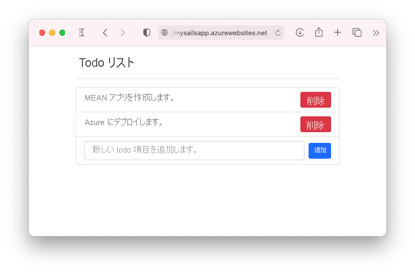
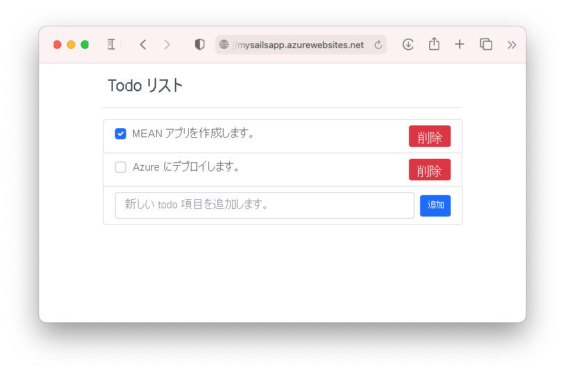

# <a name="tutorial-build-a-nodejs-and-mongodb-app-in-azure"></a>チュートリアル:Azure で Node.js と MongoDB のアプリを構築する

::: zone pivot="platform-windows"  

[Azure App Service](overview.md) は、非常にスケーラブルな、自己適用型の Web ホスティング サービスを提供します。 このチュートリアルでは、Azure App Service on Windows で Node.js アプリを作成し、MongoDB データベースに接続する方法について説明します。 完了すると、MEAN アプリケーション (MongoDB、Express、AngularJS、および Node.js) が [Azure App Service](overview.md) で実行されます。 サンプル アプリケーションでは、[Sails.js](https://sailsjs.com/) と [Angular 12](https://angular.io/) を組み合わせて使用します。

::: zone-end

::: zone pivot="platform-linux"


[Azure App Service](overview.md) は、Linux オペレーティング システムを使用する、高度にスケーラブルな自己適用型の Web ホスティング サービスを提供します。 このチュートリアルでは、App Service on Linux で Node.js アプリを作成して MongoDB データベースにローカルで接続し、Azure Cosmos DB の MongoDB 用 API でデータベースにデプロイする方法を示します。 完了すると、MEAN アプリケーション (MongoDB、Express、AngularJS、および Node.js) が App Service on Linux で実行されます。 サンプル アプリケーションでは、[Sails.js](https://sailsjs.com/) と [Angular 12](https://angular.io/) を組み合わせて使用します。

::: zone-end



ここでは、次の内容について学習します。

> [!div class="checklist"]
> * Azure で MongoDB データベースを作成する
> * Node.js アプリを MongoDB に接続する
> * Azure にアプリケーションをデプロイする
> * データ モデルを更新し、アプリを再デプロイする
> * Azure から診断ログをストリーミングする
> * Azure Portal でアプリを管理する

[!INCLUDE [quickstarts-free-trial-note](../../includes/quickstarts-free-trial-note.md)]

## <a name="prerequisites"></a>前提条件

このチュートリアルを完了するには、以下が必要です。

- [Git をインストールする](https://git-scm.com/)
- [Node.js と NPM をインストールする](https://nodejs.org/)
[!INCLUDE [azure-cli-prepare-your-environment-no-header.md](../../includes/azure-cli-prepare-your-environment-no-header.md)] 

## <a name="create-local-nodejs-app"></a>ローカル Node.js アプリを作成する

この手順では、ローカル Node.js プロジェクトを設定します。

### <a name="clone-the-sample-application"></a>サンプル アプリケーションの複製

ターミナル ウィンドウから、`cd` コマンドで作業ディレクトリに移動します。  

次のコマンドを実行して、サンプル レポジトリを複製します。 

```bash
git clone https://github.com/Azure-Samples/mean-todoapp.git
```

> [!NOTE]
> サンプル アプリの作成方法については、「[https://github.com/Azure-Samples/mean-todoapp](https://github.com/Azure-Samples/mean-todoapp)」を参照してください。

### <a name="run-the-application"></a>アプリケーションの実行

次のコマンドを実行して、必要なパッケージをインストールし、アプリケーションを起動します。

```bash
cd mean-todoapp
npm install
node app.js --alter
```

アプリが完全に読み込まれると、次のようなメッセージが表示されます。

<pre>
debug: -------------------------------------------------------
debug: :: Fri Jul 09 2021 13:10:34 GMT+0200 (Central European Summer Time)

debug: Environment : development
debug: Port        : 1337
debug: -------------------------------------------------------
</pre>

ブラウザーで `http://localhost:1337` にアクセスします。 いくつかの ToDo 項目を追加します。

MEAN サンプル アプリケーションでは、ユーザー データをデータベースに格納します。 既定では、ディスクベースの開発データベースが使用されます。 ToDo 項目を作成して表示できる場合、アプリはデータの読み取りと書き込みを行います。


任意のタイミングで Node.js を停止するには、ターミナルで `Ctrl+C` キーを押します。 

## <a name="create-production-mongodb"></a>運用 MongoDB を作成する

この手順では、Azure で MongoDB データベースを作成します。 アプリを Azure にデプロイすると、このクラウド データベースがアプリで使用されます。

このチュートリアルでは、MongoDB に [Azure Cosmos DB](../cosmos-db/index.yml) を使用します。 Cosmos DB は MongoDB のクライアント接続をサポートします。

### <a name="create-a-resource-group"></a>リソース グループを作成する

[!INCLUDE [Create resource group](../../includes/app-service-web-create-resource-group-no-h.md)] 

### <a name="create-a-cosmos-db-account"></a>Cosmos DB アカウントを作成する

> [!NOTE]
> このチュートリアルでは、ご利用の Azure サブスクリプションに Azure Cosmos DB データベースを作成しますが、そのためには料金が発生します。 「[Azure Cosmos DB を無料で試す](https://azure.microsoft.com/try/cosmosdb/)」で、無料の Azure Cosmos DB アカウントを 7 日間体験できるので、そちらをご利用ください。 MongoDB タイルの **[作成]** ボタンをクリックするだけで、無料の MongoDB データベースを Azure に作成できます。 データベースが作成されたら、ポータルの **[接続文字列]** に移動して Azure Cosmos DB 接続文字列を取得してください。後でこのチュートリアルの中で使用します。
>

Cloud Shell で、[`az cosmosdb create`](/cli/azure/cosmosdb#az_cosmosdb_create) コマンドを使用して Cosmos DB アカウントを作成します。

次のコマンドで、 *\<cosmosdb-name>* プレースホルダーを一意の Cosmos DB 名で置き換えます。 この名前は、Cosmos DB エンドポイント (`https://<cosmosdb-name>.documents.azure.com/`) の一部として使用されるため、Azure のすべての Cosmos DB アカウントで一意である必要があります。 この名前に含めることができるのは英小文字、数字、およびハイフン (-) 文字のみで、文字数は 3 ～ 50 文字にする必要があります。

```azurecli-interactive
az cosmosdb create --name <cosmosdb-name> --resource-group myResourceGroup --kind MongoDB
```

*--kind MongoDB* パラメーターにより、MongoDB のクライアント接続が有効になります。

Cosmos DB アカウントが作成されると、Azure CLI によって次の例のような情報が表示されます。

<pre>
{
  "apiProperties": {
    "serverVersion": "3.6"
  },
  "backupPolicy": {
    "periodicModeProperties": {
      "backupIntervalInMinutes": 240,
      "backupRetentionIntervalInHours": 8,
      "backupStorageRedundancy": "Geo"
    },
    "type": "Periodic"
  },
  "capabilities": [
    {
      "name": "EnableMongo"
    }
  ],
  "connectorOffer": null,
  "consistencyPolicy": {
    "defaultConsistencyLevel": "Session",
    "maxIntervalInSeconds": 5,
    "maxStalenessPrefix": 100
  },
  "cors": [],
  "databaseAccountOfferType": "Standard",
  "defaultIdentity": "FirstPartyIdentity",
  "disableKeyBasedMetadataWriteAccess": false,
  "documentEndpoint": "https://&lt;cosmosdb-name&gt;.documents.azure.com:443/",
  ...
  &lt; Output truncated for readability &gt;
}
</pre>

## <a name="connect-app-to-production-mongodb"></a>アプリを運用 MongoDB に接続する

この手順では、MongoDB 接続文字列を使用して、サンプル アプリケーションを、先ほど作成した Cosmos DB データベースに接続します。 

### <a name="retrieve-the-database-key"></a>データベース キーの取得

Cosmos DB データベースに接続するには、データベース キーが必要です。 Cloud Shell で、[`az cosmosdb keys list`](/cli/azure/cosmosdb#az_cosmosdb_keys_list) コマンドを使用して主キーを取得します。

```azurecli-interactive
az cosmosdb keys list --name <cosmosdb-name> --resource-group myResourceGroup
```

Azure CLI によって次の例のような情報が表示されます。

<pre>
{
  "primaryMasterKey": "RS4CmUwzGRASJPMoc0kiEvdnKmxyRILC9BWisAYh3Hq4zBYKr0XQiSE4pqx3UchBeO4QRCzUt1i7w0rOkitoJw==",
  "primaryReadonlyMasterKey": "HvitsjIYz8TwRmIuPEUAALRwqgKOzJUjW22wPL2U8zoMVhGvregBkBk9LdMTxqBgDETSq7obbwZtdeFY7hElTg==",
  "secondaryMasterKey": "Lu9aeZTiXU4PjuuyGBbvS1N9IRG3oegIrIh95U6VOstf9bJiiIpw3IfwSUgQWSEYM3VeEyrhHJ4rn3Ci0vuFqA==",
  "secondaryReadonlyMasterKey": "LpsCicpVZqHRy7qbMgrzbRKjbYCwCKPQRl0QpgReAOxMcggTvxJFA94fTi0oQ7xtxpftTJcXkjTirQ0pT7QFrQ=="
}
</pre>

`primaryMasterKey` の値をコピーします。 この情報は、次の手順に必要です。

<a name="devconfig"></a>
### <a name="configure-the-connection-string-in-your-sample-application"></a>サンプル アプリケーションでの接続文字列の構成

ローカル リポジトリの _config/datastores.js_ で、既存の内容を次のコードに置き換え、変更を保存します。

```javascript
module.exports.datastores = {
  default: {
    adapter: 'sails-mongo',
    url: process.env.MONGODB_URI,
    ssl: true,
  },
};
```

[Cosmos DB では TLS/SSL が必須](../cosmos-db/connect-mongodb-account.md#connection-string-requirements)なので、`ssl: true` オプションは必須です。 `url` は、次に設定する環境変数に設定されます。 

ターミナルで `MONGODB_URI` 環境変数を設定します。 2 つの \<cosmosdb-name> プレースホルダーを Cosmos DB データベース名で置き換え、 \<cosmosdb-key> プレースホルダーを前の手順でコピーしたキーで置き換えます。

```bash
export MONGODB_URI=mongodb://<cosmosdb-name>:<cosmosdb-key>@<cosmosdb-name>.documents.azure.com:10250/todoapp
```

> [!NOTE]
> この接続文字列は、[Sails.js のドキュメント](https://sailsjs.com/documentation/reference/configuration/sails-config-datastores#?the-connection-url)で定義されている形式に従います。

### <a name="test-the-application-with-mongodb"></a>MongoDB でアプリケーションをテストする

ローカル ターミナル ウィンドウで、`node app.js --alter` をもう一度実行します。

```bash
node app.js --alter
```

再度 `http://localhost:1337` に移動します。 ToDo 項目を作成して表示できる場合、アプリは Azure の Cosmos DB データベースを使用してデータの読み取りと書き込みを行います。 

ターミナルで、`Ctrl+C` キーを押して Node.js を停止します。 

## <a name="deploy-app-to-azure"></a>アプリを Azure にデプロイする

この手順では、MongoDB に接続している Node.js アプリケーションを Azure App Service にデプロイします。

### <a name="configure-a-deployment-user"></a>デプロイ ユーザーを構成する

[!INCLUDE [Configure deployment user](../../includes/configure-deployment-user-no-h.md)]

### <a name="create-an-app-service-plan"></a>App Service プランを作成する

::: zone pivot="platform-windows"  

Cloud Shell で [`az appservice plan create`](/cli/azure/appservice/plan) コマンドを使用して、App Service プランを作成します。

次の例では、**B1** 価格レベルの `myAppServicePlan` という名前の App Service プランを作成します。

```azurecli-interactive
az appservice plan create --name myAppServicePlan --resource-group myResourceGroup --sku B1
```

App Service プランが作成されると、Azure CLI によって、次の例のような情報が表示されます。

<pre>
{ 
  "freeOfferExpirationTime": null,
  "geoRegion": "UK West",
  "hostingEnvironmentProfile": null,
  "hyperV": false,
  "id": "/subscriptions/0000-0000/resourceGroups/myResourceGroup/providers/Microsoft.Web/serverfarms/myAppServicePlan",
  "isSpot": false,
  "isXenon": false,
  "kind": "app",
  "location": "ukwest",
  "maximumElasticWorkerCount": 1,
  "maximumNumberOfWorkers": 0,
  &lt; JSON data removed for brevity. &gt;
} 
</pre>

::: zone-end

::: zone pivot="platform-linux"

Cloud Shell で [`az appservice plan create`](/cli/azure/appservice/plan) コマンドを使用して、App Service プランを作成します。

<!-- [!INCLUDE [app-service-plan](app-service-plan.md)] -->

次の例では、**B1** 価格レベルの `myAppServicePlan` という名前の App Service プランを作成します。

```azurecli-interactive
az appservice plan create --name myAppServicePlan --resource-group myResourceGroup --sku B1 --is-linux
```

App Service プランが作成されると、Azure CLI によって、次の例のような情報が表示されます。

<pre>
{ 
  "freeOfferExpirationTime": null,
  "geoRegion": "West Europe",
  "hostingEnvironmentProfile": null,
  "id": "/subscriptions/0000-0000/resourceGroups/myResourceGroup/providers/Microsoft.Web/serverfarms/myAppServicePlan",
  "kind": "linux",
  "location": "West Europe",
  "maximumNumberOfWorkers": 1,
  "name": "myAppServicePlan",
  &lt; JSON data removed for brevity. &gt;
  "targetWorkerSizeId": 0,
  "type": "Microsoft.Web/serverfarms",
  "workerTierName": null
} 
</pre>

::: zone-end

<a name="create"></a>
### <a name="create-a-web-app"></a>Web アプリを作成する

::: zone pivot="platform-windows"  

[!INCLUDE [Create web app](../../includes/app-service-web-create-web-app-nodejs-no-h.md)] 

::: zone-end

::: zone pivot="platform-linux"

[!INCLUDE [Create web app](../../includes/app-service-web-create-web-app-nodejs-linux-no-h.md)] 

::: zone-end

### <a name="configure-an-environment-variable"></a>環境変数の構成

サンプル アプリケーションは、`config/datastores.js` で `MONGODB_URI` 環境変数を使用するように既に構成されていることに注意してください。 App Service で、[アプリ設定](configure-common.md#configure-app-settings)を使用してこの変数を挿入します。 

アプリ設定を設定するには、Cloud Shell で [`az webapp config appsettings set`](/cli/azure/webapp/config/appsettings#az_webapp_config_appsettings_set) コマンドを使用します。 

次の例では、Azure アプリの `MONGODB_URI` アプリ設定を構成します。 *\<app-name>* 、 *\<cosmosdb-name>* 、および *\<cosmosdb-key>* の各プレースホルダーを置き換えます。

```azurecli-interactive
az webapp config appsettings set --name <app-name> --resource-group myResourceGroup --settings MONGODB_URI='mongodb://<cosmosdb-name>:<cosmosdb-key>@<cosmosdb-name>.documents.azure.com:10250/todoapp' DEPLOYMENT_BRANCH='main'
```

> [!NOTE]
> `DEPLOYMENT_BRANCH` は、App Service にデプロイする Git ブランチを展開エンジンに通知する特殊なアプリ設定です。

### <a name="push-to-azure-from-git"></a>Git から Azure へのプッシュ

[!INCLUDE [app-service-plan-no-h](../../includes/app-service-web-git-push-to-azure-no-h.md)]

::: zone pivot="platform-windows"

<pre>
Enumerating objects: 5, done.
Counting objects: 100% (5/5), done.
Delta compression using up to 8 threads
Compressing objects: 100% (3/3), done.
Writing objects: 100% (3/3), 318 bytes | 318.00 KiB/s, done.
Total 3 (delta 2), reused 0 (delta 0), pack-reused 0
remote: Updating branch 'main'.
remote: Updating submodules.
remote: Preparing deployment for commit id '4eb0ca7190'.
remote: Generating deployment script.
remote: Running deployment command...
remote: Handling node.js deployment.
remote: Creating app_offline.htm
remote: KuduSync.NET from: 'D:\home\site\repository' to: 'D:\home\site\wwwroot'
remote: Copying file: 'package.json'
remote: Deleting app_offline.htm
remote: Looking for app.js/server.js under site root.
remote: Using start-up script app.js
remote: Generated web.config.
.
.
.
remote: Deployment successful.
To https://&lt;app-name&gt;.scm.azurewebsites.net/&lt;app-name&gt;.git
 * [new branch]      main -> main
</pre>

> [!TIP]
> Git のデプロイ中に、展開エンジンでは、ビルド オートメーションの一部として `npm install --production` が実行されます。
>
> - `package.json` で定義されているように、`postinstall` スクリプトは `npm install` によって取得され、`ng build` を実行して Angular の実稼働ファイルを生成し、[アセット](https://sailsjs.com/documentation/concepts/assets) フォルダーにデプロイします。
> - `package.json` の `scripts`では、`node_modules/.bin` にインストールされているツールを使用できます。 `npm install` にも `node_modules/.bin/ng` がインストールされたので、それを使用して Angular クライアント ファイルをデプロイすることができます。 この npm 動作は、Azure App Service でもまったく同じです。
> `package.json` の `devDependencies` にあるパッケージがインストールされていません。 運用環境で必要なすべてのパッケージを `dependencies` に移動する必要があります。
>
> アプリで既定のオートメーションをバイパスしてカスタム オートメーションを実行する必要がある場合は、「[Grunt/Bower/Gulp を実行する](configure-language-nodejs.md#run-gruntbowergulp)」を参照してください。

::: zone-end

::: zone pivot="platform-linux"

<pre>
Enumerating objects: 5, done.
Counting objects: 100% (5/5), done.
Delta compression using up to 8 threads
Compressing objects: 100% (3/3), done.
Writing objects: 100% (3/3), 347 bytes | 347.00 KiB/s, done.
Total 3 (delta 2), reused 0 (delta 0), pack-reused 0
remote: Deploy Async
remote: Updating branch 'main'.
remote: Updating submodules.
remote: Preparing deployment for commit id 'f776be774a'.
remote: Repository path is /home/site/repository
remote: Running oryx build...
remote: Operation performed by Microsoft Oryx, https://github.com/Microsoft/Oryx
remote: You can report issues at https://github.com/Microsoft/Oryx/issues
remote: 
remote: Oryx Version: 0.2.20210420.1, Commit: 85c6e9278aae3980b86cb1d520aaad532c814ed7, ReleaseTagName: 20210420.1
remote: 
remote: Build Operation ID: |qwejn9R4StI=.5e8a3529_
remote: Repository Commit : f776be774a3ea8abc48e5ee2b5132c037a636f73
.
.
.
remote: Deployment successful.
remote: Deployment Logs : 'https://&lt;app-name&gt;.scm.azurewebsites.net/newui/jsonviewer?view_url=/api/deployments/a6fcf811136739f145e0de3be82ff195bca7a68b/log'
To https://&lt;app-name&gt;.scm.azurewebsites.net/&lt;app-name&gt;.git
   4f7e3ac..a6fcf81  main -> main
</pre>

> [!TIP]
> Git のデプロイ中に、展開エンジンでは、ビルド オートメーションの一部として `npm install` が実行されます。
>
> - `package.json` で定義されているように、`postinstall` スクリプトは `npm install` によって取得され、`ng build` を実行して Angular の実稼働ファイルを生成し、[アセット](https://sailsjs.com/documentation/concepts/assets) フォルダーにデプロイします。
> - `package.json` の `scripts`では、`node_modules/.bin` にインストールされているツールを使用できます。 `npm install` にも `node_modules/.bin/ng` がインストールされたので、それを使用して Angular クライアント ファイルをデプロイすることができます。 この npm 動作は、Azure App Service でもまったく同じです。
> ビルド オートメーションが完了すると、完了したリポジトリ全体が `/home/site/wwwroot` フォルダーにコピーされ、そこからアプリがホストされます。
>
> アプリで既定のオートメーションをバイパスしてカスタム オートメーションを実行する必要がある場合は、「[Grunt/Bower/Gulp を実行する](configure-language-nodejs.md#run-gruntbowergulp)」を参照してください。

::: zone-end

### <a name="browse-to-the-azure-app"></a>Azure アプリを参照する 

Web ブラウザーを使用して、デプロイされたアプリを参照します。 

```bash 
https://<app-name>.azurewebsites.net 
``` 

ブラウザーで ToDo 項目を作成して表示できる場合は、Azure のサンプル アプリが MongoDB (Cosmos DB) データベースに接続されています。 


**お疲れさまでした。** データ主導型の Node.js アプリが Azure App Service で実行されています。

## <a name="update-data-model-and-redeploy"></a>データ モデルを更新し、再デプロイする

この手順では、`Todo` データ モデルを変更し、変更内容を Azure に発行します。

### <a name="update-the-server-side-model"></a>サーバー側モデルを更新する

Sails.js では、サーバー側モデルと API コードの変更は、データ モデルを変更するのと同じように簡単です。これは、規定でモデルの[共通ルートを Sails.js が既に定義している](https://sailsjs.com/documentation/concepts/blueprints/blueprint-routes#?restful-routes)ためです。 

ローカル リポジトリで、_api/models/Todo.js_ を開き、`done` 属性を追加します。 完了すると、スキーマ コードは次のようになります。

```javascript
module.exports = {

  attributes: {
    value: {type: 'string'},
    done: {type: 'boolean', defaultsTo: false}
  },

};
```

### <a name="update-the-client-code"></a>クライアント コードを更新する

変更する必要があるファイルは、クライアント モデル、HTML テンプレート、コンポーネントファイルの 3 つです。 

_client/src/app/todo.ts_ を開き、`done` プロパティを追加します。 完了すると、モデルは次のようになります。

```typescript
export class Todo {
    id!: String;
    value!: String;
    done!: Boolean;
}
```

_client/src/app/app.component.html_ を開きます。 唯一の `<span>` 要素のすぐ上に、次のコードを追加して、各 ToDo 項目の先頭にチェックボックスを追加します。

```html
<input class="form-check-input me-2" type="checkbox" [checked]="todo.done" (click)="toggleDone(todo.id, i)" [disabled]="isProcessing">
```

_client/src/app/app.component.ts_ を開きます。 最後の右中かっこ (`}`) のすぐ上に、次のメソッドを挿入します。 チェックボックスがクリックされると、上記のテンプレート コードによって呼び出され、サーバー側データを更新します。

```typescript
toggleDone(id:any, i:any) {
  console.log("Toggled checkbox for " + id);
  this.isProcessing = true;
  this.Todos[i].done = !this.Todos[i].done;
  this.restService.updateTodo(id, this.Todos[i])
  .subscribe((res) => {
      console.log('Data updated successfully!');
      this.isProcessing = false;
    }, (err) => {
      console.log(err);
      this.Todos[i].done = !this.Todos[i].done;
  });
}
```

### <a name="test-your-changes-locally"></a>変更をローカルでテストする

ローカル ターミナル ウィンドウで、更新された Angular クライアント コードを、`package.json` で定義したビルド スクリプトでコンパイルします。

```bash
npm run build
```

変更を `node app.js --alter` でもう一度テストします。 サーバー側モデルを変更したため、`--alter` フラグを使用して `Sails.js` による Cosmos DB データベースのデータ構造の変更が実行されます。

```bash
node app.js --alter
```

`http://localhost:1337` に移動します。 ToDo 項目の前にチェックボックスが表示されます。 チェックボックスをオンまたはオフにすると、Azure の Cosmos DB データベースが更新され、ToDo 項目が実行されたことが示されます。


ターミナルで、`Ctrl+C` キーを押して Node.js を停止します。 

### <a name="publish-changes-to-azure"></a>Azure に変更を発行する

ローカル ターミナル ウィンドウで、変更を Git にコミットし、コード変更を Azure にプッシュします。

```bash
git commit -am "added done field"
git push azure main
```

`git push` が完了したら、Azure アプリに移動し、新機能を試します。



以前に追加した記事は引き続き表示されます。 Cosmos DB の既存のデータは失われません。 また、データ スキーマは更新され、既存のデータはそのまま残ります。

## <a name="stream-diagnostic-logs"></a>診断ログをストリーミングする 

::: zone pivot="platform-windows"  

Azure App Service で Node.js アプリケーションを実行している場合、コンソール ログをターミナルにパイプできます。 このようにすると、アプリケーション エラーのデバッグに役立つ同じ診断メッセージを取得できます。

ログのストリーミングを開始するには、Cloud Shell で [`az webapp log tail`](/cli/azure/webapp/log#az_webapp_log_tail) コマンドを使用します。

```azurecli-interactive
az webapp log tail --name <app-name> --resource-group myResourceGroup
``` 

ログのストリーミングが開始されたら、ブラウザーで Azure アプリを最新の情報に更新して、Web トラフィックを取得します。 ターミナルにパイプされたコンソール ログが表示されます。

`Ctrl+C` キーを押して、任意のタイミングでログのストリーミングを停止します。 

::: zone-end

::: zone pivot="platform-linux"

[!INCLUDE [Access diagnostic logs](../../includes/app-service-web-logs-access-no-h.md)]

::: zone-end

## <a name="manage-your-azure-app"></a>Azure アプリを管理する

[Azure portal](https://portal.azure.com) に移動し、お客様が作成したアプリを表示します。

左側のメニューで **[App Services]** をクリックしてから、お客様の Azure アプリの名前をクリックします。


既定では、ポータルにはアプリの **[概要]** ページが表示されます。 このページでは、アプリの動作状態を見ることができます。 ここでは、参照、停止、開始、再開、削除のような基本的な管理タスクも行うことができます。 ページの左側にあるタブは、開くことができるさまざまな構成ページを示しています。

![Azure Portal の [App Service] ページ](./media/tutorial-nodejs-mongodb-app/web-app-blade.png)

[!INCLUDE [cli-samples-clean-up](../../includes/cli-samples-clean-up.md)]

<a name="next"></a>
## <a name="next-steps"></a>次のステップ

ここで学習した内容は次のとおりです。

> [!div class="checklist"]
> * Azure で MongoDB データベースを作成する
> * Node.js アプリを MongoDB に接続する
> * Azure にアプリケーションをデプロイする
> * データ モデルを更新し、アプリを再デプロイする
> * Azure からターミナルにログをストリーミングする
> * Azure Portal でアプリを管理する

次のチュートリアルに進み、カスタム DNS 名をアプリにマップする方法を学習してください。

> [!div class="nextstepaction"] 
> [既存のカスタム DNS 名を Azure App Service にマップする](app-service-web-tutorial-custom-domain.md)

または、他のリソースを参照してください。

- [Node.js アプリの構成](configure-language-nodejs.md)
- [環境変数とアプリ設定のリファレンス](reference-app-settings.md)