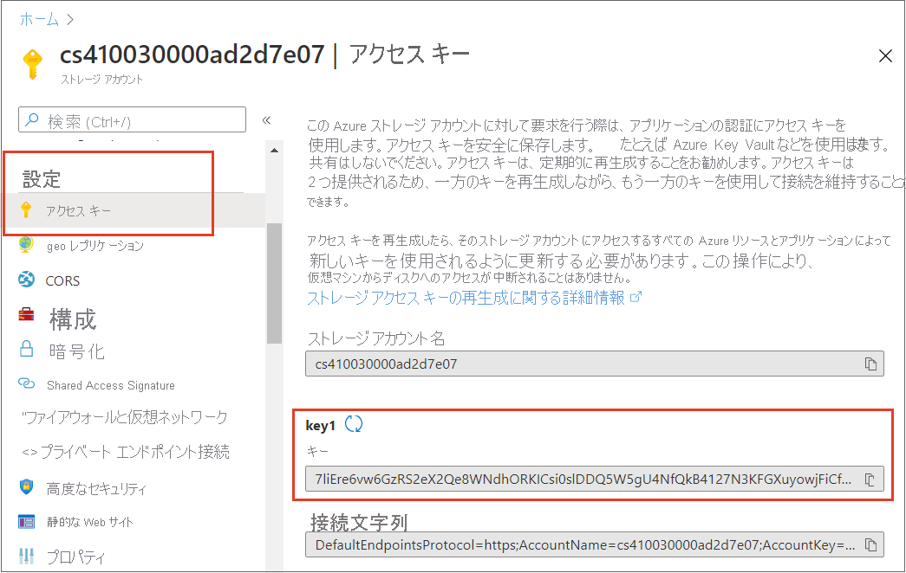

# <a name="tutorial-get-started-with-the-azure-webjobs-sdk-for-event-driven-background-processing"></a>チュートリアル: イベント ドリブンのバックグラウンド処理に Azure WebJobs SDK の使用を開始する

Azure App Service 用の Azure WebJobs SDK を使用して、Web アプリでバックグラウンド タスクやスケジュールされたタスクを実行したり、イベントに応答したりできるようにします。 

Visual Studio 2019 を使用して、WebJobs SDK を使用してAzure Storage キュー メッセージに応答する .NET Core コンソール アプリを作成し、プロジェクトをローカルで実行し、最後に Azure にデプロイします。

このチュートリアルでは、次の内容を学習します。

> [!div class="checklist"]
> * コンソール アプリを作成する
> * 関数を追加する
> * ローカルでテストする
> * Azure にデプロイ
> * Application Insights ログを有効にする
> * 入力/出力バインドを追加する

## <a name="prerequisites"></a>前提条件

* Visual Studio 2019 と **Azure 開発** ワークロード。 [Visual Studio 2019 をインストール](/visualstudio/install/)します。

* アクティブなサブスクリプションが含まれる Azure アカウント。 [無料でアカウントを作成できます](https://azure.microsoft.com/free/dotnet)。

## <a name="create-a-console-app"></a>コンソール アプリを作成する
このセクションでは、Visual Studio 2019 でプロジェクトを作成することから始めます。 次に、Azure 開発用のツール、コード発行、およびトリガーをリッスンして関数を呼び出す関数を追加します。 最後に、従来の監視ツールを無効にし、既定のフィルターを備えたコンソール プロバイダーを有効にするコンソール ログを設定します。 

>[!NOTE]  
>この記事の手順は、.NET Core 3.1 で実行される .NET Core コンソール アプリを作成するために検証されています。

### <a name="create-a-project"></a>プロジェクトを作成する

1. Visual Studio で、 **[ファイル]**  >  **[新規作成]**  >  **[プロジェクト]** の順に選択します。

1. **[新しいプロジェクトの作成]** で、 **[コンソール アプリケーション (C#)]** を選択してから、 **[次へ]** を選択します。

1. **[新しいプロジェクトの構成]** で、プロジェクトに *WebJobsSDKSample* という名前を付け、 **[次へ]** を選択します。

1. **[ターゲット フレームワーク]** を選択し、 **[作成]** を選択します。 このチュートリアルは、.NET Core 3.1 を使用して検証されています。

### <a name="install-webjobs-nuget-packages"></a>WebJobs NuGet パッケージをインストールする

最新の WebJobs NuGet パッケージをインストールします。 このパッケージには、Microsoft.Azure.WebJobs (WebJobs SDK) が含まれています。これを使用すると、Azure AppService の WebJobs に関数コードを発行できます。

1. [Microsoft.Azure.WebJobs.Extensions NuGet パッケージ](https://www.nuget.org/packages/Microsoft.Azure.WebJobs.Extensions/)の最新の安定バージョン 3.x を入手します。

2. Visual Studio で、 **[ツール]**  >  **[NuGet パッケージ マネージャー]** にアクセスします。

3. **[パッケージ マネージャー コンソール]** を選択します。 NuGet のコマンドレットの一覧、ドキュメントへのリンク、および `PM>` エントリ ポイントが表示されます。

4. 次のコマンドで、`<3_X_VERSION>` を手順 1 で確認した現在のバージョン番号に置き換えます。 

     ```powershell
     Install-Package Microsoft.Azure.WebJobs.Extensions -version <3_X_VERSION>
     ```
5. **[パッケージ マネージャー コンソール]** で、このコマンドを実行します。 拡張機能の一覧が表示され、自動的にインストールされます。 
  
### <a name="create-the-host"></a>ホストを作成する

ホストは関数のランタイム コンテナーであり、トリガーをリッスンし、関数を呼び出します。 以下の手順では、[`IHost`](/dotnet/api/microsoft.extensions.hosting.ihost) を実装するホストを作成します。これは、ASP.NET Core での汎用ホストです。

1. **[Program.cs]** タブを選択し、これらの `using` ステートメントを追加します。

    ```cs
    using System.Threading.Tasks;
    using Microsoft.Extensions.Hosting;
    ```

1. また、 **[Program.cs]** で、`Main` メソッドを次のコードに置き換えます。

    ```cs
    static async Task Main()
    {
        var builder = new HostBuilder();
        builder.ConfigureWebJobs(b =>
                {
                    b.AddAzureStorageCoreServices();
                });
        var host = builder.Build();
        using (host)
        {
            await host.RunAsync();
        }
    }
    ```

ASP.NET Core では、ホストの構成は [`HostBuilder`](/dotnet/api/microsoft.extensions.hosting.hostbuilder) インスタンスでメソッドを呼び出すことによって設定します。 詳しくは、「[.NET での汎用ホスト](/aspnet/core/fundamentals/host/generic-host)」をご覧ください。 `ConfigureWebJobs` 拡張メソッドでは、WebJobs ホストが初期化されます。 `ConfigureWebJobs` で、Storage バインド拡張機能などの特定のバインド拡張機能を初期化し、それらの拡張機能のプロパティを設定します。  

### <a name="enable-console-logging"></a>コンソール ログ記録の有効化

[ASP.NET Core ログ フレームワーク](/aspnet/core/fundamentals/logging)を使用するコンソール ログを設定します。 このフレームワーク (Microsoft.Extensions.Logging) には、さまざまな組み込みおよびサードパーティのログ プロバイダーと連携する API が含まれています。

1. `Microsoft.Extensions.Logging` を含む、[`Microsoft.Extensions.Logging.Console` NuGet パッケージ](https://www.nuget.org/packages/Microsoft.Extensions.Logging.Console/)の最新の安定バージョンを取得します。

2. 次のコマンドで、`<3_X_VERSION>` を手順 1 で確認した現在のバージョン番号に置き換えます。 NuGet パッケージの種類ごとに、一意のバージョン番号が付いています。

   ```powershell
   Install-Package Microsoft.Extensions.Logging.Console -version <3_X_VERSION>
   ```
3. **[パッケージ マネージャー コンソール]** で、現在のバージョン番号を入力し、コマンドを実行します。 拡張機能の一覧が表示され、自動的にインストールされます。 

4. **[Program.cs]** タブで、この `using` ステートメントを追加します。

   ```cs
   using Microsoft.Extensions.Logging;
   ```
5. 引き続き **[Program.cs]** で、`Build` コマンドの前に [`ConfigureLogging`](/dotnet/api/microsoft.aspnetcore.hosting.webhostbuilderextensions.configurelogging) メソッドを [`HostBuilder`](/dotnet/api/microsoft.extensions.hosting.hostbuilder)に追加します。 [`AddConsole`](/dotnet/api/microsoft.extensions.logging.consoleloggerextensions.addconsole) メソッドでは、構成にコンソールのログ記録が追加されます。

    ```cs
    builder.ConfigureLogging((context, b) =>
    {
        b.AddConsole();
    });
    ```

    `Main` メソッドは次のようになります。

    ```cs
    static async Task Main()
    {
        var builder = new HostBuilder();
        builder.ConfigureWebJobs(b =>
                {
                    b.AddAzureStorageCoreServices();
                });
        builder.ConfigureLogging((context, b) =>
                {
                    b.AddConsole();
                });
        var host = builder.Build();
        using (host)
        {
            await host.RunAsync();
        }
    }
    ```

    この追加により、これらの変更が行われます。

    * [ダッシュボード ログ記録](https://github.com/Azure/azure-webjobs-sdk/wiki/Queues#logs)を無効にします。 ダッシュボードはレガシ監視ツールであり、ダッシュボード ログ記録は高スループットの実稼働シナリオにはお勧めしません。
    * 既定の[フィルター](webjobs-sdk-how-to.md#log-filtering)を使用してコンソールのプロバイダーを追加します。

これで、Azure Storage キューへのメッセージ到着によってトリガーされる関数を追加することができます。

## <a name="add-a-function"></a>関数を追加する

関数とは、スケジュールに沿って実行されたり、イベントに基づいてトリガーされたり、あるいはオンデマンドで実行されたりするコードの単位です。 トリガーはサービス イベントをリッスンします。 WebJobs SDK のコンテキストでは、トリガーはデプロイ モードを指すわけではありません。 SDK を使用して作成されたイベントドリブンまたはスケジュールされた WebJobs は、"Always On" が有効になっている継続的な WebJobs として常にデプロイする必要があります。 

このセクションでは、Azure Storage キュー内のメッセージによってトリガーされる関数を作成します。 まず、Azure Storage に接続するために、バインド拡張機能を追加する必要があります。

### <a name="install-the-storage-binding-extension"></a>Storage バインディング拡張機能をインストールする

WebJobs SDK のバージョン 3 以降で Azure Storage サービスに接続するには、別の Storage バインド拡張機能パッケージをインストールする必要があります。 

1. [Microsoft.Azure.WebJobs.Extensions.Storage](https://www.nuget.org/packages/Microsoft.Azure.WebJobs.Extensions.Storage) NuGet パッケージの最新の安定バージョンであるバージョン 3.x を取得します。

1. 次のコマンドで、`<3_X_VERSION>` を手順 1 で確認した現在のバージョン番号に置き換えます。 NuGet パッケージの種類ごとに、一意のバージョン番号が付いています。 

    ```powershell
    Install-Package Microsoft.Azure.WebJobs.Extensions.Storage -Version <3_X_VERSION>
    ```
1. **[パッケージ マネージャー コンソール]** で、`PM>` エントリ ポイントで現在のバージョン番号を指定してコマンドを実行します。

1. 引き続き **Program.cs** の `ConfigureWebJobs` 拡張メソッドで、(`Build` コマンドの前の) [`HostBuilder`](/dotnet/api/microsoft.extensions.hosting.hostbuilder) インスタンスに `AddAzureStorage` メソッドを追加して、Storage 拡張機能を初期化します。 この時点で、`ConfigureWebJobs` メソッドはこのようになります。

    ```cs
    builder.ConfigureWebJobs(b =>
    {
        b.AddAzureStorageCoreServices();
        b.AddAzureStorage();
    });
    ```
1. `builder` がインスタンス化されたら、`Main` メソッドに次のコードを追加します。

    ```csharp
    builder.UseEnvironment(EnvironmentName.Development);
     ```

    [開発モード](webjobs-sdk-how-to.md#host-development-settings)で実行すると、ランタイムでメッセージを見つけて関数を呼び出すまでの時間を大幅に遅らせる可能性がある[キュー ポーリング指数バックオフ](../azure-functions/functions-bindings-storage-queue-trigger.md?tabs=csharp#polling-algorithm)が減少します。 開発とテストが完了したら、このコード行を削除するか、`Production` に切り替える必要があります。 

    `Main` メソッドは次の例のようになります。

    ```csharp
    static async Task Main()
    {
        var builder = new HostBuilder();
        builder.UseEnvironment(EnvironmentName.Development);
        builder.ConfigureWebJobs(b =>
        {
            b.AddAzureStorageCoreServices();
        });
        builder.ConfigureLogging((context, b) =>
        {
            b.AddConsole();
        });
        builder.ConfigureWebJobs(b =>
        {
            b.AddAzureStorageCoreServices();
            b.AddAzureStorage();
        });
        var host = builder.Build();
        using (host)
        {
            await host.RunAsync();
        }
    }
    ```

### <a name="create-a-queue-triggered-function"></a>キューによってトリガーされる関数の作成

`QueueTrigger` 属性は、`queue` と呼ばれる Azure Storage キューに新しいメッセージが書き込まれたときに、この関数を呼び出すようランタイムに通知します。 キュー メッセージの内容は、`message` パラメーター内のメソッド コードに提供されます。 メソッドの本文では、トリガー データを処理します。 この例では、コードはメッセージをログに記録するだけです。

1. ソリューション エクスプローラーで、プロジェクトを右クリックして、 **[追加]**  >  **[新しい項目]** の順に選択し、 **[クラス]** を選択します。 

2. 新しい C# クラス ファイルに *Functions.cs* という名前を付けて、 **[追加]** を選択します。

3. *Functions.cs* で、生成されたテンプレートを次のコードに置き換えます。
    
    ```cs
    using Microsoft.Azure.WebJobs;
    using Microsoft.Extensions.Logging;
    
    namespace WebJobsSDKSample
    {
        public class Functions
        {
            public static void ProcessQueueMessage([QueueTrigger("queue")] string message, ILogger logger)
            {
                logger.LogInformation(message);
            }
        }
    }
    ```

    `queue` という名前のキューにメッセージが追加されると、関数が実行され、`message` 文字列がログに書き込まれます。 監視対象のキューは、次に作成する既定の Azure Storage アカウントに含まれています。
   
`message` パラメーターは文字列である必要はありません。 JSON オブジェクト、バイト配列、または [CloudQueueMessage](/dotnet/api/microsoft.azure.storage.queue.cloudqueuemessage) オブジェクトにバインドすることもできます。 [キュー トリガーの使用方法](../azure-functions/functions-bindings-storage-queue-trigger.md?tabs=csharp#usage)に関するページをご覧ください。 バインドの種類 (キュー、BLOB、テーブルなど) ごとに、バインドできる異なる種類のパラメーター セットがあります。

### <a name="create-an-azure-storage-account"></a>Azure のストレージ アカウントの作成

ローカルで実行する Azure ストレージ エミュレーターには、WebJobs SDK に必要な機能がすべてあるわけではありません。 Azure でストレージ アカウントを作成し、それを使用するようにプロジェクトを構成します。 

汎用 v2 ストレージ アカウントの作成方法については、[Azure Storage アカウントの作成](../storage/common/storage-account-create.md?tabs=azure-portal)に関するページをご覧ください。

### <a name="locate-and-copy-your-connection-string"></a>接続文字列を検索してコピーする
ストレージを構成するには、接続文字列が必要です。 次のステップのために、この接続文字列を保持します。

1. [Azure portal](https://portal.azure.com) で、自分のストレージ アカウントに移動し、 **[設定]** を選択します。
1. **[設定]** で **[アクセス キー]** を選択します。
1. **[key1]** の下の **[接続文字列]** には、 **[クリップボードにコピー]** アイコンを選択します。

     

### <a name="configure-storage-to-run-locally"></a>ローカル環境で実行するようにストレージを構成する

WebJobs SDK では、Azure のアプリケーション設定内でストレージの接続文字列が検索されます。 ローカル環境で実行すると、ローカル構成ファイルまたは環境変数内でこの値が検索されます。

1. プロジェクトを右クリックし、 **[追加]**  > 、 **[新しい項目]** の順に選択し、 **[JavaScript JSON 構成ファイル]** を選択し、新しいファイルに *appsettings.json* という名前を付け、 **[追加]** を選択します。 

1. 新しいファイルで、次の例のように `AzureWebJobsStorage` フィールドを追加します。

    ```json
    {
        "AzureWebJobsStorage": "{storage connection string}"
    }
    ```

1. *{storage connection string}* を、先ほどコピーした接続文字列で置き換えます。

1. ソリューション エクスプローラーで *appsettings.json* ファイルを選択し、 **[プロパティ]** ウィンドウで **[出力ディレクトリにコピー]** アクションを **[新しい場合はコピーする]** に設定します。

このファイルには接続文字列シークレットが含まれているため、リモート コード リポジトリにこのファイルを保存しないでください。 プロジェクトを Azure に発行した後、Azure App Service のアプリに同じ接続文字列アプリ設定を追加できます。

## <a name="test-locally"></a>ローカルでテストする

プロジェクトをローカルでビルドして実行し、関数をトリガーするメッセージ キューを作成します。

1. Visual Studio の **Cloud Explorer** で、新しいストレージ アカウントのノードを展開し、 **[キュー]** を右クリックします。

1. **[キューの作成]** を選択します。

1. キューの名前として「*キュー*」と入力し、 **[OK]** を選択します。

   

1. 新しいキューのノードを右クリックし、 **[開く]** を選択します。

1. **メッセージの追加** アイコンを選択します。

   

1. **[メッセージの追加]** ダイアログで、「*Hello World!* 」を **[メッセージ テキスト]** として入力し、 **[OK]** を選択します。 これでキューにメッセージが入りました。

   

1. **Ctrl キーを押しながら F5 キー** を押してプロジェクトを実行します。

   コンソールには、ランタイムで関数が検出されたことが表示されます。 `ProcessQueueMessage` 関数で `QueueTrigger` 属性を使用したので、WeJobs ランタイムは `queue` という名前のキューでメッセージをリッスンします。 このキューで新しいメッセージが見つかると、ランタイムはメッセージ文字列値を渡して関数を呼び出します。

1. **[キュー]** ウィンドウに戻り、それを更新します。 ローカルで実行されている関数によって処理されたため、メッセージが消えます。

1. コンソール ウィンドウを閉じます。 

ここで、WebJobs SDK プロジェクトを Azure に発行します。

## <a name="deploy-to-azure"></a><a name="deploy-as-a-webjob"></a>Azure にデプロイする

デプロイ時に、関数を実行するアプリ サービス インスタンスを作成します。 .NET Core コンソール アプリを Azure の App Service に発行すると、WebJob として自動的に実行されます。 発行に関する詳細については、「[Visual Studio を使用して Web ジョブを開発してデプロイする](webjobs-dotnet-deploy-vs.md)」を参照してください。

### <a name="create-azure-resources"></a>Azure リソースを作成する

[!INCLUDE [webjobs-publish-net-core](../../includes/webjobs-publish-net-core.md)]

### <a name="enable-always-on"></a>Always On を有効にする

継続的な WebJob の場合は、WebJobs が正常に実行されるように、サイトで Always On 設定を有効にする必要があります。 Always On を有効にしない場合、ランタイムは非アクティブな状態が数分間続くとアイドル状態になります。 

1. **[発行]** ページで、 **[ホスティング]** の上にある 3 つの点を選択して **ホスティング プロファイル セクションのアクション** を表示し、 **[Azure portal で開きます]** を選択します。  

1. **[設定]** で、 **[構成]**  >  **[全般設定]** を選択し、 **[Always On]** を **[オン]** に設定します。次に、 **[保存]** と **[続行]** を選択し、サイトを再起動します。

### <a name="publish-the-project"></a>プロジェクトの発行

Azure で Web アプリを作成したので、WebJobs プロジェクトを発行します。 

1. **[発行]** ページの **[ホスティング]** で、[編集] ボタンを選択し、 **[WebJob の種類]** を `Continuous` に変更して、 **[保存]** を選択します。 これにより、メッセージがキューに追加されたときに WebJob が実行されるようになります。 トリガーされた WebJobs は、通常、手動の Webhook に対してのみ使用されます。 

1. **[発行]** ページの右上隅にある **[発行]** ボタンを選択します。 操作が完了すると、Azure で WebJob が実行されます。

### <a name="create-a-storage-connection-app-setting"></a>ストレージ接続アプリ設定を作成する

appsettings.json 構成ファイルでローカルに使用したのと同じストレージ接続文字列設定を Azure で作成する必要があります。 これにより、接続文字列をより安全に格納することができます。また、次のことを行います。   

1. **[発行プロファイル]** ページで、 **[ホスティング]** の上にある 3 つの点を選択して **ホスティング プロファイル セクションのアクション** を表示し、 **[Azure App Service の設定を管理する]** を選択します。

1. **[アプリケーション設定]** で、 **[+ 設定の追加]** を選択します。

1. **[新しいアプリ設定名]** に「`AzureWebJobsStorage`」と入力し、 **[OK]** を選択します。 
 
1. **[リモート]** に、ローカル設定の接続文字列を貼り付け、 **[OK]** を選択します。 

これで、Azure のアプリに接続文字列が設定されました。

### <a name="trigger-the-function-in-azure"></a>Azure で関数をトリガーする

1. ローカルで実行していないことを確認します。 コンソール ウィンドウが開いたままの場合は閉じます。 そうしないと、作成するキュー メッセージが最初にローカル インスタンスによって処理される可能性があります。

1. Visual Studio の **[キュー]** ページで、前と同様にキューにメッセージを追加します。

1. **[キュー]** ページを更新すると、Azure で実行されている関数によって処理されたため、新しいメッセージが表示されなくなります。

## <a name="enable-application-insights-logging"></a>Application Insights ログを有効にする

WebJob を Azure で実行する場合、コンソール出力を表示して関数の実行を監視することはできません。 WebJob を監視できるようにするには、プロジェクトを発行するときに、関連する [Application Insights](../azure-monitor/app/app-insights-overview.md) インスタンスを作成する必要があります。

### <a name="create-an-application-insights-instance"></a>Application Insights インスタンスを作成する

1. **[発行プロファイル]** ページで、 **[ホスティング]** の上にある 3 つの点を選択して **ホスティング プロファイル セクションのアクション** を表示し、 **[Azure portal で開きます]** を選択します。

1. Web アプリの **[設定]** で、 **[Application Insights]** を選択し、 **[Application Insights を有効にする]** を選択します。

1. 生成されたインスタンスの **リソース名** と **場所** を確認し、 **[適用]** を選択します。 

1. **[設定]** で **[構成]** を選択し、新しい `APPINSIGHTS_INSTRUMENTATIONKEY` が作成されたことを確認します。 このキーは、WebJob インスタンスを Application Insights に接続するために使用されます。   

[Application Insights](../azure-monitor/app/app-insights-overview.md) のログを利用するには、ログ コードも更新する必要があります。

### <a name="install-the-application-insights-extension"></a>Application Insights 拡張機能をインストールする

1. [Microsoft.Azure.WebJobs.Logging.ApplicationInsights](https://www.nuget.org/packages/Microsoft.Azure.WebJobs.Logging.ApplicationInsights) NuGet パッケージの最新の安定バージョンであるバージョン 3.x を取得します。

2. 次のコマンドで、`<3_X_VERSION>` を手順 1 で確認した現在のバージョン番号に置き換えます。 NuGet パッケージの種類ごとに、一意のバージョン番号が付いています。 

    ```powershell
    Install-Package Microsoft.Azure.WebJobs.Logging.ApplicationInsights -Version <3_X_VERSION>
    ```
3. **[パッケージ マネージャー コンソール]** で、`PM>` エントリ ポイントで現在のバージョン番号を指定してコマンドを実行します。

### <a name="initialize-the-application-insights-logging-provider"></a>Application Insights ログ プロバイダーを初期化する

*Program.cs* を開き、`ConfigureLogging` で `AddConsole` の呼び出しの後に次の初期化子を追加します。

```csharp
// If the key exists in settings, use it to enable Application Insights.
string instrumentationKey = context.Configuration["APPINSIGHTS_INSTRUMENTATIONKEY"];
if (!string.IsNullOrEmpty(instrumentationKey))
{
    b.AddApplicationInsightsWebJobs(o => o.InstrumentationKey = instrumentationKey);
}
```

`Main` メソッド コードは次の例のようになります。 

```csharp
static async Task Main()
{
    var builder = new HostBuilder();
    builder.UseEnvironment(EnvironmentName.Development);
    builder.ConfigureWebJobs(b =>
            {
                b.AddAzureStorageCoreServices();
                b.AddAzureStorage();
            });
    builder.ConfigureLogging((context, b) =>
            {
                b.AddConsole();

                // If the key exists in settings, use it to enable Application Insights.
                string instrumentationKey = context.Configuration["APPINSIGHTS_INSTRUMENTATIONKEY"];
                if (!string.IsNullOrEmpty(instrumentationKey))
                {
                    b.AddApplicationInsightsWebJobs(o => o.InstrumentationKey = instrumentationKey);
                }
            });
    var host = builder.Build();
    using (host)
    {
        await host.RunAsync();
    }
}
```

これにより、既定の[フィルタリング](webjobs-sdk-how-to.md#log-filtering)を使用して Application Insights ログ プロバイダーが初期化されます。 ローカルで実行しているときは、情報レベルとそれより高いレベルのログがすべて、コンソールと Application Insights の両方に出力されます。

### <a name="republish-the-project-and-trigger-the-function-again"></a>プロジェクトを再発行し、この関数を再びトリガーします

1. **ソリューション エクスプローラー** で、プロジェクトを右クリックし、 **[発行]** を選択します。

1. 「*Hello App Insights!* 」をメッセージ テキストとして入力すること以外は、[前](#test-locally)に行ったときと同様に、Visual Studio の **Cloud Explorer** を使用してキュー メッセージを 作成します。

1. **[発行プロファイル]** ページで、 **[ホスティング]** の上にある 3 つの点を選択して **ホスティング プロファイル セクションのアクション** を表示し、 **[Azure portal で開きます]** を選択します。

1. Web アプリの **[設定]** で、 **[Application Insights]** を選択し、 **[Application Insights データの表示]** を選択します。

1. **[検索]** を選択し、 **[See all data in the last 24 hours]\(過去 24 時間のすべてのデータを表示\)** を選択します。

   ![[検索] の選択](./media/webjobs-sdk-get-started/select-search.png)

1. "*Hello App Insights!* " メッセージが表示されない場合は、 **[更新]** を数分ごとに定期的に選択します Application Insights クライアントが処理するログをフラッシュするのに少し時間がかかるので、ログはすぐには表示されません。

   

## <a name="add-inputoutput-bindings&quot;></a>入力/出力バインドを追加する

バインドを使用すると、データの読み取りと書き込みを行うコードが簡略化されます。 入力バインディングでは、データを読み取るコードを簡略化します。 出力バインディングでは、データを書き込むコードを簡略化します。  

### <a name=&quot;add-input-binding&quot;></a>入力バインドを追加する

入力バインディングでは、データを読み取るコードを簡略化します。 この例では、キュー メッセージは BLOB の名前であり、Azure Storage の BLOB の検索と読み取りに使用します。

1. *Functions.cs* で、`ProcessQueueMessage` メソッドを次のコードに置き換えます。

   ```cs
   public static void ProcessQueueMessage(
       [QueueTrigger(&quot;queue")] string message,
       [Blob("container/{queueTrigger}", FileAccess.Read)] Stream myBlob,
       ILogger logger)
   {
       logger.LogInformation($"Blob name:{message} \n Size: {myBlob.Length} bytes");
   }
   ```

   このコードでは、`queueTrigger` は[バインディング式](../azure-functions/functions-bindings-expressions-patterns.md)なので、実行時に別の値に解決されます。  実行時には、キュー メッセージの内容が含まれます。

1. `using` を追加します。

   ```cs
   using System.IO;
   ```

1. ストレージ アカウントで BLOB コンテナーを作成します。

   a. Visual Studio の **Cloud Explorer** で、ストレージ アカウントのノードを展開し、 **[BLOB]** を右クリックして **[BLOB コンテナーの作成]** を選択します。

   b. **[BLOB コンテナーの作成]** ダイアログで、コンテナー名として「*container*」を入力し、 **[OK]** を選択します。

1. BLOB コンテナーに *Program.cs* ファイルをアップロードします (このファイルは、ここでは例として使用しています。任意のテキスト ファイルをアップロードし、そのファイルの名前でキュー メッセージを作成できます)。

   a. **Cloud Explorer** で、作成したコンテナーのノードをダブルクリックします。

   b. **[コンテナー]** ウィンドウで **アップロード** ボタンをクリックします。

   

   c. *Program.cs* を検索して選択し、 **[OK]** を選択します。

1. *Program.cs* をメッセージのテキストとして、以前に作成したキューにキュー メッセージを作成します。

   

1. プロジェクトをローカルで実行します。

   キュー メッセージによって関数がトリガーされ、BLOB が読み取られて、その長さがログに記録されます。 コンソール出力は次のようになります。

   ```console
   Found the following functions:
   ConsoleApp1.Functions.ProcessQueueMessage
   Job host started
   Executing 'Functions.ProcessQueueMessage' (Reason='New queue message detected on 'queue'.', Id=5a2ac479-de13-4f41-aae9-1361f291ff88)
   Blob name:Program.cs
   Size: 532 bytes
   Executed 'Functions.ProcessQueueMessage' (Succeeded, Id=5a2ac479-de13-4f41-aae9-1361f291ff88)
   ```
### <a name="add-an-output-binding"></a>出力バインディングを追加する

出力バインディングでは、データを書き込むコードを簡略化します。 この例では、サイズをログに記録する代わりに BLOB のコピーを書き込むことで、前の例を変更します。 BLOB ストレージのバインドは、前にインストールした Azure Storage の拡張機能パッケージに含まれます。

1. `ProcessQueueMessage` メソッドを次のコードに置き換えます。

   ```cs
   public static void ProcessQueueMessage(
       [QueueTrigger("queue")] string message,
       [Blob("container/{queueTrigger}", FileAccess.Read)] Stream myBlob,
       [Blob("container/copy-{queueTrigger}", FileAccess.Write)] Stream outputBlob,
       ILogger logger)
   {
       logger.LogInformation($"Blob name:{message} \n Size: {myBlob.Length} bytes");
       myBlob.CopyTo(outputBlob);
   }
   ```

1. *Program.cs* をメッセージのテキストとして別のキュー メッセージを作成します。

1. プロジェクトをローカルで実行します。

   キュー メッセージによって関数がトリガーされ、BLOB が読み取られ、その長さがログに記録されて、新しい BLOB が作成されます。 コンソール出力は同じですが、BLOB コンテナー ウィンドウに移動して **[更新]** を選択すると、*copy-Program.cs* という名前の新しい BLOB が表示されます。

### <a name="republish-the-project"></a>プロジェクトを再発行する

1. **ソリューション エクスプローラー** で、プロジェクトを右クリックし、 **[発行]** を選択します。

1. **[発行]** ダイアログで、現在のプロファイルが選択されていることを確認し、 **[発行]** を選択します。 発行の結果は **[出力]** ウィンドウに詳しく表示されます。
 
1. ファイルを再び BLOB コンテナーにアップロードし、アップロードしたファイルの名前になっているキューにメッセージを追加することで Azure で関数を検証します。 キューからメッセージが削除されたことと、BLOB コンテナーにファイルのコピーが作成されたことを確認できます。 

## <a name="next-steps"></a>次のステップ

このチュートリアルでは、WebJobs SDK 3.x プロジェクトを作成、実行、デプロイする方法について説明しました。

> [!div class="nextstepaction"]
> [WebJobs SDK の詳細を確認してください](webjobs-sdk-how-to.md)