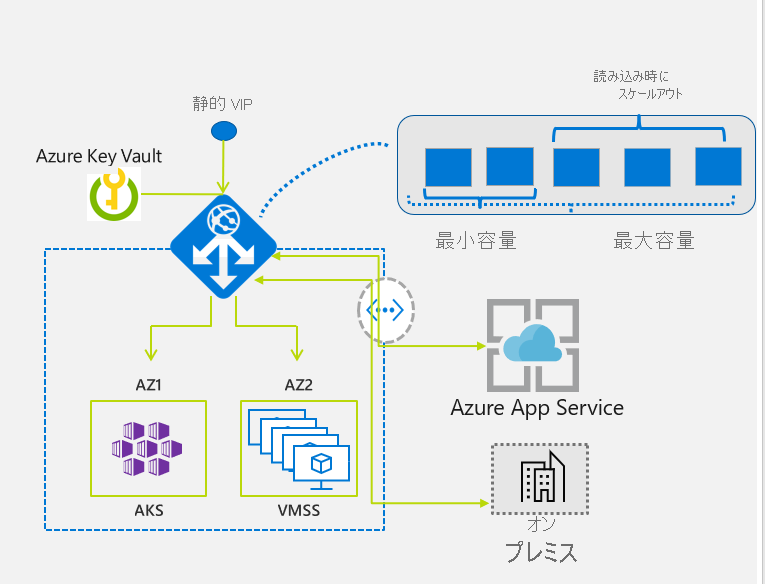

# 自動スケーリングとゾーン冗長 Application Gateway v2 

Application Gateway と Web アプリケーション ファイアウォール (WAF) は、Standard_v2 SKU と WAF_v2 SKU でも使用できます。 v2 SKU では、パフォーマンスが強化され、自動スケールダウン、ゾーン冗長、静的 VIP のサポートなどの重要な新機能のサポートが追加されます。 Standard SKU と WAF SKU の既存機能は、[比較](#differences-with-v1-sku)セクションで示されているいくつかの例外を除き、新しい v2 SKU でも引き続きサポートされます。

新しい v2 SKU には、次の拡張機能が含まれます。

- **自動スケール**:自動スケーリング SKU の下での Application Gateway または WAF のデプロイは、トラフィック負荷パターンの変化に基づいてスケールアップまたはスケールダウンできます。 また、自動スケールにより、プロビジョニングの間にデプロイのサイズまたはインスタンスの数を選択する必要がなくなります。 この SKU では真のエラスティック性が提供されます。 Standard_v2 および WAF_v2 SKU では、Application Gateway は固定容量モード (自動スケーリング無効) と自動スケーリング有効モードの両方で動作できます。 固定容量モードは、ワークロードが一定で予測可能なシナリオに便利です。 自動スケールダウン モードは、アプリケーション トラフィックが変動するアプリケーションで役に立ちます。
- **ゾーン冗長性**: Application Gateway または WAF のデプロイは複数の可用性ゾーンを対象にできるため、Traffic Manager を使ってゾーンごとに個別に Application Gateway のインスタンスをプロビジョニングする必要はありません。 Application Gateway のインスタンスをデプロイする単一のゾーンまたは複数のゾーンを選択できるので、ゾーンの障害の回復性が向上します。 アプリケーションのバックエンド プールも、複数の可用性ゾーンに同様に分散できます。

  ゾーン冗長性は、Azure ゾーンが使用可能な場所でのみ使用できます。 他のリージョンでは、その他のすべての機能がサポートされます。 詳しくは、「[Azure の Availability Zones の概要](../availability-zones/az-overview.md#services-support-by-region)」をご覧ください。
- **静的 VIP**: Application Gateway v2 SKU では、静的 VIP の種類だけがサポートされます。 これにより、アプリケーション ゲートウェイに関連付けられた VIP は、デプロイのライフサイクルの間は、再起動後であっても変化しません。  v1 には静的 VIP がないため、アプリケーション ゲートウェイを経由して App Services にルーティングするドメイン名の IP アドレスの代わりに、アプリケーション ゲートウェイの URL を使用する必要があります。
- **ヘッダーの書き換え**: Application Gateway では、HTTP 要求と応答のヘッダーを v2 SKU で追加、削除、更新することができます。 詳しくは、「[Application Gateway で HTTP ヘッダーを書き換える](rewrite-http-headers.md)」をご覧ください
- **Key Vault の統合 (プレビュー)** : Application Gateway v2 では、HTTPS が有効なリスナーにアタッチされているサーバー証明書用の Key Vault との統合 (パブリック プレビュー段階) がサポートされます。 詳細については、「[Key Vault 証明書での SSL 終了](key-vault-certs.md)」を参照してください。
- **Azure Kubernetes Service のイングレス コントローラー (プレビュー)** : Application Gateway v2 のイングレス コントローラーを使うと、AKS クラスターと呼ばれる Azure Kubernetes Service (AKS) に対するイングレスとして Azure Application Gateway を使用できます。 詳しくは、[ドキュメントのページ](https://azure.github.io/application-gateway-kubernetes-ingress/)をご覧ください。
- **パフォーマンスの向上**: v2 SKU では、Standard/WAF SKU と比較して、SSL オフロードのパフォーマンスが最大で 5 倍になります。
- **デプロイと更新の時間の短縮**: v2 SKU では、Standard/WAF SKU と比較して、デプロイと更新の時間が短縮されます。 これには、WAF の構成の変更も含まれます。

## サポートされているリージョン

Standard_v2 および WAF_v2 SKU は、次のリージョンで利用できます: 米国中北部、米国中南部、米国西部、米国西部 2、米国東部、米国東部 2、米国中部、北ヨーロッパ、西ヨーロッパ、東南アジア、フランス中部、英国西部、東日本、西日本、オーストラリア東部、オーストラリア南東部、カナダ中部、カナダ東部、東アジア、韓国中部、韓国南部、インド南部、英国南部、インド中部、インド西部、インド南部。

## 価格

v2 SKU では、価格モデルは従量課金方式であり、インスタンス数やサイズには関連付けられません。 v2 SKU の価格には 2 つのコンポーネントがあります。

- **固定価格** - これは、Standard_v2 または WAF_v2 ゲートウェイをプロビジョニングするための 1 時間 (または 1 時間未満) 単位の価格です。
- **容量ユニット価格** - これは固定コストに追加して課金される使用量ベースの料金です。 容量ユニットの料金も、1 時間または 1 時間未満の単位で計算されます。 容量ユニットには、コンピューティング ユニット、永続的接続、スループットの 3 つのディメンションがあります。 コンピューティング ユニットは、使用されたプロセッサの容量のメジャーです。 コンピューティング ユニットに影響する要因は、1 秒あたりの TLS 接続数、URL 書き換え計算、WAF ルールの処理です。 永続的接続は、特定の請求期間にアプリケーション ゲートウェイに対して確立された TCP 接続のメジャーです。 スループットは、特定の請求期間にシステムによって処理された平均メガビット数/秒です。

各容量ユニットは最大で次のものにより構成されます: 1 コンピューティング ユニット、または 2500 永続的接続、または 2.22 Mbps のスループット。

コンピューティング ユニットのガイダンス:

- **Standard_v2** - 各コンピューティング ユニットは、RSA 2048 ビット キーの TLS 証明書で 1 秒あたり約 50 の接続に対応します。
- **WAF_v2** - 各コンピューティング ユニットは、70% が 2 KB 未満の GET/POST 要求、残りがそれ以上の要求の混合で、1 秒あたり約 10 件の同時要求をサポートできます。 WAF のパフォーマンスは、現在、応答のサイズによる影響を受けません。

> [!NOTE]
> 各インスタンスは、現在、約 10 個の容量ユニットをサポートできます。
> コンピューティング ユニットが処理できる要求の数は、TLS 証明書のキーのサイズ、キー交換アルゴリズム、ヘッダーの書き換え、WAF での着信要求のサイズなど、さまざまな条件に依存します。 アプリケーションのテストを実行し、コンピューティング ユニットあたりの要求レートを決定することをお勧めします。 容量ユニットとコンピューティング ユニットはどちらも、請求が始まる前に、メトリックとして使用できるようになります。

次の表は、例示のみを目的として、価格の例を示しています。

**米国東部での料金**:

|              SKU 名                             | 固定価格 ($/時間)  | 容量ユニットの価格 ($/CU 時間)   |
| ------------------------------------------------- | ------------------- | ------------------------------- |
| Standard_v2                                       |    0.20             | 0.0080                          |
| WAF_v2                                            |    0.36             | 0.0144                          |

価格情報の詳細については、[価格](https://azure.microsoft.com/pricing/details/application-gateway/)に関するページを参照してください。 課金は、2019 年 7 月 1 日に開始される予定です。

**例 1**

ある Standard_v2 アプリケーション ゲートウェイは、自動スケーリングなし、手動スケーリング モード、5 インスタンスの固定容量でプロビジョニングされます。

固定価格 = 744 (時間) * $0.20 = $148.8  
容量ユニット = 744 (時間) * 10 容量ユニット/インスタンス * 5 インスタンス * $0.008/容量ユニット時間 = $297.6

合計価格 = $148.8 + $297.6 = $446.4

**例 2**

ある standard_v2 アプリケーション ゲートウェイは、1 か月だけプロビジョニングされ、この間に、毎秒 25 個の新規 SSL 接続と平均 8.88 Mbps のデータ転送を受け取ります。 接続の有効期間が短いと仮定した場合、価格は次のようになります。

固定価格 = 744 (時間) * $0.20 = $148.8

容量ユニットの価格 = 744 (時間) * 最大 (1 秒間の接続数に対する 25/50 コンピューティング ユニット、スループットに対する 8.88/2.22 容量ユニット) * $0.008 = 744 * 4 * 0.008 = $23.81

合計価格 = $148.8 + $23.81 = $172.61

> [!NOTE]
> Max 関数は、値のペアの最大値を返します。

**例 3**

ある WAF_v2 アプリケーション ゲートウェイは、1 か月間だけプロビジョニングされます。 この間に、毎秒 25 個の新規 SSL 接続と平均 8.88 Mbps のデータ転送を受け取り、1 秒間に 80 件の要求を行います。 接続の有効期間が短く、アプリケーションのコンピューティング ユニットの計算でコンピューティング ユニットあたり 10 RPS がサポートされると仮定した場合、価格は次のようになります。

固定価格 = 744 (時間) * $0.36 = $267.84

容量ユニットの価格 = 744 (時間) * 最大 (コンピューティング ユニット最大 (1 秒間の接続数に対する 25/50、80/10 WAF RPS)、スループットに対する 8.88/2.22 容量ユニット) * $0.0144 = 744 * 8 * 0.0144 = $85.71

合計価格 =$267.84 + $85.71 = $353.55

> [!NOTE]
> Max 関数は、値のペアの最大値を返します。

## Application Gateway と WAF v2 のスケーリング

Application Gateway と WAF は、2 つのモードでスケーリングするように構成できます。

- **自動スケーリング** - 自動スケーリングを有効にすると、Application Gateway と WAF v2 SKU は、アプリケーションのトラフィック要件に基づいて、スケールアップまたはスケールダウンします。 このモードでは、アプリケーションに対して優れた柔軟性が提供され、アプリケーション ゲートウェイのサイズまたはインスタンスの数を推測する必要がなくなります。 また、このモードでは、予想される最大トラフィック負荷に対するピーク時のプロビジョニング容量でゲートウェイを実行する必要がないので、コストを節約することもできます。 お客様は、最小のインスタンス数と、必要に応じて最大のインスタンス数を、指定する必要があります。 最小容量により、トラフィックがない場合であっても、Application Gateway と WAF v2 が、指定された最小インスタンス数を下回らないことが保証されます。 トラフィックがまったくない場合であっても、この最小容量に対して課金されます。 また、必要に応じて最大インスタンス数を指定することができ、これにより、Application Gateway が指定したインスタンスを超えてスケーリングしないことが保証されます。 ゲートウェイによって処理されるトラフィックの量に対して、継続的に課金されます。 インスタンス数の範囲は 0 から 125 です。 最大インスタンス数を指定しない場合の既定値は 20 です。
- **手動** - 代わりに手動モードを選択でき、ゲートウェイは自動的にスケーリングされません。 このモードでは、Application Gateway または WAF が処理できる量をトラフィックが超えた場合、トラフィックが失われる可能性があります。 手動モードでは、インスタンス数の指定が必須です。 指定できるインスタンスの数は 1 から 125 までです。

## v1 SKU と v2 SKU の機能比較

次の表では、各 SKU で使用できる機能を比較しています。

|                                                   | v1 SKU   | v2 SKU   |
| ------------------------------------------------- | -------- | -------- |
| 自動スケール                                       |          | &#x2713; |
| ゾーン冗長性                                   |          | &#x2713; |
| 静的 VIP                                        |          | &#x2713; |
| Azure Kubernetes Service (AKS) のイングレス コントローラー |          | &#x2713; |
| Azure Key Vault の統合                       |          | &#x2713; |
| HTTP ヘッダーを書き換える                           |          | &#x2713; |
| URL ベースのルーティング                                 | &#x2713; | &#x2713; |
| 複数サイトのホスティング                             | &#x2713; | &#x2713; |
| トラフィック リダイレクト                               | &#x2713; | &#x2713; |
| Web アプリケーション ファイアウォール (WAF)                    | &#x2713; | &#x2713; |
| Secure Sockets Layer (SSL) ターミネーション            | &#x2713; | &#x2713; |
| エンドツーエンド SSL 暗号化                         | &#x2713; | &#x2713; |
| セッション アフィニティ                                  | &#x2713; | &#x2713; |
| カスタム エラー ページ                                | &#x2713; | &#x2713; |
| WebSocket のサポート                                 | &#x2713; | &#x2713; |
| HTTP/2 のサポート                                    | &#x2713; | &#x2713; |
| 接続のドレイン                               | &#x2713; | &#x2713; |

> [!NOTE]
> 自動スケーリングの v2 SKU では、[既定の正常性プローブ](application-gateway-probe-overview.md#default-health-probe)がサポートされるようになりました。これにより、そのバックエンド プール内のすべてのリソースの正常性が自動的に監視され、異常と見なされたバックエンド メンバーは強調表示されます。 カスタム プローブの構成がないバックエンドに対しては、既定の正常性プローブが自動的に構成されます。 詳細については、[アプリケーション ゲートウェイの正常性プローブ](application-gateway-probe-overview.md)に関するページを参照してください。

## v1 SKU との相違点

|相違点|詳細|
|--|--|
|認証証明書|サポートされていません。 詳細については、「[Application Gateway でのエンド ツー エンド SSL の概要](ssl-overview.md#end-to-end-ssl-with-the-v2-sku)」を参照してください。|
|同じサブネット上の Standard_v2 と Standard Application Gateway の混在|サポートされていません|
|Application Gateway サブネット上のユーザー定義ルート (UDR)|サポートされていません|
|受信ポート範囲の NSG| - Standard_v2 SKU では 65200 ～ 65535 - Standard SKU では 65503 ～ 65534 詳細については、[FAQ](application-gateway-faq.md#are-network-security-groups-supported-on-the-application-gateway-subnet) をご覧ください。|
|Azure Diagnostics でのパフォーマンス ログ|サポートされていません。 Azure メトリックを使用する必要があります。|
|課金|課金は、2019 年 7 月 1 日に開始される予定です。|
|FIPS モード|現在はサポートされていません。|
|ILB のみモード|現在これはサポートされていません。 パブリック モードと ILB モードがまとめてサポートされます。|
|Netwatcher 統合|サポートされていません。|
|Azure Security Center の統合|まだ使用できません。

## v1 から v2 への移行

Azure PowerShell スクリプトは PowerShell ギャラリー内で利用でき、v1 Application Gateway/WAF から v2 Autoscaling SKU への移行に役立ちます。 このスクリプトを利用して、v1 ゲートウェイから構成をコピーできます。 トラフィックの移行は引き続き、お客様の責任です。 詳しくは、[v1 から v2 への Azure Application Gateway の移行](migrate-v1-v2.md)に関するページをご覧ください。

## 次の手順

- [クイック スタート:Azure Application Gateway による Web トラフィックのルーティング - Azure portal](quick-create-portal.md)
- [Azure PowerShell を使用して、自動スケーリングの予約済み IP アドレスを持つゾーン冗長アプリケーション ゲートウェイを作成します](tutorial-autoscale-ps.md)
- [Application Gateway](overview.md) の詳細を参照します。
- [Azure Firewall](../firewall/overview.md) の詳細を参照します。
