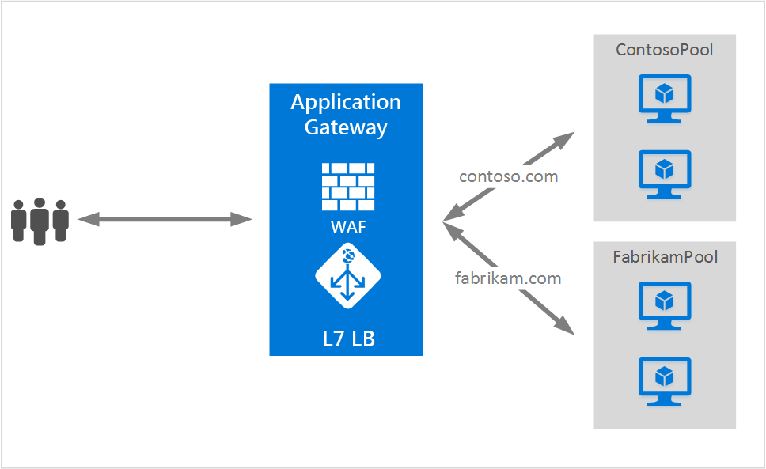

<properties
   pageTitle="Application Gateway での SSL ポリシーとエンド ツー エンド SSL の有効化 | Microsoft Azure"
   description="このページでは、Application Gateway によるエンドツーエンド SSL のサポートの概要を示します。"
   documentationCenter="na"
   services="application-gateway"
   authors="amsriva"
   manager="rossort"
   editor="amsriva"/>
<tags
   ms.service="application-gateway"
   ms.devlang="na"
   ms.topic="article"
   ms.tgt_pltfrm="na"
   ms.workload="infrastructure-services"
   ms.date="09/26/2016"
   ms.author="amsriva"/>

# Application Gateway での SSL ポリシーとエンド ツー エンド SSL の有効化

## Overview

アプリケーション ゲートウェイは、ゲートウェイの SSL ターミネーションをサポートします。通常、トラフィックは、その後、暗号化されないままバックエンド サーバーに渡されます。これにより、Web サーバーは、負荷の大きい暗号化/復号化のオーバーヘッドから開放されます。ただし、暗号化されていない通信をバックエンド サーバーで受け入れていない顧客もいます。セキュリティとコンプライアンスの要件や、セキュリティで保護された接続以外はアプリケーションで受け入れられないことが、この原因であると考えられます。このようなアプリケーションのために、アプリケーション ゲートウェイでは、現在、エンド ツー エンド SSL 暗号化がサポートされています。

エンド ツー エンド SSL により、暗号化されたバックエンドに機密データを安全に送信しながら、Cookie のアフィニティ、URL ベースのルーティング、サイトに基づくルーティングのサポート、X-Forwarded-* ヘッダーを挿入する機能など、アプリケーション ゲートウェイが提供するレイヤー 7 の負荷分散機能の利点を役立てることができます。

エンド ツー エンド SSL 通信モードが構成されている場合、アプリケーション ゲートウェイによってユーザーの SSL セッションがゲートウェイで終了され、ユーザー トラフィックの暗号化が解除されます。次に、構成済みのルールが適用され、トラフィックのルーティング先になる適切なバックエンド プール インスタンスが選択されます。バックエンドに要求を送信する前に、アプリケーション ゲートウェイによってバックエンド サーバーへの新しい SSL 接続が開始され、バックエンド サーバーの公開キー証明書を使用してデータが再暗号化されます。エンド ツー エンド SSL は BackendHTTPSetting のプロトコル設定を Https に設定することによって有効になります。この設定は次にバックエンド プールに適用されます。エンド ツー エンド SSL が有効になったバックエンド プール内の各バックエンド サーバーは、セキュリティで保護された通信を許可するように証明書で構成する必要があります。

この例では、https://contoso.com の要求は、HTTP 経由で ContosoServerPool にルーティングでき、https://fabrikam.com は、エンド ツー エンド SSL を使用して HTTPS 経由で FabrikamServerPool にルーティングされます。

## エンド ツー エンド SSL と証明書のホワイト リスト

アプリケーション ゲートウェイ は、既知のバックエンド インスタンスのみと通信します。これらのインスタンスでは、アプリケーション ゲートウェイに関する証明書がホワイトリスト登録されています。証明書のホワイトリスト登録を有効にするには、バックエンド サーバーの証明書の公開キーを アプリケーション ゲートウェイにアップロードする必要があります。ホワイトリスト登録された既知のバックエンドへの接続のみが許可され、それ以外ではゲートウェイ エラーが発生します。自己署名証明書はテストのみを目的とするため、運用環境のワークロードで使用することはお勧めできません。このような証明書も、使用する前に、上記の説明のように アプリケーション ゲートウェイでホワイトリスト登録する必要があります。

## Application Gateway の SSL ポリシー

アプリケーション ゲートウェイは、ユーザーが構成できる SSL ネゴシエーション ポリシーもサポートします。このポリシーを使用すると、顧客はアプリケーション ゲートウェイで SSL 接続をより詳細に制御できます。

1. SSL 2.0 および 3.0 は、すべての Application Gateway に対して強制的に無効になります。これらはまったく構成できません。
2. SSL ポリシーの定義によって、TLSv1\_0、TLSv1\_1、TLSv1\_2 の 3 つのプロトコルのうち任意のものを無効にできます。
3. SSL ポリシーが定義されていない場合は、3 つすべて (TLSv1\_0、TLSv1\_1、TLSv1\_2) が有効になります。

## 次のステップ

エンド ツー エンド SSL と SSL ポリシーについて学習したので、[アプリケーション ゲートウェイでのエンド ツー エンド SSL の有効化](application-gateway-end-to-end-ssl-powershell.md)に進んで、暗号化された形式でバックエンドにトラフィックを送信する機能を持つアプリケーション ゲートウェイを作成します。

<!---HONumber=AcomDC_0928_2016-->