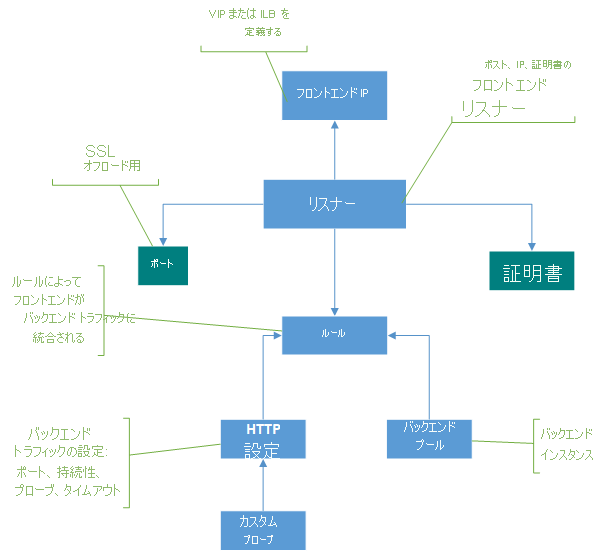

# アプリケーション ゲートウェイのコンポーネント

 アプリケーション ゲートウェイは、クライアントからの単一接続点として機能します。 アプリケーション ゲートウェイは、着信するアプリケーション トラフィックを、Azure VM、仮想マシン スケール セット、Azure App Service、オンプレミス/外部サーバーなど、複数のバックエンド プールに配布します。 トラフィックを配布するために、アプリケーション ゲートウェイではこの記事で説明する各種コンポーネントが使用されます。

## フロントエンド IP アドレス

フロントエンド IP アドレスとは、アプリケーション ゲートウェイに関連付けられた IP アドレスのことです。 アプリケーション ゲートウェイは、パブリック IP アドレス、プライベート IP アドレス、またはその両方を持つように構成できます。 アプリケーション ゲートウェイでは、パブリックまたはプライベート IP アドレスが 1 つサポートされます。 仮想ネットワークとパブリック IP アドレスは、アプリケーション ゲートウェイと同じ場所に存在する必要があります。 フロントエンド IP アドレスは、作成された後、リスナーに関連付けられます。

### 静的パブリック IP アドレスと動的パブリック IP アドレス

Azure Application Gateway V2 SKU は、静的内部 IP アドレスと静的パブリック IP アドレスの両方をサポートするよう構成することも、静的パブリック IP アドレスのみをサポートするよう構成することもできます。 静的内部 IP アドレスのみをサポートするよう構成することはできません。

V1 SKU は、静的内部 IP アドレスと動的パブリック IP アドレスをサポートする、静的内部 IP アドレスのみをサポートする、または動的パブリック IP アドレスをサポートするように構成できます。 Application Gateway の動的 IP アドレスは、実行中のゲートウェイでは変化しません。 ゲートウェイの停止時または起動時にのみ変化する可能性があります。 システム障害、更新、Azure ホストの更新などでは変化しません。 

アプリケーション ゲートウェイに関連付けられた DNS 名は、そのゲートウェイのライフサイクル全体を通して変更されません。 そのため、CNAME エイリアスを使用し、アプリケーション ゲートウェイの DNS アドレスを参照してください。

## リスナー

リスナーは、入ってくる接続要求をチェックする論理エンティティです。 リスナーは、要求に関連付けられているプロトコル、ポート、ホスト、IP アドレスがリスナー構成に関連付けられている同じ要素に一致した場合、要求を受け取ります。

アプリケーション ゲートウェイを使用する前に、リスナーを少なくとも 1 つ追加する必要があります。 1 つのアプリケーション ゲートウェイには複数のリスナーをアタッチできます。その複数のリスナーは同じプロトコルに使用できます。

クライアントから入ってきた要求をリスナーが検出すると、アプリケーション ゲートウェイはその要求をバックエンド プールのメンバーに転送します。 アプリケーション ゲートウェイでは、入ってきた要求を受け取ったリスナーに定義されている要求ルーティング規則が使用されます。

リスナーでは、次のポートとプロトコルがサポートされます。

### Port

ポートとは、リスナーがクライアント要求を待つ場所です。 v1 SKU については 1 から 65502 まで、v2 SKU については 1 から 65199 までのポートを構成できます。

### プロトコル

アプリケーション ゲートウェイでサポートされている 4 つのプロトコル:HTTP、HTTPS、HTTP/2、WebSocket

- リスナー構成で HTTP プロトコルか HTTPS プロトコルを指定します。
- [WebSockets プロトコルと HTTP/2 プロトコル](https://docs.microsoft.com/azure/application-gateway/overview#websocket-and-http2-traffic)のサポートはネイティブで提供されます。[WebSocket サポート](https://docs.microsoft.com/azure/application-gateway/application-gateway-websocket)は既定で有効になっています。 ユーザーが構成可能な、WebSocket のサポートを選択的に有効または無効にするための設定はありません。 WebSocket は HTTP リスナーと HTTPS リスナーの両方で使用します。
- HTTP/2 プロトコルのサポートを利用できるのは、アプリケーション ゲートウェイ リスナーに接続しているクライアントだけです。 バックエンド サーバー プールへの通信は、HTTP/1.1 で行われます。 既定では、HTTP/2 のサポートは無効になっています。 必要であれば、有効にすることもできます。

HTTPS リスナーは SSL 終了に使用します。 HTTPS リスナーは暗号化と解読の作業負荷をアプリケーション ゲートウェイにまかせるため、Web サーバーはオーバーヘッドの負担から解放されます。 それにより、アプリをビジネス ロジックに集中させることができます。

### カスタム エラー ページ

アプリケーション ゲートウェイでは、既定のエラー ページを表示する代わりに、カスタム エラー ページを作成できます。 カスタム エラー ページでは、独自のブランディングとレイアウトを使用することができます。 要求がバックエンドに到達できない場合、Application Gateway にはカスタム エラー ページが表示されます。

詳しくは、[Application Gateway のカスタム エラー ページの作成](https://docs.microsoft.com/azure/application-gateway/custom-error)に関するページをご覧ください。

### リスナーの種類

リスナーには、次の 2 つの種類があります:

- **Basic**。 このタイプのリスナーでは、1 つのドメイン サイトがリッスンされます。この構成では、アプリケーション ゲートウェイの IP アドレスに対して 1 つの DNS マッピングが適用されます。 アプリケーション ゲートウェイの背後に 1 つのサイトをホストする場合は、このリスナー構成が必要になります。

- **マルチサイト**。 このリスナー構成は、同じアプリケーション ゲートウェイ インスタンスで複数の Web アプリケーションを構成する場合に必要になります。 最大で 100 個の Web サイトを 1 つのアプリケーション ゲートウェイに追加することによって、デプロイに効率的なトポロジを構成できます。 各 Web サイトは、独自のバックエンド プールに送られるようにすることができます。 たとえば、abc.contoso.com、xyz.contoso.com、pqr.contoso.com という 3 つのサブドメインがアプリケーション ゲートウェイの IP アドレスを指しています。 マルチサイト リスナーを 3 つ作成し、リスナーごとにポートとプロトコル設定を構成します。

    詳しくは、[マルチサイト ホスティング](https://docs.microsoft.com/azure/application-gateway/application-gateway-web-app-overview)に関するページをご覧ください。

リスナーを作成したら、要求ルーティング規則に関連付ける必要があります。 この規則により、リスナー上で受信された要求がバック エンドにルーティングされる方法が決まります。

Application Gateway は示されている順序でリスナーを処理します。 基本リスナーが着信した要求と一致した場合、それが最初に処理されます。 適切なバックエンドにトラフィックを転送するには、基本リスナーの前にマルチサイト リスナーを構成します。

## 要求ルーティング規則

要求ルーティング規則は、リスナーのトラフィックを転送する方法を決定することから、アプリケーション ゲートウェイの主要なコンポーネントとなっています。 この規則では、リスナー、バックエンド サーバー プール、およびバックエンド HTTP の各設定がバインドされます。

リスナーが要求を受け取ると、要求ルーティング規則により要求がバックエンドに転送されるか、他の場所にリダイレクトされます。 要求がバックエンドに転送される場合、要求ルーティング規則により、転送先となるバックエンド サーバー プールが決定されます。 また、要求ルーティング規則では、要求のヘッダーを書き直すかどうかも決定されます。 リスナーは、1 つの規則に 1 つだけアタッチできます。

要求ルーティング規則には、次の 2 つの種類があります。

- **Basic**。 関連付けられたリスナー (例: blog.contoso.com/*) 上のすべての要求が、関連付けられた HTTP 設定を使用して、関連付けられたバックエンド プールに転送されます。

- **パスベース**。 このルーティング規則では、関連付けられたリスナー上の要求を、要求内の URL に基づいて、特定のバックエンド プールにルーティングできます。 要求内の URL のパスがパスベース規則内のパス パターンと一致した場合は、その規則により要求がルーティングされます。 パスのパターンは URL パスのみに適用され、そのクエリ パラメーターには適用されません。 リスナー要求の URL のパスがいずれのパスベース規則とも一致しなかった場合、要求は既定のバックエンド プールと HTTP 設定にルーティングされます。

詳しくは、[URL ベースのルーティング](https://docs.microsoft.com/azure/application-gateway/url-route-overview)に関する記事をご覧ください。

### リダイレクトのサポート

要求ルーティング規則では、アプリケーション ゲートウェイ上でトラフィックをリダイレクトすることもできます。 これは一般的なリダイレクト メカニズムであり、規則を利用することで、定義した任意のポート間でリダイレクトできます。

リダイレクト先として別のリスナー (HTTP から HTTPS への自動リダイレクトに便利) や外部サイトを選択できます。 リダイレクトを一時的なものとして指定することも、いつも同じ場所にリダイレクトすることもできます。URI パスとクエリ文字列をリダイレクト先の URL に追加することもできます。

詳しくは、[アプリケーション ゲートウェイでのトラフィックのリダイレクト](https://docs.microsoft.com/azure/application-gateway/redirect-overview)に関する記事をご覧ください。

### HTTP ヘッダーを書き換える

要求ルーティング規則を使用すると、要求および応答パケットがクライアントとバックエンド プールの間を移動する間に、アプリケーション ゲートウェイを通じて、HTTP(S) 要求および応答ヘッダーを追加、削除、更新できます。

ヘッダーは静的な値に設定するか、その他のヘッダーやサーバー変数に設定できます。 クライアント IP アドレスを抽出する、バックエンドに関する機密情報を削除する、セキュリティを追加するなど、重要なユース ケースで役立ちます。

詳しくは、[アプリケーション ゲートウェイでの HTTP ヘッダーの書き換え](https://docs.microsoft.com/azure/application-gateway/rewrite-http-headers)に関する記事をご覧ください。

## HTTP 設定

アプリケーション ゲートウェイは、このコンポーネントに詳細があるポート番号、プロトコル、その他の設定を使用し、(HTTP 設定が含まれる要求ルーティング規則に指定されている) バックエンド サーバーにトラフィックをルーティングします。

アプリケーション ゲートウェイとバックエンド サーバーの間でトラフィックが暗号化されるかどうか (エンドツーエンドの SSL が与えられるかどうか) は、HTTP 設定で使用されているポートやプロトコルによって決定されます。

このコンポーネントは次の目的にも使用されます。

- [Cookie ベースのセッション アフィニティ](https://docs.microsoft.com/azure/application-gateway/overview#session-affinity)を利用し、ユーザー セッションを同じサーバー上で維持するかどうかを決定する。

- [接続のドレイン](https://docs.microsoft.com/azure/application-gateway/overview#connection-draining)を使用し、バックエンド プール メンバーを正常に削除する。

- カスタム プローブを関連付け、バックエンドの正常性を監視する。要求タイムアウトの間隔を設定する。要求のホスト名とパスをオーバーライドする。App Service バックエンドの設定をワンクリックで簡単に指定できるようにする。

## バックエンド プール

バックエンド プールにより、要求にサービスを提供するバックエンド サーバーに要求がルーティングされます。 バックエンド プールに含まれるもの:

- NIC
- 仮想マシン スケール セット
- パブリック IP アドレス
- 内部 IP アドレス
- FQDN
- マルチテナント バックエンド (App Service など)

Application Gateway バックエンド プールのメンバーは、可用性セットには関連付けられません。 アプリケーション ゲートウェイは、それが属している仮想ネットワークの外部にあるインスタンスとの通信が可能です。 そのため、IP 接続がある限り、バックエンド プールのメンバーを、クラスターやデータ センターをまたいで、または Azure の外部に配置したりすることができます。

バックエンド プール メンバーとして内部 IP を使用する場合、[仮想ネットワーク ピアリング](https://docs.microsoft.com/azure/virtual-network/virtual-network-peering-overview)または [VPN ゲートウェイ](https://docs.microsoft.com/azure/vpn-gateway/vpn-gateway-about-vpngateways)を使用する必要があります。 仮想ネットワーク ピアリングはサポート対象であり、他の仮想ネットワークにおけるトラフィックの負荷分散に適しています。

アプリケーション ゲートウェイは、Azure ExpressRoute や VPN トンネルによって接続されているとき、トラフィックが許可されていれば、オンプレミスのサーバーとも通信できます。

要求の種類ごとに、異なるバックエンド プールを作成することもできます。 たとえば、一般的な要求用のバックエンド プールを 1 つ作成したうえで、アプリケーションのマイクロ サービスに対する要求については、別のバックエンド プールを作成することもできます。

## 正常性プローブ

既定では、アプリケーション ゲートウェイによりそのバック エンド プールにあるすべてのリソースの状態が監視され、異常なリソースがプールから自動的に削除されます。 その後、異常なインスタンスが監視され、それらのインスタンスが利用可能になって、正常性プローブに応答するようになったら、それらが正常なバックエンド プールに追加しなおされます。

既定の正常性プローブによる監視を行うだけでなく、アプリケーションの要件に合わせて正常性プローブをカスタマイズすることもできます。 カスタム プローブを使用すると、正常性監視をより細かく制御できます。 カスタム プローブを使用すると、プローブの間隔やテスト対象となる URL とパスを構成したり、バックエンド プール インスタンスを異常と判断する基準とする応答失敗回数を構成したりすることができます。 カスタム プローブでは、各バックエンド プールの正常性を監視するように構成することをお勧めします。

詳しくは、[アプリケーション ゲートウェイの正常性の監視](https://docs.microsoft.com/azure/application-gateway/application-gateway-probe-overview)に関する記事をご覧ください。

## 次の手順

アプリケーション ゲートウェイの作成

* [Azure Portal で](quick-create-portal.md)
* [Azure PowerShell を使用する方法](quick-create-powershell.md)
* [Azure CLI を使用する方法](quick-create-cli.md)
