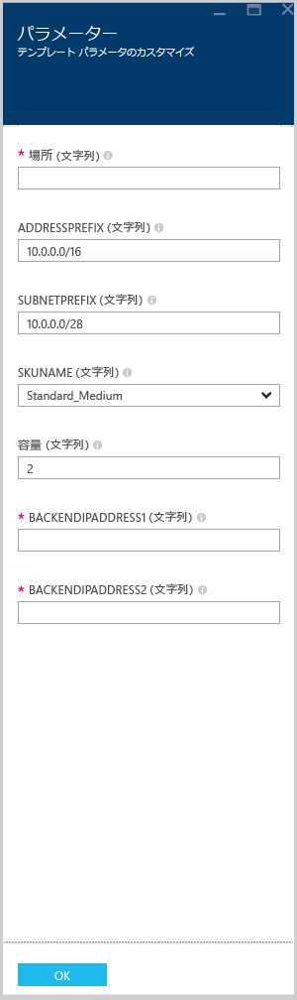

# <a name="create-an-application-gateway-by-using-the-azure-resource-manager-template"></a>Azure リソース マネージャー テンプレートを使用した Application Gateway の作成

> [!div class="op_single_selector"]
> * [Azure Portal](application-gateway-create-gateway-portal.md)
> * [Azure Resource Manager の PowerShell](application-gateway-create-gateway-arm.md)
> * [Azure Classic PowerShell (Azure クラシック PowerShell)](application-gateway-create-gateway.md)
> * [Azure Resource Manager テンプレート](application-gateway-create-gateway-arm-template.md)
> * [Azure CLI](application-gateway-create-gateway-cli.md)

Azure Application Gateway はレイヤー 7 のロード バランサーです。 クラウドでもオンプレミスでも、異なるサーバー間のフェールオーバーと HTTP 要求のパフォーマンス ルーティングを提供します。 Application Gateway は、HTTP 負荷分散、Cookie ベースのセッション アフィニティ、Secure Sockets Layer (SSL) オフロード、カスタムの正常性プローブ、マルチサイトのサポートなどの多くのアプリケーション配信コントローラー (ADC) 機能を備えています。 サポートされている機能の完全な一覧については、「[Application Gateway の概要](application-gateway-introduction.md)」を参照してください。

この記事では、GitHub から既存の [Azure Resource Manager テンプレート](../azure-resource-manager/resource-group-authoring-templates.md)をダウンロードして変更し、そのテンプレートを GitHub、PowerShell、Azure CLI からデプロイする方法を説明します。

GitHub から直接テンプレートをデプロイするだけで、変更を加えない場合は、GitHub からのテンプレートのデプロイに進んでください。

## <a name="scenario"></a>シナリオ

このシナリオでは次のことを行います。

* Web アプリケーション ファイアウォールを備えたアプリケーション ゲートウェイを作成します。
* VirtualNetwork1 という名前の仮想ネットワークと予約済み CIDR ブロック 10.0.0.0/16 を作成します。
* CIDR ブロックとして 10.0.0.0/28 を使用する Appgatewaysubnet という名前のサブネットを作成します。
* トラフィックを負荷分散する Web サーバー用に 2 個の事前構成済みバックエンド IP を設定します。 このテンプレート例でのバックエンド IP は、10.0.1.10 と 10.0.1.11 です。

> [!NOTE]
> これらの設定は、このテンプレートのパラメーターです。 テンプレートをカスタマイズするには、zuredeploy.json ファイルでルール、リスナー、SSL、およびその他のオプションを変更できます。


## <a name="download-and-understand-the-azure-resource-manager-template"></a>Azure リソース マネージャー テンプレートのダウンロードと理解

GitHub から既存の Azure リソース マネージャー テンプレートをダウンロードして仮想ネットワークと 2 つのサブネットを作成し、そのテンプレートに変更を加えて再利用することができます。 そのためには、次の手順を実行してください。

1. 「[Web アプリケーション ファイアウォールが有効なアプリケーション ゲートウェイの作成](https://github.com/Azure/azure-quickstart-templates/tree/master/101-application-gateway-waf)」に移動します。
1. **[azuredeploy.json]**、**[RAW]** の順にクリックします。
1. お使いのコンピューター上のローカル フォルダーにファイルを保存します。
1. Azure リソース マネージャー テンプレートを使用したことがある場合は、手順 7 に進みます。
1. 保存したファイルを開き、5 行目にある **parameters** の内容を確認します。
1. Azure リソース マネージャー テンプレートのパラメーターでは、デプロイメント中に入力できる、値のプレース ホルダーが用意されています。

  | パラメーター | [説明] |
  | --- | --- |
  | **subnetPrefix** |Application Gateway サブネットの CIDR ブロック。 |
  | **applicationGatewaySize** | Application Gateway のサイズ。  WAF では、中および大だけを使用できます。 |
  | **backendIpaddress1** |1 番目の Web サーバーの IP アドレス。 |
  | **backendIpaddress2** |2 番目の Web サーバーの IP アドレス。 |
  | **wafEnabled** | WAF が有効かどうかを決定する設定。|
  | **wafMode** | Web アプリケーション ファイアウォールのモード。  使用できるオプションは、**[防止]** または **[検出]** です。|
  | **wafRuleSetType** | WAF のルールセットの種類。  現在、サポートされているオプションは、OWASP だけです。 |
  | **wafRuleSetVersion** |ルールセットのバージョン。 現在、サポートされているオプションは、OWASP CRS 2.2.9 および 3.0 です。 |

1. **resources** の内容を確認し、次のプロパティを参照します。

   * **type**。 テンプレートによって作成されるリソースのタイプ。 この場合、タイプは `Microsoft.Network/applicationGateways` です。これは、アプリケーション ゲートウェイを表します。
   * **name**。 リソースの名前です。 `[parameters('applicationGatewayName')]` が使用されているため、名前はデプロイ中にユーザーまたはパラメーター ファイルによって入力されます。
   * **properties**。 リソースのプロパティの一覧です。 このテンプレートは、Application Gateway の作成の過程で、仮想ネットワークとパブリック IP アドレスを使用します。

1. [https://github.com/Azure/azure-quickstart-templates/blob/master/101-application-gateway-waf/](https://github.com/Azure/azure-quickstart-templates/blob/master/101-application-gateway-waf) に戻ります。
1. **[azuredeploy-paremeters.json]**、**[RAW]** の順にクリックします。
1. お使いのコンピューター上のローカル フォルダーにファイルを保存します。
1. 保存したファイルを開き、パラメーターの値を編集します。 次の値を使用して、このシナリオで説明したアプリケーション ゲートウェイをデプロイします。

    ```json
    {
        "$schema": "http://schema.management.azure.com/schemas/2015-01-01/deploymentParameters.json#",
        "contentVersion": "1.0.0.0",
        "parameters": {
            "addressPrefix": {
            "value": "10.0.0.0/16"
            },
            "subnetPrefix": {
            "value": "10.0.0.0/28"
            },
            "applicationGatewaySize": {
            "value": "WAF_Medium"
            },
            "capacity": {
            "value": 2
            },
            "backendIpAddress1": {
            "value": "10.0.1.10"
            },
            "backendIpAddress2": {
            "value": "10.0.1.11"
            },
            "wafEnabled": {
            "value": true
            },
            "wafMode": {
            "value": "Detection"
            },
            "wafRuleSetType": {
            "value": "OWASP"
            },
            "wafRuleSetVersion": {
            "value": "3.0"
            }
        }
    }
    ```

1. ファイルを保存します。 [JSlint.com](http://www.jslint.com/)などのオンライン JSON 検証ツールを使用して、JSON テンプレートとパラメーター テンプレートをテストできます。

## <a name="deploy-the-azure-resource-manager-template-by-using-powershell"></a>PowerShell を使用した Azure リソース マネージャー テンプレートのデプロイ

Azure PowerShell を初めて使用する場合は、[Azure PowerShell のインストールおよび構成方法](/powershell/azure/overview)に関するページを参照してください。手順に従って Azure にサインインし、サブスクリプションを選択します。

1. PowerShell にログイン

    ```powershell
    Connect-AzureRmAccount
    ```

1. アカウントのサブスクリプションを確認します。

    ```powershell
    Get-AzureRmSubscription
    ```

    資格情報を使用して認証を行うように求めるメッセージが表示されます。

1. 使用する Azure サブスクリプションを選択します。

    ```powershell
    Select-AzureRmSubscription -Subscriptionid "GUID of subscription"
    ```

1. 必要に応じて、 **New-AzureResourceGroup** コマンドレットを使用してリソース グループを作成します。 以下の例では、米国東部に AppgatewayRG という名前のリソース グループを作成します。

    ```powershell
    New-AzureRmResourceGroup -Name AppgatewayRG -Location "West US"
    ```

1. **New-AzureRmResourceGroupDeployment** コマンドレットを実行し、先ほどダウンロードして変更したテンプレート ファイルとパラメーター ファイルを使用して、新しい仮想ネットワークをデプロイします。
    
    ```powershell
    New-AzureRmResourceGroupDeployment -Name TestAppgatewayDeployment -ResourceGroupName AppgatewayRG `
    -TemplateFile C:\ARM\azuredeploy.json -TemplateParameterFile C:\ARM\azuredeploy-parameters.json
    ```

## <a name="deploy-the-azure-resource-manager-template-by-using-the-azure-cli"></a>Azure CLI を使用した Azure リソース マネージャー テンプレートのデプロイ

Azure CLI を使用してダウンロードした Azure Resource Manager テンプレートをデプロイするには、次の手順に従います。

1. Azure CLI を初めて使用する場合は、 [Azure CLI のインストールと構成](/cli/azure/install-azure-cli) に関するページを参照して、Azure のアカウントとサブスクリプションを選択する時点までの指示に従います。

1. 必要に応じて、次のコード スニペットに示されているように、`az group create` コマンドを実行してリソース グループを作成します。 コマンドの出力が表示されます。 出力の後に表示される一覧では、使用されたパラメーターについて説明されています。 リソース グループの詳細については、「 [Azure Resource Manager の概要](../azure-resource-manager/resource-group-overview.md)」を参照してください。

    ```azurecli
    az group create --location westus --name appgatewayRG
    ```
    
    **-n (または --name)**。 新しいリソース グループの名前です。 このシナリオでは、 *appgatewayRG*です。
    
    **-l (または --location)**。 新しいリソース グループが作成される Azure リージョンです。 このシナリオでは、*westus* です。

1. `az group deployment create` コマンドレットを実行し、前の手順でダウンロードおよび変更したテンプレート ファイルとパラメーター ファイルを使用して、新しい仮想ネットワークをデプロイします。 出力の後に表示される一覧では、使用されたパラメーターについて説明されています。

    ```azurecli
    az group deployment create --resource-group appgatewayRG --name TestAppgatewayDeployment --template-file azuredeploy.json --parameters @azuredeploy-parameters.json
    ```

## <a name="deploy-the-azure-resource-manager-template-by-using-click-to-deploy"></a>"クリックしてデプロイ" を使用した Azure リソース マネージャー テンプレートのデプロイ

"クリックしてデプロイ" は、Azure リソース マネージャー テンプレートを使用するもう 1 つの方法です。 これは、Azure ポータルでテンプレートを使用する簡単な方法です。

1. 「[Web アプリケーション ファイアウォールのあるアプリケーション ゲートウェイを作成する](https://azure.microsoft.com/documentation/templates/101-application-gateway-waf/)」に移動します。

1. **[Azure へのデプロイ]** をクリックします。

    ![[Deploy to Azure (Azure へのデプロイ)]](./media/application-gateway-create-gateway-arm-template/deploytoazure.png)
    
1. ポータルでのデプロイ テンプレートのパラメーターを入力し、 **[OK]** をクリックします。

    
    
1. **[上記の使用条件に同意する]** を選択し、**[購入]** をクリックします。

1. [カスタム デプロイ] ブレードで、 **[作成]** をクリックします。

## <a name="providing-certificate-data-to-resource-manager-templates"></a>証明書データを Resource Manager テンプレートに提供する

テンプレートを使って SSL を使用する場合、証明書をアップロードするのではなく、base64 文字列で指定する必要があります。 .pfx または .cer を base64 文字列に変換するには、以下のいずれかのコマンドを使用します。 これらのコマンドによって、証明書はテンプレートに提供できる base64 文字列に変換されます。 予測される出力は、変数に格納できる文字列、またテンプレートに貼り付けることのできる文字列です。

### <a name="macos"></a>macOS
```bash
cert=$( base64 <certificate path and name>.pfx )
echo $cert
```

### <a name="windows"></a>Windows
```powershell
[System.Convert]::ToBase64String([System.IO.File]::ReadAllBytes("<certificate path and name>.pfx"))
```

## <a name="delete-all-resources"></a>すべてのリソースの削除

この記事で作成したリソースをすべて削除するには、次の手順の 1 つを実行します。

### <a name="powershell"></a>PowerShell

```powershell
Remove-AzureRmResourceGroup -Name appgatewayRG
```

### <a name="azure-cli"></a>Azure CLI

```azurecli
az group delete --name appgatewayRG
```

## <a name="next-steps"></a>次の手順

SSL オフロードを構成する場合は、[SSL オフロード用のアプリケーション ゲートウェイの構成](application-gateway-ssl.md)に関するページを参照してください。

内部ロード バランサーと共に使用するようにアプリケーション ゲートウェイを構成する場合は、「[内部ロード バランサー (ILB) を使用したアプリケーション ゲートウェイの作成](application-gateway-ilb.md)」を参照してください。

負荷分散オプション全般の詳細については、次の記事をご覧ください。

* [Azure Load Balancer](https://azure.microsoft.com/documentation/services/load-balancer/)
* [Azure の Traffic Manager](https://azure.microsoft.com/documentation/services/traffic-manager/)

