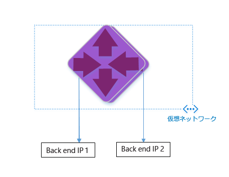
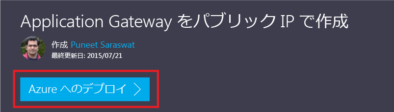

<properties
   pageTitle="Azure リソース マネージャー テンプレートを使用した Application Gateway の作成 | Microsoft Azure"
   description="このページでは、Azure リソース マネージャー テンプレートを使用して、Azure Application Gateway を作成する方法について説明します。"
   documentationCenter="na"
   services="application-gateway"
   authors="georgewallace"
   manager="carmonm"
   editor="tysonn"/>
<tags
   ms.service="application-gateway"
   ms.devlang="na"
   ms.topic="hero-article"
   ms.tgt_pltfrm="na"
   ms.workload="infrastructure-services"
   ms.date="09/06/2016"
   ms.author="gwallace"/>

# Azure リソース マネージャー テンプレートを使用した Application Gateway の作成

Azure Application Gateway はレイヤー 7 のロード バランサーです。クラウドでもオンプレミスでも、異なるサーバー間のフェールオーバーと HTTP 要求のパフォーマンス ルーティングを提供します。Application Gateway は、HTTP 負荷分散、Cookie ベースのセッション アフィニティ、Secure Sockets Layer (SSL) オフロードなどのアプリケーション配信機能を備えています。

> [AZURE.SELECTOR]
- [Azure ポータル](application-gateway-create-gateway-portal.md)
- [Azure Resource Manager の PowerShell](application-gateway-create-gateway-arm.md)
- [Azure Classic PowerShell (Azure クラシック PowerShell)](application-gateway-create-gateway.md)
- [Azure Resource Manager テンプレート](application-gateway-create-gateway-arm-template.md)
- [Azure CLI](application-gateway-create-gateway-cli.md)

GitHub から既存の Azure Resource Manager テンプレートをダウンロードして変更し、そのテンプレートを GitHub、PowerShell、Azure CLI からデプロイする方法を説明します。

GitHub から直接 Azure リソース マネージャー テンプレートをデプロイするだけで、変更を加えない場合は、Github からのテンプレートのデプロイに進んでください。

## シナリオ

このシナリオでは次のことを行います。

- 2 インスタンスの Application Gateway を作成します。
- VirtualNetwork1 という名前の仮想ネットワークと予約済み CIDR ブロック 10.0.0.0/16 を作成します。
- CIDR ブロックとして 10.0.0.0/28 を使用する Appgatewaysubnet という名前のサブネットを作成します。
- トラフィックを負荷分散する Web サーバー用に 2 個の事前構成済みバックエンド IP を設定します。このテンプレート例でのバックエンド IP は、10.0.1.10 と 10.0.1.11 です。

>[AZURE.NOTE] これらの設定は、このテンプレートのパラメーターです。テンプレートをカスタマイズするには、azuredeploy.json を開くルール、リスナー、SSL を変更できます。

## Azure リソース マネージャー テンプレートのダウンロードと理解

GitHub から既存の Azure リソース マネージャー テンプレートをダウンロードして仮想ネットワークと 2 つのサブネットを作成し、そのテンプレートに変更を加えて再利用することができます。そのためには、次の手順を実行してください。

1. [[アプリケーション ゲートウェイの作成]](https://github.com/Azure/azure-quickstart-templates/tree/master/101-application-gateway-create) に移動します。
2. **[azuredeploy.json]**、**[RAW]** の順にクリックします。
3. お使いのコンピューター上のローカル フォルダーにファイルを保存します。
4. Azure リソース マネージャー テンプレートを使用したことがある場合は、手順 7 に進みます。
5. 保存したファイルを開き、5 行目にある **parameters** の内容を確認します。Azure リソース マネージャー テンプレートのパラメーターでは、デプロイメント中に入力できる、値のプレース ホルダーが用意されています。

	| パラメーター | Description |
	|---|---|
	| **location** | アプリケーション ゲートウェイを作成する Azure リージョン |
	| **VirtualNetwork1** | 新しい仮想ネットワークの名前 |
	| **addressPrefix** | 仮想ネットワークのアドレス空間 (CIDR 形式) |
	| **ApplicationGatewaysubnet** | Application Gateway サブネットの名前 |
	| **subnetPrefix** | Application Gateway サブネットの CIDR ブロック |
	| **skuname** | SKU インスタンスのサイズ |
	| **容量** | インスタンスの数 |
	| **backendaddress1** | 1 番目の Web サーバーの IP アドレス |
	| **backendaddress2** | 2 番目の Web サーバーの IP アドレス |

	>[AZURE.IMPORTANT] GitHub で管理される Azure リソース マネージャー テンプレートは、今後変更される可能性があります。使用する前に、必ずテンプレートを確認してください。

6. **resources** の内容を確認し、次を参照します。

	- **type**。テンプレートによって作成されるリソースのタイプ。この場合、タイプは **Microsoft.Network/applicationGateways** であり、アプリケーション ゲートウェイを表します。
	- **name**。リソースの名前です。**[parameters('applicationGatewayName')]** が使用されているため、名前はデプロイ中にユーザーまたはパラメーター ファイルによって入力されます。
	- **properties**。リソースのプロパティの一覧です。このテンプレートは、Application Gateway の作成の過程で、仮想ネットワークとパブリック IP アドレスを使用します。

7. [https://github.com/Azure/azure-quickstart-templates/blob/master/101-application-gateway-create/](https://github.com/Azure/azure-quickstart-templates/blob/master/101-application-gateway-create) に戻ります。
8. **[azuredeploy-paremeters.json]**、**[RAW]** の順にクリックします。
9. お使いのコンピューター上のローカル フォルダーにファイルを保存します。
10. 保存したファイルを開き、パラメーターの値を編集します。次の値を使用して、このシナリオで説明したアプリケーション ゲートウェイをデプロイします。

		{
		"$schema": "http://schema.management.azure.com/schemas/2015-01-01/deploymentParameters.json#",
		{
		"location" : {
		"value" : "West US"
		},
		"addressPrefix": {
		"value": "10.0.0.0/16"
		},
		"subnetPrefix": {
		"value": "10.0.0.0/24"
		},
		"skuName": {
		"value": "Standard_Small"
		},
		"capacity": {
		"value": 2
		},
		"backendIpAddress1": {
		"value": "10.0.1.10"
		},
		"backendIpAddress2": {
		"value": "10.0.1.11"
		}
		}

11. ファイルを保存します。[JSlint.com](http://www.jslint.com/) などのオンライン JSON 検証ツールを使用して、JSON テンプレートとパラメーター テンプレートをテストできます。

## PowerShell を使用した Azure リソース マネージャー テンプレートのデプロイ

Azure PowerShell を初めて使用する場合は、[Azure PowerShell のインストールおよび構成方法](../powershell-install-configure.md)に関するページを参照してください。手順に従って Azure にサインインし、サブスクリプションを選択します。

### 手順 1

	Login-AzureRmAccount

### 手順 2.

アカウントのサブスクリプションを確認します。

	Get-AzureRmSubscription

資格情報を使用して認証を行うように求めるメッセージが表示されます。 

### 手順 3.

使用する Azure サブスクリプションを選択します。 

	Select-AzureRmSubscription -Subscriptionid "GUID of subscription"

### 手順 4.

必要に応じて、**New-AzureResourceGroup** コマンドレットを使用してリソース グループを作成します。以下の例では、米国東部に AppgatewayRG という名前のリソース グループを作成します。

	New-AzureRmResourceGroup -Name AppgatewayRG -Location "East US"

**New-AzureRmResourceGroupDeployment** コマンドレットを実行し、先ほどダウンロードして変更したテンプレート ファイルとパラメーター ファイルを使用して、新しい仮想ネットワークをデプロイします。

	New-AzureRmResourceGroupDeployment -Name TestAppgatewayDeployment -ResourceGroupName AppgatewayRG `
 		-TemplateFile C:\ARM\azuredeploy.json -TemplateParameterFile C:\ARM\azuredeploy-parameters.json

## Azure CLI を使用した Azure リソース マネージャー テンプレートのデプロイ

Azure CLI を使用してダウンロードした Azure リソース マネージャー テンプレートをデプロイするには、次の手順に従います。

### 手順 1

Azure CLI を初めて使用する場合は、[Azure CLI のインストールと構成](../xplat-cli-install.md)に関するページを参照して、Azure のアカウントとサブスクリプションを選択する時点までの指示に従います。
### 手順 2.

次に示すように、**azure config mode** コマンドを実行してリソース マネージャー モードに切り替えます。

	azure config mode arm

上記のコマンドで想定される出力を次に示します。

	info:	New mode is arm

### 手順 3.

必要に応じて、次のように **azure group create** コマンドで新しいリソース グループを作成します。コマンドの出力が表示されます。出力の後に表示される一覧では、使用されたパラメーターについて説明されています。リソース グループの詳細については、「[Azure Resource Manager の概要](../resource-group-overview.md)」を参照してください。

	azure group create -n appgatewayRG -l eastus

**-n (または --name)**。新しいリソース グループの名前です。このシナリオでは、*appgatewayRG* です。

**-l (または --location)**。新しいリソース グループが作成される Azure リージョンです。このシナリオでは、*eastus* です。

### 手順 4.

**azure group deployment create** コマンドレットを実行し、上記でダウンロードおよび変更したテンプレート ファイルとパラメーター ファイルを使用して新しい仮想ネットワークをデプロイします。出力の後に表示される一覧では、使用されたパラメーターについて説明されています。

	azure group deployment create -g appgatewayRG -n TestAppgatewayDeployment -f C:\ARM\azuredeploy.json -e C:\ARM\azuredeploy-parameters.json

## "クリックしてデプロイ" を使用した Azure リソース マネージャー テンプレートのデプロイ

"クリックしてデプロイ" は、Azure リソース マネージャー テンプレートを使用するもう 1 つの方法です。これは、Azure ポータルでテンプレートを使用する簡単な方法です。

### 手順 1

「[Create an Application Gateway with Public IP (パブリック IP でのアプリケーション ゲートウェイの作成)](https://azure.microsoft.com/documentation/templates/101-application-gateway-public-ip/)」に移動します。

### 手順 2.

[**Azure へのデプロイ**] をクリックします。

### 手順 3.

ポータルでのデプロイ テンプレートのパラメーターを入力し、**[OK]** をクリックします。

### 手順 4.

**[Legal terms (法律条項)]** を選択し、**[購入]** をクリックします。

### 手順 5.

[カスタム デプロイ] ブレードで、**[作成]** をクリックします。

## 次のステップ

SSL オフロードを構成する場合は、[SSL オフロード用のアプリケーション ゲートウェイの構成](application-gateway-ssl.md)に関するページを参照してください。

内部ロード バランサーと共に使用するようにアプリケーション ゲートウェイを構成する場合は、「[内部ロード バランサー (ILB) を使用したアプリケーション ゲートウェイの作成](application-gateway-ilb.md)」を参照してください。

負荷分散のオプション全般の詳細については、次を参照してください。

- [Azure Load Balancer](https://azure.microsoft.com/documentation/services/load-balancer/)
- [Azure の Traffic Manager](https://azure.microsoft.com/documentation/services/traffic-manager/)

<!---HONumber=AcomDC_0907_2016-->