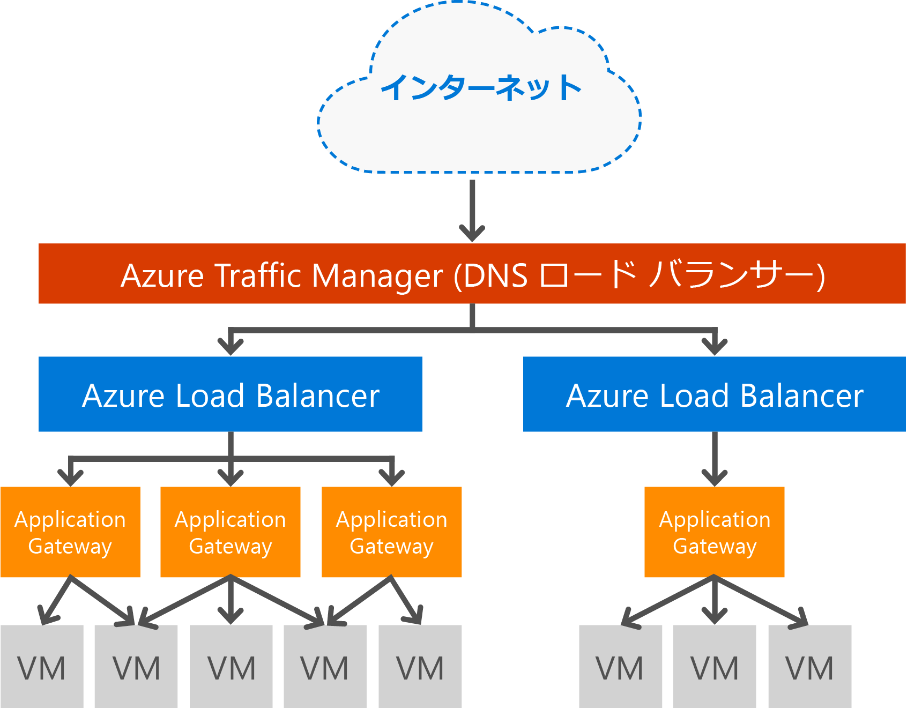

# Application Gateway の概要

Microsoft Azure Application Gateway は専用の仮想アプライアンスであり、アプリケーション配信コントローラー (ADC) をサービスとして提供します。 お客様のアプリケーションで、さまざまなレイヤー 7 負荷分散機能を利用できます。 これにより、CPU を集中的に使用する SSL 終了をお客様が Application Gateway にオフロードし、Web ファームの生産性を最適化できます。 また、着信トラフィックのラウンド ロビン分散、Cookie ベースのセッション アフィニティ、URL パス ベースのルーティング、単一の Application Gateway の背後で複数の Web サイトをホストする機能など、その他のレイヤー 7 ルーティング機能も用意されています。 アプリケーション ゲートウェイの WAF SKU の一部として、Web アプリケーション ファイアウォール (WAF) も提供されます。 一般的な Web の脆弱性や悪用から Web アプリケーションを保護します。 Application Gateway は、インターネット接続ゲートウェイ、または内部的にのみ使用されるゲートウェイのいずれかとして構成できるほか、この両方を組み合わせて使用することも可能です。 

## Features (機能)

現在、Application Gateway には次の機能があります。

* **[Web アプリケーション ファイアウォール](application-gateway-webapplicationfirewall-overview.md)** - Azure Application Gateway の Web アプリケーション ファイアウォール (WAF) は、SQL インジェクション、クロスサイト スクリプティング攻撃、セッション ハイジャックなどの一般的な Web ベースの攻撃から Web アプリケーションを保護します。
* **HTTP の負荷分散** - Application Gateway は、ラウンド ロビン負荷分散を提供します。 負荷分散は、レイヤー 7 で実行され、HTTP(S) トラフィックのみに使用されます。
* **Cookie ベースのセッション アフィニティ** - Cookie ベースのセッション アフィニティ機能は、ユーザー セッションを同じバックエンドで保持したい場合に便利です。 ゲートウェイで管理される Cookie を使用すると、Application Gateway は、ユーザー セッションの後続のトラフィックを、処理のために同じバックエンドに送ることができます。 この機能は、ユーザー セッションのためにセッションの状態をバックエンド サーバー上でローカルに保存する場合に重要です。
* **[Secure Sockets Layer (SSL) オフロード](application-gateway-ssl-arm.md)** - この機能は、コストのかかる HTTPS トラフィックの暗号化解除タスクを Web サーバーから切り離します。 SSL 接続を Application Gateway で終了し、要求を暗号化せずにサーバーに転送することにより、Web サーバーが暗号化解除を行う負荷から解放されます。  応答は、Application Gateway によって再び暗号化された後、クライアントに送信されます。 この機能は、バックエンドが Azure の Application Gateway と同じセキュリティで保護された仮想ネットワーク内に配置されている場合に有用です。
* **[エンド ツー エンド SSL](application-gateway-backend-ssl.md)** - Application Gateway は、トラフィックのエンド ツー エンド暗号化をサポートしています。 これは、Application Gateway で SSL 接続を終了することによってサポートされます。 ゲートウェイでは、その後、トラフィックへのルーティング規則の適用、パケットの再暗号化、定義済みのルーティング規則に基づいた適切なバックエンドへのパケットの転送が実行されます。 Web サーバーからの応答は、同じ手順でエンドユーザーに移動します。
* **[URL ベースのコンテンツ ルーティング](application-gateway-url-route-overview.md)** - この機能は、トラフィックごとに異なるバックエンド サーバーを使用する機能を提供します。 Web サーバー上のフォルダーまたは CDN に対するトラフィックを異なるバックエンドにルーティングできます。 この機能により、特定のコンテンツを提供しないバックエンドに対する不要な負荷を減らすことができます。
* **[マルチサイト ルーティング](application-gateway-multi-site-overview.md)** - Application Gateway では、単一のアプリケーション ゲートウェイに最大 20 個の Web サイトを統合できます。
* **[WebSocket のサポート](application-gateway-websocket.md)** - Application Gateway のもう 1 つの優れた機能として、WebSocket がネイティブでサポートされます。
* **[正常性の監視](application-gateway-probe-overview.md)** - Application Gateway は、バックエンド リソースの既定の正常性の監視と、より具体的なシナリオを監視するカスタム プローブを提供します。
* **[SSL ポリシーと暗号](application-gateway-ssl-policy-overview.md)** - この機能によって、サポートされる SSL プロトコルのバージョンと暗号スイート、およびそれらが処理される順序を制限することができます。
* **[要求のリダイレクト](application-gateway-redirect-overview.md)** - HTTP の要求を HTTPS リスナーにリダイレクトする機能です。
* **[マルチテナント バックエンドのサポート](application-gateway-web-app-overview.md)** - Application Gateway では、Azure Web Apps や API ゲートウェイなどのマルチテナント バックエンド サービスをバックエンド プール メンバーとして構成できます。 
* **[高度な診断](application-gateway-diagnostics.md)** - Application Gateway は、完全な診断とアクセス ログを提供します。 WAF が有効になっているアプリケーション ゲートウェイに対してファイアウォールのログを使用できます。

## メリット

Application Gateway は、以下の用途に便利です。

* 同じユーザー/クライアントのセッションからの要求が同じバックエンド仮想マシンに到達する必要があるアプリケーション。 これらのアプリケーションの例としては、ショッピング カート アプリケーションや Web メール サーバーなどが挙げられます。
* Web サーバー ファームの SSL 終了のオーバーヘッドの削減。
* 実行時間の長い同じ TCP 接続で複数の HTTP 要求を異なるバックエンド サーバーにルーティング/負荷分散する必要があるアプリケーション (コンテンツ配信ネットワークなど)。
* WebSocket トラフィックをサポートするアプリケーション
* SQL インジェクション、クロスサイト スクリプティング攻撃、セッション ハイジャックなどの一般的な Web ベースの攻撃に対する Web アプリケーションの保護。
* URL パスやドメイン ヘッダーなど、さまざまなルーティング条件に基づいたトラフィックの論理的な分散。

Application Gateway は Azure によって完全に管理され、非常にスケーラブルで、高い可用性を備えています。 管理しやすいように診断機能とログ機能が豊富に用意されているほか、 アプリケーション ゲートウェイを作成すると、エンドポイント (パブリック VIP または内部 ILB IP) が関連付けられ、イングレス ネットワーク トラフィックに使用されます。 この VIP または ILB IP は、Azure Load Balancer によって提供されます。Azure Load Balancer は、トランスポート レベル (TCP/UDP) で機能し、すべての受信ネットワーク トラフィックの負荷を Application Gateway worker インスタンスに分散します。 その後、Application Gateway は、仮想マシン、クラウド サービス、内部または外部 IP アドレスのいずれであるかにかかわらず、その構成に基づいて HTTP/HTTPS トラフィックをルーティングします。

Azure で管理されるサービスとしての Application Gateway の負荷分散により、Azure のソフトウェア ロード バランサーの背後でレイヤー 7 ロード バランサーをプロビジョニングできます。 Traffic Manager を使用して、次の図のようなシナリオを作成します。このシナリオでは、Traffic Manager は、さまざまなリージョンの複数のアプリケーション ゲートウェイ リソースに対するトラフィックにリダイレクトと可用性を提供し、アプリケーション ゲートウェイは、リージョン間でレイヤー 7 の負荷分散を実現します。 このシナリオの例については、「[Using load balancing services in the Azure cloud (Azure クラウドの負荷分散サービスの使用)](../traffic-manager/traffic-manager-load-balancing-azure.md)」を参照してください

[!INCLUDE [load-balancer-compare-tm-ag-lb-include.md](../../includes/load-balancer-compare-tm-ag-lb-include.md)]

## ゲートウェイのサイズとインスタンス

現在、Application Gateway は **Small**、**Medium**、**Large** の 3 つのサイズで提供されています。 Small サイズのインスタンスは、開発用およびシナリオのテスト用です。

サブスクリプションごとに最大 50 個のアプリケーション ゲートウェイを作成でき、アプリケーション ゲートウェイごとに最大 10 個のインスタンスを使用できます。 各アプリケーション ゲートウェイは、20 個の HTTP リスナーで構成できます。 アプリケーション ゲートウェイの制限の詳細な一覧については、[Application Gateway サービスの制限](../azure-subscription-service-limits.md?toc=%2fazure%2fapplication-gateway%2ftoc.json#application-gateway-limits)に関するページをご覧ください。

次の表では、SSL オフロードが有効になっているアプリケーション ゲートウェイ インスタンスごとにパフォーマンス スループットの平均値を示します。

| バックエンド ページの応答 | Small | 中 | Large |
| --- | --- | --- | --- |
| 6K |7.5 Mbps |13 Mbps |50 Mbps |
| 100K |35 Mbps |100 Mbps |200 Mbps |

> [!NOTE]
> これらの値は、アプリケーション ゲートウェイ スループットのおおよその値です。 実際のスループットは、平均ページ サイズ、バックエンド インスタンスの場所、ページの処理時間など、さまざまな環境の違いによって異なります。 パフォーマンス面の正確な数値は、ご自身でテストを実施のうえご確認ください。 ここに挙げた数値は、容量計画の参考とすることを目的として記載したものにすぎません。

## 正常性の監視

Azure Application Gateway は、基本またはカスタムの正常性プローブを使用してバックエンド インスタンスの正常性を自動的に監視します。 正常性プローブを使用すると、正常なホストのみがトラフィックに応答する状態を確保できます。 詳細については、「 [Application Gateway による正常性監視の概要](application-gateway-probe-overview.md)」を参照してください。

## 構成と管理

アプリケーション ゲートウェイは、そのエンドポイントに対して、パブリック IP、プライベート IP、またはその両方を持つことができます。 アプリケーション ゲートウェイは、独自のサブネットの仮想ネットワーク内に構成されます。 アプリケーション ゲートウェイ用に作成または使用されるサブネットには、他の種類のリソースを含めることはできません。サブネットに含めることができるリソースは、他のアプリケーション ゲートウェイのみです。 バックエンド リソースをセキュリティで保護するために、アプリケーション ゲートウェイと同じ仮想ネットワークの別のサブネット内に、バックエンド サーバーを含めることができます。 このサブネットは、バックエンド アプリケーションに必須ではありません。 アプリケーション ゲートウェイは IP アドレスにアクセスできる限り、バックエンド サーバーに ADC 機能を提供することができます。 

REST API、PowerShell コマンドレット、Azure CLI、または [Azure Portal](https://portal.azure.com/)を使用して、アプリケーション ゲートウェイを作成および管理できます。 アプリケーション ゲートウェイに関するその他の質問については、[Application Gateway の FAQ](application-gateway-faq.md) に関する記事のよく寄せられる質問の一覧を参照してください。

## 価格

料金は、1 時間あたりのゲートウェイ インスタンスの料金とデータ処理の料金に基づいています。 WAF SKU の 1 時間あたりのゲートウェイ価格は、Standard SKU の料金とは異なります。 この価格情報については、[Application Gateway の価格の詳細](https://azure.microsoft.com/pricing/details/application-gateway/)に関するページを参照してください。 データ処理の料金は同じです。

## FAQ

Application Gateway に関してよく寄せられる質問については、[Application Gateway の FAQ](application-gateway-faq.md) に関する記事を参照してください。

## 次のステップ

アプリケーション ゲートウェイについて学習すると、[アプリケーション ゲートウェイを作成](application-gateway-create-gateway-portal.md)することも、[アプリケーション ゲートウェイ SSL オフロードを作成](application-gateway-ssl-arm.md)して HTTPS 接続を負荷分散することもできるようになります。

URL ベースのコンテンツ ルーティングを使用してアプリケーション ゲートウェイを作成する方法については、「 [URL ベースのルーティングを使用して Application Gateway を作成する](application-gateway-create-url-route-arm-ps.md) 」を参照してください。

その他 Azure の重要なネットワーク機能については、[Azure のネットワーク](../networking/networking-overview.md)に関するページを参照してください。

