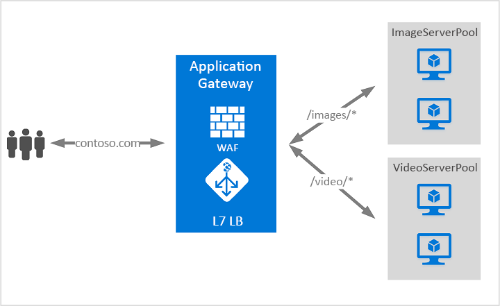

# Azure Application Gateway とは

Azure Application Gateway は、Web アプリケーションに対するトラフィックを管理できる Web トラフィック ロード バランサーです。 

従来のロード バランサーはトランスポート レイヤー (OSI レイヤー 4 - TCP と UDP) で動作し、送信元 IP アドレスとポートに基づくトラフィックを送信先 IP アドレスとポートにルーティングします。 一方、Application Gateway では、より詳細に指定できます。 たとえば、着信 URL に基づいてトラフィックをルーティングできます。 そのため、`/images` が着信 URL にある場合、画像用に構成された特定のサーバー セット (プールと呼ばれます) にトラフィックをルーティングできます。 `/video` がこの URL にある場合、そのトラフィックはビデオ用に最適化された別のプールにルーティングされます。

この種類のルーティングは、アプリケーション レイヤー (OSI レイヤー 7) の負荷分散と呼ばれます。 Azure Application Gateway は URL ベースのルーティングなどを行うことができます。 Azure Application Gateway には、次の機能があります。 

## URL ベースのルーティング

URL パス ベースのルーティングを使用すると、要求の URL パスに基づいてバックエンド サーバー プールにトラフィックをルーティングできます。 シナリオの 1 つとして、さまざまなコンテンツ タイプの要求を異なるプールにルーティングする場合があります。

たとえば、`http://contoso.com/video/*` の要求は VideoServerPool にルーティングされ、`http://contoso.com/images/*` は ImageServerPool にルーティングされます。 一致するパス パターンがない場合は、DefaultServerPool が選択されます。

## リダイレクト

HTTP を HTTPS に自動的にリダイレクトして、アプリケーションとユーザーの間のすべての通信が暗号化されたパスで行われるようにすることは、多くの Web アプリケーションでよくあるシナリオです。 

これまでは、HTTP で受信した要求を HTTPS にリダイレクトすることが唯一の目的である専用のプールの作成といった手法を使う場合がありました。 Application Gateway は、トラフィックをリダイレクトする機能をサポートしています。 これにより、アプリケーションの構成が簡単になり、リソースの使用が最適化され、グローバルなリダイレクトやパスに基づくリダイレクトなどの新しいリダイレクト シナリオがサポートされるようになります。 Application Gateway のリダイレクトのサポートは、HTTP から HTTPS へのリダイレクトだけではありません。 これは一般的なリダイレクト メカニズムなので、規則を使用して定義した任意のポート間とリダイレクトできます。 同様に、外部サイトへのリダイレクトもサポートします。

Application Gateway のリダイレクトのサポートでは、次の機能が提供されます。

- アプリケーション ゲートウェイ上のあるポートから別のポートへのグローバルなリダイレクト。 これにより、サイトでの HTTP から HTTPS へのリダイレクトが可能になります。
- パスに基づくリダイレクト。 このタイプのリダイレクトを使うと、特定のサイト領域でのみ HTTP から HTTPS へのリダイレクトが可能になります (たとえば、`/cart/*` で示されたショッピング カート領域など)。
- 外部サイトへのリダイレクト

## 複数サイトのホスティング

複数サイトのホストにより、同じ Application Gateway インスタンスで複数の Web サイトを構成することができます。 この機能を使用すると、最大で 20 の Web サイトを 1 つのアプリケーション ゲートウェイに追加することによって、デプロイに効率的なトポロジを構成できます。 各 Web サイトは、独自のプールに送られるようにすることができます。 たとえば、Application Gateway は、ContosoServerPool と FabrikamServerPool という 2 つのサーバー プールから `contoso.com` と `fabrikam.com` のトラフィックを処理できます。

`http://contoso.com` の要求は ContosoServerPool にルーティングされ、`http://fabrikam.com` は FabrikamServerPool にルーティングされます。

同様に、同じ親ドメインの 2 つのサブドメインも、同じ Application Gateway デプロイでホストすることができます。 サブドメインを使用する例としては、単一の Application Gateway デプロイ上でホストされる `http://blog.contoso.com`、`http://app.contoso.com` などがあります。

## セッション アフィニティ

Cookie ベースのセッション アフィニティ機能は、同じサーバー上にユーザー セッションを保持する場合に便利です。 ゲートウェイで管理される Cookie を使用すると、アプリケーション ゲートウェイは、ユーザー セッションの後続のトラフィックを、処理のために同じサーバーに送ることができます。 この機能は、ユーザー セッションのためにセッションの状態をサーバー上でローカルに保存する場合に重要です。

## Secure Sockets Layer (SSL) の終了

Application Gateway は、ゲートウェイの SSL ターミネーションをサポートします。通常、トラフィックは、その後、暗号化されないままバックエンド サーバーに渡されます。 この機能により、Web サーバーは、負荷の大きい暗号化と復号化のオーバーヘッドから開放されます。 ただし、サーバーに対する暗号化されていない通信を利用できない場合があります。 その理由として、セキュリティ要件、コンプライアンス要件、またはセキュリティで保護された接続以外はアプリケーションで受け入れられない場合があります。 このようなアプリケーションのために、アプリケーション ゲートウェイでは、エンド ツー エンド SSL 暗号化がサポートされています。

## Web アプリケーション ファイアウォール

Web アプリケーション ファイアウォール (WAF) は、一般的な脆弱性やその悪用から Web アプリケーションを一元的に保護する Application Gateway の機能です。 WAF は、[OWASP (Open Web Application Security Project) コア ルール セット](https://www.owasp.org/index.php/Category:OWASP_ModSecurity_Core_Rule_Set_Project) 3.0 または 2.2.9 の規則に基づいています。 

Web アプリケーションが、既知の脆弱性を悪用した悪意のある攻撃の的になるケースが増えています。 よくある攻撃の例として、SQL インジェクション攻撃やクロス サイト スクリプティング (XSS) 攻撃が挙げられます。 アプリケーション コードでこのような攻撃を防ぐことは困難な場合があり、厳格な保守、パッチの適用、アプリケーション トポロジの多数のレイヤーの監視が必要になることもあります。 Web アプリケーション ファイアウォールを一元化することで、セキュリティの管理がはるかに簡単になり、アプリケーション管理者にとっては侵入の脅威からより確実に保護されるようになります。 また、WAF のソリューションは、1 か所に既知の脆弱性の修正プログラムを適用することで、個々の Web アプリケーションのデプロイをセキュリティで保護する場合と比較して、さらに迅速にセキュリティの脅威に対応できます。 既存のアプリケーション ゲートウェイは、WAF に対応したアプリケーション ゲートウェイに簡単に変換できます。

## Websocket と HTTP/2 トラフィック

Application Gateway は、WebSocket および HTTP/2 プロトコルをネイティブにサポートしています。 ユーザーが構成可能な、WebSocket のサポートを選択的に有効または無効にするための設定はありません。 Azure PowerShell を使用して HTTP/2 サポートを有効にすることができます。
 
WebSocket および HTTP/2 プロトコルによって、長時間実行されている TCP 接続上でサーバーとクライアント間の全二重通信が可能になります。 この機能により、HTTP ベースの実装では必須だったポーリングを使用することなく、Web サーバーとクライアントの間により対話的な双方向通信が可能になります。 これらのプロトコルは、HTTP とは異なってオーバーヘッドが少なく、複数の要求や応答で同じ TCP 接続を再利用できるため、リソースをより効率的に使用できます。 これらのプロトコルは、従来の HTTP ポート 80 および 443 上で動作するよう設計されています。

## 次の手順

要件と環境に応じて、Azure Portal、Azure PowerShell、または Azure CLI のいずれかを使用してテスト Application Gateway を作成できます。

- [クイック スタート - Azure Application Gateway による Web トラフィックのルーティング - Azure Portal](quick-create-portal.md)。
- [クイック スタート - Azure Application Gateway による Web トラフィックのルーティング - Azure PowerShell](quick-create-powershell.md)
- [クイック スタート - Azure Application Gateway による Web トラフィックのルーティング - Azure CLI](quick-create-cli.md)
