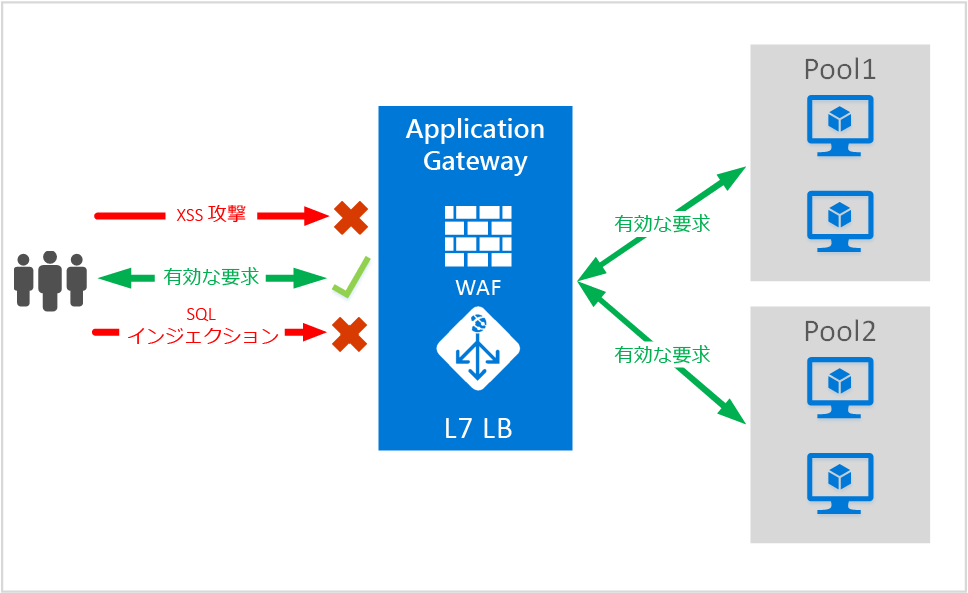
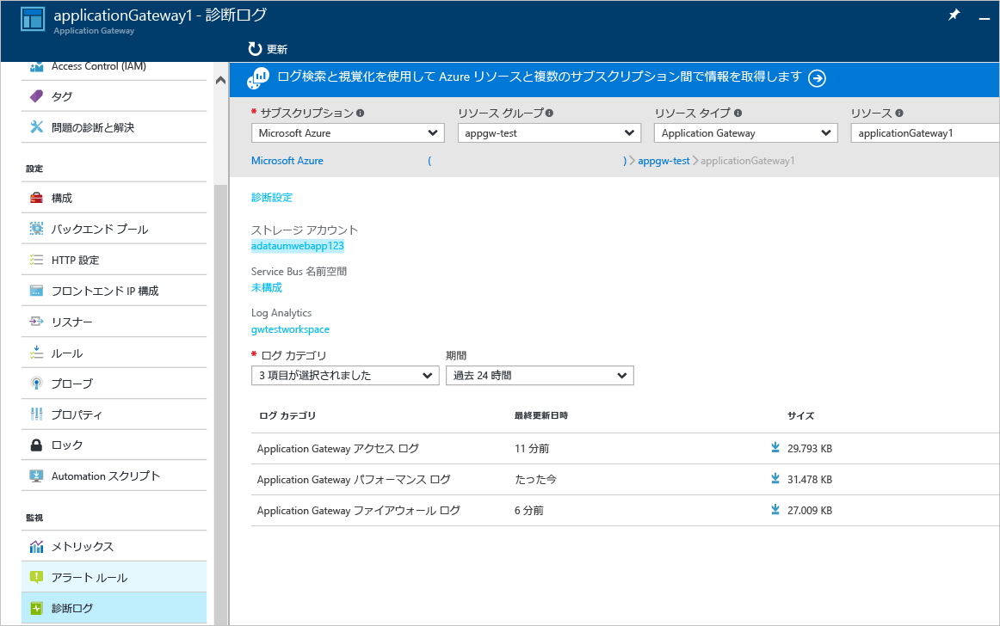

# <a name="application-gateway-web-application-firewall-preview"></a>Application Gateway の Web アプリケーション ファイアウォール (プレビュー)

Web アプリケーション ファイアウォール (WAF) は Azure Application Gateway の機能で、標準のアプリケーション配信コントロール (ADC) 機能に対してアプリケーション ゲートウェイを使用して、Web アプリケーションを保護します。 Web アプリケーション ファイアウォールは、OWASP の上位 10 件の一般的 Web 脆弱性の大部分に対する保護を提供することで、これを実現します。 Web アプリケーションが、一般的な既知の脆弱性を悪用した悪意のある攻撃の的になるケースが増えています。 よくある攻撃の例として、SQL インジェクション攻撃やクロス サイト スクリプティング攻撃が挙げられます。 アプリケーション コードでこのような攻撃を防ぐことは困難な場合があり、厳格な保守、パッチの適用、アプリケーション トポロジの複数のレイヤーの監視が必要になることもあります。 Web 攻撃に対する保護を提供する Web アプリケーション ファイアウォールを一元化することで、セキュリティの管理がはるかに簡単になり、侵入の脅威からアプリケーションがより確実に保護されます。 また、WAF のソリューションは、1 か所に既知の脆弱性の修正プログラムを適用することで、個々の Web アプリケーションをセキュリティで保護する場合と比較して、さらに迅速にセキュリティの脅威に対応できます。 既存のアプリケーション ゲートウェイは、Web アプリケーション ファイアウォールを備えたアプリケーション ゲートウェイに簡単に変換できます。



Application Gateway は、アプリケーション配信コントローラーとして動作し、SSL ターミネーション、Cookie ベースのセッション アフィニティ、ラウンドロビンの負荷分散、コンテンツ ベースのルーティング、複数の Web サイトをホストする機能、セキュリティ強化機能を提供します。 Application Gateway で実現するセキュリティの強化には、SSL ポリシーの管理、エンド ツー エンド SSL のサポートが含まれます。 ADC 製品に直接統合された WAF (Web アプリケーション ファイアウォール) を導入することで、弊社サービスのアプリケーション セキュリティ機能が強化されます。 その結果、一般的な Web の脆弱性に対して Web アプリケーションを管理および保護するための構成を、1 か所で簡単に設定できます。

アプリケーション ゲートウェイに WAF を構成することには、次のようなメリットがあります。

* バックエンド コードを変更しなくても、Web アプリケーションを Web の脆弱性および攻撃から保護できます。
* アプリケーション ゲートウェイの内側にある複数の Web アプリケーションを同時に保護できます。 アプリケーション ゲートウェイは、1 つのゲートウェイの内側で最大 20 個の Web サイトをホスティングし、すべてを Web 攻撃から保護できます。
* アプリケーション ゲートウェイの WAF ログで生成されたリアルタイムのレポートを使用して、Web アプリケーションに対する攻撃を監視できます。
* 特定のコンプライアンス制御では、インターネットに接続するすべてのエンド ポイントを WAF ソリューションで保護する必要があります。 WAF が有効になったアプリケーション ゲートウェイを使用することで、これらのコンプライアンス要件を満たすことができます。

## <a name="overview"></a>Overview

Application Gateway の WAF は新しい SKU (WAF SKU) で提供されます。ModSecurity および OWASP コア ルール セットが事前定義されており、OWASP の上位 10 件の一般的 Web 脆弱性の大部分に対する基本的保護が提供されます。

* SQL インジェクションからの保護
* クロス サイト スクリプティングからの保護
* 一般的な Web 攻撃からの保護 (コマンド インジェクション、HTTP 要求スマグリング、HTTP レスポンス スプリッティング、リモート ファイル インクルード攻撃など)
* HTTP プロトコル違反に対する保護
* HTTP プロトコル異常に対する保護 (ホスト ユーザー エージェントと承認ヘッダーが見つからない場合など)
* ボット、クローラー、スキャナーの防止
* 一般的なアプリケーション構成ミスの検出 (Apache、IIS など)

## <a name="waf-modes"></a>WAF のモード

Application Gateway の WAF は、次の 2 つのモードで実行するように構成できます。

* **検出モード** – 検出モードで実行するように構成すると、Application Gateway の WAF ではすべての脅威のアラートが監視され、ログ ファイルに記録されます。 [診断] セクションを使用して、Application Gateway の診断ログの記録を有効にする必要があります。 また、WAF のログを選択し、オンにする必要があります。
* **防止モード** – 防止モードで実行するように構成すると、Application Gateway の規則に従って検出された侵入と攻撃が自発的にブロックされます。 攻撃者に "403 不正アクセス" の例外が送信され、接続が終了します。 防止モードでも、検出モードと同様に攻撃などが WAF ログに記録されます。

## <a name="application-gateway-waf-reports"></a>Application Gateway の WAF のレポート

Application Gateway の WAF では、検出された脅威ごとに詳細なレポートが提供されます。 ログ記録は Azure 診断ログに統合されており、json 形式でアラートが記録されます。



```json
{
    "resourceId": "/SUBSCRIPTIONS/<subscriptionId>/RESOURCEGROUPS/<resourceGroupName>/PROVIDERS/MICROSOFT.NETWORK/APPLICATIONGATEWAYS/<applicationGatewayName>",
    "operationName": "ApplicationGatewayFirewall",
    "time": "2016-09-20T00:40:04.9138513Z",
    "category": "ApplicationGatewayFirewallLog",
    "properties":     {
        "instanceId":"ApplicationGatewayRole_IN_0",
        "clientIp":"108.41.16.164",
        "clientPort":1815,
        "requestUri":"/wavsep/active/RXSS-Detection-Evaluation-POST/",
        "ruleId":"OWASP_973336",
        "message":"XSS Filter - Category 1: Script Tag Vector",
        "action":"Logged",
        "site":"Global",
        "message":"XSS Filter - Category 1: Script Tag Vector",
        "details":{"message":" Warning. Pattern match "(?i)(<script","file":"/owasp_crs/base_rules/modsecurity_crs_41_xss_attacks.conf","line":"14"}}
}
```

## <a name="application-gateway-waf-sku-pricing"></a>Application Gateway の WAF SKU の価格

プレビュー期間中は、Application Gateway の WAF を使用しても追加料金は発生しません。 引き続き、現行の Basic SKU の料金が請求されます。 WAF SKU の料金は、一般公開の際にご案内します。 WAF SKU での Application Gateway のデプロイを決定されたお客様は、一般公開のお知らせの後から WAF SKU の料金が発生します。

## <a name="next-steps"></a>次のステップ

WAF の機能の詳細について学習した後は、[Application Gateway で Web アプリケーション ファイアウォールを構成する方法](application-gateway-web-application-firewall-portal.md)に関するページを参照してください。


<!--HONumber=Dec16_HO3-->


