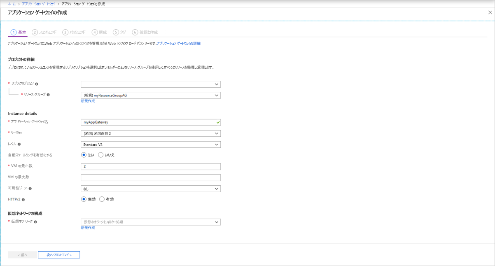
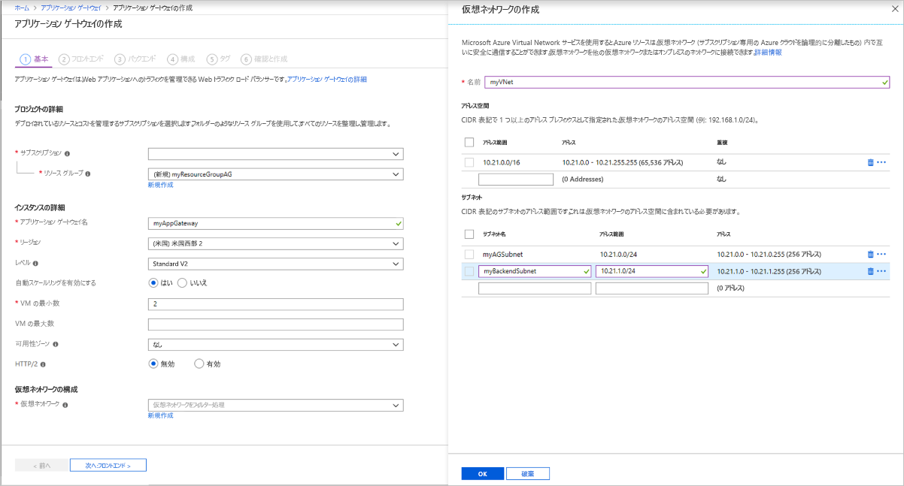
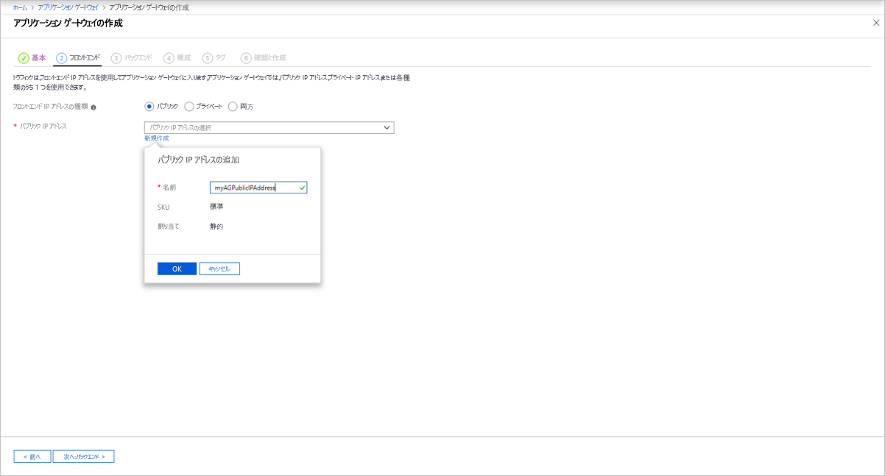

# <a name="tutorial-create-an-application-gateway-with-path-based-routing-rules-using-the-azure-portal"></a>チュートリアル:Azure Portal を使用してパス ベースのルーティング規則のあるアプリケーション ゲートウェイを作成する

[アプリケーション ゲートウェイ](overview.md)を作成するときに、Azure Portal を使用して [URL パス ベースのルーティング規則](url-route-overview.md)を構成できます。 このチュートリアルでは、仮想マシンを使用してバックエンド プールを作成します。 その後、Web トラフィックがプール内の適切なサーバーに確実に到着するようにルーティング規則を作成します。

このチュートリアルでは、以下の内容を学習します。

> [!div class="checklist"]
> * アプリケーション ゲートウェイの作成
> * バックエンド サーバー用の仮想マシンの作成
> * バックエンド サーバーでのバックエンド プールの作成
> * バックエンド リスナーの作成
> * パス ベースのルーティング規則の作成


好みに応じて、[Azure CLI](tutorial-url-route-cli.md) または [Azure PowerShell](tutorial-url-route-powershell.md) を使ってこのチュートリアルの手順を実行することもできます。

Azure サブスクリプションをお持ちでない場合は、開始する前に [無料アカウント](https://azure.microsoft.com/free/?WT.mc_id=A261C142F) を作成してください。

## <a name="sign-in-to-azure"></a>Azure へのサインイン

Azure Portal ([https://portal.azure.com](https://portal.azure.com)) にサインインします。

## <a name="create-an-application-gateway"></a>アプリケーション ゲートウェイの作成

1. Azure portal の左側のメニューにある **[リソースの作成]** を選択します。 **[新規作成]** ウィンドウが表示されます。

2. **[ネットワーク]** を選択し、**おすすめ**のリストで **[Application Gateway]** を選択します。

### <a name="basics-tab"></a>[基本] タブ

1. **[基本]** タブで、次のアプリケーション ゲートウェイの設定に以下の値を入力します。

   - **[リソース グループ]** :リソース グループには、**myResourceGroupAG** を選択します。 存在しない場合は、 **[新規作成]** を選択して作成します。
   - **[アプリケーション ゲートウェイ名]** :アプリケーション ゲートウェイの名前として「*myAppGateway*」と入力します。

     

2.  お客様が作成するリソースの間で Azure による通信が行われるには、仮想ネットワークが必要です。 新しい仮想ネットワークを作成することも、既存の仮想ネットワークを使用することもできます。 この例では、アプリケーション ゲートウェイの作成と同時に新しい仮想ネットワークを作成します。 Application Gateway インスタンスは、個別のサブネットに作成されます。 この例では 2 つのサブネットを作成します。1 つはアプリケーション ゲートウェイ用で、もう 1 つはバックエンド サーバー用です。

    **[仮想ネットワークの構成]** で、 **[新規作成]** を選択して新しい仮想ネットワークを作成します。 **[仮想ネットワークの作成]** ウィンドウが開いたら、次の値を入力して、仮想ネットワークと 2 つのサブネットを作成します。

    - **[名前]** :仮想ネットワークの名前として「*myVNet*」と入力します。

    - **[サブネット名]** (Application Gateway サブネット): **[サブネット]** グリッドには、 *[既定]* という名前のサブネットが表示されます。 このサブネットの名前を *myAGSubnet* に変更します。

      アプリケーション ゲートウェイ サブネットには、アプリケーション ゲートウェイのみを含めることができます。 その他のリソースは許可されません。

    - **[サブネット名]** (バックエンド サーバー サブネット): **[サブネット]** グリッドの 2 行目で、 **[サブネット名]** 列に「*myBackendSubnet*」と入力します。

    - **[アドレス範囲]** (バックエンド サーバー サブネット): **[サブネット]** グリッドの 2 行目に、*myAGSubnet* のアドレス範囲と重複しないアドレス範囲を入力します。 たとえば、*myAGSubnet* のアドレス範囲が 10.0.0.0/24 の場合は、*myBackendSubnet* のアドレス範囲として「*10.0.1.0/24*」と入力します。

    **[OK]** を選択して **[仮想ネットワークの作成]** ウィンドウを閉じ、仮想ネットワークの設定を保存します。

     
    
3. **[基本]** タブで、その他の設定の既定値をそのまま使用し、 **[次へ:フロントエンド]** を選択します。

### <a name="frontends-tab"></a>[フロントエンド] タブ

1. **[フロントエンド]** タブで、 **[フロントエンド IP アドレスの種類]** が **[パブリック]** に設定されていることを確認します。 <br>ユース ケースに従って、フロントエンド IP を [パブリック] または [プライベート] に設定できます。 この例では、パブリック フロントエンド IP を選択します。
   > [!NOTE]
   > Application Gateway v2 SKU では、 **[パブリック]** フロントエンド IP 構成のみを選択できます。 プライベート フロントエンド IP 構成は、この v2 SKU では現在有効になっていません。

2. **[パブリック IP アドレス]** として **[新規作成]** を選択し、パブリック IP アドレス名として「*myAGPublicIPAddress*」と入力し、 **[OK]** を選択します。 

     

3. **[次へ:バックエンド]** を選択します。

### <a name="backends-tab"></a>[バックエンド] タブ

バックエンド プールは、要求を処理するバックエンド サーバーに要求をルーティングするために使用されます。 バックエンド プールには、NIC、仮想マシン スケール セット、パブリック IP、内部 IP、完全修飾ドメイン名 (FQDN)、および Azure App Service などのマルチテナント バックエンドがあります。 この例では、アプリケーション ゲートウェイを使用して空のバックエンド プールを作成し、バックエンド ターゲットをバックエンド プールに追加します。

1. **[バックエンド]** タブで、 **[+ バックエンド プールの追加]** を選択します。

2. 開いた **[バックエンド プールの追加]** ウィンドウで、次の値を入力して空のバックエンド プールを作成します。

    - **[名前]** :バックエンド プールの名前として「*appGatewayBackendPool*」と入力します。
    - **[ターゲットを持たないバックエンド プールを追加します]** : **[はい]** を選択して、ターゲットを持たないバックエンド プールを作成します。 アプリケーション ゲートウェイを作成した後で、バックエンド ターゲットを追加します。

3. **[バックエンド プールの追加]** ウィンドウで、 **[追加]** を選択してバックエンド プールの構成を保存し、 **[バックエンド]** タブに戻ります。
4. 次に、*imagesBackendPool* と *videoBackendPool* という 2 つのバックエンド プールをさらに追加します。

     

4. **[バックエンド]** タブで、 **[次へ:構成]** を選択します。

### <a name="configuration-tab"></a>[構成] タブ

**[構成]** タブで、ルーティング規則を使用して作成したフロントエンドとバックエンド プールを接続します。

1. **[ルーティング規則]** 列で **[規則を追加する]** を選択します。
2. 開いた **[ルーティング規則の追加]** ウィンドウで、 **[規則名]** に「*Rule1*」と入力します。
3. ルーティング規則にはリスナーが必要です。 **[ルーティング規則の追加]** ウィンドウ内の **[リスナー]** タブで、リスナーの次の値を入力します。

    - **[リスナー名]** :リスナーの名前として「*DefaultListener*」と入力します。
    - **[フロントエンド IP]** : **[パブリック]** を選択して、フロントエンド用に作成したパブリック IP を選択します。

   **[リスナー]** タブで他の設定の既定値をそのまま使用し、 **[バックエンド ターゲット]** タブを選択して、ルーティング規則の残りの部分を構成します。
4. **[バックエンド ターゲット]** タブで、 **[バックエンド ターゲット]** として **[appGatewayBackendPool]** を選択します。

5. **[HTTP 設定]** には **[新規作成]** を選択して新しい HTTP 設定を作成します。 HTTP 設定によって、ルーティング規則の動作が決まります。 開いた **[HTTP 設定の追加]** ウィンドウで、 **[HTTP 設定名]** として「*myHTTPSetting*」と入力します。 **[HTTP 設定の追加]** ウィンドウで他の設定の既定値をそのまま使用し、 **[追加]** を選択して **[ルーティング規則の追加]** ウィンドウに戻ります。 

6. **[ルーティング規則の追加]** ウィンドウで **[追加]** を選択してルーティング規則を保存し、 **[構成]** タブに戻ります。


1. **[ルーティング規則]** 列で **[規則を追加する]** を選択します。

2. 開いた **[ルーティング規則の追加]** ウィンドウで、 **[規則名]** に「*Rule2*」と入力します。

3. ルーティング規則にはリスナーが必要です。 **[ルーティング規則の追加]** ウィンドウ内の **[リスナー]** タブで、リスナーの次の値を入力します。

    - **[リスナー名]** :リスナーの名前として「*myBackendListener*」と入力します。
    - **[フロントエンド IP]** : **[パブリック]** を選択して、フロントエンド用に作成したパブリック IP を選択します。
    - **ポート**:8080

   **[追加設定]** :
   - **[リスナーの種類]** :Basic

   **[リスナー]** タブで他の設定の既定値をそのまま使用し、 **[バックエンド ターゲット]** タブを選択して、ルーティング規則の残りの部分を構成します。

4. **[バックエンド ターゲット]** タブで、 **[バックエンド ターゲット]** として **[appGatewayBackendPool]** を選択します。

5. **[HTTP 設定]** で、 *[myHTTPSetting]* を選択します。 **[HTTP 設定の追加]** ウィンドウで他の設定の既定値をそのまま使用し、 **[追加]** を選択して **[ルーティング規則の追加]** ウィンドウに戻ります。 

1. **[パスベースのルーティング]** で、 **[パスベースの規則を作成する複数のターゲットを追加します]** を選択します。
2. **[パスの規則を追加する]** ウィンドウで、パスの規則の次の値を入力します。

   - **[パス]** : */images/\**
   - **[パスの規則名]** :*イメージ*
   - **[HTTP 設定]** : *[myHTTPSetting]* を選択
   - **[バックエンド ターゲット]** : *imagesBackendPool*
9. **[追加]** を選択します。
10. */video/\** パスと *videoBackendPool* を指定した *Video* という名前の別のパスの規則を追加します。
11. **[変更を保存してルーティング規則に戻る]** を選択します。

    

12. **[追加]** を選択します。

7. **[次へ:タグ]** 、 **[次へ:確認と作成]** をクリックします。

### <a name="review--create-tab"></a>[確認と作成] タブ

**[確認と作成 ]** タブの設定を確認し、 **[作成]** を選択して、仮想ネットワーク、パブリック IP アドレス、およびアプリケーションゲートウェイを作成します。 Azure によるアプリケーション ゲートウェイの作成には数分かかる場合があります。

次のセクションに進む前に、デプロイが正常に完了するまで待機します。


## <a name="create-virtual-machines"></a>仮想マシンを作成する

この例では、アプリケーション ゲートウェイのバックエンド サーバーとして使用する 3 つの仮想マシンを作成します。 また、IIS を仮想マシンにインストールして、アプリケーション ゲートウェイが正常に作成されたことを確認します。

1. Azure portal で、 **[リソースの作成]** を選択します。 **[新規作成]** ウィンドウが表示されます。
2. **[コンピューティング]** を選択し、 **[人気順]** の一覧で **[Windows Server 2016 Datacenter]** を選択します。 **[仮想マシンの作成]** ページが表示されます。

   Application Gateway は、バックエンド プールで使用されているあらゆる種類の仮想マシンにトラフィックをルートできます。 この例では、Windows Server 2016 Datacenter を使用します。
1. **[基本]** タブで、次の仮想マシンの設定に以下の値を入力します。

    - **[リソース グループ]** :リソース グループ名には、**myResourceGroupAG** を選択します。
    - **[仮想マシン名]** : 仮想マシンの名前として、「*myVM1*」と入力します。
    - **[ユーザー名]** : 管理者のユーザー名として「*azureuser*」と入力します。
    - **Password**:管理者パスワードとして「*Azure123456!* 」と入力します 。
4. 他の既定値をそのまま使用し、 **[Next: ディスク]** を選択します。  
5. **[ディスク]** タブの既定値をそのまま使用し、 **[Next: Networking]\(次へ : ネットワーク\)** を選択します。
6. **[ネットワーク]** タブで、 **[仮想ネットワーク]** に **myVNet** が選択されていること、および **[サブネット]** が **myBackendSubnet** に設定されていることを確認します。 他の既定値をそのまま使用し、 **[Next: 管理]** を選択します。

   Application Gateway は、それが存在している仮想ネットワークの外部にあるインスタンスと通信できますが、IP 接続があることを確認する必要があります。
1. **[管理]** タブで、 **[ブート診断]** を **[オフ]** に設定します。 他の既定値をそのまま使用し、 **[確認および作成]** を選択します。
2. **[確認および作成]** タブで、設定を確認し、検証エラーを修正してから、 **[作成]** を選択します。
3. 仮想マシンの作成が完了するのを待って先に進みます。

### <a name="install-iis"></a>IIS のインストール

[!INCLUDE [updated-for-az](../../includes/updated-for-az.md)]

1. 対話型シェルを開いて、**PowerShell** に設定されていることを確認します。

    

2. 次のコマンドを実行して、IIS を仮想マシンにインストールします。 

    ```azurepowershell-interactive
    $publicSettings = @{ "fileUris" = (,"https://raw.githubusercontent.com/Azure/azure-docs-powershell-samples/master/application-gateway/iis/appgatewayurl.ps1");  "commandToExecute" = "powershell -ExecutionPolicy Unrestricted -File appgatewayurl.ps1" }
    Set-AzVMExtension `
      -ResourceGroupName myResourceGroupAG `
      -Location eastus `
      -ExtensionName IIS `
      -VMName myVM1 `
      -Publisher Microsoft.Compute `
      -ExtensionType CustomScriptExtension `
      -TypeHandlerVersion 1.4 `
      -Settings $publicSettings
    ```

3. さらに 2 つの仮想マシンを作成し、完了したばかりの手順を使用して、IIS をインストールします。 仮想マシンの名前および Set-AzVMExtension の **VMName** の値として、*myVM2* と *myVM3* を使用します。

## <a name="add-backend-servers-to-backend-pools"></a>バックエンド プールヘのバックエンド サーバーの追加

1. **[すべてのリソース]** を選択し、**myAppGateway** を選択します。

2. 左側のメニューで **[バックエンド プール]** を選択します。

3. **[appGatewayBackendPool]** を選択します。

4. **[ターゲット]** の下のドロップダウン リストで **[仮想マシン]** を選択します。

5. **[仮想マシン]** と **[ネットワーク インターフェイス]** で、**myVM1** 仮想マシンとその関連するネットワーク インターフェイスをドロップダウン リストから選択します。

    

6. **[保存]** を選択します。
7. 手順を繰り返して、*myVM2* とインターフェイスを *imagesBackendPool* に、*myVM3* とインターフェイスを *videoBackendPool* に追加します。

デプロイが完了するまで待ってから次の手順に進んでください。

## <a name="test-the-application-gateway"></a>アプリケーション ゲートウェイのテスト

1. **[すべてのリソース]** を選択し、 **[myAGPublicIPAddress]** を選択します。

    

2. そのパブリック IP アドレスをコピーし、ブラウザーのアドレス バーに貼り付けます。 [http://www.contoso.com](http://40.121.222.19 ) など。

    

3. URL を http://&lt;ip-address&gt;:8080/images/test.htm に変更します。&lt;ip-address&gt; は使用している IP アドレスに置き換えてください。次の例のように表示されます。

    

4. URL を http://&lt;ip-address&gt;:8080/video/test.htm に変更します。&lt;ip-address&gt; は使用している IP アドレスに置き換えてください。次の例のように表示されます。

    

## <a name="clean-up-resources"></a>リソースのクリーンアップ

アプリケーション ゲートウェイと共に作成したリソースが不要になったら、リソース グループを削除します。 リソース グループを削除することで、アプリケーション ゲートウェイとそのすべての関連リソースも削除します。 

リソース グループを削除するには:

1. Azure portal の左側のメニューにある **[リソース グループ]** を選択します。
2. **[リソース グループ]** ページで、リストの **myResourceGroupAG** を探して選択します。
3. **[リソース グループ] ページ**で、 **[リソース グループの削除]** を選択します。
4. **[TYPE THE RESOURCE GROUP NAME]\(リソース グループ名を入力してください\)** に「*myResourceGroupAG*」と入力し、 **[削除]** を選択します。

## <a name="next-steps"></a>次の手順

> [!div class="nextstepaction"]
> [Azure Application Gateway で実行できる操作の詳細を確認する](application-gateway-introduction.md)
