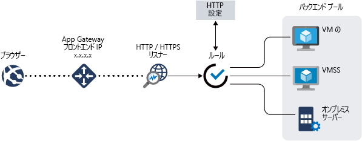

# Azure Application Gateway とは

Azure Application Gateway は、Web アプリケーションに対するトラフィックを管理できる Web トラフィック ロード バランサーです。 従来のロード バランサーはトランスポート レイヤー (OSI レイヤー 4 - TCP と UDP) で動作し、送信元 IP アドレスとポートに基づくトラフィックを送信先 IP アドレスとポートにルーティングします。

一方、Application Gateway では、より詳細に指定できます。 たとえば、着信 URL に基づいてトラフィックをルーティングできます。 そのため、`/images` が着信 URL にある場合、画像用に構成された特定のサーバー セット (プールと呼ばれます) にトラフィックをルーティングできます。 `/video` がこの URL にある場合、そのトラフィックはビデオ用に最適化された別のプールにルーティングされます。

この種類のルーティングは、アプリケーション レイヤー (OSI レイヤー 7) の負荷分散と呼ばれます。 Azure Application Gateway は URL ベースのルーティングなどを行うことができます。 

Azure Application Gateway には、次の機能があります。

## 自動スケーリングのパブリック プレビュー

Application Gateway では、この記事で説明されている機能の他に、自動スケーリングとその他の重要なパフォーマンス強化を実現する新しい SKU [Standard_V2] のパブリック プレビューも提供されています。

- **自動スケーリング** - 自動スケーリング SKU の下での Application Gateway または WAF のデプロイは、トラフィック負荷パターンの変化に基づいてスケールアップまたはスケールダウンできます。 また、自動スケールにより、プロビジョニングの間にデプロイのサイズまたはインスタンスの数を選択する必要がなくなります。 

- **ゾーン冗長性** - Application Gateway または WAF のデプロイは複数の可用性ゾーンを対象にできるため、Traffic Manager を使ってゾーンごとに個別に Application Gateway のインスタンスをプロビジョニングして稼働させる必要はありません。

- **静的 VIP** - アプリケーション ゲートウェイの VIP は、静的な VIP の種類だけをサポートするようになります。 これにより、アプリケーション ゲートウェイに関連付けられた VIP は、再起動後でも変化しません。

- 一般提供の SKU と比較して、**デプロイと更新の時間が短縮**。 

- 一般提供の SKU と比較して、**SSL オフロードのパフォーマンスが 5 倍**。

Application Gateway のパブリック プレビューの機能の詳細については、「[自動スケールとゾーン冗長 Application Gateway (パブリック プレビュー)](application-gateway-autoscaling-zone-redundant.md)」を参照してください。

## Secure Sockets Layer (SSL) の終了

アプリケーション ゲートウェイは、ゲートウェイの SSL ターミネーションをサポートします。通常、トラフィックは、その後、暗号化されないままバックエンド サーバーに渡されます。 この機能により、Web サーバーは、負荷の大きい暗号化と復号化のオーバーヘッドから開放されます。 ただし、サーバーに対する暗号化されていない通信を利用できない場合があります。 その理由として、セキュリティ要件、コンプライアンス要件、またはセキュリティで保護された接続以外はアプリケーションで受け入れられない場合があります。 このようなアプリケーションのために、Application Gateway では、エンド ツー エンドの SSL 暗号化がサポートされています。

## Azure Kubernetes Service (AKS) のイングレス コントローラーの概要 

Application Gateway イングレス コントローラーは、AKS クラスター内のポッドとして実行され、Application Gateway が AKS クラスターに対する入り口として機能できるようにします。 

詳細については、「[Azure Application Gateway Ingress Controller (Azure Application Gateway イングレス コントローラー)](https://azure.github.io/application-gateway-kubernetes-ingress/)」を参照してください。

## 接続のドレイン

接続のドレインを使用すると、計画的なサービスの更新中にバックエンド プール メンバーを正常に削除することができます。 この設定は、バックエンド http 設定を通じて有効にされ、ルールの作成中にバックエンド プールのすべてのメンバーに適用することができます。 有効にすると、Application Gateway は、バックエンド プールのすべての登録解除インスタンスが新しい要求を受け取らないようにし、既存の要求は構成された制限時間内に完了するようにします。 これは、API 呼び出しによってバックエンド プールから明示的に削除されたバックエンド インスタンスと、正常性プローブの判断によって異常であるとレポートされたバックエンド インスタンスの両方に適用されます。

## カスタム エラー ページ
Application Gateway では、既定のエラー ページを表示する代わりに、カスタム エラー ページを作成することができます。 カスタム エラー ページでは、独自のブランディングとレイアウトを使用することができます。

詳細については、「[Create Application Gateway custom error pages (Application Gateway のカスタム エラー ページを作成する)](custom-error.md)」を参照してください。

## Web アプリケーション ファイアウォール

Web アプリケーション ファイアウォール (WAF) は、一般的な脆弱性やその悪用から Web アプリケーションを一元的に保護する Application Gateway の機能です。 WAF は、[OWASP (Open Web Application Security Project) コア ルール セット](https://www.owasp.org/index.php/Category:OWASP_ModSecurity_Core_Rule_Set_Project) 3.0 または 2.2.9 の規則に基づいています。 

Web アプリケーションが、一般的な既知の脆弱性を悪用した悪意のある攻撃の的になるケースが増えています。 よくある攻撃の例として、SQL インジェクション攻撃やクロス サイト スクリプティング攻撃が挙げられます。 アプリケーション コードでこのような攻撃を防ぐことは困難な場合があり、厳格な保守、パッチの適用、アプリケーション トポロジの多数のレイヤーの監視が必要になることもあります。 Web アプリケーション ファイアウォールを一元化することで、セキュリティの管理がはるかに簡単になり、アプリケーション管理者にとっては侵入の脅威からより確実に保護されるようになります。 また、WAF のソリューションは、1 か所に既知の脆弱性の修正プログラムを適用することで、個々の Web アプリケーションをセキュリティで保護する場合と比較して、さらに迅速にセキュリティの脅威に対応できます。 既存のアプリケーション ゲートウェイは、Web アプリケーション ファイアウォールに対応したアプリケーション ゲートウェイに簡単に変換できます。

## URL ベースのルーティング

URL パス ベースのルーティングを使用すると、要求の URL パスに基づいてバックエンド サーバー プールにトラフィックをルーティングできます。 シナリオの 1 つとして、さまざまなコンテンツ タイプの要求を異なるプールにルーティングする場合があります。

たとえば、`http://contoso.com/video/*` の要求は VideoServerPool にルーティングされ、`http://contoso.com/images/*` は ImageServerPool にルーティングされます。 一致するパス パターンがない場合は、DefaultServerPool が選択されます。

## 複数サイトのホスティング

複数サイトのホストにより、同じアプリケーション ゲートウェイ インスタンスで複数の Web サイトを構成することができます。 この機能を使用すると、最大で 20 の Web サイトを 1 つのアプリケーション ゲートウェイに追加することによって、デプロイに効率的なトポロジを構成できます。 各 Web サイトは、独自のプールに送られるようにすることができます。 たとえば、アプリケーション ゲートウェイは、ContosoServerPool と FabrikamServerPool という 2 つのサーバー プールから `contoso.com` と `fabrikam.com` のトラフィックを処理できます。

`http://contoso.com` の要求は ContosoServerPool にルーティングされ、`http://fabrikam.com` は FabrikamServerPool にルーティングされます。

同様に、同じ親ドメインの 2 つのサブドメインも、同じアプリケーション ゲートウェイ デプロイでホストすることができます。 サブドメインを使用する例としては、単一のアプリケーション ゲートウェイ デプロイ上でホストされる `http://blog.contoso.com` 、 `http://app.contoso.com` などがあります。

## リダイレクト

HTTP を HTTPS に自動的にリダイレクトして、アプリケーションとユーザーの間のすべての通信が暗号化されたパスで行われるようにすることは、多くの Web アプリケーションでよくあるシナリオです。 

これまでは、HTTP で受信した要求を HTTPS にリダイレクトすることが唯一の目的である専用のプールの作成といった手法を使う場合がありました。 Application Gateway は、Application Gateway 上でトラフィックをリダイレクトする機能をサポートしています。 これにより、アプリケーションの構成が簡単になり、リソースの使用が最適化され、グローバルなリダイレクトやパスに基づくリダイレクトなどの新しいリダイレクト シナリオがサポートされるようになります。 Application Gateway のリダイレクトのサポートは、HTTP から HTTPS へのリダイレクトだけではありません。 これは一般的なリダイレクト メカニズムなので、規則を使用して定義した任意のポート間とリダイレクトできます。 同様に、外部サイトへのリダイレクトもサポートします。

Application Gateway のリダイレクトのサポートでは、次の機能が提供されます。

- Gateway 上のあるポートから別のポートへのグローバルなリダイレクト。 これにより、サイトでの HTTP から HTTPS へのリダイレクトが可能になります。
- パスに基づくリダイレクト。 このタイプのリダイレクトを使うと、特定のサイト領域でのみ HTTP から HTTPS へのリダイレクトが可能になります (たとえば、`/cart/*` で示されたショッピング カート領域など)。
- 外部サイトへのリダイレクト

## セッション アフィニティ

Cookie ベースのセッション アフィニティ機能は、同じサーバー上にユーザー セッションを保持する場合に便利です。 ゲートウェイで管理される Cookie を使用すると、Application Gateway は、ユーザー セッションの後続のトラフィックを、処理のために同じサーバーに送ることができます。 この機能は、ユーザー セッションのためにセッションの状態をサーバー上でローカルに保存する場合に重要です。

## Websocket と HTTP/2 トラフィック

Application Gateway は、WebSocket および HTTP/2 プロトコルをネイティブにサポートしています。 ユーザーが構成可能な、WebSocket のサポートを選択的に有効または無効にするための設定はありません。 Azure PowerShell を使用して HTTP/2 サポートを有効にすることができます。

WebSocket および HTTP/2 プロトコルによって、長時間実行されている TCP 接続上でサーバーとクライアント間の全二重通信が可能になります。 この機能により、HTTP ベースの実装では必須だったポーリングを使用することなく、Web サーバーとクライアントの間により対話的な双方向通信が可能になります。 これらのプロトコルは、HTTP とは異なってオーバーヘッドが少なく、複数の要求や応答で同じ TCP 接続を再利用できるため、リソースをより効率的に使用できます。 これらのプロトコルは、従来の HTTP ポート 80 および 443 上で動作するよう設計されています。

## HTTP ヘッダーを書き換える (パブリック プレビュー)

クライアントとサーバーは、HTTP ヘッダーを使用して、要求または応答に追加の情報を渡すことができます。 これらの HTTP ヘッダーを書き換えることにより、HSTS/ X-XSS-Protection などのセキュリティ関連のヘッダー フィールドを追加したり、バックエンド サーバー名などの機密情報を暴露する可能性がある応答ヘッダー フィールドを削除するなど、いくつかの重要なシナリオを達成できます。 

Application Gateway では、受信 HTTP 要求と送信 HTTP 応答のヘッダーを書き換える機能をサポートするようになりました。 要求/応答パケットがクライアントおよびバックエンド プールの間を移動する間に、HTTP 要求および応答ヘッダーを追加、削除、または更新することができます。 ([RFC 2616](https://www.ietf.org/rfc/rfc2616.txt) に規定されている) 標準ヘッダー フィールドと非標準のヘッダー フィールドの両方を書き換えることができます。  

このパブリック プレビュー機能の詳細については、[HTTP ヘッダーの書き換え](rewrite-http-headers.md)に関するページを参照してください。

## 次の手順

要件と環境に応じて、Azure Portal、Azure PowerShell、または Azure CLI のいずれかを使用してテスト Application Gateway を作成できます。

- [クイック スタート: Azure Application Gateway による Web トラフィックのルーティング - Azure portal](quick-create-portal.md)。
- [クイック スタート: Azure Application Gateway による Web トラフィックのルーティング - Azure PowerShell](quick-create-powershell.md)
- [クイック スタート: Azure Application Gateway による Web トラフィックのルーティング - Azure CLI](quick-create-cli.md)
